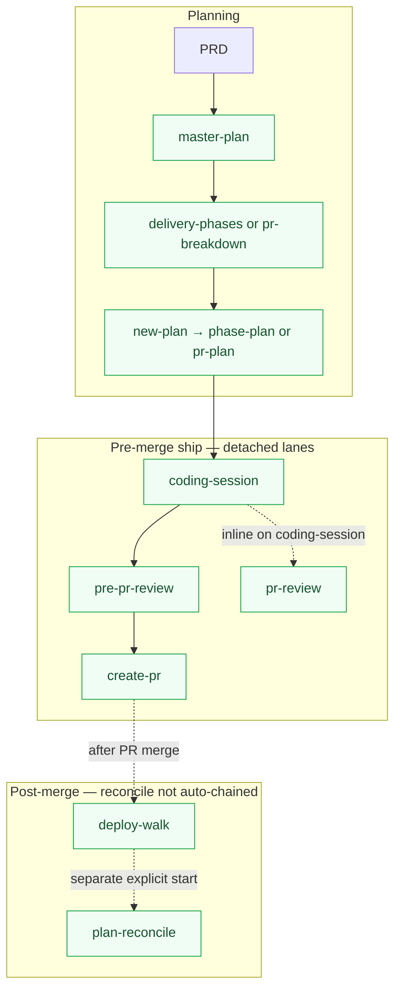
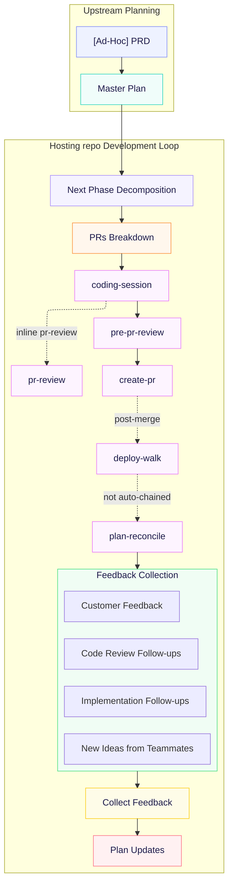

# Sedea's New Feature Development Process

## Overview

This is a document describing how developers deliver new features from idea to production. It is structured in four layers, captured in this order:

1. **Strategy** — the underlying principles that govern every decision.
2. **Development tools** - A surface of missions, protocol branches, agents, and extensions that is used to deliver artifacts - designs, plans and hosting repo code.
3. **Planning Modes** — the three modes planning passes through, applied top-down (*architectural / code design* → *delivery phases* → *PR breakdown*), each with a plan-file template and notes on how the template shifts across hierarchy levels (feature-level plan, delivery phase plan, etc.). A **PRD** (Product or Feature Requirements Document) is upstream input to the one-shot **Master Plan** in mode #1; it is not a separate planning mode.
4. **Cadence** — the continuous loop that wraps the modes once delivery starts: phase decomposition → PRs breakdown → work session → feedback collection → plan updates → next phase. Each iteration may update *any* plan in the hierarchy, depending on the feedback's nature.

**Naming.** **Master Plan** is this document's term for the feature-level plan at the top of a feature's plan tree — the artifact mode #1's **Master Plan** template (below) produces. It is the single source of truth for the feature; phases, PRs, and child plans all hang off it.

## Strategy

The six principles below are the non-negotiables. Everything in **Planning Modes** and **Cadence** below must be consistent with them.

1. **Top-down granularity.** Planning moves from the highest, least-granular level down to the lowest, most-granular level. We never start from a PR.
2. **Three planning modes.** Planning happens in three modes, applied top-down:
   - *Architectural / code design* — what the shape of the solution is.
   - *Delivery phases* — how that shape decomposes on its way to delivery (a phase is never delivered directly — it splits further into sub-phases or into PRs).
   - *PR breakdown* — how a **PR-ready plan** (a phase plan decided not to decompose further, or a Master Plan small enough to skip the phase layer) breaks into individual, coding-ready PRs. Optional and partial: only PR-ready plans go through this mode.
3. **Each level has its own set of plans.** A planning level in the hierarchy is not a single document; it is a set of plans that share that level's granularity.
4. **Small chunks, fast to production.** We plan and deliver small chunks of work. Chunks that are ready ship to production as soon as possible — we do not batch.
5. **Forward planning is partial by design.** We do not require everything to be planned before the first chunks go out. Later levels are planned just-in-time as earlier chunks land.
6. **Single concern per deliverable.** Every deliverable chunk follows the single-concern principle — one purpose, one reason to change, one PR's worth of intent.

**Desired outcome.** Living by these principles, we ship a steady stream of small PRs that are easy for both a human developer reviewer and **a reviewer agent** to review, and whose impact on production execution is easy to reason about. The issues that do reach production are correspondingly small in scope and easy to fix. As a result we are always confident that the production system is robust and stable — every production issue we currently have is temporary and easy to fix.

## Development tools

Single catalogue of **what we use** in this process. Later sections still spell out **agent roles** wherever a role appears (e.g. **a coding agent**) so a developer reader scanning a template never has to chase definitions.

### Center and mission governance

This center does **not** ship **`missions/<missionSlug>/rules/*.mdc`** for **`plan-and-deliver`**, **`prd`**, or **`topics`**. That is **intentional**, not incomplete setup. Sedea treats mission rules as **optional** (see **`.sedea/centers/sedea/rules/4_mission.mdc`** § *Rules* — absence is normal).

R&D delivery agents are governed by:

- **Center rules** — `.sedea/centers/research-and-development/rules/`
- **Mission plans** — `missions/<missionSlug>/plan.mdc`
- **Skills** — `missions/<missionSlug>/skills/` and the **Protocol branches** table below

**Audits and gap reports** must **not** flag missing mission-level rule files under this center. To change **this center's** process or rules, use **`improve center rules`** on **`research-and-development`** (`center-maintenance` on the **sedea** center). For **Sedea platform** governance (hosting layout, git gate, Safeguard), use **`improve center rules`** on **`sedea`**. To change **repo** agent guidance in a hosting repo, use **`.cursor/rules/*.mdc`** per **`.sedea/centers/research-and-development/rules/40_maintain-rules.mdc`** and per-PR plan **§ 5. Repo rules impact**.

**`center.yaml` `skillEntries` sync (manifest hygiene).** Mission Control discovers skills on disk; **`skillEntries`** in **`.sedea/centers/research-and-development/center.yaml`** is for audits and maintenance. When you **add, rename, or remove** a `SKILL.md` under any mission `skills/` tree, update that mission's `skillEntries` list in the same change. From the **hosting repo root**:

```bash
node .sedea/centers/research-and-development/missions/plan-and-deliver/scripts/verify-skill-manifest.mjs
```

Exit **0** when manifest and disk match; **1** prints paths only on disk or only in YAML. Plan-and-deliver authors also see **`.sedea/centers/research-and-development/missions/plan-and-deliver/skills/README.md`** § *Adding or removing a skill*.

**Scripts vendor trees.** Any `node_modules/` or other tooling-only trees under `missions/*/scripts/` are **not** center governance assets — do not link-audit or gap-report them as protocol. Hosting repos document audit scope in **`.cursor/rules/`** (not in this center repo).

### PRD authoring — which path?

Two R&D flows produce requirements upstream of **`master-plan`**. Pick **one** row; do not run both for the same feature unless the developer explicitly switches (for example after **`manage prd`** on an existing doc, then **`plan and deliver`** with that `@path`).

| Situation | Start here | Mission command phrase | Artifact | Typical next step |
| --- | --- | --- | --- | --- |
| **Full PRD** — create or revise a structured Product or Feature Requirements Document **outside** an active `plan and deliver` planning dispatch | **`prd`** mission | **`create prd`** / **`manage prd`** | **`.sedea/operations/<operationsUserId>/docs/`** — path from **`author-prd`** (flexible sections) | When **`planningReadiness`** is sufficient, developer starts **`plan and deliver`** with PRD link or `@path` → Squad Leader §2 |
| **Ad-hoc PRD** — bug, small improvement, or short blurb **inside** **`plan and deliver`** (no existing PRD file yet) | **`plan and deliver`** Squad Leader §1 | **`plan and deliver`** (then §1 **AskQuestion** option 2) → spawn **`ad-hoc-prd`** | **`ad_hoc_<slug>_<hex>.ad-hoc-prd.md`** only under **`<operationsUserId>/docs/`** (never **`joint/docs/`** from this skill) | **Ad-Hoc PRD agent** lane: approve / revise → terminal handoff → Squad Leader §4 seed → §5 **`master-plan`** |
| **Existing external PRD** — Confluence, Google Docs, or workspace file **already authored** | **`plan and deliver`** Squad Leader §1 | **`plan and deliver`** (then §1 option 1) | Link, URL, or `@path` (may live outside **`operations/`**) | §2 validate readable body → §4 seed → §5 **`master-plan`** |
| **Existing Ad-Hoc PRD file** on disk | **`plan and deliver`** | **`plan and deliver`** with `@path` to **`.ad-hoc-prd.md`** | Treat as §1 option 1 local file — same as external PRD for §2 | §2 read → §4–§5 |
| **External URL auth-blocked** during **`plan and deliver`** §2 | Stay on **`plan and deliver`** or **`prd`** | §2 **AskQuestion** (paste body, ad-hoc branch, **`create prd`** first, or new `@path`) | Readable artifact required before **`master-plan`** | Per **`plan.mdc`** §2 *Auth-blocked or unreadable PRD* |

**Do not use**

- **`create prd`** / **`manage prd`** when the developer is already on **`plan and deliver`** §1 option 2 — use **`ad-hoc-prd`** spawn instead (lighter template, same dispatch).
- **`ad-hoc-prd`** for a full multi-section PRD that needs **`author-prd`** section policy and iterative **`manage prd`** — use the **`prd`** mission first.
- **`joint/docs/`** for new Ad-Hoc PRD writes — **`ad-hoc-prd`** is personal **`operationsUserId`** only; move the file manually to share.

**Referenced skills:** **`ad-hoc-prd`**, **`author-prd`**; missions **`plan-and-deliver/plan.mdc`** §§1–2, **`prd/plan.mdc`**.

### Sedea Hub Start New Plan vs Centers dispatch

| Dispatch path | `missionInputs` on Hub command | Squad Leader §4 parent **AskQuestion** |
| --- | --- | --- |
| **Start New Plan** on a Sedea Hub `top_level_topic` row (`parentSlug === null`) | `parentSlug` required; Hub host resolves `parentPlanPath` into `dispatch.yaml` | **Skipped** when opening message includes **`### Parent (Sedea Hub)`** and **`Parent:`** line (see **`plan-and-deliver/plan.mdc`** §4 *Hub parent in opening message*) |
| **Centers** mission launch from Hub (no parent context) | Omitted — Hub skips `missionInputs` validation when mission `plan.mdc` has no Hub block | **Unchanged** — parent **AskQuestion** when `Parent` not in opening message |
| Manual **`plan and deliver`** in Mission Control (no Hub queue) | N/A | **Unchanged** |

**Contract:** Only **`plan and deliver`** declares **`## Hub missionInputs`** in **`plan.mdc`** (keys `parentSlug`, `parentPlanPath`). Hub host reads that block generically; Mission Control renders **Parent** in the opening message when `missionInputs` is present (merged PRs **hub-start-new-plan**, **mc-parent-opening**). This PR (**plan-deliver-hub-intake**) adds §4 skip logic and Squad Leader echo — not Hub menu or MC template code.

### PRD intake — `plan and deliver` §2 vs `prd` mission

The table above chooses **how to author** a PRD. This table chooses **which mission validates or loads** requirements before **`master-plan`**.

| Developer situation | Where to work | What the agent does |
| --- | --- | --- |
| **Readable PRD already exists** — workspace `@path`, local file, or URL the agent can fetch | **`plan and deliver`** §1 option **1** → **§2** | Squad Leader collects the reference, reads or fetches the body, acknowledges title/source, passes the artifact into the **`master-plan`** seed. **Do not** open a **`prd`** dispatch for intake alone. |
| **No PRD yet; needs a full structured doc** — sections, evidence, iterative revision via **`manage prd`** | **`prd`** mission first (**`create prd`** / **`manage prd`**) | **`author-prd`** writes under **`.sedea/operations/<operationsUserId>/docs/`**. When the developer is satisfied, start a **separate** **`plan and deliver`** dispatch with **`@path`** (or link) to that file → §2 treats it like any existing PRD. |
| **No PRD yet; short blurb; already on `plan and deliver`** | Same dispatch — §1 option **2** → §3 **`ad-hoc-prd`** | Spawn **`ad-hoc-prd`** on this dispatch. **Not** **`create prd`** / **`manage prd`** (those belong to the **`prd`** mission). |
| **External URL auth-blocked or unreadable in §2** | Stay on **`plan and deliver`** (or switch per AskQuestion) | §2 **AskQuestion**: paste body, switch to ad-hoc (§1 option 2), **`create prd` mission first** (then return with `@path`), or a different readable `@path`. See **`plan.mdc`** §2 *Auth-blocked or unreadable PRD*. |
| **PRD needs more depth before planning** | **`prd`** **`manage prd`** | Finish or revise the doc on the **`prd`** dispatch; resume **`plan and deliver`** only when the developer supplies a readable `@path` or link. |

**`plan and deliver` §2 does not:** spawn **`author-prd`**, run **`create prd`** / **`manage prd`** inline, or replace option **1** (existing PRD) with **`ad-hoc-prd`**.

**`prd` mission does not:** perform Squad Leader §2 link validation or Confluence/Google fetch for the **`master-plan`** seed — that is **`plan and deliver`** only.

**Handoff phrase examples**

| Developer says (paraphrase) | Route |
| --- | --- |
| “Here’s the PRD `@path` — start planning” | **`plan and deliver`** → §2 |
| “Write a PRD from these notes, then we’ll plan” | **`create prd`** → later **`plan and deliver`** + `@path` |
| “Small fix, plan and deliver” (no file) | **`plan and deliver`** §1 option **2** → **`ad-hoc-prd`** |
| “This Confluence link won’t load” | **`plan and deliver`** §2 **AskQuestion** (not invented body text) |

### Agent UX pitfalls (easy mis-runs)

| Pitfall | Correct surface |
|---------|-----------------|
| **Squad Leader §6** shows decomposition menus | **Forbidden** — only **Master Plan agent** Step 7 (**`master-plan/SKILL.md`**) offers §6 routes; leader **ack only** (**`plan.mdc`** §6) |
| **`pr-review`** as its own Mission Control dispatch | **Stop** — inline on active **`coding-session`** only (**`pr-review/SKILL.md`** § *Standalone dispatch*) |
| **Commit and push cadence** step 3 | Rule **20** step 3 = **`pr-review` Step 5 — GitHub only** after push when Steps 1–4 already ran — not a second full triage |
| **High complexity** Master Plan (score **> 20**) | Omit §6 spawn routes until score **≤ 20**; Squad Leader never spawns **`delivery-phases`** / **`pr-breakdown`** |
| Branch/PR/chat titles | **`.sedea/centers/research-and-development/rules/10_plan-naming-convention.mdc`** — benefit verbs only; never the forbidden busy-work prefix |
| **`create prd`** while already on **`plan and deliver`** §1–2 | §1 option **2** → **`ad-hoc-prd`**, or finish **`prd`** first then new **`plan and deliver`** + `@path` — § *PRD intake — plan and deliver §2 vs prd mission* |
| Squad Leader collects **title only**, spawns **`author-prd`**, child invents scope | **`prd/plan.mdc`** §**2.5** intake on Squad Leader; §3 handoff includes **`prdDescription`** + **`sourceMaterials`** |

### Agents and roles

**Coding agent.** Delivers deliverables defined in a PR plan.

**Pre-PR reviewer agent.** Reviews the change **before** the PR is treated as ready to land: run that pass in a **new agent session with no carry-over turns from the coding session**, no “we already decided X while coding” bias — so the review is **unbiased**. That **pre-PR reviewer agent** complements — it does **not** replace — **a reviewer agent** on the PR surface. Per-PR plans and PR descriptions must read cleanly to **both** passes.

**PR-creating agent.** Only *a PR-creating agent* drafts the GitHub PR description from the prompt **a coding agent** supplies; the parenthetical names the sole supported implementation today. Use that full phrase wherever the PR-authoring role must be explicit.

**Reviewer agent.** The role is *a reviewer-agent* — whichever **dedicated** automated PR-review agent consumes the PR diff and description on the review surface. It might be part of a Sedea Squad agents, or it might be a third-party service connected directly to GitHub PRs. These agents are not part of Sedea and are not mandated by the Mission Control. Dedicated reviewer-agents are **not** the only review pass — see **Pre-PR reviewer agent** above. Use that full phrase wherever that dedicated reviewing role must be explicit (distinct from **developer**, who reads planning-mode plans on the plan board). In the same paragraph, *they / them* may refer to that reviewer-agent.

### Surfaces and artifacts

- **GitHub** — Pull requests, diffs, and PR description fields (e.g. “Notes for the reviewer”). **A PR-creating agent** fills the body from the prompt **a coding agent** supplies.
- **Plan board** — Where **developers** open and review planning-mode `.plan.md` files in the plans folder `.sedea/operations/**/plans/**`).
- **Path placeholders (`...`)** — In this document and R&D governance, `` `...` `` inside path examples (e.g. `.sedea/operations/.../plans/`) denotes **omitted segments**, not a folder named `...`. Substitute **`joint`**, **`operationsUserId`**, or a real **`slug`**. See **`.sedea/centers/research-and-development/rules/31_operations-user-id.mdc`** § *Path placeholders in documentation*.
- **`.plan.md` files** — Standalone plan files at each hierarchy level (Master Plan, phase plans, PR plans); canonical location is under `.sedea/operations/**/plans/**`.
- **PRD** — Product (or feature) Requirements Document — the prime input for the one-shot **Master Plan** (mode #1). **Which authoring flow** (`prd` mission vs **`plan and deliver`** + **`ad-hoc-prd`**) is decided in § *PRD authoring — which path?* above — not by filename alone.
- **Git worktree** — Isolated worktree used by the **`coding-session`** protocol branch when spinning up a coding agent.
- **Protocol** — The **plan and deliver** mission (`.sedea/centers/research-and-development/missions/plan-and-deliver/plan.mdc`, command phrase *plan and deliver*) — protocol branches and skills under `missions/plan-and-deliver/skills/` implement this document's cadence. 

### Protocol branches

| Branch | Path | Role in this process |
| --- | --- | --- |
| `ad-hoc-prd` | `.sedea/centers/research-and-development/missions/plan-and-deliver/skills/ad-hoc-prd/SKILL.md` | Scaffold a minimal **Ad-Hoc PRD** (`ad_hoc_<slug>_<hex>.ad-hoc-prd.md`) under **`.sedea/operations/<operationsUserId>/docs/`** only — standalone upstream input for **`master-plan`**; Master Plan `.plan.md` is created afterward. Moving an Ad-Hoc PRD into **`joint/docs/`** for sharing is manual. |
| `master-plan` | `.sedea/centers/research-and-development/missions/plan-and-deliver/skills/master-plan/SKILL.md` | PRD → **Master Plan** (mode #1). Drafts §§ 1–5 in the initial turn, including **`### Decomposition assessment`** and **`### Complexity score (plan-scope signal)`** under § 5. **High** complexity (overall score > 20) withholds §6 decomposition in **AskQuestion** until scope shrinks. Follow-up moves use **AskQuestion** per **`.sedea/centers/research-and-development/rules/30_planning-target-resolution.mdc`** § *Sedea input channel* — spawn **`delivery-phases`** or **`pr-breakdown`** via **`AGENT_RUN_REQUEST_V1`**, draft §7 Caveats inline, revise sections, or commit plans when the user asks in the same message. |
| `delivery-phases` | `.sedea/centers/research-and-development/missions/plan-and-deliver/skills/delivery-phases/SKILL.md` | Decompose a focused **Master Plan** or **Phase plan** into delivery phases (mode #2). Drafts the dual-title section as a numbered list of child phases; sets the heading to `Delivery phases`. |
| `pr-breakdown` | `.sedea/centers/research-and-development/missions/plan-and-deliver/skills/pr-breakdown/SKILL.md` | Decompose a focused **Master Plan** or **Phase plan** into PRs (mode #3 set-level). Ensures **`### Decomposition assessment`** exists (inserts if missing), then gates **Delivery phases** vs multi-PR vs single-PR `PR breakdown`. Drafts the dual-title section as `### Single-concern strategy` + `### Sequencing` + `### PR list` (numbered; **one item is valid** for a single deliverable); sets the heading to `PR breakdown` when a PR breakdown path is chosen. |
| `phase-plan` | `.sedea/centers/research-and-development/missions/plan-and-deliver/skills/phase-plan/SKILL.md` | Populate the body of a focused **phase plan** stub (usually after **`new-plan`** indexed child spawn for a `Delivery phases` row): drafts §§ 1–4 plus **`### Decomposition assessment`** before dual-title § 5, using the parent's `Delivery phases` item **N** as the scope anchor. |
| `pr-plan` | `.sedea/centers/research-and-development/missions/plan-and-deliver/skills/pr-plan/SKILL.md` | Populate §§ 1–4 on the **planning** lane; §§ 5–8 default **`_TBD_`**. **AskQuestion** **Start coding session** → spawn **`coding-session`** via **`AGENT_RUN_REQUEST_V1`** (§5d). See skill § *Handoff to coding-session*. |
| `new-plan` | `.sedea/centers/research-and-development/missions/plan-and-deliver/skills/new-plan/SKILL.md` | Scaffold a new `.plan.md` + sidecar; parent linkage; runs when the developer picks list index **N** via **AskQuestion** (one `option` per index) to expand a `Delivery phases` or `PR breakdown` child. |
| `coding-session` | `.sedea/centers/research-and-development/missions/plan-and-deliver/skills/coding-session/SKILL.md` | **Separate** lane from **`pr-plan`**: worktree, attach, then **spawned child implements** §§ 5–8 on that lane (default after **`pr-plan`** spawn; **auto-authorize** when §§1–4 drafted — no second approval modal) or **prompt-only** external handoff when detached / `promptOnly`. Ship chain (**`pre-pr-review`**, **`create-pr`**, **`pr-review`**). See skill § *Auto-authorize implementation (pr-plan spawn)*. |
| `pre-pr-review` | `.sedea/centers/research-and-development/missions/plan-and-deliver/skills/pre-pr-review/SKILL.md` | Fresh spawned pre-PR reviewer lane. Reviews committed implementation diff against a PR plan or free-form scope, checks per-PR template + repo rules + quality, returns **proposed** non-blocker items in `outputs.proposedFollowUps` when anchored to **`plan`** (does **not** edit the plan file). The active **`coding-session`** agent presents proposals to the developer; approved bullets are appended to `## Follow-ups` before **`create-pr`** when the developer chooses that path. Reports go/no-go. |
| `create-pr` | `.sedea/centers/research-and-development/missions/plan-and-deliver/skills/create-pr/SKILL.md` | Spawned **PR-creating agent** lane after **`pre-pr-review`** returns `go`. **Only** branch that may run **`gh pr create`** (per **`.sedea/centers/research-and-development/rules/20_efficient-pr-shipping.mdc`**). Builds a reviewer-complete PR description from the PR plan, diff, and pre-PR review context; opens the GitHub PR when push/creation is authorized, or emits a copy-paste prompt for **a PR-creating agent** when not. **`coding-session`** spawns this skill — planning, coding, and review lanes must not open PRs themselves. May spawn **`deploy-walk`** after merge when configured. |
| `pr-review` | `.sedea/centers/research-and-development/missions/plan-and-deliver/skills/pr-review/SKILL.md` | Triage PR review comments; feeds **Code review follow-ups** on the PR plan. |
| `deploy-walk` | `.sedea/centers/research-and-development/missions/plan-and-deliver/skills/deploy-walk/SKILL.md` | Walk a PR plan's `## N. Deploy test plan` section step by step via **`deploy-walk`** (natural language or **AskQuestion** per **30_planning-target-resolution** § *Sedea input channel*). Present step **N** in detail; mark step **N** done / skip / block; flip Status `drafted → deployed` to unlock After-deploy; summarise progress. Loose mode between present and resolution — normal collaboration between bracketing commands. State lives in the plan file (**`**Status:**`** lifecycle line + GFM task list `1. [ ]`). After-deploy fully checked auto-flips Status `deployed → done` **and** frontmatter todo `deploy-test-plan-verified` `pending` → `done`. Does **not** auto-run **`plan-reconcile`**. |
| `plan-reconcile` | `.sedea/centers/research-and-development/missions/plan-and-deliver/skills/plan-reconcile/SKILL.md` | Plan reconcile / archive, plus **follow-ups triage** at dispatch resolve time (see **Cadence** § *Plan Updates*). |

### Diagram and feedback channels

- **Mermaid** (or similar) — Diagrams inside plan files (mode #1 **Architectural design**, mode #2 **Code design**, mode #3 **Sequencing** optional graph).
- **Slack**, support tickets, production telemetry, customer interviews — Async inputs listed under **Cadence** → *Customer feedback* / *New ideas from teammates*; drained at *Plan Updates*, not plan-authoring tools.

## Planning Modes

Per Strategy principle #2, planning happens in three modes, applied top-down: **architectural / code design**, **delivery phases**, and **PR breakdown**. Each addresses a different question — design says *what* will exist, delivery says *how the design decomposes* (into sub-phases or into PRs) *on its way to delivery*, and PR breakdown says *which coding-ready PRs* a PR-ready phase produces. PRs are the only units that ship; phases are organizing structure, not delivery units.

**Every level of the plan tree gets its own plan file.** A feature is a plan tree rooted at the **Master Plan** (one file per feature, mode #1). Every phase, sub-phase, and sub-sub-phase below it is its own standalone plan file authored from the **Phase plan template** in mode #2 — recursion stops only when a plan is decided to be **PR-ready**. Every PR is its own standalone plan file authored from the per-PR template in mode #3. Standalone files at every level keep each plan focused on a single granularity, let **a coding agent** work without broader-context distraction when working from a PR plan (Strategy #6), and make **indexed child expansion** via **`new-plan`** the natural way to grow any non-PR-ready entry one level down.

**The dual-title `Delivery phases | PR breakdown` section is the recursion point.** Both the Master Plan template (§ 6) and the Phase plan template (§ 5) end in a dual-title section whose heading is one of `Delivery phases` (children are sub-phase plans) or `PR breakdown` (children are PR plans, mode #3). The shared **§ 6 / § 5 contents rule** below the Phase plan template defines both shapes once. Until the decomposition decision is made, the heading reads `Delivery phases | PR breakdown` and the body is `_TBD_`.

**Roles and surfaces** — Agent definitions, GitHub, plan board, and the protocol are listed in **Development tools** (section above). Subsections below define **authoring conventions** (short bullets, LLM consumers, carve-outs) that apply across the three modes.

**Bullet-style convention.** Most bulleted sections across the three modes follow a short-bullet rule: aim for 2–3 words per bullet, never more than 5. **A long list of short bullets is always better than a short list of long sentences.** The rule exists because the primary reader is a human (the developer) scanning the plan board to validate a design or trace delivery — humans process small, bite-sized chunks faster and more precisely than long prose, so terse bullets win.

**LLM-agent corollary.** When a section's primary consumer is an LLM agent (e.g. **a coding agent** reading a PR plan, **a pre-PR reviewer agent** in a **fresh agent session**, or **a reviewer agent** reading a PR description), the constraint becomes *whatever length lets the agent consume the section unambiguously*, not 2–5 words. Sometimes that's still short bullets (e.g. **Change scope** in mode #3 is the contract for **a coding agent** — terseness *is* the value, and a clipped bullet is unambiguous because it names a code-level concept the agent can ground on). Sometimes it's full sentences (e.g. **Reasoning** in mode #3 — **a coding agent** has to relay the *because* into a PR description for **a reviewer agent** and surface the same *because* in a **fresh pre-PR reviewer agent session**, and a 3-word bullet would force **a coding agent** to invent context). The author judges per section.

**Carve-outs from the short-bullet rule.** Sections that opt out, with reason:
- **PR list** (mode #3 set-level § 3) — a numbered list whose item lines (the PR slug or short title, bolded) follow the short-bullet rule, but whose **Single concern** sub-bullet inherits the per-PR § 1 sentence verbatim and is therefore full prose, not 2–5 words.
- **Reasoning** (mode #3 per-PR) — **a coding agent** (implementation + **fresh pre-PR reviewer agent session**) + **a reviewer agent**-facing; full sentences so the PR description carries faithful rationale.
- **Deploy test plan** (mode #3 per-PR) — each step must be unambiguous for the on-call.
- **Repo rules impact** (mode #3 per-PR § 5) — short bullets for **`.cursor/rules/*.mdc`** in the repo that receives the PR (hosting repo or hosting repo worktree); see **`.sedea/centers/research-and-development/rules/40_maintain-rules.mdc`**. **Not** Sedea center rules under **`.sedea/centers/`** — R&D center changes use **`improve center rules`** on **`research-and-development`**; Sedea platform center rules use **`sedea`**. The `_None — …_` line is still short-bullet form.
- **Caveats** (mode #3 per-PR only) — **a coding agent** (implementation + **fresh pre-PR reviewer agent session**) + **a reviewer agent**-facing; full sentences so the PR description carries the concern faithfully. *In modes #1 and #2 Caveats is read by the developer during plan review and follows the short-bullet rule like the other planning bullets — short, scannable, sufficient.*

Each section says inline whether it follows the short-bullet rule or opts out.

### 1. Architectural / code design

The design mode answers: *what shape does the change take, and where does it land in the codebase?*

#### Master Plan template

A **Master Plan** operates at feature granularity. It has these sections only — sections 1–6 are required, section 7 is optional:

1. **Background.** 1–2 sentences about the feature from a hosting repo perspective.
2. **Benefits.** Short bullet points covering only the *why* — benefits to merchants or their customers, cost / effort reductions for the system, user-experience improvements. Follow the short-bullet rule from the bullet-style convention above.
3. **Related features.** Short bullet points capturing how this feature relates to others touching the same parts of the system. Per related feature, list the relationship type and what it implies for **delivery** or **scope**. **Ordering / concurrency** — *follows*, *precedes*, or *concurrent*, with the implied synchronization need (order, shared surface, rollout coupling). **Scope** — *narrows scope*, *widens scope*, or *shifts scope*, with a few words on *how* (less this feature must own, more it must cover, or boundaries / ownership that move). One bullet may combine ordering and scope when both apply. Follows the short-bullet rule.
4. **Architectural design.** One or more diagrams showing what the implementation will look like. Pick the diagram type(s) that best fit the feature:
   - **Component / architecture chart** — service topology, module boundaries, dependency direction.
   - **Flow chart** — control flow or data flow through new logic.
   - **Sequence diagram** — interactions between services, processes, or actors over time.
   - **State diagram** — lifecycle / state-machine changes.
   - **ER / schema diagram** — data model or database changes.
   - …whatever conveys the change most clearly.
5. **Changes.** Short bullet points listing what changes, how, and where, scoped at the feature level. Follows the short-bullet rule. Immediately after the change bullets, the **`master-plan`** protocol branch appends a **`### Decomposition assessment`** subsection (same short-bullet + one-line recommendation pattern as phase plans — see mode #2 below). That block records **kinds of change**, **PR count band**, **sequencing / coupling**, a **routing recommendation** (`Delivery phases`, multi-PR `PR breakdown`, or single-PR `PR breakdown`), and **confidence**, so **developer** can choose "Delivery Phase" or "PR Breakdown" with evidence before § 6 is drafted. After that block, **`master-plan`** appends **`### Complexity score (plan-scope signal)`** using the **table + overall score + band** shape and counting rules defined in **`master-plan`** Step 6c (**low** ≤ 10, **medium** 11–20, **high** > 20, where the score is the max of the three table rows). **High** means pause **§6 decomposition** (spawn route) until the plan is narrowed or split along merchant/customer outcomes (see the protocol branch).
6. **Delivery phases | PR breakdown.** Dual-title section: the heading is `Delivery phases` when the feature decomposes into one or more phase plans, or `PR breakdown` when the feature is small enough to break directly into PRs without an intermediate phase layer. When the heading is `Delivery phases`, the body is a **short numbered list** (see the **§ 6 / § 5 contents rule** below the Phase plan template in mode #2). Most features land on `Delivery phases`; tiny features that don't need a phase layer land on `PR breakdown` and skip mode #2 entirely. Until this section is drafted, its body may stay `_TBD_` **or** follow the **assessment-before-dual-title** pattern in the **§ 6 / § 5 contents rule** (assessment block already present from § 5, dual-title list still `_TBD_`).
7. **Caveats.** *Optional — omit if there are none.* Anything that needs special attention — known exceptions, edge cases, risks, or coupling that isn't obvious from the diagram or change list. Follows the short-bullet rule from the bullet-style convention above (developer-primary; one short bullet per concern is more scannable than a paragraph).

### 2. Delivery phases

The delivery-phases mode answers: *how does the design decompose on the way to delivery?* A phase is **never delivered directly**. It is either broken further into sub-phases (the next hierarchy level down) or split into PRs via mode #3 (PR breakdown) that are themselves the delivered units. Phases exist to step the design down from "one big shape" toward PR-sized chunks aligned with Strategy #4 (small chunks, fast to production).

**PR-readiness is decided per phase.** When you decide a phase will be split directly into PRs (no further sub-phases), you mark it a **PR-ready phase** — its dual-title section is titled `PR breakdown` and holds PR pointers via mode #3. Otherwise, the **delivery phase** is further decomposed into **sub-phases** — its dual-title section is titled `Delivery phases` and holds a **short numbered list** of summary entries pointing at each sub-phase's standalone plan file. The decision is made per phase, so PR breakdown is **optional and partial by design**: some phases of the same parent may be PR-ready while others decompose further. A phase having a PR breakdown is what makes it **PR-ready** — there is no further plan breakdown beyond it.

**This mode produces a standalone plan file per child phase.** Each item in the parent plan's dual-title `Delivery phases` **numbered list** corresponds to its own `<slug>.plan.md` authored from the **Phase plan template** below. The parent's section only carries short summaries with links — the body of every phase plan lives in its own file. This is what lets every plan stay scoped to a single granularity and keeps any plan a reader opens digestible in one screen.

#### Phase plan template

A **phase plan** is a standalone plan file that fills in one entry of a parent plan's dual-title `Delivery phases` section. The same phase-plan template applies whether the parent is a **Master Plan** or another phase plan (recursion). It has these sections only — 1–5 are required, 6 is optional:

1. **Background.** 1–2 sentences on how this phase builds on the previous phase(s) and which part of the parent plan it covers.
2. **Scope.** One short sentence describing the scope at a high level, plus diagram(s) reused from the parent plan's **Architectural design** section with the parts this phase touches highlighted (annotation / color / callout). The highlight should convey both *which* parts the phase touches and *how* it touches them.
3. **Code design.** A diagram giving a visual representation of the change introduced by this phase. Pick the type that best fits, using the same menu as **Architectural design** in mode #1 (component, flow, sequence, state, ER, …).
4. **Changes.** Short bullet list describing each change. Follows the short-bullet rule from the bullet-style convention above. Immediately after these bullets, the **`phase-plan`** protocol branch appends **`### Decomposition assessment`** — a short, explicit pass over **kinds of change** (count distinct *kinds*, not files), **PR count band** (single vs few vs many), **sequencing / coupling** (migrations, flags, cross-repo, etc.), a **routing recommendation** (`Delivery phases` vs multi-PR `PR breakdown` vs single-PR `PR breakdown`), and **confidence** (high / med / low). That block is **evidence for the next planning move**; the committed recursion shape is still the dual-title **heading** once `delivery-phases` / `pr-breakdown` runs. Until then, keep the dual-title heading as `Delivery phases | PR breakdown` and leave the dual-title **list** body as `_TBD_` after the assessment block (see **assessment-before-dual-title** below).
5. **Delivery phases | PR breakdown.** Dual-title section: the heading is `Delivery phases` when this phase decomposes further into sub-phases, or `PR breakdown` when it is PR-ready and decomposes directly into PRs. When the heading is `Delivery phases`, the body is a **short numbered list** (see the **§ 6 / § 5 contents rule** below). The **heading** is the committed decomposition decision once set; the **`### Decomposition assessment`** block (between § 4 and § 5 for phase plans, under § 5 for Master Plans) is the **pre-commitment sizing record** used to choose that heading. Until the decision is made, leave the heading as `Delivery phases | PR breakdown` and the list body `_TBD_` (with assessment already filled in by `master-plan` / `phase-plan` where those protocol branches have run).
6. **Caveats.** Same as mode #1 above — *optional*, short bullets for exceptions, risks, or coupling that needs special attention (e.g. feature-flag prerequisites, ordering constraints with other phases, migration sequencing). Follows the short-bullet rule.

#### § 6 / § 5 contents rule (shared by Master Plan and Phase plan templates)

**Assessment-before-dual-title.** For a Master Plan or Phase plan, the file may contain **`### Decomposition assessment`** (sizing and routing recommendation) **immediately above** the dual-title `## 6.` / `## 5.` section while the dual-title body is still `_TBD_`. Legacy plans may have only `_TBD_` under the dual heading; **`pr-breakdown`** ensures an assessment exists (inserting one if missing) before the developer picks `Delivery phases` vs multi-PR vs single-PR `PR breakdown`. The assessment does **not** replace the numbered child list or the mode #3 set-level template — it informs the choice.

**Single-PR hoist from a phase plan.** Typical chain: **`master-plan`** → **`delivery-phases`** → **`new-plan`** → **`phase-plan`**. When **`phase-plan`** records **single-PR** `PR breakdown` in **`### Decomposition assessment`**, do **not** draft a full § 5 **`PR breakdown`** set-level block on that phase file. **Hoist** instead: run **`pr-breakdown`** on the **decomposition ancestor** (the plan whose **`Delivery phases`** list contains this phase's row **N**) with `hoistFromPhasePath` pointing at the phase plan. The ancestor row **N** becomes **PR-ready** (`Decomposition decision: PR breakdown`; **`Phase plan:`** keeps the phase link; **`Plan:`** wires the new PR plan via **`new-plan`** with `hoistFromPhase: true`). Multi-PR breakdown on a phase plan after **`phase-plan`** is unchanged — § 5 **`PR breakdown`** stays on the phase file. Override (single PR on the phase plan) requires explicit `decomposeOnPhasePlan: true` on the **`pr-breakdown`** spawn. See **`.sedea/centers/research-and-development/missions/plan-and-deliver/skills/phase-plan/SKILL.md`** § **5a-hoist** and **`pr-breakdown/SKILL.md`** § **3.6**.

Every plan ends in a **dual-title section** — § 6 in the Master Plan, § 5 in a Phase plan — whose heading is one of two values, and whose body shape is determined by the heading:

- **Heading = `Delivery phases`** (the plan decomposes into child phases): a **short numbered list** — use Markdown ordered list syntax (`1.`, `2.`, `3.`, …), **one numbered item per child phase**. Under each numbered item, three nested sub-bullets (unordered `-` bullets are fine):
  - Sub-bullet 1: the child's decomposition decision — `Delivery phases` or `PR breakdown` (matches the child plan's own dual-title heading).
  - Sub-bullet 2: a one-line scope sentence (paraphrased from the child plan's § 2 Scope).
  - Sub-bullet 3: a Markdown link to the child plan's `.plan.md` file.

  List index **N** (1-based ordered list) is what the developer picks via **AskQuestion** or **`MC_ASKQUESTION_V1`** (one `option` per index) when spawning a child via **`new-plan`**: keep list order and numbering in sync with `## N.` phase headings in the parent plan when you add those headings (same **N**, same sequence). Follows the short-bullet rule (each sub-bullet is one short line).

- **Heading = `PR breakdown`** (the plan is PR-ready and decomposes directly into PRs): the mode #3 set-level content — Single-concern strategy + Sequencing + **PR list**. The **PR list** sub-section is itself a **short numbered list** mirroring the Delivery phases shape (one numbered item per PR, with the PR's slug or short title bolded on the item line so **`new-plan`** can seed the child name from item **N**). See mode #3 below for the full set-level template, including the two sub-bullets each numbered item carries.

A short **optional intro paragraph** (one or two sentences) is allowed immediately under the heading and before the entries — useful when the decomposition needs a one-line framing the reader can't infer from the entries alone (e.g. "phases run in two parallel tracks"). Skip it when the entries speak for themselves; an empty intro is preferred over filler.

A non-PR-ready plan thus *only* lists short summaries pointing at child plans — never inlines a child's body. To break a child entry out into its own plan file, the developer picks list index **N** via **AskQuestion** or **`MC_ASKQUESTION_V1`** per **30_planning-target-resolution** § *Sedea input channel*; the agent runs the **`new-plan`** protocol branch (**Development tools** § *Protocol branches*) with the parent plan resolved from chat context per **`.sedea/centers/research-and-development/rules/30_planning-target-resolution.mdc`**. **N** is the ordered-list index from the parent's numbered list of children — `Delivery phases` body when the heading is `Delivery phases`, or the `### PR list` sub-section when the heading is `PR breakdown`. **`new-plan`** seeds the child plan's name from the bolded item title on item **N**'s line (indexed-child mode). **Indexed-child stub:** the child file uses a **generic** scaffold (`## Overview`, `## Phasing`, `## Out of scope`) until **`phase-plan`** or **`pr-plan`** replaces the body with the Phase plan or per-PR template — that two-step split is intentional.

### 3. PR breakdown

The PR-breakdown mode answers: *how does a PR-ready plan decompose into individual, coding-ready PRs?* Each PR is a single-concern deliverable (Strategy #6) that can ship to production on its own. This mode applies to any plan whose dual-title section is titled `PR breakdown` — typically a **PR-ready phase plan**, but also a **Master Plan** for features small enough to skip the phase layer entirely. PR breakdown is therefore optional and partial: only PR-ready plans go through this mode.

**Each PR has its own standalone plan file.** Like phase plans (mode #2), PR plans are standalone — but where phase plans separate by *granularity*, PR plans separate by *coding agent isolation*. A PR plan is the artifact handed to **a coding agent**, who must not be confused by broader feature / phase context. Keeping the PR plan scoped to a single concern keeps **them** focused on a single concern (Strategy #6).

The responsibilities of **a coding agent** do not stop at the code change. **They** also produce the prompt for **a PR-creating agent**, which writes the PR description. That description must give **a reviewer agent** *complete context* — including *why* a change was made and *which alternatives were considered and rejected* — so **a reviewer agent** can respond with actionable feedback rather than exploratory prompts. The same per-PR material must support a **fresh pre-PR reviewer agent session** (see **Development tools** § *Pre-PR reviewer agent*) before those dedicated reviewer-agents run. **A coding agent** cannot invent that reasoning without the per-PR plan carrying it explicitly. This is why the per-PR template below contains **Background** and **Reasoning** sections in addition to the change-scope / tests / deploy-plan answers.

The breakdown answers five core questions split across two scopes:

| Set level (PR-ready plan's dual-title `PR breakdown` section) | Per PR (standalone PR plan file) |
| --- | --- |
| 1. How is single-concern enforced across the whole set? | 3. What is the change scope of this PR? |
| 2. Which PRs are chained vs parallel? | 4. What tests need to be written? |
| | 5. What is the test plan before and after deployment? |

…plus the supporting Background + Reasoning sections per PR so **a PR-creating agent** can draft a description **a reviewer agent** can act on — and so **a coding agent** can run a **fresh pre-PR reviewer agent session** from the same artifact.

The set-level content fills the PR-ready plan's dual-title section (Master Plan § 6 or Phase plan § 5) when it is titled `PR breakdown`. Every PR pointer in that list links to a standalone PR plan file authored from the per-PR template.

#### PR sizing — test cases and kinds of changes

**Canonical source (center sync contract).** This subsection is the **authoritative** definition of PR sizing for the **research-and-development** center. When buckets, kinds-of-change rules, or test-case counting change, edit **here first**, then align:

- **`.sedea/centers/research-and-development/rules/20_efficient-pr-shipping.mdc`** § *Keep PRs small and focused* (ship-lane summary)
- **`.sedea/centers/research-and-development/missions/plan-and-deliver/skills/pr-breakdown/SKILL.md`** § *Step 5a — Infer PR boundaries from the parent plan* (operational application)
- **`master-plan`** / **`phase-plan`** § *Decomposition assessment* (routing bands `single` | `few (2–5)` | `many (6+)` only — sizing metrics reference this subsection)

Do **not** change thresholds (**≤ 10** / **11–20** / **21+**) or the kinds-vs-lines rule in a single downstream file alone.

Two metrics support the breakdown decision — which PRs to carve out, and how heavy each candidate ends up:

1. **Test-case count.** Estimate the test cases each candidate PR introduces or meaningfully changes — unit + integration / snapshot + exploratory recordings, each enumerated case counted once. Buckets: **≤ 10** simple, **11–20** mid-sized, **21+** heavy. A heavy PR is a *signal to investigate* splitting — it is not automatically wrong. Do not split if the only available split runs within one kind of change (instance batching), or if the result is a half-shipped feature (Strategy #4 trumps size).
2. **Kinds of changes.** Count *distinct kinds* of changes — not raw lines and not raw files. N instances of the same kind (the same shape applied to N similar files) is **one kind**, not N kinds. Threading the same prompt fragment into 8 generators is one kind with 8 instances; **a reviewer agent** reads the first instance carefully and skims the rest, and **a pre-PR reviewer agent** does the same. Splitting by call-path or by file is rarely justified when the kinds across both halves are identical.

Raw changed-line count is **not** a size signal in this process. Downstream copies must stay aligned with this subsection per the sync contract above.

**When to run sizing.** **`### Decomposition assessment`** is authored at the end of **`master-plan`** § 5 and **`phase-plan`** § 4 (same metrics as this subsection), *before* the dual-title section is populated — so **developer** and **`pr-breakdown`** together choose `delivery-phases`, a multi-item **`pr-breakdown`**, or a **one-item `### PR list`** with full context. If a plan predates that block, **`pr-breakdown`** inserts it before the decision gate.

#### Set-level template (PR-ready plan's dual-title `PR breakdown` section)

When a PR-ready plan's dual-title section is titled `PR breakdown` and populated, it has these sub-sections in order:

1. **Single-concern strategy.** 1–2 sentences on how this PR-ready plan keeps each PR single-concern (Strategy #6) — typically: "every PR maps to exactly one user-visible behavior change or one internal contract change; no PR mixes concerns". Optionally followed by a short bullet list of concerns that were tempting to bundle but were intentionally split (short-bullet rule per the convention above).
2. **Sequencing.** How PRs relate in time. Pick whichever form conveys it most clearly:
   - Bullet list grouped by stage: *Stage 1 (sequential): PR 1 → PR 2; Stage 2 (parallel): PR 3, PR 4*. Numbers match the `### PR list` ordering so cross-references resolve at a glance.
   - Small dependency diagram (Mermaid graph or similar).
   When the bullet form is used, follows the short-bullet rule.
3. **PR list.** A **short numbered list** — use Markdown ordered list syntax (`1.`, `2.`, `3.`, …), one numbered item per PR, in roughly the sequencing order from the **Sequencing** sub-section above. A **single numbered item** is valid when the whole plan ships as one coding-ready PR (then **`new-plan`** indexed spawn for item **1** → per-PR plan → **`pr-plan`**). Each numbered item carries the PR's slug or short title on the item line, **bolded** so the **`new-plan`** protocol branch (digit-only **N** in session) can read it as the new plan's name; under each numbered item, two nested sub-bullets (unordered `-` bullets are fine):
   - Sub-bullet 1: **Single concern.** A one-line single-concern summary — this is the per-PR § 1 sentence repeated here so **a reviewer agent** can scan the set in one glance.
   - Sub-bullet 2: **Plan.** A Markdown link to the standalone PR plan file, or _TBD_ until **`new-plan`** creates the child for item **N** (indexed spawn).

   The index **N** is the digit-only indexed-child argument to **`new-plan`** — invoking **`new-plan`** with the parent locked and **N**=`3` on a parent plan whose dual-title section is `PR breakdown` spawns the standalone PR plan file for the third numbered item. This section is **carved out** of the short-bullet rule on the **Single concern** sub-bullet — that bullet inherits the per-PR Single-concern sentence and is full prose, not 2–5 words. The bolded item line itself follows the short-bullet rule (a slug or 2–5-word title).

#### Per-PR plan template

Each PR's standalone plan file has these sections only — sections 1–7 are required, section 8 is optional. Sections 1–3 keep **a coding agent** on a single concern; sections 4 and the prose of section 2 give **them** what they need so **a PR-creating agent** can draft a complete PR description for **a reviewer agent** — and so **a coding agent** can run a **fresh pre-PR reviewer agent session** from the same text.

1. **Single concern.** One sentence stating the single concern this PR addresses (e.g. *"Add the `feature_flag_x_enabled` field to the merchant config schema and surface it in the admin UI read path."*). This sentence is also what shows up next to the PR's bullet in the parent PR-ready plan's PR list, and is the basis for the PR title.
2. **Background.** 2–3 sentences narrowly scoped to this PR — the relevant prior state of the codebase, and the gap, decision, or upstream change this PR is responding to. Oriented for **a reviewer agent** reading the PR cold *and* for **a coding agent** in a **fresh pre-PR reviewer agent session**: enough context that **they** can understand *why this PR exists* without opening the parent plan. Do **not** restate the broader feature / phase context — **a coding agent** must stay focused on the single concern; this section only carries the narrow slice of context needed for the PR description.
3. **Change scope.** Short bullet list of what changes, how, and where. Follows the short-bullet rule from the bullet-style convention above — terseness is the contract for **a coding agent**: anything outside this list is outside the PR. (This is a section where the LLM corollary still resolves to short bullets, because each bullet names a code-level concept the agent can ground on.)
4. **Reasoning.** Why this PR makes the choices it does, in two parts. The bullet-length rule does **not** apply here — items are full sentences, since each entry needs to make the reasoning unambiguous for **a reviewer agent** (via the PR description), for **a coding agent** relaying to **a PR-creating agent**, and for **a coding agent** in a **fresh pre-PR reviewer agent session**.
   - **Why this approach.** The design decisions made in this PR and *why each was made*. Capture the *because* for every non-obvious choice — naming, layering, where logic is placed, what is reused vs introduced, what is kept backwards-compatible.
   - **Considered & rejected.** Alternatives that were considered but not taken, each with the reason it was rejected. This gives **a reviewer agent** maximum signal and the same signal to **a coding agent** in a **fresh pre-PR reviewer agent session**: capturing "we considered X and rejected it because Y" short-circuits "did you think about X?" comments and lets **a reviewer agent** give actionable feedback on the chosen path.
5. **Repo rules impact.** Short bullet list for **a coding agent** — which **`.cursor/rules/*.mdc`** files in the **hosting repo** (the repo that receives this PR) should be **added or updated** after the code change lands, and **one line each** on *what* guidance to add or adjust (new boundary, deployment constraint, error-handling pattern, layout rule, …). Follows the short-bullet rule; paths are relative to that repo's root. When this PR does not warrant any rule change, write a single bullet: `_None — no repo rule updates required for this PR._` This section is **plan-first** for long-lived agent guidance (see **`.sedea/centers/research-and-development/rules/40_maintain-rules.mdc`**); it is **not** required to duplicate the GitHub PR description body unless **a coding agent** chooses to surface it under "Notes for the reviewer".

   **Align hosting-repo rules before commit and push.** The §5 list is not only planning intent — it is the **coding checklist against the hosting-repo diff**. Before asking for review or running rule **20** § *Commit and push cadence*, **a coding agent** reconciles every §5 bullet with the branch: bullets that call for **update** / **extend** / **add** a named **`.cursor/rules/*.mdc`** file must have the corresponding edit **in the same PR** (preferred) or an explicit follow-up commit on the same branch before merge; bullets that say **no file edit** / **verify only** / **skip unless …** are satisfied by confirming the code obeys the existing rule (no `.mdc` change). If a rule edit is genuinely deferred, **revise §5 in the plan** in the same window so a **fresh pre-PR reviewer agent session** and **reviewer-agents** do not see plan ↔ repo drift.
6. **Tests to write.** Check this repo's specific rule for writing tests if exists. If the rule does not exist write: *No testing rules exist for this repo.*
7. **Deploy test plan.** Two **numbered GFM task lists** (Markdown `1. [ ]`, `2. [ ]`, `3. [ ]` — *not* dash bullets, *not* bare numbered items without checkboxes), under a **`**Status:**`** lifecycle marker. Section shape:

   ```markdown
   ## 7. Deploy test plan

   **Status:** drafted *(YYYY-MM-DD: PR plan drafted.)*

   ### Before deploy

   1. [ ] First step.
   2. [ ] Second step.

   ### After deploy

   1. [ ] First post-deploy check.
   2. [ ] Second post-deploy check.
   ```

   The **`**Status:**`** line tracks the section's lifecycle: `drafted` (PR plan written, nothing deployed yet) → `deployed` (PR landed in the target env; After-deploy steps unlocked) → `done` (all checks complete). Each transition appends a dated `*(YYYY-MM-DD: <note>)*` entry; history is **append-only** and serves as the audit trail for what was verified when. The **`deploy-walk`** protocol branch (**Development tools** § *Protocol branches*) is the agent that drives this lifecycle interactively — it presents each `[ ]` step in detail, flips the box on user resolution, and transitions Status as the walk progresses. Plans authored without the lifecycle marker still validate (legacy form), but `deploy-walk` will surface the missing-marker case as a flag and recommend adding it.

   **Sub-sections:**
   - **Before deploy** — what to verify locally / in staging before merging the PR.
   - **After deploy** — what to verify in production after the PR ships (smoke checks, monitors / alerts to watch, rollback trigger conditions).

   The bullet-length rule does **not** apply here: items can be full sentences, since each step needs to be unambiguous for **a coding agent** or the on-call. Numbering is required so reviewers and a **fresh pre-PR reviewer agent session** can reference each step by index (e.g. *"flag § 7 After-deploy 3"*) without counting; the same convention applies to § 8 Caveats. The `[ ]` / `[x]` checkbox is the contract the **`deploy-walk`** protocol branch uses — *no* checkbox means the step won't be picked up by `deploy-walk <N> done` and the step has to be tracked manually.

   **What NOT to include.** § 7 is the **PR-specific delta** on top of the baseline development process — anything covered by always-on rules, standing alerts, or the hosting repo’s **standing** pre-review commands (README, CONTRIBUTING, CI defaults, etc.) does not belong here. Center docs do **not** name hosting-repo rule paths; discover that repo’s baseline from its own docs when implementing. Specifically:

   - **Standing verify / review commands** — Do **not** paste the hosting repo’s normal lint/build/test (or equivalent) pre-review bar into § 7. § 7 captures what is **different for this PR** beyond that standing bar. Do **not** assume another hosting repo’s pipelines or copy baseline commands from this center doc.
   - **Local smoke curls when integration tests cover the same surface.** If § 6 Tests to write includes an integration test that exercises the new endpoint / handler / job, do not also list a `curl http://localhost:<port>/...` step in **Before deploy**. The integration test is the contract; a localhost curl is a strictly weaker version of it. List a local smoke curl only when there is no integration test (because the surface is hard to integration-test) or when the curl exercises a real external dependency the integration test mocks.

   When applying these exclusions leaves a section empty (e.g. **Before deploy** with no PR-specific prep), write the section as a single italic line — *"None — covered by § 6 tests and the hosting repo’s standing pre-review checks (not duplicated here)."* — rather than leaving it blank.

   **Frontmatter capstone todo (`deploy-test-plan-verified`).** Every PR plan's YAML `todos:` list must include one entry **after** implementation todos, **before** `isProject:`:

   ```yaml
   todos:
     - id: deploy-test-plan-verified
       content: >-
         Mark done only when every Before-deploy and After-deploy step is checked
         (`[x]`) and the deploy section `**Status:**` reads `done` (walk via `deploy-walk`,
         or edit manually). Independent of PR merge; run `plan-reconcile` protocol branch when you want
         reconcile/archive after merges.
       status: pending
   ```

   In real files **`todos:` already exists** — append only the **new** list item (same indentation as sibling todos: two spaces before `-`, four before `content` / `status`, six before each `>-` continuation line) after the last implementation todo, before `isProject:`.

   - **Purpose** — Plan Board and developers see a single row that stays `pending` until the deploy checklist is fully verified, even when every § 7 box is already `[x]` on disk (e.g. if someone edited Markdown without running **`deploy-walk`**). The todo is the **capstone**: mark `done` only in sync with `**Status:**` `done`.
   - **Who flips it** — The **`deploy-walk`** protocol branch flips this todo from `pending` → `done` in the **same turn** as the `StrReplace` that sets `**Status:**` `deployed` → `done` after the last After-deploy checkbox (see that protocol branch's *Frontmatter capstone* subsection). If you close the walk manually (edit the plan file without `deploy-walk`), flip the todo yourself.
   - **`plan-reconcile` is not auto-triggered.** Finishing the deploy walk (or this todo) does **not** run `plan-reconcile` protocol branch. **`plan-reconcile`** reconciles **merged** PRs, archive candidates, and follow-ups triage — a different cadence. Run `plan-reconcile` yourself when linked PRs have merged and you want reconcile/archive. See the **`plan-reconcile`** protocol branch *When to trigger* guardrail.
8. **Caveats.** *Optional — omit if there are none.* Free-form bullets for exceptions, risks, or agent-relevant warnings (e.g. feature-flag dependencies, schema-migration timing, rollback caveats). The short-bullet rule does **not** apply here: bullets may be full sentences, since this section faces **a coding agent** (implementation + **fresh pre-PR reviewer agent session**) and **a reviewer agent** — **a coding agent** carries Caveats into the PR description's "Notes for the reviewer" field (GitHub UI label), and **a reviewer agent** needs the concern spelled out unambiguously. (This is the divergence from mode #1 / mode #2 Caveats, which are developer-only and do follow the short-bullet rule.)

Sections 1, 2, 3, 4, 6, 7, and 8 (when present) flow into the PR description that **a coding agent** has **a PR-creating agent** write — single concern → PR title and summary; Background → "Context"; Change scope → "What changed"; Reasoning → "Why this approach" and "Alternatives considered"; Tests to write → "Tests"; Deploy test plan → "Verification / deploy plan"; Caveats → "Notes for the reviewer" (for **a reviewer agent** and for a **fresh pre-PR reviewer agent session**). Section **5 (Repo rules impact)** is primarily for **coding + workspace rules** alignment; it may be summarized in the PR description optionally but its contract is to list **which** rule files to touch — and **those hosting-repo `.mdc` edits land with the code before merge** unless §5 explicitly defers them (see **Align hosting-repo rules before commit and push** above).

## Cadence

**Strategy**, **Development tools**, and **Planning Modes** describe the **artifacts** and tooling of feature development. **Cadence** describes the **operational loop** those artifacts live inside. Setup is one-shot per feature (PRD → **Master Plan**); from there, every feature runs the loop below until it is done shipping.

### Canonical sources (do not conflate)

| Question | Read first |
|----------|------------|
| Protocol branch names, templates, and the **hosting repo development loop** | This document — **Development tools** § *Protocol branches* and **Cadence** below |
| Happy-path **skill order** (planning → ship) | **Cadence reference** diagram (matches **`plan-and-deliver/plan.mdc`** *Cadence reference*) |
| **Mission Control `plan and deliver` dispatch** — who spawns whom, §§1–8 protocol, §8 ship ledger, `MC_DISPATCH_RESOLVED_V1` gates | **`.sedea/centers/research-and-development/missions/plan-and-deliver/plan.mdc`** — *Squad operations* and §8 (not duplicated here) |

The large loop diagram below includes planning, **ship chain**, feedback, and plan updates. It is **not** the Squad Leader spawn map. Detached ship lanes, Mission Control §8 host sync, and leader-lane recap: **`plan.mdc`** §8 (*Mission Control host sync*, *Leader-lane ship recap*) and **Loop stages** § *Leader-lane ship recap* below.

### Cadence reference (skill order — same as plan-and-deliver mission plan)

Logical **milestones** — **not** strict spawn order. **`pr-review`** is usually **inline on `coding-session`** (open PR). **`plan-reconcile`** is **not** auto-started after **`deploy-walk`** (rule **20**, **`plan-reconcile/SKILL.md`** § *Not auto-started from deploy-walk*).



### Hosting repo development loop (planning + ship + feedback)



**Diagram legend.** **`coding-session`** covers worktree setup and the **coding agent** implementation pass. **Pre-merge:** **`pre-pr-review`** → **`create-pr`** on the ship lane; **`pr-review`** is usually **inline on `coding-session`** (dotted edge), not a mandatory step after **`create-pr`**. **Post-merge:** **`deploy-walk`** after merge (dotted from **`create-pr`**); **`plan-reconcile`** is a **separate explicit start** — finishing **`deploy-walk` does not auto-run reconcile** (dotted *not auto-chained*). See **Cadence reference** and **`plan-and-deliver/plan.mdc`**. Feedback and **Plan Updates** close the iteration; they are not substitutes for ship branches.

**One-shot setup.** PRD → **Master Plan**. The agent that drafts the **Master Plan** from a PRD is the **`master-plan`** protocol branch (path in **Development tools** § *Protocol branches*); the artefact is mode #1's **Master Plan** template above.

**Continuous loop.** Once the **Master Plan** exists, the loop runs per *delivery slice* — the next-phase-to-ship plus the PRs it decomposes into. Each iteration produces one or more PRs in production and a batch of feedback that triages back into the plan tree. Loops continue until the **Master Plan**'s last phase ships.

**Targeted plan updates.** The closing arc is *Plan Updates*, not "**Master Plan** Update": each feedback item routes to whichever plan in the hierarchy fits its nature, and a single batch can fan out across many plans. Heuristics:

- **Code / system hardening discovered in passing.** Often slots into a deferred hardening phase appended to the **Master Plan**, scheduled to land when feature delivery has cooled off. Doesn't block the next iteration.
- **Feature improvement that's blocking customer adoption.** Goes into the *next* phase of the **Master Plan**; high priority by definition.
- **Implementation detail noticed during a session.** Often attaches to the currently-active phase plan rather than escalating to the **Master Plan** — local concern, local fix.
- **Out-of-scope idea bigger than this feature.** Might go to a different feature's **Master Plan**, a different top-level topic, or spawn a new **Master Plan** via the `master-plan` flow.

The triage decision is the human-in-the-loop part of the cycle — there is no rule like "feedback type X always goes to plan Y", just heuristics like the four above. The discipline is to *triage every item* before kicking off the next phase decomposition.

**An un-triaged follow-up is a forgotten one.**

### Loop stages

#### Next Phase Decomposition

Pick up the next phase to ship from the active plan's dual-title section (Master Plan § 6 or, recursively, a phase plan's § 5). The **section's heading** is the decomposition decision: `Delivery phases` means the body is a **short numbered list** of child phases; `PR breakdown` means "skip mode #2 and go straight to mode #3 here" — the body's `### PR list` sub-section is itself a **short numbered list** of child PRs. The two heading variants share the same numbered-list shape. Expanding list item **N** uses **`new-plan`** (indexed child) after the developer picks **N** per **`.sedea/centers/research-and-development/rules/30_planning-target-resolution.mdc`** § *Sedea input channel* (**N** is the parent plan list index).

#### PRs Breakdown

For a plan decided to be PR-ready (its dual-title section is titled `PR breakdown`), this stage produces the per-PR plans. See **§ 3 PR breakdown** above and its set-level + per-PR templates.

#### Planning readiness vs worktree completeness

**Canonical (do not duplicate here):** [`.sedea/centers/research-and-development/rules/30_planning-target-resolution.mdc`](../rules/30_planning-target-resolution.mdc) § *Planning readiness vs ship* (three signals + agent checklist), § *PR-plan completeness before coding-session* (script + snapshot ordering), and § *§8 ship ledger and inline `pr-review`* (leader recap after inline **`pr-review`**).

Two independent gates apply before a worktree opens: layer 1 **`readyForImplementation`** + **`planningHandoffApproved`** from **`pr-plan`** §5c **Start coding session**, then layer 2 **`developerApprovedImplementation`** from **`coding-session`**. On **`pr-plan`** §5d spawn, when **`plan-ws-completeness.mjs`** reports **`OK`** (full plan) or **`INCOMPLETE`** + **`EXPECTED_SECTIONS_5_8_TBD`** (§§1–4 drafted), the child **auto-authorizes** worktrees — no second approval modal; §§5–8 fill during implementation on that lane. Detached **`coding-session`** entry still uses the worktree-open gate. Neither layer alone advances Squad Leader §8 past `not-started` — **`plan-and-deliver/plan.mdc`** §7–§8.

#### Start implementation (`coding-session` entry)

After **`pr-plan`** handoff (or an approved per-PR plan), implementation runs on a **detached** lane — **not** on the **`plan and deliver`** Squad Leader lane (§§1–7). There is **no** `mission.yaml` command phrase for ship; use one of the starts below.

| How to start | Typical lane | Minimum inputs |
|--------------|--------------|----------------|
| **New Mission Control session** — natural language | Detached | Name **`coding-session`** or “implement this PR”; `@path` to `.sedea/operations/<operationsUserId>/plans/<slug>.plan.md` or `targetPlanSlug`; hosting repo **`repoPath`** or **`repoPaths`** |
| **After `pr-plan` spawn** (§5d **`AGENT_RUN_REQUEST_V1`**) | Child lane opened by host | **Same lane implements** the PR plan in the worktree after layer 2 — not paste-prompt-elsewhere. Spawn `inputs` carry `targetPlanPath`, `repoPath`, `readyForImplementation`, `planningHandoffMode: sections-1-4-complete`; §§5–8 may stay `_TBD_` until the child fills them. Worktree-open gate uses **Continue — fill §§5–8 while implementing** (expected `INCOMPLETE` from `plan-ws-completeness.mjs`) |
| **After `pr-plan` without spawn** (defer / revise only) | Detached session when developer starts later | Same as natural-language row; `readyForImplementation` is a hint only |
| **Re-use a prior session prompt** | Detached / coding-agent | Two-phase prompt from an earlier **`coding-session`** run; branch and sidecar `worktrees` must still match |
| **Planning snapshot** | Detached | Snapshot with `targetPlanPath`, `operationsUserId`, repo paths per **`.sedea/centers/research-and-development/rules/30_planning-target-resolution.mdc`** |

**Do not** — see rule **30** § *Agent checklist (planning vs ship — do not conflate)*.

**Canonical skill:** `.sedea/centers/research-and-development/missions/plan-and-deliver/skills/coding-session/SKILL.md`  
**Squad Leader §8:** post **Ship recap — plan and deliver** on the active leader dispatch as ship milestones complete (**`.sedea/centers/research-and-development/missions/plan-and-deliver/plan.mdc`** §8).

#### Coding Session

Each PR is delivered through the **`coding-session`** protocol branch (see **Development tools** § *Protocol branches*). This stage spins up a worktree and attaches the Sedea workbench when applicable. **Mission Control spawn** from **`pr-plan`** (or another spawner) defaults to **implementation on the child lane** in that worktree after the worktree-open gate — not an orchestrator-only stop that tells the developer to paste a prompt elsewhere. **Detached** or **`promptOnly`** entry may still emit a copy-safe prompt for **a separate coding agent** session. The active lane coordinates the **ship chain** (§ *Ship chain* below) after an explicit committed implementation cut point.

**In-loop feedback** during implementation: **a coding agent** maintains **`## Follow-ups`** on the PR plan for scope-adjacent items (Strategy #6). **`pre-pr-review`** returns **proposed** follow-ups only; **`coding-session`** appends after developer approval. **`pr-review`** follow-ups follow the same approval pattern when required. § *Plan Updates* below drains routed bullets.

#### Ship chain (per PR)

After **`pr-plan`** handoff and **`coding-session`** implementation, the happy path runs these **protocol branches** in order (see **Cadence reference** and the loop diagram). Branches usually run on **detached** lanes (developer phrase, snapshot, or nested spawn) — not from the **plan and deliver** Squad Leader protocol §§1–7. Skill paths: **Development tools** § *Protocol branches*.

| Order | Branch | Role (one line) |
|------:|--------|-----------------|
| 1 | **`pre-pr-review`** | Fresh reviewer lane; go/no-go before merge-ready |
| 2 | **`create-pr`** | **Only** branch that may run **`gh pr create`** (rule **20**) |
| 3 | **`pr-review`** | Triage open PR comments (often **inline** in **`coding-session`**) |
| 4 | **`deploy-walk`** | Walk §7 deploy checklist after merge when applicable (see **Entry points** below) |
| 5 | **`plan-reconcile`** | Merge-driven archive + follow-ups triage (separate cadence after merge/deploy) |

**`deploy-walk` entry points (canonical)**

| How it starts | Typical lane | When |
|---------------|--------------|------|
| **Developer phrase** — `deploy-walk present <N>`, `deploy-walk status`, step done/skip/block | Detached (developer or snapshot) | PR merged or target env ready; plan §7 exists |
| **`create-pr` chain** — **AskQuestion** **Start deploy verification now** after merge | Spawned **`deploy-walk`** child | PR `merged`; `autoDeployAfterMerge` not `false` (**`create-pr/SKILL.md`** § *Spawn deploy-walk after merge*) |
| **Mission / skill dispatch** — invoke **`deploy-walk/SKILL.md`** with plan anchor | Detached | Same as developer phrase when inputs are supplied |

**Ordering:** Run **`deploy-walk`** after the PR is **merged** and §7 is walkable. Finishing deploy-walk (or capstone todo **done**) does **not** run **`plan-reconcile`** — start **`plan-reconcile`** separately when linked PRs are merged and you want archive/follow-up triage (**`plan-reconcile/SKILL.md`** § *When to trigger*).

##### pre-pr-review

Spawned from **`coding-session`** after a committed cut point. Reviews diff + PR plan + repo rules; returns **`recommendation: go`** or blockers. Non-blockers are **`outputs.proposedFollowUps`** — **`coding-session`** presents them; plan **`## Follow-ups`** edits only after developer approval. See **`.sedea/centers/research-and-development/missions/plan-and-deliver/skills/pre-pr-review/SKILL.md`**.

##### create-pr

Spawned from **`coding-session`** when pre-PR review is **go**. Builds reviewer-complete PR description; opens GitHub PR when authorized. Planning and coding lanes must **not** run **`gh pr create`**. May chain **`deploy-walk`** after merge when configured. See **`.sedea/centers/research-and-development/missions/plan-and-deliver/skills/create-pr/SKILL.md`**.

##### pr-review

Runs **inline** on the active **`coding-session`** lane after a PR exists (not a separate spawn on **`plan and deliver`**). Triages review comments; commit/push gates per rule **20** and Sedea **6_git-commit-push-gate**. See **`.sedea/centers/research-and-development/missions/plan-and-deliver/skills/pr-review/SKILL.md`**.

##### deploy-walk

Step-by-step walk of the PR plan **`## 7. Deploy test plan`**; flips capstone todo **`deploy-test-plan-verified`** when done. Entry paths: **§ Ship chain** *deploy-walk entry points* above. See **`deploy-walk/SKILL.md`** § *Entry points*.

##### plan-reconcile

Archive candidates, follow-ups triage, merge/deploy gates. Often developer-triggered after merge; separate from deploy-walk completion. **Post-ship workspace cleanup** (worktree remove, merged-branch delete, pull `main` on the hosting repo) is owned here via **`plan-reconcile/SKILL.md`** §5 — **`coding-session`** only runs **`plan-state.mjs detect-stale-workspaces`** and routes to reconcile. See **`.sedea/centers/research-and-development/missions/plan-and-deliver/skills/plan-reconcile/SKILL.md`**.

##### Leader-lane ship recap (detached lanes)

On a **`plan and deliver`** Mission Control dispatch, the Squad Leader **§8** ship ledger often does **not** show detached child **`AGENT_RESULT_RESPONSE_V1`** on the leader chat. Progress still reaches §8 through three channels (see **`plan.mdc`** §8 *Mission Control host sync* and *Leader-lane ship recap*):

| Channel | When |
|---------|------|
| **Host sync** | Mission Control persists **`ship-ledger.v1.json`** and injects a silent leader-lane message **`Mission Control: ship-ledger sync (section 8).`** with a **Ship recap — plan and deliver** block when a ship child terminal includes **`outputs.targetPlanPath`**, **`outputs.shipPhase`**, and **`outputs.rowStatus`**. |
| **Developer recap** | Developer or agent posts the recap template on the **leader dispatch** (`lastReportedBy: developer-message`). |
| **Forwarded child-output** | A parent lane forwards parseable child results to the leader. |

- **Host sync is partial.** It covers terminal results from **`coding-session`**, **`pre-pr-review`**, **`create-pr`**, **`deploy-walk`**, and **`plan-reconcile`** when required **`outputs`** are present. It does **not** run for inline **`pr-review`** on the **`coding-session`** lane (no separate child terminal). Manual recap is still required for **`pr-review`** milestones and whenever sync was skipped (missing `targetPlanPath`, older Mission Control build, or nested parent not the Squad Leader).
- **Manual recap still valid.** Post **Ship recap — plan and deliver** on the leader dispatch when host sync did not fire or §8 rows look stale. Each ship skill § *Squad Leader bubble-up* and § *Mission Control section 8 sync* maps terminal **`outputs`** → **`shipPhase`** / **`rowStatus`**.

##### §8 troubleshooting (stale ledger or blocked dispatch close)

Full checklist and *Pre-resolution checklist* live in **`.sedea/centers/research-and-development/missions/plan-and-deliver/plan.mdc`** §8 *§8 troubleshooting (when the ledger looks wrong)*. Short version:

| If… | Then… |
|-----|--------|
| Ship child finished but leader §8 unchanged | Child terminal must include **`targetPlanPath`**, **`shipPhase`**, **`rowStatus`** — otherwise host sync skips; paste **Ship recap** |
| No **`Mission Control: ship-ledger sync (section 8).`** on leader | Paste recap manually; read **`ship-ledger.v1.json`** in the dispatch bundle when present |
| **`pr-review`** finished on coding lane | No detached child terminal — post recap with `shipPhase: pr-review` |
| Developer wants **`resolved`** but rows still `open` | Run *Pre-resolution checklist* **AskQuestion** — recap, planning-only close, or **`partial`** |

**Host sync scope:** **`coding-session`**, **`pre-pr-review`**, **`create-pr`**, **`deploy-walk`**, **`plan-reconcile`** terminals only — not inline **`pr-review`**. Behavior is implemented in the **hosting repo Mission Control extension**, not in this center repository alone. Implementation contract: **`extensions/mission-control/docs/plan-and-deliver-section-8-ship-ledger.md`** (from monorepo root); manifest pointer: **`center.yaml`** `governance.hostSync`.

- **Dispatch closure gate:** On the **plan and deliver** leader lane, do **not** propose **`MC_DISPATCH_RESOLVED_V1`** with **`resolved`** while any §8 ship row is **`open`** or **`blocked`** unless a **Ship recap** block for that row was parsed on the leader dispatch in this session (including host-sync messages), or the developer explicitly chose **planning-only** dispatch closure via **AskQuestion** (see **`plan.mdc`** §8 *Pre-resolution checklist*).

#### Feedback Collection

Four sources, split by where they enter the loop.

**In-loop sources** — captured inside the Coding Agent Session, on the PR plan's `## Follow-ups`:

- **Implementation Follow-ups.** Things **a coding agent** noticed *while writing the code* that aren't in scope of the current PR. Recorded during the session in `## Follow-ups`. Freshest source; losing these is the most expensive omission in the loop.
- **Code Review Follow-ups.** Non-blockers from **a pre-PR reviewer agent** (`outputs.proposedFollowUps` → developer approval → **`coding-session`** append), from **a reviewer agent** on the open PR (**`pr-review`** after approval), or from **a coding agent** during implementation (direct append when in scope). Example: **a pre-PR reviewer agent** flags "out of scope but worth thinking about" without blocking merge readiness.

**Async sources** — they don't originate inside the loop; they queue up between sessions and are drained at the next Plan Updates pass:

- **New Ideas from Teammates.** Out-of-band suggestions from Slack DMs, design reviews, planning meetings, hallway conversations.
- **Customer Feedback.** Production telemetry, support tickets, customer interviews.

The async sources are *not* part of the per-iteration tempo — they accumulate independently of the coding-session rhythm, and the discipline is to drain them every time Plan Updates runs. They enter the loop at the same triage step as in-loop sources; only the upstream channel differs.

#### Plan Updates

Closing the loop. When a PR plan is archived (via `plan-reconcile`), the archive flow pauses on every plan with a non-empty `## Follow-ups` section and routes each bullet — **Drop**, **Postpone** (skip archive for that plan; bullet stays where it is), or **Integrate → `<target-plan>`**. The integrate target list is the whole plan tree ordered by proximity to the source plan: **parent**, then **siblings**, then **grandparent**, then grandparent's other-subtree descendants, up to the **Master Plan**. Routed bullets land in the **target plan's `## Follow-ups`** — a single canonical sink, not directly into **Changes** / **Caveats** / **Delivery phases**, because section choice is a planning act the user makes later when reviewing the target plan.

A bullet may eventually graduate from the target's `## Follow-ups` to:

1. **Changes** — a feature-level addition picked up in the next PR breakdown.
2. **Delivery phases | PR breakdown** — a new entry that becomes its own phase or PR.
3. **Caveats** — a risk or constraint the next coding agent must respect.
4. **A new child plan** scaffolded via **`new-plan`** — **indexed-child** (list item **N** under a parent, then **`phase-plan`** or **`pr-plan`** on the child path) or **standalone** (free-standing plan with `parent: null`), per **`.sedea/centers/research-and-development/rules/30_planning-target-resolution.mdc`**.

(Section numbers shift between templates: Master Plan uses § 5 / § 6 / § 7, Phase plan uses § 4 / § 5 / § 6 — names stay the same.)

The async-source drain plugs in at the same step: teammate suggestions and customer signals land in some plan's `## Follow-ups` (Master Plan by default) and pass through the same routing options the next time **`plan-reconcile`** archives that plan.

### Nested loops — child plans feed back up the hierarchy

A **child plan** (one scaffolded via **`new-plan`** with a non-Master `parent` in the sidecar) runs *its own* Cadence loop — own phase decomposition, own PR breakdown, own work sessions, own feedback collection, own plan updates. When that sub-loop's Plan Updates step fires, the targeted plan is picked from the same heuristics — but the candidate set now includes the child plan itself, its parent, the **Master Plan**, and any sibling. **Feedback flows along the plan hierarchy, in either direction.** A child loop's Implementation Follow-up may surface a **Master Plan**-level concern; a **Master Plan**-level customer feedback item may target a child plan if the work it implies is local to that child's concern.

The diagram above describes the per-feature shape and deliberately does not draw the cross-loop arrows for every hierarchy level — adding them makes it unreadable. The shape is fractal: every plan in the tree runs the same loop with the same triage step.

## Plan reconcile triggers

| Event | Starts **`plan-reconcile`?** |
|-------|---------------------------|
| **`deploy-walk`** completes (deploy checklist + capstone todo **done**) | **No** — use **AskQuestion** if the user wants reconcile next |
| **`create-pr`** after merge; developer chooses reconcile | **Yes** (spawned; requires `deployStatus` / `deployTodoStatus` **done**) |
| Developer says **plan reconcile** / mission dispatch | **Yes** |

Ship cadence detail: **`.sedea/centers/research-and-development/rules/20_efficient-pr-shipping.mdc`** § *deploy-walk vs plan-reconcile (not chained)*. Skill procedure: **`plan-reconcile/SKILL.md`** § *When this skill runs*.

## Plan metadata backfill (`backfill-prs-from-body`)

Optional **`plan-state.mjs`** subcommand (see **`--help`**) — run **before** reconcile step 1 when a PR plan lists merged PRs **only in body prose** and sidecar **`prs[]`** / frontmatter **`shippedPrs`** are empty (otherwise PR-tracked **`reconcile`** may **skip** the plan).

| Step | Action |
|------|--------|
| 1 | Dry-run: `backfill-prs-from-body --slug <slug>` or `--all` |
| 2 | **AskQuestion** — approve backfill vs skip |
| 3 | Re-run without `--dry-run`; add `--force` only when overwriting existing **`shippedPrs`** after prose fixes |

The subcommand **only** backfills **`shippedPrs`** — it does not archive, reparent, or run follow-ups triage.

```bash
cd "$HOSTING_ROOT"
OPS_ID="<operationsUserId>"

node .sedea/centers/research-and-development/missions/plan-and-deliver/scripts/plan-state.mjs \
  --operations-user-id "$OPS_ID" backfill-prs-from-body --slug <slug> --dry-run
node .sedea/centers/research-and-development/missions/plan-and-deliver/scripts/plan-state.mjs \
  --operations-user-id "$OPS_ID" backfill-prs-from-body --all --dry-run
```

## Out of scope

- Per-tool setup, packaging, and auth internals (e.g. Mission Control install, third-party OAuth). **Development tools** names what this process uses and where protocol branches are recorded; hosting-repo-specific mechanics belong with each hosting repo’s docs.
- Repo-specific roadmaps and engineering plans. Those live alongside the plan trees and top-level topics your org uses under the operations / plans layout (see **Surfaces and artifacts**).
- People / org / HR / hiring process. This document describes the development loop and artifacts for **developers** using Sedea’s planning protocol; it is not team workflow policy.
