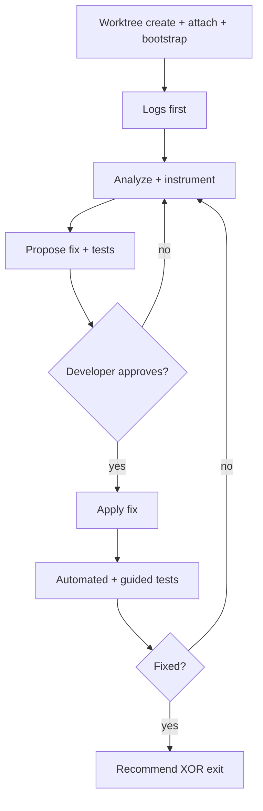

# Debug and fix

**Intent:** **Debug and Fix agent** runs a log-first diagnosis and fix loop in a dedicated hosting-repo worktree. Prioritize log access and debug instrumentation before substantive analysis. When the fix is verified, recommend an XOR exit: **Ad-Hoc PRD** (noisy worktree) or **code promotion** (clean fix).

**Normative mode:** **Spawned only** on this mission — child lane owns worktree lifecycle for the debug session unless protocol explicitly re-spawns **`coding-session`** for promotion.

## Inputs

| Field | Required | Notes |
|-------|----------|-------|
| `issueSummary` | Yes | Symptom or bug description |
| `reproductionSteps` | No | Reproduction narrative |
| `logHints` | No | Where to look first |
| `repoPath` | No | **`HOSTING_ROOT`** — resolve from workspace when omitted |
| `operationsUserId` | Yes | Session context |

## Execution diagram

## Steps

### 1 — Resolve paths and worktree name

1. Set **`HOSTING_ROOT`** = `repoPath` or workspace root containing `.sedea/centers/sedea/`.
2. Derive **`worktreeName`** per [`.sedea/centers/sedea/rules/7_stacked-pr-worktree-naming.mdc`](.sedea/centers/sedea/rules/7_stacked-pr-worktree-naming.mdc) — default non-stacked: `improve/debug-and-fix-<short-slug>` from issue summary.
3. Choose sibling **`WORKTREE_ROOT`** path per team convention (outside **`HOSTING_ROOT`** checkout tree).

### 2 — Worktree create, attach, bootstrap (binding)

Follow [`.sedea/centers/sedea/rules/0_hosting-repo.mdc`](.sedea/centers/sedea/rules/0_hosting-repo.mdc) § *Attach worktree to VS Code workspace* and **`coding-session`** hard rules:

| Step | Action |
|------|--------|
| 1 | **`git worktree add <absolute-path> -b <worktree-name> origin/main`** from **`HOSTING_ROOT`** |
| 2 | MCP **`sedea_add_worktree_folder`** with absolute **`WORKTREE_ROOT`** |
| 3 | Run **`./scripts/bootstrap-worktree-dev.sh "$WORKTREE_ROOT"`** from **`HOSTING_ROOT`** (inline — same as **`worktree-bootstrap`**) |

Do **not** edit product code before bootstrap succeeds.

### 3 — Logs first (mandatory gate)

**Do not start substantive root-cause analysis until log access is established.**

1. Read [`.cursor/rules/sedea-debug-logging-settings.mdc`](.cursor/rules/sedea-debug-logging-settings.mdc) and hosting-repo rules for log channels (`sedeaHub.logLevel`, `missionControl.logLevel`, Output panel sinks).
2. Collect existing logs relevant to `issueSummary` / `logHints`.
3. Add **liberal debug logging** to code under **`WORKTREE_ROOT`** when existing logs are insufficient — verbose debug output is acceptable for this stage.
4. Reproduce using `reproductionSteps` when provided; capture log evidence before proposing fixes.

### 4 — Analyze and propose fix

1. Analyze code with log evidence — prioritize log-backed hypotheses.
2. Propose fix with explicit **testing scenarios** (automated and manual).
3. Close turn with structured choice — developer approves fix proposal, requests revision, or aborts.

### 5 — Apply fix (after approval)

1. Implement approved fix only under **`WORKTREE_ROOT`**.
2. Run automated tests applicable to the change.
3. Guide developer through manual test scenarios step-by-step via structured choice checkpoints.

### 6 — Fix loop

- If issue persists or a new issue appears → return to step **3** (logs first on new evidence).
- If blocked (missing access, unrecoverable env) → set `fixStatus: blocked` and terminal with evidence.

### 7 — Session cleanup vs XOR recommendation

When fix is verified:

| Worktree state | `exitRecommendation` | Action |
|----------------|---------------------|--------|
| Many unrelated / noisy changes | `ad-hoc-prd` | Summarize fix + noise for Ad-Hoc PRD handover |
| Few changes, needs cleanup | `code-promotion` after optional in-session cleanup | Remove temporary debug noise when safe; keep beneficial logs |
| Clean, ready to ship | `code-promotion` | Hand off worktree paths to parent for **`coding-session`** spawn |

Present structured choice confirming recommendation; parent owns XOR selection in mission step 4.

## Structured choice (Mission Control)

Every assistant turn closes with **AskQuestion** or **`MC_PHASED_RESPONSE_V1`** per [`.sedea/centers/sedea/rules/2_ask-question-instructions.mdc`](.sedea/centers/sedea/rules/2_ask-question-instructions.mdc). Use **external-wait / parked continuation** when developer reviews diffs or runs tests outside chat.

## Completion (spawned)

| Output | Meaning |
|--------|---------|
| `fixStatus` | `verified` \| `partial` \| `failed` \| `blocked` |
| `fixSummary` | What was wrong and what changed |
| `testEvidence` | Automated + manual test outcomes |
| `worktreePath` | Absolute **`WORKTREE_ROOT`** |
| `worktreeName` | Branch / worktree name |
| `hostingRoot` | Absolute **`HOSTING_ROOT`** |
| `exitRecommendation` | `ad-hoc-prd` \| `code-promotion` \| `blocked` |
| `remainingTasks` | Open items for parent or developer |

### Host protocol line (required)

Emit **exactly one** terminal line (sentinel + JSON on the same line, no markdown fence):

`AGENT_RESULT_RESPONSE_V1 {"version":1,"correlationId":"<uuid>","status":"<success|partial|failure|aborted|abandoned>","summary":"<1-3 sentences>","outputs":{...},"errors":[]}`

Populate `outputs` per the table above. Use the spawn `correlationId` from the originating run request.

## Completion (inline)

Not used on this mission — **spawned only**.
