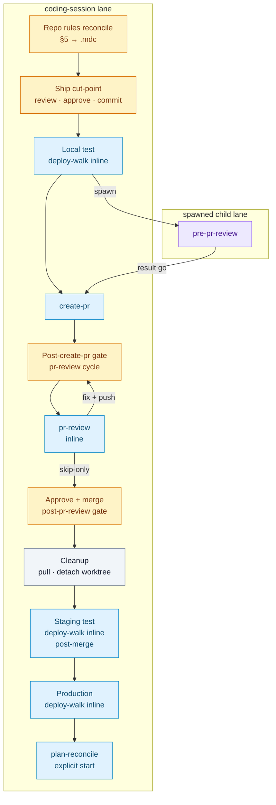

# Coding session

Hand off a unit of work into a **dedicated git worktree**, with the worktree visible in the **same Sedea workbench** (multi-root workspace), not a second editor process. Worktree **setup** is **center `worktree-setup.sh` only** (from **`HOSTING_ROOT`**); workbench **attach** is **`sedea_add_worktree_folder` only** — see [Hard rules — git worktree vs workbench attach (binding)](#hard-rules--git-worktree-vs-workbench-attach-binding) and [Center worktree scripts (binding)](#center-worktree-scripts-binding). **Execution mode** after setup depends on entry path — see [Execution mode after worktree attach](#execution-mode-after-worktree-attach).

**Owns:** per-PR plan §§ **5–8** during implementation (repo rules impact, tests, deploy plan, caveats); center **`worktree-setup.sh`**, JSON hint parsing, `plan-state.mjs set-worktrees` / `set-session`, Mission Control worktree attach, bootstrap status from setup hints (`outputs.bootstrapStatus: success` before implementation — no default-path inline **`worktree-bootstrap`**), pre-worktree validation + worktree-open gate; **spawned-lane implementation** or curated **prompt-only** session prompt emission; post-merge MCP **`sedea_remove_worktree_folder`**, hosting **`compose-worktree-teardown.sh`** (fail-open; warn on **`failed-open`**), then center **`worktree-cleanup.sh`**; [Ship chain after implementation](#ship-chain-after-implementation-coding-session-lane) ([Ship cut-point gate](#ship-cut-point-gate-approve-commit-local-test) — one modal approve + commit + Local test **`deploy-walk`** inline → **auto-spawn **`pre-pr-review`** → **auto inline **`create-pr`** on clean **go** → Staging test **`deploy-walk`** inline → **auto** [Post-merge workspace cleanup](#post-merge-workspace-cleanup) when merged → Production **`deploy-walk`** inline).

**Out of scope:** drafting per-PR §§ **1–4** ( **`pr-plan`** ); implementing hosting repo code when this run is **prompt-only** (see [Prompt-only handoff](#prompt-only-handoff)); opening PRs from the planning lane; **`plan-reconcile`** archive cadence except where this skill references it for cleanup narrative.

## Warm-up manifest (spawned)

Per [`.sedea/centers/sedea/docs/lane-manifest-contract.md`](.sedea/centers/sedea/docs/lane-manifest-contract.md) and **`../README.md`** § *Default warm-up* / *Warm-up cap exceptions*. Host merge: `effectiveWarmUp = dedupe(bootstrapRules → laneRules → skillWarmUp)`. Frontmatter matches this table; spawners may omit run-request **`laneRules`** when identical (README spawn preflight row 11). **384 KiB cap:** frontmatter omits **`plan.mdc`**, **`development-process.md`**, and rule **30** — explicit **`Read`** of those paths (and **`inputs.targetPlanPath`**) when ship/procedure steps require them. **No `alwaysApply` frontmatter flip.**

### `bootstrapRules` — host-resolved (R&D layer)

| Path | Purpose |
|------|---------|
| `.sedea/centers/research-and-development/rules/bootstrap.mdc` | Sole R&D `alwaysApply: true` bootstrap (≤10 KB); host merges when `centerSlug === research-and-development` |

### `skillWarmUp` — frontmatter `warmUpRules`

| Path | Purpose |
|------|---------|
| `.sedea/centers/research-and-development/missions/plan-and-deliver/skills/README.md` | Spawn contracts, terminal stop, cap exceptions |
| `.sedea/centers/research-and-development/rules/20_efficient-pr-shipping.mdc` | Worktree naming, ship chain, bootstrap |

**Omitted from frontmatter (384 KiB spawn cap — runtime `Read`):** `plan.mdc`, `development-process.md` — load via **`inputs.targetPlanPath`** and explicit **`Read`** when ship-chain or procedure steps require them.

### `laneRules` — frontmatter `laneRules`

| Path | Purpose |
|------|---------|
| `.sedea/centers/sedea/rules/2_ask-question-instructions.mdc` | Structured choice, AskQuestion / MCP structured choice |
| `.sedea/centers/sedea/rules/6_git-commit-push-gate.mdc` | Commit/push gate before ship cut-point |
| `.sedea/centers/research-and-development/rules/20_efficient-pr-shipping.mdc` | Ship lane minimum (role row in README) |
| `.sedea/centers/research-and-development/missions/plan-and-deliver/skills/coding-session/SKILL.md` | This skill procedure |

## Agent messaging (MCP)

**MCP spawn/result/notify-receive skill.** Parent→child spawn, child terminal result, and parent plan-change notify delivery use MCP tools per **`.sedea/centers/sedea/rules/4_mission.mdc`** § *Agent-to-agent spawn protocol* and § *MCP notify protocol*.

| Action | MCP tool |
|--------|----------|
| Parent spawn (when this skill emits a child lane) | **`mission_control_spawn_agent`** |
| **This** spawned lane terminal (and terminal re-emits) | **`mission_control_send_agent_result`** |
| Parent plan-change notify (receive only — **forbidden** on this lane) | Host-delivered UserSend — see [Plan-change notification receive (child lane)](#plan-change-notification-receive-child-lane) |

**Binding:**

- Run **`../README.md`** § *MCP spawn preflight* (rows M1–M8) before every MCP spawn; **forbidden** host-resolved identity keys in MCP args (`correlationId`, `dispatchId`, `slotId`, … — see README § *Host-resolved identity*).
- Inline skills on this mission stay **inline-only** — no spawn wire change unless the protocol step explicitly spawns a child lane.
- **`coding-session`** is a **notify recipient**, not a notify caller — **forbidden** **`mission_control_notify_child_lanes`** on this lane; escalate via upstream planner or Squad Leader.

### Plan-change notification receive (child lane)

When Mission Control delivers a silent UserSend whose first line is **`Mission Control: plan-change-notification delivered.`**, treat it as a **parent plan-change handoff** — not terminal completion, not implicit external-wait resume, and **not** permission to close the ship chain.

**Intake (binding):**

1. **Detect** the preamble line and parse the host envelope: **`summary`**, **`changeType`**, **`affectedPlanPaths`**, optional **`excerptPointers`**, optional **`requestedChildActions`**, optional **`initiatingContext`**, parent slug/agent id.
2. **`Read`** each path in **`affectedPlanPaths`** in full (`Read` tool, no offset/limit skip) **before** acting or offering options.
3. **Compare** grounded plan content to lane **`inputs`** (`targetPlanPath`, `targetPlanSlug`, `parentPlanPath`, ledger sidecar) and current implementation state.
4. **Keep** **`outputs.continuationStatus: active`** on any in-flight ship work — notify does not mark PR ship complete.

**Checkpoint vs external-wait (binding):** Plan-change notification delivery is a **developer-input USER_CHECKPOINT** on this lane — **not** implicit external-wait. Call **`mission_control_present_structured_choice`** or **AskQuestion** on the **same turn** after re-read and recap; do **not** end with prose-only acknowledgment or auto-advance into ship steps without the developer pick.

USER_CHECKPOINT — parent plan-change notification received; pick how to respond before continuing implementation or ship work.

**Required recap** (include in **`displayMarkdown`** when calling **`mission_control_present_structured_choice`**):

- One line: parent slug, **`changeType`**, and **`summary`**.
- Bullet list of **`affectedPlanPaths`** re-read (confirm each file was loaded).
- One line comparing whether **`inputs.targetPlanPath`** or anchored PR plan intersects the change (yes/no + which sections).

**Required options** (`modalTitle`: *Coding session — plan change notification*; list in this order):

| Option id | Label |
|-----------|--------|
| `acknowledge-only` | Acknowledge — continue current implementation with updated context |
| `re-read-revise` | Re-read / revise affected plan sections on this lane |
| `plan-reconcile` | Run inline **`plan-reconcile`** when authorized (plan-anchored ship) |
| `escalate-parent` | Escalate to parent planner — change needs upstream decision |
| `stop-work` | Stop work on this lane (when **`changeType: cancellation`** or developer-directed) |
| `more-details` | More details for option _ |

**Option semantics (binding):**

| Option | Act |
|--------|-----|
| **`acknowledge-only`** | Record acknowledgment in chat; resume prior ship-chain step — **no** terminal MCP result |
| **`re-read-revise`** | Edit anchored plan §§ or implementation scope per re-read; stay **`continuationStatus: active`** |
| **`plan-reconcile`** | Inline **`plan-reconcile`** per its contract when plan-anchored and ship rules loaded — merge ledger; **no** terminal result solely from notify |
| **`escalate-parent`** | Summarize gap for upstream **`phase-planner`** / **`pr-plan`** / Squad Leader — **no** **`mission_control_refocus_parent_lane`** solely from notify |
| **`stop-work`** | Pause implementation; may emit **`partial`** only when skill work is genuinely blocked — **not** because notify arrived |

When **`requestedChildActions`** is present, surface matching options in recap (for example **`re-read-plan`** → prefer **`re-read-revise`**; **`run-plan-reconcile`** → prefer **`plan-reconcile`**; **`acknowledge-only`** → default **`acknowledge-only`**; **`stop-work`** → include **`stop-work`**).

**Forbidden on notify delivery (binding):**

- Terminal **`mission_control_send_agent_result`** solely because notification arrived.
- **`mission_control_refocus_parent_lane`** solely because notification arrived.
- Treating notify as **`pre-pr-review`** / child-result external-wait — no host **`correlationId`** merge on parent from notify alone.
- Skipping **`Read`** of **`affectedPlanPaths`** before the USER_CHECKPOINT gate.
- Classifying notify as external-wait to avoid a turn-end modal under Checkpoint trust.

Normative protocol summary: **`.sedea/centers/sedea/rules/4_mission.mdc`** § *MCP notify protocol* § *Child agent duty*; **`../README.md`** § *Spawn vs notify* and § *Child delivery checkpoint (receive)*.

## Worktree create → attach → bootstrap (ownership)

Three **sequential** agent steps on the **`coding-session`** lane after the [Worktree-open gate](#worktree-open-gate), plus **center setup** (step **1** — includes fast bootstrap inside the shell).

| Step | Owner lane | Action | Tool / skill |
|------|------------|--------|--------------|
| 1 | **`coding-session`** | Setup worktree + fast bootstrap | **`.sedea/centers/sedea/scripts/worktree-setup.sh`** ([Generic flow](#generic-flow-single-repo) step 1) |
| 2 | **`coding-session`** | Record sidecar `worktrees` / `session` | `plan-state.mjs` (step 2) |
| 3 | **`coding-session`** | Mount worktree in Sedea workbench | MCP **`sedea_add_worktree_folder`** when setup hint **`nextAction: attach-required`** (step 3) |
| 4 | **`coding-session`** | Script-bootstrap post-setup when required | `./scripts/bootstrap-worktree-dev.sh` from **`HOSTING_ROOT`** when setup hint is **`skipped-noop`** and dot-sedea **`mode: none`** ([Generic flow](#generic-flow-single-repo) step 4) |

**Bootstrap:** Default path — center setup step **1**, MCP attach step **3**, then step **4** script-bootstrap post-setup when **`skipped-noop`** on **`mode: none`** hosts. Set **`outputs.bootstrapStatus: success`** only after step **4** completes (or when step **1** hint is **`success`** / **`skipped-idempotent`** without step **4**). Retry / exception only — [Worktree bootstrap (inline mandatory)](#worktree-bootstrap-inline-mandatory).

**Not a conflict:** center setup creates the directory and runs overlay bootstrap; **`sedea_add_worktree_folder`** adds that path to the Mission Control / editor workspace.

**Removal is the mirror:** post-merge detach/remove applies **only** to the **`WORKTREE_ROOT`** from steps 1–3 on **this pass** **or** the exact absolute path when [Inherited worktree ownership](#inherited-worktree-ownership-upstream-handoff-binding) applies — see § *Post-merge workspace cleanup* and rule **20** § *Worktree removal ownership (binding)*. **Do not remove worktrees you do not own.**

## Inherited worktree ownership (upstream handoff — binding)

When spawn **`inputs`** (or a clear invoker handoff) include **all** of:

| Field | Rule |
|-------|------|
| **`worktreePath`** | Absolute existing **`WORKTREE_ROOT`** on disk |
| **`worktreeOwnership: "inherited"`** | Upstream creator / mount lane passed cleanup ownership to this spawn |
| **`worktreeCreatedByUpstream`** | Non-empty skill slug (for example **`debug-and-fix`**) |
| **`worktreeName`** | Matching worktree / branch name when known |

…then **this lane owns cleanup** for that exact path even though **this** pass did **not** run **`worktree-setup.sh`**.

| Phase | Behavior |
|-------|----------|
| **Setup** | **Skip** center **`worktree-setup.sh`**. Set **`WORKTREE_ROOT`** / **`outputs.worktreePath`** from **`inputs.worktreePath`**. Set **`outputs.bootstrapStatus: success`** when the directory exists and prior bootstrap was success-class (or re-map from documented skip). |
| **Attach** | When **`mountedViaMcp: true`**, skip duplicate MCP attach if the folder is already mounted; when **`false`** or not mounted, call **`sedea_add_worktree_folder`** once for that absolute path — **do not** create a new worktree. |
| **Ship / cleanup** | Treat Path A / rule **20** “this pass” setup **and** “this pass” MCP attach preconditions as **satisfied via inheritance** for **that path only**. Post-merge **auto-apply** cleanup — **no** ownership-unclear modal for remount-only reuse. Cleanup attestation: **`--ownership-path a`**, **`--created-this-pass`**, **`--mounted-via-mcp`** when attach ran on this lane or upstream (`mountedViaMcp: true`). |

**Forbidden:** classifying **`worktreeOwnership: inherited`** + matching absolute **`WORKTREE_ROOT`** as unclear ownership because setup was not re-run on this lane; inventing a second worktree; removing any other path.

**Detection helpers:** Also treat as inherited when **`upstreamSkill === "debug-and-fix"`** and absolute **`inputs.worktreePath`** exists, even if a parent omitted the string **`inherited`** — still require the path to match the debug seed exactly; prefer parents that set the full field set (**`pr-plan` §5d**).

## Hard rules — git worktree vs workbench attach (binding)

Agents repeatedly call **`sedea_add_worktree_folder`** instead of **`git worktree add`**, or skip MCP attach after creating the worktree. On **every** **`coding-session`** lane these rules are **non-negotiable**:

| Step | Required | Forbidden |
|------|----------|-----------|
| **1 — Center setup** | **`.sedea/centers/sedea/scripts/worktree-setup.sh`** from **`HOSTING_ROOT`** with **`--hosting-root`**, **`--worktree-path`**, **`--worktree-name`**, optional **`--base-ref`** — **except** [Inherited worktree ownership](#inherited-worktree-ownership-upstream-handoff-binding) (reuse existing absolute path) | **`sedea_add_worktree_folder`** (MCP does **not** run git — it only mounts an **existing** folder), inline **`git worktree add`** on the default path, `git clone`, manual checkout/mkdir |
| **3 — Mount in Sedea workbench** | MCP **`sedea_add_worktree_folder`** with **absolute** `path` (optional `name`) when setup hint **`nextAction: attach-required`** **or** inherited handoff with **`mountedViaMcp: false`** / not yet mounted | VS Code / Cursor **Add Folder to Workspace**, hand-edited **`.code-workspace`** as the attach mechanism on Mission Control lanes, assuming step 1 made the worktree appear in the explorer |

**Fixed order (create-own path):** center setup (step **1**) → sidecar (step **2**) → MCP attach (step **3**). Never call **`sedea_add_worktree_folder`** before **`worktree-setup.sh`** exits **0** on the create-own path. Never skip step **3** because the directory exists on disk — **unless** [Inherited worktree ownership](#inherited-worktree-ownership-upstream-handoff-binding) with **`mountedViaMcp: true`** and the folder is already in the workbench.

**Squad Leader vs this lane:** **20_efficient-pr-shipping.mdc** § *Squad Leader on HOSTING_ROOT* may run center setup and call **`sedea_add_worktree_folder`** before spawning **`coding-session`**. When this skill runs [Generic flow](#generic-flow-single-repo) on a **spawned implementation lane**, **this lane** owns setup → sidecar → attach end-to-end unless the leader (or **inherited upstream** such as **`debug-and-fix`**) already completed attach and passed absolute **`WORKTREE_ROOT`** in spawn `inputs` — then skip duplicate setup / MCP only when the worktree path already exists **and** is already mounted in the workbench, and apply [Inherited worktree ownership](#inherited-worktree-ownership-upstream-handoff-binding) for cleanup.

## Center worktree scripts (binding)

**Setup and cleanup git orchestration** run through built-in **sedea** center shells from **`HOSTING_ROOT`**. **MCP attach/detach remain explicit agent steps** — shells emit JSON hints; they do **not** invoke **`sedea_add_worktree_folder`** or **`sedea_remove_worktree_folder`**.

| Script | Path | Replaces on this skill |
|--------|------|------------------------|
| **Setup** | `.sedea/centers/sedea/scripts/worktree-setup.sh` | Inline dirty-primary gate, **`git fetch`**, **`git worktree add`**, and default-path inline **`worktree-bootstrap`** |
| **Cleanup** | `.sedea/centers/sedea/scripts/worktree-cleanup.sh` | Inline post-merge **`git pull origin main`**, **`git worktree remove`**, and stale worktree name ref drop on owned paths |

Hosting overlay contract: **`.cursor/rules/dot-sedea.mdc`** § *Worktree bootstrap mode* and § *Center `worktree-setup.sh`*. Split contract: [`.sedea/centers/sedea/rules/0_hosting-repo.mdc`](.sedea/centers/sedea/rules/0_hosting-repo.mdc) § *Attach worktree to VS Code workspace* / § *Detach worktree from VS Code workspace*.

### Parse setup/cleanup JSON hints (binding)

Each script prints **one JSON line on stdout** (human progress on stderr). On **non-zero exit**, parse failure JSON when present — branch on **`exitCode`**, **`nextAction`**, and **`message`**.

| Hint field | Setup | Cleanup |
|------------|-------|---------|
| **`exitCode`** | Shell exit (**0** = success) | Same |
| **`nextAction`** | **`attach-required`** → MCP attach (step 3) | **`none`** on success; **`detach-required`** → run MCP detach before retry |
| **`worktreeRoot`**, **`worktreeName`** | Set **`WORKTREE_ROOT`** / sidecar + cleanup attestation | Same |
| **`bootstrapMode`**, **`bootstrapStatus`** | Map to **`outputs`** from step **1** hint — **`success`** / **`skipped-idempotent`** allow implementation after step **1**; **`skipped-noop`** requires [Generic flow](#generic-flow-single-repo) step **4** before implementation | N/A |
| **`cleanupStatus`** | N/A | **`success`** → **`outputs.postMergeCleanupStatus: success`** |

**Forbidden on default setup path:** raw **`git worktree add`**, running **`bootstrap-worktree-dev.sh`** **instead of** center setup step **1**, or **`full`** bootstrap escalation when center setup fails (exit **11** warm-primary → structured retry; exit **12** overlay → fix dot-sedea). **Allowed on default path:** **`bootstrap-worktree-dev.sh`** as **mandatory** Generic flow step **4** after MCP attach when step **1** hint is **`skipped-noop`** and dot-sedea **`worktreeBootstrap.mode: none`**. **Forbidden on default cleanup path:** inline **`git worktree remove`** + hosting **`git pull`** when **`worktree-cleanup.sh`** applies for an owned path after MCP detach.

## Structured choice (Mission Control)

Approval gates and worktree naming picks use **AskQuestion** or **`mission_control_present_structured_choice`** per **`.sedea/centers/sedea/rules/2_ask-question-instructions.mdc`** and **`../README.md`** § *Recap, structured choice, act* — recap + modal in **one turn** when practical; rule **2** priority **3** split only when a long draft was already sent (next message = MCP structured choice). **Act** (worktrees, spawn, `git`, code edits) is always after the developer selects in the modal.

On **[Spawned implementation lane](#spawned-implementation-lane)**, **this lane** edits the hosting repo under the worktree through the implementation cut point — do not tell the developer to paste a session prompt into another chat. On **prompt-only** runs, emit the external prompt and **stop** without implementing here.

## Session orientation table (binding)

Give developers a **consistent state snapshot** at ship gates so they can re-orient after reload, tab switch, or parallel work.

**When required:** At every **Mandatory gate** below — render as the **first block** in `displayMarkdown` (before step recap or checklist prose). **Forbidden:** omitting the table and substituting scattered one-liners.

**Table shape (markdown):**

| Field | Value |
|-------|-------|
| Plan | `<slug>` @ `<path>` or — |
| Plan IO host | `<absolute HOSTING_ROOT>` or — |
| Code IO | `<absolute WORKTREE_ROOT>` or — |
| Worktree | `<absolute WORKTREE_ROOT>` or — |
| Branch | `<worktreeName>` or — |
| PR | `<url>` (#N) or — |
| Ship phase | `<shipPhase>` |
| Deploy scope | Local test · After deploy · — |
| CI | `passing` · `failing (N)` · `pending` · `deferred` — from **`pr-review`** Step 1b when in PR review |
| Review | `<prePrReviewRecommendation>` / `prReviewStatus` / `reviewState` or — |

**Population rules:**

| Rule | Requirement |
|------|-------------|
| No invention | Use `—` when unknown; never guess paths or PR numbers |
| Plan IO host / Code IO | Set after worktree attach — **Plan IO host** = **`HOSTING_ROOT`**; **Code IO** = **`WORKTREE_ROOT`** (see § *Plan and sidecar IO (binding)*) |
| Worktree row | Populated while session worktree exists; `—` after authorized cleanup |
| PR row | Populated when `prUrl` or `prNumber` exists |
| Deploy scope | `Local test` during local-test-only walk; `Production` post-merge walk; `—` otherwise |
| Review row | Pre-PR: `outputs.prePrReviewRecommendation`; during PR: `prReviewStatus` + GitHub `reviewState` when known |

**Mandatory gates (this skill):**

| Gate | Section |
|------|---------|
| Repo rules reconciliation | [Repo rules reconciliation gate](#repo-rules-reconciliation-gate) |
| Ship cut-point | [Ship cut-point gate](#ship-cut-point-gate-approve-commit-local-test) |
| Local test walk | [Local test deploy-walk handoff](#local-test-deploy-walk-handoff) |
| Pre-PR handback | [Pre-PR review handoff](#pre-pr-review-handoff) |
| PR opened | [Post-create-pr handoff gate](#post-create-pr-handoff-gate) |
| Post-merge cleanup modal | [Post-merge workspace cleanup](#post-merge-workspace-cleanup) |
| Production walk | [Production deploy-walk handoff](#production-deploy-walk-handoff) |
| Implementation continuation | [Implementation continuation gate](#implementation-continuation-gate) |

Inline **`deploy-walk`** and **`pr-review`** on this lane must include the same table per their skill contracts.

## Plan and sidecar IO (binding)

Operations plan and sidecar IO always targets **`HOSTING_ROOT`** — never **`WORKTREE_ROOT/.sedea/operations/`**.

| IO kind | Root | Rule |
|---------|------|------|
| Plan body (`Read` / `StrReplace` on `*.plan.md`) | **`HOSTING_ROOT`** | Use spawn `inputs.targetPlanPath` verbatim when supplied |
| Sidecar (`plan-state.mjs`) | **`HOSTING_ROOT`** | `cd "$HOSTING_ROOT"` before every script invocation |
| Inline **`deploy-walk`** checklist patches | **`HOSTING_ROOT`** | Same absolute path as the anchored plan |

**Worktree operations copy:** Center **`worktree-setup.sh`** may copy `.sedea/operations/` from primary into the worktree for **read-only context** at bootstrap. That copy **does not sync** after creation and is **not** Plan Board authority. **Forbidden:** `Read` for write intent, `StrReplace`, `Write`, or hand edits under `WORKTREE_ROOT/.sedea/operations/`.

**Pre-write guard (binding):** Before any `.sedea/operations/` file mutation, resolve the absolute path. If the path contains a `*-worktrees/` segment or lies under a worktree checkout's `.sedea/operations/`, **stop** and rewrite to the equivalent path under **`HOSTING_ROOT`** (match slug; prefer spawn `targetPlanPath`).

Cross-refs: **20_efficient-pr-shipping.mdc** § *Hosting repo cwd for scripts* and § *Operations plan files (binding)*; **0_hosting-repo.mdc** § *Operations persistence (main hosting root only)*.

## Refresh lane display (when stale)

After **`targetPlanPath`** / PR concern is clear (before worktree attach or immediately after bootstrap succeeds):

1. Compare the visible tab **title** / **hover** to this lane's work (`targetPlanSlug`, §1 single concern).
2. When spawn labels are **generic or wrong**, call MCP **`mission_control_update_lane_display`** on **this lane only** with **`title`** = `PR{parentIndex}-{semantic title}` when **`parentIndex`** is known (§1 single concern or **`targetPlanSlug`**); otherwise `PR-{semantic title}` — and optional **`description`** / **`hoverDescription`** (max lengths in [`.sedea/centers/sedea/rules/9_display-metadata-authority.mdc`](.sedea/centers/sedea/rules/9_display-metadata-authority.mdc)). See [rule **50**](../../../../rules/50_mission-control-display-metadata-discipline.mdc) § *Lane title prefix conventions*.
3. **Skip** when spawn labels already match scope.
4. **Forbidden:** **`mission_control_update_dispatch_display`** from a child lane.

See [`.sedea/centers/research-and-development/rules/50_mission-control-display-metadata-discipline.mdc`](../../../../rules/50_mission-control-display-metadata-discipline.mdc) § *Child lane — refresh own slot when labels are stale*.

### Spawned lane — MCP structured choice (binding)

On spawned **`coding-session`** lanes, **in order to use the AskQuestion modal**, call **`mission_control_present_structured_choice`** for gates (MCP structured choice). Before the [Worktree-open gate](#worktree-open-gate), [Worktree-open gate (pr-plan spawn handoff)](#worktree-open-gate-pr-plan-spawn-handoff), [Repo rules reconciliation gate](#repo-rules-reconciliation-gate), [Ship cut-point gate](#ship-cut-point-gate-approve-commit-before-deploy), [Review feedback approval gate](#review-feedback-approval-gate) (**non-Checkpoint / exception only**), [Create-PR handoff after go](#create-pr-handoff-after-go) (exceptional — when **`hasProposedFollowUps`**, **`actionablePrePrFindings`** with developer **`proceed-create-pr`**, or explicit defer/revise before PR), [Post-create-pr handoff gate](#post-create-pr-handoff-gate), and any turn that **awaits a developer pick** before the next **Act** — **unless** [Auto-authorize implementation (pr-plan spawn)](#auto-authorize-implementation-pr-plan-spawn) or [Auto-spawn pre-pr-review](#auto-spawn-pre-pr-review) / [Inline create-pr (auto on clean go)](#inline-create-pr-auto-on-clean-go) / Checkpoint [auto-advance `fix-now-session`](#checkpoint--auto-advance-fix-now-session-binding) / Checkpoint [auto-advance `approve-followups-create-pr`](#checkpoint--auto-advance-approve-followups-create-pr-binding) / [Post-merge workspace cleanup](#post-merge-workspace-cleanup) auto-advance applies (no modal; proceed):

1. **Self-check:** call **`mission_control_present_structured_choice`** with recap in **`displayMarkdown`** — **no** recap-only prose without the MCP call.
2. Put required recap lines in **`displayMarkdown`** only (see pr-plan spawn handoff recap below).
3. Copy-paste template for pr-plan spawn **worktree-open** gate (replace `<recap>` when validation adds a line):

```json
{
  "displayMarkdown": "<recap>",
  "askQuestion": {
    "modalTitle": "Coding session — start implementation",
    "questions": [
      {
        "id": "worktree-open",
        "prompt": "Authorize worktree and implementation on this lane?",
        "allowMultiple": false,
        "options": [
          {
            "id": "continue-fill-5-8",
            "label": "Continue — fill §§5–8 while implementing"
          },
          {
            "id": "revise-plan",
            "label": "Revise PR plan first"
          },
          {
            "id": "change-repo",
            "label": "Change repo or worktree settings"
          },
          {
            "id": "defer",
            "label": "Defer implementation"
          },
          {
            "id": "more-details",
            "label": "More details for option _"
          }
        ]
      }
    ]
  }
}
```

Default **`<recap>`** for pr-plan spawn: *Planning handoff complete (§§1–4). §§5–8 fill on this lane during implementation.*

### Prose-only ship handoff forbidden (binding)

On spawned **`coding-session`** lanes, Mission Control opens the AskQuestion UI only when **StreamFinal** parses the **AskQuestion tool** or a valid **`mission_control_present_structured_choice`** call per [`.sedea/centers/sedea/rules/2_ask-question-instructions.mdc`](.sedea/centers/sedea/rules/2_ask-question-instructions.mdc). Resolve host parser module names from the **active hosting repo** overlay (for example **`.cursor/rules/dot-sedea.mdc`**) — do not embed product source paths in center assets. Prose menus do **not** open a modal.

**Forbidden** when any ship gate awaits a developer pick (cut-point, review feedback, exceptional create-PR, post-create-PR, or § *Every developer-await turn*):

| Anti-pattern | Why it fails |
|--------------|--------------|
| *Stay advisory until you pick …* / *I'll wait until you …* | Prose handoff — conduct **1** § *No idle handoff*; rule **2** § *Turn completion invariant* |
| *Pick Ship cut-point* / *tell me to push* without **`mission_control_present_structured_choice`** | User cannot click options — same |
| *PR created* / PR URL only — *review on GitHub* without post-create-pr **`mission_control_present_structured_choice`** | Same — § [Post-create-pr handoff gate](#post-create-pr-handoff-gate) step **7** |
| *Run these spot-checks, then reply with results* / *tell me when review is done* / *auto-advancing (no modal)* at a **developer-input** gate | § [Developer input vs external-wait (Checkpoint)](#developer-input-vs-external-wait-checkpoint) — manual deploy steps need **`deploy-walk`** [Manual step await gate](../deploy-walk/SKILL.md#manual-step-await-gate-binding); PR-review resume needs post-create-pr or **`pr-review`** disposition gate |
| Recap + diff summary **without** MCP structured choice on the **same** turn | **No modal** — agent failure |
| Redirect cut-point to Squad Leader or another tab | § *Post-reload / cold session* — cut-point runs **on this lane** |

**Required instead:** call **`mission_control_present_structured_choice`** (recap in **`displayMarkdown`**; ship options in **`askQuestion`**) per the gate template for that step. During implementation with **no** open ship gate, use [Implementation continuation gate](#implementation-continuation-gate) — **not** rule **2** default options that include push or PR paths.

### Every developer-await turn (binding)

On spawned **`coding-session`** lanes, **any** assistant turn where the developer must **pick** before you **Act** (commit, push, spawn, `gh pr create`, edits, next ship step) **must** end with **`mission_control_present_structured_choice`** (or **AskQuestion** tool when available on the lane). This includes — not only ship cut-point:

| Await point | Modal section |
|-------------|----------------|
| Worktree / implementation | [Worktree-open gate](#worktree-open-gate) |
| Implementation batch (no ship gate open) | [Implementation continuation gate](#implementation-continuation-gate) — **Checkpoint:** auto-advance **`ready-for-review`** when clean; modal only on exception |
| Plan §5 → `.mdc` reconcile (plan-anchored) | [Repo rules reconciliation gate](#repo-rules-reconciliation-gate) |
| Review-ready / commit / Local test | [Ship cut-point gate](#ship-cut-point-gate-approve-commit-before-deploy) — **Checkpoint:** auto-advance **`commit-only`** + **Act same turn** when clean; [Yield gate](#yield-gate-checkpoint--binding) if Act cannot continue; modal on exception |
| Local test manual step | § [Local test deploy-walk handoff](#before-deploy-deploy-walk-handoff) step 4 |
| Pre-PR findings | [Review feedback approval gate](#review-feedback-approval-gate) — **Checkpoint:** auto-advance **`fix-now-session`** **same turn** (no consent modal when Act continues) |
| Open PR (exceptional) | [Create-PR handoff after go](#create-pr-handoff-after-go) — **Checkpoint:** auto-advance **`approve-followups-create-pr`** when **`hasProposedFollowUps`** |
| **After `gh pr create` succeeds** | [Post-create-pr handoff gate](#post-create-pr-handoff-gate) — **Checkpoint:** **Gate** — emit post-create-pr **`mission_control_present_structured_choice`** same turn |
| **Waiting for PR review / merge resume** (developer returns after GitHub review or idle PR) | **`pr-review`** disposition gate — **Checkpoint:** PR review stop only |
| **After fix push — Step 5 pending** | Run **`pr-review`** Step 5 **same turn** as push — **Checkpoint:** auto-run; no post-create-pr or pre-merge modal until **`githubReconciliationStatus: complete`** |
| Waiting on child **`pre-pr-review`** | **Checkpoint:** **Gate** on spawn turn — next-step resume **`mission_control_present_structured_choice`** before StreamFinal ([Yield gate](#yield-gate-checkpoint--binding) / #external-wait); auto-advance **Act** on child result same turn when possible per [Review result aggregation](#review-result-aggregation) |
| **After deploy manual §7 step** (inline **`deploy-walk`**) | **`deploy-walk`** [Manual step await gate](../deploy-walk/SKILL.md#manual-step-await-gate-binding) — **same turn** as Step 4 presentation |

**Forbidden:** ending a turn with only a PR link, *PR created — review on GitHub*, *tell me when*, *reply with results*, or *pick … in chat* when a gate table exists for that await point. **Forbidden:** treating **developer-input** gates as **external-wait** — see § [Developer input vs external-wait (Checkpoint)](#developer-input-vs-external-wait-checkpoint).

### Post-reload / cold session (binding)

After Mission Control reload or window restart on **this** spawned **`coding-session`** lane:

1. **You are already on the coding-session child lane** — warm-up and post-restore preamble identify **spawned child**, not Squad Leader.
2. **Never** ask the developer to "switch to" or "continue in" the Coding session tab — they are messaging you here.
3. **[Ship cut-point gate](#ship-cut-point-gate-approve-commit-before-deploy)**, worktree-open, and every other gate in this skill run **on this lane** — call **`mission_control_present_structured_choice`** here; do **not** redirect ship cut-point to another tab or to the Squad Leader.
4. Re-read this SKILL.md and the prior transcript; resume from the last incomplete ship-chain step.
5. **Dispatch binding (binding):** When the preamble includes `[Mission Control — post-restore cold session]`, treat **`Active dispatch UUID`**, **`Bundle directory`**, and **`Your slot id`** in that preamble as authoritative scope. Read **`parent-child-registry.v1.json`**, **`dispatch-tab.v1.json`**, and **`dispatch-events.v1.ndjson` only under that bundle directory** — never under sibling dispatch folders.
6. **Forbidden cold-restore recovery:** `ls -lt` (or any mtime sort) across `.sedea/operations/**/dispatch/` to pick a dispatch; opening another tab's bundle because it is "newer"; mapping **PR N** without **`targetPlanSlug`** + the dispatch id stated in the preamble.
7. When spawn context JSON is missing from the preamble but dispatch binding is present, recover handover from **this dispatch's** registry (and `dispatch-events` for the matching `correlationId`) before running tools — do not improvise cross-dispatch scope.

## Relationship to `pr-plan`

| Concern | **`pr-plan`** | **`coding-session`** (this skill) |
|---------|--------------|-----------------------------------|
| §§ **1–4** | Drafted on the planning lane | Read for prompts and review; edit only when the developer revises the plan |
| §§ **5–8** | **`_TBD_`** or optional speculative sketch | Substantive fill during implementation |
| Handoff | **`pr-plan`** §5d **`mission_control_spawn_agent`** or detached entry | Spawned child lane or developer-started detached session |

See **`pr-plan/SKILL.md`** § *Handoff to coding-session*.

### pr-plan spawn handoff detection

Treat this run as a **pr-plan spawn handoff** when **either**:

- `inputs.planningHandoffMode === "sections-1-4-complete"`, or
- `inputs.upstreamSkill === "pr-plan"` **and** `inputs.readyForImplementation === true`.

When true, follow [Spawned from `pr-plan` (expected incomplete)](#spawned-from-pr-plan-expected-incomplete). After [Pre-worktree validation](#pre-worktree-validation-plan-completeness), use [Auto-authorize implementation (pr-plan spawn)](#auto-authorize-implementation-pr-plan-spawn) when eligible — otherwise [Worktree-open gate (pr-plan spawn handoff)](#worktree-open-gate-pr-plan-spawn-handoff) — not the generic incomplete gate with “executive override” labels.

### Spawned from `pr-plan` (expected incomplete)

When [pr-plan spawn handoff detection](#pr-plan-spawn-handoff-detection) applies:

1. Do **not** say the PR plan is “not fully populated,” “incomplete planning,” “not ready,” or that **`pr-plan`** failed.
2. Say: *Planning handoff complete (§§1–4). §§5–8 fill on this lane during implementation.*
3. After **`plan-ws-completeness.mjs`** → `INCOMPLETE` (optional second stdout line `EXPECTED_SECTIONS_5_8_TBD`), treat as **expected**, not a defect — do **not** send the developer back to **`pr-plan`** unless they choose **Revise PR plan first** or **Stop — I'll complete the plan first** (detached / snapshot entry only — demoted on pr-plan spawn path).
4. When [Auto-authorize implementation (pr-plan spawn)](#auto-authorize-implementation-pr-plan-spawn) does **not** apply, the [Worktree-open gate (pr-plan spawn handoff)](#worktree-open-gate-pr-plan-spawn-handoff) uses **Continue — fill §§5–8 while implementing** as the default authorizing choice — not “executive override” wording.

## Plan-anchored context (optional inputs)

The developer starts **`coding-session`** on a detached lane, via mission dispatch, or as a **spawned child** of **`pr-plan`** (§5d).

When `targetPlanPath` / `targetPlanSlug` are known (message, `@` path, snapshot, or spawn `inputs`), use them for sidecar writes and the session prompt. When spawned from **`pr-plan`**, treat spawn `inputs` and `initiatingPrompt` as authoritative — do not re-resolve from documentation placeholders.

If `upstreamSkill` is **`pr-plan`** and `repoPath` is present in `inputs`, use it as hosting repo root. If repo targets are missing, stop and ask the developer with **AskQuestion** to choose or provide the hosting repo(s). Do not infer from focused files alone.

## Implementation consent (two layers)

Only **two** developer-consent layers apply before worktrees. Do not stack extra approval **AskQuestion** rounds for the same decision.

| Layer | Where decided | Output field | This skill |
|-------|---------------|--------------|------------|
| **1 — Planning handoff** | **`pr-plan`** §5c **Start coding session** + §5d spawn `inputs` | `readyForImplementation`, `planningHandoffApproved` | Hint only; **do not** re-ask. Does **not** authorize worktrees or advance **`.sedea/centers/research-and-development/missions/plan-and-deliver/plan.mdc`** §8 `phase` past `not-started`. |
| **2 — Worktree open** | [Worktree-open gate](#worktree-open-gate) **or** [Auto-authorize implementation (pr-plan spawn)](#auto-authorize-implementation-pr-plan-spawn) | `developerApprovedImplementation` | Set `true` after an authorizing gate choice **or** auto-authorize when spawn handoff + §§1–4 drafted (see below). |

**Not consent layers** (validation / setup only — no separate approval **AskQuestion**):

- **`plan-ws-completeness.mjs`** — script check; incomplete plans are handled inside the worktree-open gate (override option), not a second gate.
- **Repo selection** — **AskQuestion** only when `repoPath` / `repoPaths` are missing.

`inputs.developerApprovedImplementation` is never a substitute for layer 2 on **detached** entry; ignore upstream `true` until the developer picks an authorizing worktree-open option **or** [Auto-authorize implementation (pr-plan spawn)](#auto-authorize-implementation-pr-plan-spawn) applies on this run.

## Checkpoint turn UX (skill-local)

Under Checkpoint trust (`trustLevel: checkpoint`), auto-advance scripted happy-path steps when this lane **continues Act on the same turn**; emit structured choice at **USER_CHECKPOINT** markers, implicit external-wait surfaces, exception paths, and every **Yield** (see [Yield gate](#yield-gate-checkpoint--binding)). **No cross-skill inheritance** — gate defaults here apply only to **`coding-session`**; other ship-chain skills document their own markers.

### Yield gate (Checkpoint — binding)

Under Checkpoint trust, **auto-advance may resolve a pick and Act on the same turn**. It must **not** end StreamFinal mid-ship with recap / `partial` only and rely on host continue-recovery.

**Yield** = this assistant turn will StreamFinal **without** further Act (tool use, edits, spawn, or git writes) on the **same** turn while ship work remains open:

- `continuationStatus: active`, **or**
- non-empty `remainingTasks`, **or**
- dirty worktree / uncommitted ship edits, **or**
- awaiting a child result (`pre-pr-review` correlation in flight), **or**
- any hop documented as “Act on the **next** turn” after an implied Checkpoint pick

When **Yield** applies: **must** call **`mission_control_present_structured_choice`** (or AskQuestion) before StreamFinal — resume / continue Act / pause / **More details for option _** — treat as a gate surface even without a legacy `USER_CHECKPOINT` marker.

**Forbidden:** “Checkpoint auto-advance — Act next turn” prose-only StreamFinal; relying on `[Mission Control — continue recovery]` as the control plane for mid-ship hops.

**Still allowed without a Yield modal:** same-turn Act after auto-resolve (for example **`fix-now-session`** implement on the same turn as the child result; agent-executable **`deploy-walk`** steps that continue Act in-turn; clean continuous Act chains that do not StreamFinal mid-flight).

### Checkpoint three-stop model (binding)

On a **clean** Checkpoint ship chain (no eligibility failures, named defer/revise, executive override, or plan-change notify), the lane opens a **developer consent** turn-end modal at these surfaces (in addition to any [Yield gate](#yield-gate-checkpoint--binding) when StreamFinal would otherwise yield mid-ship):

| # | Surface | Normative gate |
|---|---------|----------------|
| **1** | **PR opened** — next ship action after inline **`create-pr`** | [Post-create-pr handoff gate](#post-create-pr-handoff-gate) on this lane |
| **2** | **PR review** — inline **`pr-review`** disposition (Step **3b** / Step **4**) after PR exists | **`pr-review/SKILL.md`** disposition gate on this lane |
| **3** | **Manual deploy verification** — §7 Production Deploy Steps the agent cannot execute | **`deploy-walk`** [Manual step await gate](../deploy-walk/SKILL.md#manual-step-await-gate-binding) for **`### Local test`** and **`### Production`** manual steps |

**Auto-advance under Checkpoint (not consent-modal stops — standard ship operations when Act continues same turn):** worktree-open when [Auto-authorize](#auto-authorize-implementation-pr-plan-spawn) applies; implementation continuation; repo rules reconciliation; ship cut-point (**Act same turn** — see [Yield gate](#yield-gate-checkpoint--binding) if Act cannot continue); agent-executable Local test **`deploy-walk`** steps; **`pre-pr-review`** child **result** handback when Act continues same turn (spawn turn still requires Yield / #external-wait resume modal); pre-PR findings with **`flags`** / Must / Should (**`fix-now-session`** **same turn** — **no** review-feedback consent modal; append **`proposedFollowUps`** to plan when present); inline **`create-pr`** on clean **`go`** (including **`create-pr`** [Checkpoint — auto-advance `authorize-create-pr`](../create-pr/SKILL.md#checkpoint--auto-advance-authorize-create-pr-binding) — **forbidden:** *Create the pull request now?* consent modal); create-PR when **`hasProposedFollowUps`** only (**`approve-followups-create-pr`** **same turn** — append + open PR); rebase onto **`origin/main`** including conflict resolution and **`--force-with-lease`** push; failing CI remediation; post-fix push + **`pr-review`** Step 5; pre-merge when **`mergeDelegationReady`** (**`delegate-merge-confirm`**); post-merge cleanup and After deploy agent-executable steps; **`deploy-walk`** [Checkpoint — auto-advance `approve-deploy-closure`](../deploy-walk/SKILL.md#checkpoint--auto-advance-approve-deploy-closure-binding) when After deploy is fully satisfied (**forbidden:** *approve deploy checklist closure?* modal on clean path); inline **`plan-reconcile`** [Checkpoint — auto-advance `approve-reconcile-mutations`](../plan-reconcile/SKILL.md#checkpoint--auto-advance-approve-reconcile-mutations-binding), [Checkpoint — auto-advance own-plan archive](../plan-reconcile/SKILL.md#checkpoint--auto-advance-own-plan-archive-binding), and [Checkpoint — auto-advance `confirm-inline-closure`](../plan-reconcile/SKILL.md#checkpoint--auto-advance-confirm-inline-closure-binding) when clean (**forbidden:** *approve PR-tracked reconcile mutations?*, multi-plan *pick plans to archive?*, and *confirm plan-reconcile inline closure?* on the clean own-plan path).

**Not exceptions (binding):** pre-PR review **`flags`**, PR comment fix loops, rebase conflict resolution, failing CI fix paths, and post-create-pr rebase push — run as **standard operations** without an extra coding-session modal between steps **except** [Post-create-pr handoff gate](#post-create-pr-handoff-gate) stop **1** and **`pr-review`** disposition stop **2**. **Forbidden:** prose-only *Next: inline pr-review* / PR URL recap without post-create-pr **`mission_control_present_structured_choice`** on the **`create-pr`** completion turn — that gate is the resume surface for PR handling, not external-wait.

**Real-dispatch test loop (binding):** After merge, run one full **`coding-session`** spawn on a Checkpoint dispatch through the worktree-open gate (or auto-authorize path when eligible) and collect a developer verdict before the parent phase advances **`pre-pr-review`** PR 2 — per **Ship-chain skills UX** § *Single-concern strategy*.

Marker syntax: [`.sedea/centers/sedea/docs/user-checkpoint-marker-syntax.md`](.sedea/centers/sedea/docs/user-checkpoint-marker-syntax.md).

### Developer input vs external-wait (Checkpoint)

Under Checkpoint trust, **happy-path protocol steps may auto-advance when this lane continues Act on the same turn**. Call **`mission_control_present_structured_choice`** or **AskQuestion** at **USER_CHECKPOINT** markers in this skill, **implicit external-wait** surfaces that end the turn before the child/host delivery, **exception** paths, and every [Yield gate](#yield-gate-checkpoint--binding) StreamFinal.

**Developer-input** (continuation requires the **developer** to pick a modal option or structured choice on **this lane**) is **not** external-wait. Under **non-Checkpoint** trust, these USER_CHECKPOINT surfaces **must** close the turn with **`mission_control_present_structured_choice`** / **AskQuestion**. Under **Checkpoint** trust, rows marked **Checkpoint gate** require a modal; same-turn Act auto-advance remains per [Checkpoint three-stop model](#checkpoint-three-stop-model-binding) — **forbidden:** StreamFinal mid-ship without a modal when [Yield gate](#yield-gate-checkpoint--binding) applies.

| Situation | Normative gate | Checkpoint |
|-----------|----------------|------------|
| PR opened — next ship action (review, merge check, defer) | [Post-create-pr handoff gate](#post-create-pr-handoff-gate) | **Checkpoint gate** — post-create-pr stop **1** |
| Developer submits own GitHub review — resume triage | [Manual review submission (developer-input)](#manual-review-submission-developer-input) | Auto-advance **`start-pr-review-delegate-merge`** when triage was requested |
| Inline **`pr-review`** — triage disposition / fix scope | **`pr-review`** Step **3b** / Step **4** disposition gates | **Checkpoint gate** — PR review stop |
| Before / After deploy — manual §7 verification | **`deploy-walk`** [Manual step await gate](../deploy-walk/SKILL.md#manual-step-await-gate-binding) | **Checkpoint gate** — deploy manual stop |
| After deploy checklist fully satisfied — Status `deployed → done` | **`deploy-walk`** [Deploy closure approval gate](../deploy-walk/SKILL.md#deploy-closure-approval-gate-binding) | Auto-advance **`approve-deploy-closure`** **same turn** — **no** modal on clean path |
| Pre-PR findings after child returns | [Review feedback approval gate](#review-feedback-approval-gate) | Auto-advance **`fix-now-session`** **same turn** — **no** `USER_CHECKPOINT` / modal on clean path |
| Agent-delegated merge when clean | [Pre-merge authorization gate](#pre-merge-authorization-gate) | Auto-advance **`delegate-merge-confirm`** when **`mergeDelegationReady`** |
| Parent plan-change notify UserSend | [Plan-change notification receive (child lane)](#plan-change-notification-receive-child-lane) | **Checkpoint gate** (exception to three-stop when notify arrives mid-ship) |

**Implicit external-wait** (host or async event may resume the lane **without** a developer modal pick on that turn): host-delivered **`mission_control_send_agent_result`** from spawned **`pre-pr-review`** may arrive later — **before** StreamFinal on the spawn turn, still open the **next-step resume** structured choice (**Yield** / #external-wait). Squad Leader **`#external-wait`** resume per mission `plan.mdc` — same. **Forbidden:** classifying *waiting for the developer to review the PR on GitHub and return* as external-wait — GitHub reviewers are external; **lane continuation** is developer-input via the gates above. **Forbidden:** ending a **`pre-pr-review`** spawn turn with prose-only *waiting for child* and no resume modal.

**Checkpoint auto-advance does not apply** when a row in § *Every developer-await turn* names a gate and no clean auto-advance criterion in the Checkpoint table passes — including **manual After deploy** presentation: auto-advance stops **at** presentation; the **same turn** must emit **`deploy-walk`** Manual step await gate.

| Step | Checkpoint behavior | Gate |
|------|---------------------|------|
| **Pre-worktree validation** — `plan-ws-completeness.mjs` | Auto-advance — record `planCompleteness`; route in worktree-open or auto-authorize | exception: missing plan path |
| **Auto-authorize** — pr-plan / phase-planner spawn handoff | Auto-advance when [eligibility](#auto-authorize-implementation-pr-plan-spawn) passes — skip worktree-open modal | exception: eligibility fails → worktree-open gate |
| **Worktree-open gate** | **Gate** when layer 2 modal required — **first developer-pick gate on spawned lane** | Authorize worktree (below) |
| **Generic flow** steps **1–4** — setup, sidecar, attach, bootstrap | Auto-advance on happy path | exception: bootstrap / attach failure |
| **Spawned implementation** steps **5–6** | Auto-advance through implementation batches | exception: blocking stop → `partial` result |
| **Implementation continuation gate** | **Auto-advance** — resolve **`ready-for-review`** when [clean implementation](#implementation-continuation-gate) criteria pass | **Gate** when any clean criterion fails — [Implementation continuation gate](#implementation-continuation-gate) |
| **Repo rules reconciliation** + **pre-review verification** (steps **7–8**) | Auto-advance on happy path before ship cut-point | exception: action bullets without `.mdc` diff; verification failures — [Repo rules reconciliation gate](#repo-rules-reconciliation-gate) |
| **Ship cut-point gate** | **Auto-advance** — resolve **`commit-only`** and **Act same turn** (full path: commit + inline Local test **`deploy-walk`** when plan-anchored) when [clean cut-point](#ship-cut-point-gate-approve-commit-before-deploy) criteria pass; if Act cannot continue this turn → [Yield gate](#yield-gate-checkpoint--binding) | **Gate** when any clean criterion fails — [Ship cut-point gate](#ship-cut-point-gate-approve-commit-before-deploy) |
| **Pre-PR review feedback** | **Auto-advance** — **`fix-now-session`** **same turn** when **`actionablePrePrFindings`** (implement Must + Should; append follow-ups to plan); inline **`create-pr`** on clean **`go`** without findings; **`approve-followups-create-pr`** **same turn** when **`hasProposedFollowUps`** only | Exception: developer **`defer`** / **`revise-scope`** in **same** message — [Review feedback approval gate](#review-feedback-approval-gate) Non-Checkpoint modal only |
| **Pre-merge ship** (after post-create-pr pick → **`pr-review`** → merge delegation) | **Auto-advance** — rebase push **`--force-with-lease`**; pre-merge → **`delegate-merge-confirm`** when **`mergeDelegationReady`** | **Checkpoint gate** at **`pr-review`** disposition only; exception: merge blockers after inspect — [Pre-merge authorization gate](#pre-merge-authorization-gate) |
| **Post-create-pr handoff** | **Gate** — emit post-create-pr **`mission_control_present_structured_choice`** same turn as inline **`create-pr`** completion | [Post-create-pr handoff gate](#post-create-pr-handoff-gate) — **Checkpoint** stop **1** |
| **Post-merge tail** (cleanup → promote-pin hint → After deploy walk entry) | **Auto-advance** — no turn-end modal between PR merge and first After deploy manual step | exception: cleanup partial / merge unconfirmed / promote-pin hard failure |
| **After deploy deploy-walk** — manual §7 steps (Production Deploy Steps) | **Gate** — **sole** USER_CHECKPOINT surface **after PR merge** on this lane | [`deploy-walk` Manual step await gate](../deploy-walk/SKILL.md#manual-step-await-gate-binding) |
| **Post-after-deploy tail** (plan-reconcile → **`prShipComplete`**) | **Auto-advance** — run remainder inventory without batch modal when clean | exception: reconcile flags requiring developer picks |
| **Plan-change notification receive** | **Gate** — developer-input USER_CHECKPOINT after mandatory re-read | [Plan-change notification receive (child lane)](#plan-change-notification-receive-child-lane) — **not** external-wait |

**Skip worktree-open modal (binding):** When [Auto-authorize implementation (pr-plan spawn)](#auto-authorize-implementation-pr-plan-spawn) applies, layer 2 is satisfied without opening [Worktree-open gate](#worktree-open-gate) — not a regression for this calibration.

### Post-merge Checkpoint chain (binding)

Under Checkpoint trust, after **`outputs.prState: merged`** (or merge confirmed on **`check-pr-status`** / delegate-merge path), **one continuous auto-advance chain** runs before any turn-end modal — **except** when [After deploy deploy-walk handoff](#after-deploy-deploy-walk-handoff) reaches a **manual** §7 step and **`deploy-walk`** opens its [Manual step await gate](../deploy-walk/SKILL.md#manual-step-await-gate-binding).

**Auto-advance order (happy path — no turn-end modal between steps):**

1. [Post-merge workspace cleanup](#post-merge-workspace-cleanup) **`--apply`** when ownership preconditions pass.
2. Inline **`promote-center-submodule-pin`** when cleanup JSON **`nextAction: promote-pin-required`** (agent-owned handoff — no spawn, no modal per that skill).
3. [After deploy deploy-walk handoff](#after-deploy-deploy-walk-handoff) — inline **`deploy-walk`** for **`### Production`** only.
4. When **`deployStatus: done`** and **`deployTodoStatus: done`**, auto-run [Post–After deploy remainder inventory](#post-after-deploy-remainder-inventory) steps (**`plan-reconcile`** then **`pr-ship-complete`**) without [Post–After deploy remainder authorization](#post-after-deploy-remainder-authorization) batch modal when reconcile requires no developer picks.

**Manual step presentation (binding):** When step **3** inline **`deploy-walk`** presents a **manual** After deploy step (Step 4 presentation), **same assistant turn** must close with **`deploy-walk`** [Manual step await gate](../deploy-walk/SKILL.md#manual-step-await-gate-binding). **Forbidden:** listing unchecked After deploy steps in recap and ending with *reply with results*, *run these spot-checks then tell me*, or *auto-advancing (no modal)* — that gate is the **allowed** USER_CHECKPOINT after merge, not an optional extra modal.

**Forbidden turn-end modals after PR merge (Checkpoint — binding):**

| Forbidden | Includes |
|-----------|----------|
| Re-open [Post-create-pr handoff gate](#post-create-pr-handoff-gate) | *PR merged — what's next?*, **`spawn-after-deploy-walk`** pick substitutes, standalone After deploy recap before **`deploy-walk`** presents step 1 |
| Standalone After deploy step modal | Recap + **`mission_control_present_structured_choice`** that mirrors §7 step text **before** inline **`deploy-walk`** runs — manual gates come **only** from **`deploy-walk`** Step 4 / Manual step await |
| [Post-merge workspace cleanup](#post-merge-workspace-cleanup) authorization | Default auto-apply path — exceptional modal only per that section |
| [Post–After deploy remainder authorization](#post-after-deploy-remainder-authorization) | Batch or per-step remainder modals on clean happy path |
| **`approve-deploy-closure`** as a separate coding-session modal | Defer to **`deploy-walk`** [Checkpoint — auto-advance `approve-deploy-closure`](../deploy-walk/SKILL.md#checkpoint--auto-advance-approve-deploy-closure-binding) — **forbidden:** *approve deploy checklist closure?* on this lane |
| **`approve-reconcile-mutations`** / multi-plan archive pick as coding-session modals | Defer to **`plan-reconcile`** [Checkpoint — auto-advance `approve-reconcile-mutations`](../plan-reconcile/SKILL.md#checkpoint--auto-advance-approve-reconcile-mutations-binding) and [own-plan archive](../plan-reconcile/SKILL.md#checkpoint--auto-advance-own-plan-archive-binding) — **forbidden:** *approve PR-tracked reconcile mutations?* and *pick plans to archive…* multi-select on the clean Checkpoint path |
| **`confirm-inline-closure`** as a separate coding-session or reconcile modal on clean handback | Defer to **`plan-reconcile`** [Checkpoint — auto-advance `confirm-inline-closure`](../plan-reconcile/SKILL.md#checkpoint--auto-advance-confirm-inline-closure-binding) — **forbidden:** *confirm plan-reconcile inline closure?* on clean path |

**Allowed USER_CHECKPOINT after merge:** **`deploy-walk`** [Manual step await gate](../deploy-walk/SKILL.md#manual-step-await-gate-binding) for **`### Production`** manual steps only (Production Deploy Steps).

**Exception paths (modal OK):** post-merge cleanup partial failure; promote-pin hard stop; **`deploy-walk`** block/skip paths; plan-reconcile inventory requiring explicit picks (flagged archive, follow-ups triage when unchecked bullets remain, Non-Checkpoint / exception reconcile gates); **`return-to-implementation-new-worktree`** from deploy manual gate.

## Pre-worktree validation (plan completeness)

**Worktree validation** (see **`pr-plan`** §5b and **development-process.md** § *Planning readiness vs worktree completeness*). Independent of layer 1 **`readyForImplementation`**. **`readyForImplementation: true` does not skip this script** — run it unless validation is skipped or the user message already contains **`override incomplete plan`**.

When this run anchors Phase 2 to a Plan Board **`.plan.md`** under **`.sedea/operations/`**, run validation **before** the [Worktree-open gate](#worktree-open-gate) — but **do not** use a separate completeness **AskQuestion**; record the script result and present override/stop choices in that single gate.

**Lane-change snapshots** (*back to plan*, *where are we?*, …) follow **30_planning-target-resolution.mdc** § *PR-plan completeness before coding-session*: when a snapshot lists both an incomplete per-PR plan and **coding-session**, **finishing the plan** must be ordered **first**.

**Skip** when there is **no** plan file anchor.

**Treat as override already chosen** when the user message contains **`override incomplete plan`** (ASCII, case-insensitive) — skip the script; proceed to the worktree-open gate.

Otherwise:

1. Resolve the plan’s **absolute** path. If you cannot, **stop** and ask for a path or `plan-state` linkage.
2. From the **hosting repo root**:
 ```bash
 node .sedea/centers/research-and-development/missions/plan-and-deliver/scripts/plan-ws-completeness.mjs --file "<absolute-plan-path>"
 ```
 - Exit **0** (`OK` / `SKIP_NOT_PER_PR`) → `planCompleteness: complete` for the worktree-open gate.
 - Exit **1** (`INCOMPLETE`) → `planCompleteness: incomplete` — **do not** create worktrees yet; route to the worktree-open gate (pr-plan spawn handoff vs generic incomplete).
 - When [pr-plan spawn handoff detection](#pr-plan-spawn-handoff-detection) applies, `INCOMPLETE` is **expected** (§§5–8 still `_TBD_` by design). If stdout includes `EXPECTED_SECTIONS_5_8_TBD`, treat as the normal §5d handoff. Use [Spawned from `pr-plan` (expected incomplete)](#spawned-from-pr-plan-expected-incomplete) wording — not “plan not fully populated.”

**Multi-repo:** run the script **once** on the shared plan before the worktree-open gate or auto-authorize path.

- **Next-step resolution:** Auto-advance to [Auto-authorize implementation (pr-plan spawn)](#auto-authorize-implementation-pr-plan-spawn) or [Worktree-open gate](#worktree-open-gate) after recording `planCompleteness` — no `USER_CHECKPOINT` on this step.

## Auto-authorize implementation (pr-plan spawn)

**Layer 2 waived** — no worktree-open **AskQuestion** or **`mission_control_present_structured_choice`** when the developer already approved **Start coding session** on the **`pr-plan`** lane and the PR plan is ready to implement.

### Eligibility (all required)

1. [pr-plan spawn handoff detection](#pr-plan-spawn-handoff-detection) applies.
2. `inputs.planningHandoffApproved === true` **or** (`inputs.readyForImplementation === true` **and** `inputs.upstreamSkill === "pr-plan"`).
3. `inputs.promptOnly` is not `true`.
4. `inputs.repoPath` or non-empty `inputs.repoPaths` is present.
5. After [Pre-worktree validation](#pre-worktree-validation-plan-completeness), **either**:
 - `planCompleteness: complete` (`plan-ws-completeness.mjs` exit **0** / `OK`), **or**
 - `planCompleteness: incomplete` **and** stdout included `EXPECTED_SECTIONS_5_8_TBD` (§§ **1–4** drafted; §§ **5–8** may stay `_TBD_`).

### When eligibility fails

| Failure | Action |
|---------|--------|
| §§ **1–4** still contain `_TBD_` (incomplete without `EXPECTED_SECTIONS_5_8_TBD`) | [Worktree-open gate](#worktree-open-gate) — generic incomplete options; do **not** auto-authorize |
| `readyForImplementation: false` or `planningHandoffApproved` not set | [Worktree-open gate (pr-plan spawn handoff)](#worktree-open-gate-pr-plan-spawn-handoff) or generic gate |
| Missing `repoPath` / `repoPaths` | **AskQuestion** once for repo only — not a second planning-approval round |
| Detached / snapshot entry (no spawn handoff) | [Worktree-open gate](#worktree-open-gate) — layer 2 required |

### When eligible — act without modal

1. Set `outputs.developerApprovedImplementation: true` and `outputs.planCompleteness` from validation.
2. State one informational line (no modal): *Planning handoff approved on **pr-plan** lane. §§1–4 ready — implementing; §§5–8 fill on this lane as code lands.* When `planCompleteness: complete`, use: *PR plan complete — implementing.*
3. Proceed immediately to [Generic flow](#generic-flow) (center setup, sidecar, attach) — then [Spawned implementation lane](#spawned-implementation-lane).
   - **Bootstrap gate (binding):** Step **1** **`worktree-setup.sh`** must exit **0**. When hint is **`success`** or **`skipped-idempotent`**, set **`outputs.bootstrapStatus: success`** after step **1**. When hint is **`skipped-noop`** on a **`mode: none`** script-bootstrap host, complete Generic flow step **4** before product edits — **`skipped-noop` alone is not dev-ready**.
   - Set **`outputs.bootstrapStatus: success`** only when step **1** or step **4** (post-setup script) completes successfully.
   - **If setup fails or bootstrap hint is not success-class:** STOP — no product edits, no §§5–8, no ship chain. Follow **Failure** under [Worktree bootstrap (mandatory)](#worktree-bootstrap-mandatory).
   - **Forbidden substitute:** extension-level `npm ci`, `tsc`, or vitest passing does **not** set `bootstrapStatus: success` when setup exited non-zero.
4. Do **not** call **`mission_control_present_structured_choice`** for worktree-open on this path.

- **Next-step resolution:** Auto-advance to [Generic flow](#generic-flow-single-repo) when eligible — no `USER_CHECKPOINT` on this path.

## Worktree-open gate

**Layer 2 — single AskQuestion** before any center **`worktree-setup.sh`**, sidecar session write, Mission Control worktree attach, or coding-agent prompt emission — **skip** when [Auto-authorize implementation (pr-plan spawn)](#auto-authorize-implementation-pr-plan-spawn) applies. After approval, [Generic flow](#generic-flow-single-repo) step **1** is **center setup only**; step **3** is **`sedea_add_worktree_folder` only** — see [Hard rules](#hard-rules--git-worktree-vs-workbench-attach-binding).

**Recap and structured choice:** Summarize completeness / plan path in **`displayMarkdown`** when calling **`mission_control_present_structured_choice`**. On spawned lanes, **call MCP structured choice** — see [Spawned lane — MCP structured choice (binding)](#spawned-lane--mcp-structured-choice-binding). Open every gate via **AskQuestion** or **`mission_control_present_structured_choice`** — prefer one message for recap + modal. See **`../README.md`** § *Recap, structured choice, act (plan-and-deliver)*, **`.sedea/centers/sedea/rules/2_ask-question-instructions.mdc`**, and **`.cursor/rules/mission-control-agent-runtime.mdc`**.

**Branch first:** when [Auto-authorize implementation (pr-plan spawn)](#auto-authorize-implementation-pr-plan-spawn) applies, **skip this entire section**. When [pr-plan spawn handoff detection](#pr-plan-spawn-handoff-detection) applies but auto-authorize does not, use [Worktree-open gate (pr-plan spawn handoff)](#worktree-open-gate-pr-plan-spawn-handoff) below — even when `planCompleteness: complete`. Otherwise use the generic tables in this section.

### Worktree-open gate (pr-plan spawn handoff)

When [pr-plan spawn handoff detection](#pr-plan-spawn-handoff-detection) applies:

**Required recap** (include in `displayMarkdown` or recap prose before the modal):

*Planning handoff complete (§§1–4). §§5–8 fill on this lane during implementation.*

When `planCompleteness: incomplete`, add one line: *Validation reported incomplete because §§5–8 are still `_TBD_` — expected after **pr-plan** spawn.*

USER_CHECKPOINT — authorize worktree and implementation on this lane.

**Required options** (`modalTitle`: *Coding session — start implementation*; list in this order):

| Option id | Label |
|-----------|--------|
| `continue-fill-5-8` | Continue — fill §§5–8 while implementing |
| `revise-plan` | Revise PR plan first |
| `change-repo` | Change repo or worktree settings |
| `defer` | Defer implementation |
| `more-details` | More details for option _ |

- Do **not** label the primary path “executive override” or imply **`pr-plan`** failed.
- Do **not** list **Stop — I'll complete the plan first** before **Continue — fill §§5–8 while implementing** on this path (that stop option is for detached / snapshot entry in the generic incomplete gate).
- **`continue-fill-5-8`** → `outputs.developerApprovedImplementation: true` (authorizing).
- All other options → `developerApprovedImplementation: false`.
- **`defaultOptionId: continue-fill-5-8`** when §§1–4 are drafted and spawn handoff applies.

When `planCompleteness: complete` on a pr-plan spawn handoff, use the generic **complete** option set below (rare — plan fully drafted before coding).

### Generic worktree-open gate

USER_CHECKPOINT — authorize worktree and implementation on this lane.

**When `planCompleteness: complete`** (or validation skipped / override already in the user message), required options:

- **Start implementation now**
- **Revise PR plan first**
- **Change repo or worktree settings**
- **Defer implementation**
- **More details for option _**

**When `planCompleteness: incomplete`** (and **not** [pr-plan spawn handoff detection](#pr-plan-spawn-handoff-detection)), required options (do **not** offer plain **Start implementation now** without override):

- **Start with incomplete plan (executive override)**
- **Stop — I'll complete the plan first**
- **Revise PR plan first**
- **Change repo or worktree settings**
- **Defer implementation**
- **More details for option _**

**Authorizing choices** (set `outputs.developerApprovedImplementation: true`):

- **Start implementation now** — only when `planCompleteness: complete` (generic gate).
- **Continue — fill §§5–8 while implementing** (`continue-fill-5-8`) — pr-plan spawn handoff when `planCompleteness: incomplete`.
- **Start with incomplete plan (executive override)** — generic incomplete gate only (detached / snapshot entry).

All other choices → `developerApprovedImplementation: false`; end or stay `continuationStatus: active` without worktrees. A prior **`pr-plan`** menu option does not substitute for this gate.

## Execution mode after worktree attach

After [Pre-worktree validation](#pre-worktree-validation-plan-completeness), an authorizing [Worktree-open gate](#worktree-open-gate) choice, worktree creation, sidecar writes, and Mission Control attach, choose **one** mode:

| Mode | When | After attach |
|------|------|--------------|
| **Spawned implementation lane** | Mission Control **spawned child** (`mission_control_spawn_agent` for this skill) **and** `outputs.developerApprovedImplementation: true` **and** `inputs.promptOnly` is not `true` **and** the developer did not choose **Defer implementation** at the gate | Continue on **this lane** — [Spawned implementation lane](#spawned-implementation-lane) |
| **Prompt-only handoff** | Detached natural-language entry, **re-use a prior session prompt**, planning snapshot handoff without spawn, `inputs.promptOnly: true`, **Defer implementation**, or Squad Leader orchestration that only needs an external coding chat | [Prompt-only handoff](#prompt-only-handoff) — emit fenced prompt and **stop** |

**Orientation (spawned lane):** Tell the developer you are **implementing on this worktree on this lane**. Do **not** say “paste the prompt in another session” unless **prompt-only** mode applies.

## Spawned implementation lane

Normative path when **`pr-plan`** (or another spawner) opens a **coding-session** child lane and layer 2 is satisfied.

1. **Scope guard** — Edit only files under the attached worktree root(s). Resolve hosting repo root vs worktree per **20_efficient-pr-shipping.mdc**.
2. **Bootstrap prerequisite (assert first)** — If `outputs.bootstrapStatus !== 'success'` (and no documented attested `--skip-*` in `outputs.bootstrapSkipFlags`), this section is **out of scope**. Only bootstrap recovery per [Worktree bootstrap (mandatory)](#worktree-bootstrap-mandatory) is allowed until success or attested skip flags are recorded. When bootstrap is `pending` or `failed`, **stop** — do not warm up, read the plan for implementation, or edit the worktree. **Forbidden until `outputs.bootstrapStatus: success`:** worktree product edits, plan §§ **5–8** fill, tests, local `npm` / compile, `git commit`, `git push`, [Ship cut-point gate](#ship-cut-point-gate-approve-commit-local-test), inline **`deploy-walk`** (Local test), spawn **`pre-pr-review`**, inline **`create-pr`**, and ad-hoc Local test checkbox edits that substitute for [Local test deploy-walk handoff](#local-test-deploy-walk-handoff).
3. **Warm-up on this lane** — Follow [Session prompt structure](#session-prompt-structure) Phase 1 steps (workspace readiness, worktree name check, load **Project rules** from the worktree, plan file + sidecar when anchored). You may skip emitting a fenced **external** session prompt unless the developer asks for a copy.
4. **Read the anchored PR plan** — Load `targetPlanPath` (from spawn `inputs` / `initiatingPrompt`). Use §§ **1–4** for scope context; **first implementation work** is substantive fill of §§ **5–8** (replace `_TBD_` as code paths become known), then code/tests/docs per those sections.
5. **Implement** — Make hosting-repo edits (code, tests, docs) in the worktree until **implementation ready for developer review** or a blocking stop. **Do not** `git commit` or `git push` during implementation — see **20_efficient-pr-shipping.mdc** § *Review before commit* and [Ship cut-point gate](#ship-cut-point-gate-approve-commit-before-deploy) (ship cut-point also requires `outputs.bootstrapStatus: success`). Maintain **`## Follow-ups`** on the PR plan per **development-process** § *Coding Session*.
6. **Continuation** — Keep `outputs.continuationStatus: "active"` and `outputs.shipPhase: "implementing"` while work remains. Emit **`mission_control_send_agent_result`** with `status: partial` when blocked; do **not** use `continuationStatus: terminal` to mean “prompt emitted — hand off elsewhere.”
7. **Repo rules reconciliation** — When plan-anchored, run [Repo rules reconciliation (binding)](#repo-rules-reconciliation-binding) and pass [Repo rules reconciliation gate](#repo-rules-reconciliation-gate) before step **8** or [Ship cut-point gate](#ship-cut-point-gate-approve-commit-before-deploy). Skip when `anchorType` is free-form or plan **§5** is `_None — no repo rule updates required for this PR._` only.
8. **Pre-review verification** — Before [Ship cut-point gate](#ship-cut-point-gate-approve-commit-before-deploy), complete pre-review verification prescribed by applicable **Project rules** paths (hosting-repo **`.cursor/rules/*.mdc`** listed in the session prompt or plan **§5**). **`Read`** each cited rule and run its before-review steps; re-run after each implementation batch. Block the review modal until every prescribed step passes (**exit 0**). Commands and repo-specific paths live in those hosting rules only — do not duplicate them in this skill.
9. **Ship chain** — When implementation is ready for developer review, step **7** reconciliation passes (or is skipped), and step **8** passes (or no Project rule prescribes verification), follow [Ship chain after implementation](#ship-chain-after-implementation-coding-session-lane) on **this same lane** ([Ship cut-point gate](#ship-cut-point-gate-approve-commit-before-deploy) — one modal for approve + commit + Local test spawn when applicable → **`pre-pr-review`** → **`create-pr`** when authorized). **Do not** skip Local test or open a PR before that order completes.
## Repo rules reconciliation (binding)

Plan-anchored runs must reconcile plan **§5 Repo rules impact** with the **hosting-repo** worktree diff **before** [Post-implementation tests and checks](#post-implementation-tests-and-checks) step **8** and **before** [Ship cut-point gate](#ship-cut-point-gate-approve-commit-local-test). Normative contract: **`40_maintain-rules.mdc`** § *Plan-anchored PRs* and **development-process.md** § *Align hosting-repo rules before commit and push*.

**Out of scope:** Sedea center rules under **`.sedea/centers/`** — those use **`improve center rules`**, not §5 hosting-repo bullets.

### Procedure

1. **Read plan §5** — Load **`## 5. Repo rules impact`** (or legacy **`## N. Repo rules impact`**) from `targetPlanPath`.
2. **Classify each bullet** per **`40_maintain-rules.mdc`** § *Plan-anchored PRs*:

| Class | §5 signal | Agent action |
|-------|-----------|--------------|
| **Action** | Names **`.cursor/rules/*.mdc`** with **update** / **extend** / **add** | Apply the **`.mdc` edit in `WORKTREE_ROOT`** in this PR |
| **Verify-only** | **no file edit**, **verify only**, **skip unless …** | Confirm code obeys the existing rule; no `.mdc` diff required |
| **`_None_`** | Single bullet `_None — no repo rule updates required for this PR._` | Skip reconciliation; record `outputs.repoRulesReconciliationStatus: skipped-none` |

3. **Apply action bullets** — Edit only under **`WORKTREE_ROOT/.cursor/rules/`**. Update plan **§5** when implementation reveals new rule paths or honest deferral (revise bullets so plan ↔ repo cannot drift).
4. **Record outputs** — Set `outputs.reconciledRepoRulesPaths` (array of absolute paths touched or verified) and `outputs.repoRulesReconciliationStatus`: `complete` | `skipped-none` | `pending`.
5. **Re-run after code batches** that might change §5 intent or rule applicability.

**Forbidden:** reaching [Ship cut-point gate](#ship-cut-point-gate-approve-commit-local-test) or spawning **`pre-pr-review`** while action bullets lack matching **`.mdc` diffs** and §5 was not revised to document deferral.

### Repo rules reconciliation gate

**When required:** Plan-anchored run with at least one **action** or **verify-only** §5 bullet (not `_None_` only). Open **immediately before** [Ship cut-point gate](#ship-cut-point-gate-approve-commit-local-test) — **standalone** modal, not combined with cut-point options.

**Precondition:** Implementation ready for developer review; step **7** procedure complete or honestly skipped.

USER_CHECKPOINT — approve §5 repo rules reconciliation before ship cut-point on this lane. defaultOptionId: reconcile-approved

Call **`mission_control_present_structured_choice`** (`modalTitle`: *Coding session — repo rules reconciliation*). Recap must include [Session orientation table (binding)](#session-orientation-table-binding) as first block, then:

- Each §5 bullet with classification (action / verify-only)
- Matching **`.mdc` diff** path or verify-only attestation
- `outputs.reconciledRepoRulesPaths` when populated

| Option id | Label (brief) | Agent action |
|-----------|---------------|--------------|
| `reconcile-approved` | Reconcile approved — open ship cut-point | Set `outputs.repoRulesReconciliationStatus: complete`; open [Ship cut-point gate](#ship-cut-point-gate-approve-commit-local-test) on **next** turn |
| `revise-rules` | Revise `.mdc` or §5 first | Return to step **7** procedure |
| `more-changes` | More implementation changes first | Return to [Spawned implementation lane](#spawned-implementation-lane) step **5** |
| `defer` | Defer ship chain | Keep `continuationStatus: active` |
| `more-details` | More details for option _ | Elaborate; re-ask |

**Block opening ship cut-point** when any **action** bullet lacks a worktree **`.mdc` diff** and §5 was not revised — offer **`revise-rules`** / **`more-changes`** only.

**Spawned lane — MCP structured choice (binding):** Same turn ends with **`mission_control_present_structured_choice`**; recap in **`displayMarkdown`** only.

## Deploy test plan confirmations

When the developer **confirms** a numbered step in the anchored PR plan’s **`## N. Deploy test plan`** (§7 **`### Local test`**, **`### Staging test`**, or **`### Production`**; legacy **`### Local test`** → Local test), treat chat as **not** the system of record — same contract as **`deploy-walk`**: state lives in the plan file. Prefer loading **`deploy-walk`** **inline** for checklist walks — it auto-runs agent-executable steps; use this ad-hoc path only for one-off confirmations when a full inline walk is not running.

**Local test + bootstrap:** Do **not** run inline **`deploy-walk`** (Local test) or flip **`### Local test`** checkboxes via this ad-hoc path until `outputs.bootstrapStatus: success`. **Staging test** confirmations follow post-merge **`deployed`** routing; **Production** follows Staging completion per [Post-merge deploy routing](#post-merge-deploy-routing).

**Classification gate (binding — ad-hoc path):** Before flipping any §7 checkbox on this path, **Read** the step text and classify per **`deploy-walk/SKILL.md`** § *Per-step and per-assertion classification* and § *Agent capability inventory (binding)*:

| Step kind | Ad-hoc behavior |
|-----------|-----------------|
| **Agent-executable only** | Run tools first; flip only after tool evidence. Developer chat does not substitute for file/YAML/diff checks. |
| **Mixed** (UI + file/YAML/diff) | Run agent-executable sub-assertions first; flip only when every sub-assertion is satisfied. |
| **Manual only** | Developer confirmation may authorize the flip; still patch the plan file in the same turn. When multiple manual steps remain, prefer inline **`deploy-walk`** (offers **`all-manual-steps-done`**) over ad-hoc one-at-a-time chat confirmations. |

**Forbidden on ad-hoc path:** flipping filesystem, `dispatch.yaml`, bundle JSON, sidecar, grep/diff, or YAML/JSON checks from developer confirmation alone when the inventory covers that work.

1. **Resolve `targetPlanPath`** — from spawn `inputs` (prefer verbatim absolute path under **`HOSTING_ROOT`**), `plan-state.mjs resolve --cwd "<worktreePath>"` with shell **`cwd`** at **`HOSTING_ROOT`**, or an explicit `@path` in the message. If multiple plans could apply, use **AskQuestion** once for **which plan** or **which step number** — not whether to persist.
2. **Classify then act** — apply the classification gate above. When agent-executable work applies, run it before any plan edit. Before patching, **Read** `targetPlanPath` and confirm it is the anchored PR plan under **`HOSTING_ROOT`** `.sedea/operations/` (matching spawn `inputs.targetPlanPath`); **forbidden:** paths under `WORKTREE_ROOT/.sedea/operations/`; if the path is missing, stale, or outside operations, stop without editing.
3. **Same-turn file edit** — before the reply ends, patch the matching §7 line only when classification + evidence rules pass. Append a dated note citing tool evidence or manual resolution.
4. **Reply** — state the **absolute `targetPlanPath`**, step numbers checked, and one-line evidence per flipped step.
5. **Do not** tell the developer “you can mark” or “likely done” without editing when you can write the operations plan. If you cannot write (permissions, wrong repo, missing path), say why and offer **`deploy-walk present 7`** / **`deploy-walk <N> done`** / **`deploy-walk all-manual-done`** or a concrete absolute path.
6. **Terminal `outputs`** — when you emit **`mission_control_send_agent_result`** in the same turn after edits, include `outputs.deployPlanStepsChecked` (array of step numbers, e.g. `[1,2,3]`) and `outputs.targetPlanPath`.

**Trigger examples:** “1 confirmed”, “step 2 done”, “3. confirmed” (numbered §7 items). Do not infer confirmation from vague chat (“looks good”) without an explicit step reference — use **AskQuestion** for the step number if needed. When the referenced step is agent-executable or mixed, treat the trigger as “run verification, then flip if pass” — not “developer said done, flip immediately.”

## Prompt-only handoff

Reserved when this run is **not** a spawned implementation lane (see table above).

1. Complete Generic flow steps **1–4** (including center setup bootstrap hints — wait for **`outputs.bootstrapStatus: success`**) before emitting the external prompt.
2. Emit a **session prompt** per [Session prompt structure](#session-prompt-structure) inside a [copy/paste-safe](#copypaste-safe-prompt-output-required) fence. State that bootstrap completed (`outputs.bootstrapStatus: success`) or document failure and that the external agent must not implement until bootstrap succeeds.
3. Set `outputs.sessionPromptEmitted: true` and `outputs.implementationMode: "prompt-only"`.
4. **Stop** — do not `cd` into the worktree to implement on this lane until step 1 reports bootstrap success.
4. When the developer later continues on **this** or another lane after implementation review, this skill owns [Ship chain after implementation](#ship-chain-after-implementation-coding-session-lane) from the appropriate step.

Detached developers may paste the prompt into a separate Mission Control session; that session then follows the same skill as an implementation lane once layer 2 is satisfied there.

## Copy/paste-safe prompt output (required)

When you emit the final session prompt for the user to paste into **a separate coding agent** session (**prompt-only** mode):

- Wrap the **entire session prompt** in a fenced markdown code block (default ` ```text … ``` `).
- If the body contains triple backticks, use a four-backtick outer fence or escape inner fences.
- Keep explanatory prose **outside** the fence.

## Generic flow (single repo)

Run only **after** [Pre-worktree validation](#pre-worktree-validation-plan-completeness) and an authorizing choice in the [Worktree-open gate](#worktree-open-gate).

1. **Center worktree setup** — from **`HOSTING_ROOT`**, run **`.sedea/centers/sedea/scripts/worktree-setup.sh`** (see [Center worktree scripts (binding)](#center-worktree-scripts-binding)):

 ```bash
 HOSTING_ROOT="<absolute-hosting-root>"   # spawn inputs.repoPath or walk-up to .sedea/centers/sedea/
 WORKTREE_ROOT="<absolute-sibling-path>"   # repo basename prefix per rule 20
 WORKTREE_NAME="<worktree-name>"           # rule 7 / rule 20
 BASE_REF="${baseRef:-origin/main}"

 "$HOSTING_ROOT/.sedea/centers/sedea/scripts/worktree-setup.sh" \
   --hosting-root "$HOSTING_ROOT" \
   --worktree-path "$WORKTREE_ROOT" \
   --worktree-name "$WORKTREE_NAME" \
   --base-ref "$BASE_REF"
 ```

 - **Forbidden (step 1):** **`sedea_add_worktree_folder`** — MCP attach is step **3** only. **Forbidden:** inline **`git worktree add`** / dirty-primary **`git status`** gate on the default path when this script exists on **`HOSTING_ROOT`**.
 - Worktree naming: **`.sedea/centers/research-and-development/rules/20_efficient-pr-shipping.mdc`** § *Worktree naming* (primary **hosting repo** → Sedea **`.sedea/centers/sedea/rules/7_stacked-pr-worktree-naming.mdc`**).
 - **Exit 0:** parse the stdout JSON line; set **`WORKTREE_ROOT`**, **`outputs.bootstrapMode`**, and provisional **`outputs.bootstrapStatus`** from hint. **`success`** / **`skipped-idempotent`** → set **`outputs.bootstrapStatus: success`** after step **1**. **`skipped-noop`** → continue to step **4** (do **not** treat as dev-ready on **`mode: none`** script-bootstrap hosts).
 - **Non-zero:** parse failure JSON when present; set **`outputs.bootstrapStatus: failed`**, **`outputs.bootstrapFailureReason`** from **`message`**; stop with structured retry — exit **10** dirty primary (on sedea-push run **`.cursor/rules/dot-sedea.mdc`** § *Housekeeping pass (dirty hosting tree before bootstrap)* before retry); exit **11** warm-primary (**no `full` fallback** on center path); exit **12** overlay missing / mode not allowed.
 - If `baseRef` input is supplied, it must be a remote integration ref such as `origin/main`; do not accept a local-only ref for worktree creation.

2. **Record the session on the plan** (see [Sidecar state](#sidecar-state)). From the **hosting repo root**:
 ```bash
 node .sedea/centers/research-and-development/missions/plan-and-deliver/scripts/plan-state.mjs set-worktrees \
 --slug <plan-slug> \
 --json '[{"repo":"<repo-basename>","path":"<absolute-worktree-path>"}]'
 node .sedea/centers/research-and-development/missions/plan-and-deliver/scripts/plan-state.mjs set-session \
 --slug <plan-slug> \
 --focus <absolute-worktree-path>
 ```
 Skip when the session has no plan anchor.

3. **Attach the worktree in Sedea** (same workbench) — when setup JSON **`nextAction`** is **`attach-required`**, invoke MCP **`sedea_add_worktree_folder`** with JSON `{ "path": "<absolute-worktree-root>" }` (optional `"name"` for the explorer label). See **20_efficient-pr-shipping.mdc** — *Squad Leader on HOSTING_ROOT vs agent sessions in worktrees* and *Attach the worktree in Sedea*.

 - **Forbidden (step 3):** Do **not** use editor **Add Folder to Workspace**, hand-edited **`.code-workspace`** files, or “open folder” as a substitute for **`sedea_add_worktree_folder`**. Workbench attach is **`sedea_add_worktree_folder` only** (after step 1 succeeds).

 This MCP attach is mandatory before post-setup work. If the MCP call fails, stop with `partial`; report the worktree path and the attach error, and keep `continuationStatus: "active"` so the Squad Leader does not close the implementation lane.

4. **Bootstrap complete (default path)** — When step **1** hint **`bootstrapStatus`** is **`success`**, **`skipped-noop`**, or **`skipped-idempotent`**, set **`outputs.bootstrapStatus: success`** (and **`outputs.bootstrapMode`** from hint). Set **`outputs.shipPhase: worktree`** on the first MCP result call that reports setup complete. **Do not** run inline **`worktree-bootstrap`** on the default path. **Exception:** retry only per [Worktree bootstrap (inline mandatory)](#worktree-bootstrap-inline-mandatory) when setup failed or developer attests **`--skip-*`** on a follow-up turn.
 | Condition | Action |
 |-----------|--------|
 | Step **1** hint **`bootstrapStatus`** is **`success`** or **`skipped-idempotent`** | **`outputs.bootstrapStatus: success`** already set — skip this step |
 | Step **1** hint **`bootstrapStatus`** is **`skipped-noop`** **and** overlay **`worktreeBootstrap.mode: none`** **and** **`$HOSTING_ROOT/scripts/bootstrap-worktree-dev.sh`** exists | **Mandatory before implementation:** `cd "$HOSTING_ROOT" && ./scripts/bootstrap-worktree-dev.sh "$WORKTREE_ROOT"` (honor attested **`--skip-*`** only when the developer attests in the same message). Set **`outputs.bootstrapMode: script-bootstrap`**. Set **`outputs.bootstrapStatus: success`** only on exit **0** |
 | **`skipped-noop`** but hosting script missing | **`outputs.bootstrapStatus: failed`** — stop per [Worktree bootstrap (mandatory)](#worktree-bootstrap-mandatory) |

 **Forbidden:** treat **`skipped-noop`** alone as dev-ready on **`mode: none`** script-bootstrap hosts.

 Alternatively invoke [`.sedea/centers/research-and-development/missions/plan-and-deliver/skills/worktree-bootstrap/SKILL.md`](../worktree-bootstrap/SKILL.md) **inline** with the same **`worktreePath`** / **`hostingRoot`** when step **4** conditions apply — same success contract.

5. **Bootstrap complete (default path)** — When **`outputs.bootstrapStatus: success`**, set **`outputs.shipPhase: worktree`** on the first terminal line that reports setup complete. **Do not** run inline **`worktree-bootstrap`** on the default path when step **4** completed successfully. **Exception:** retry only per [Worktree bootstrap (inline mandatory)](#worktree-bootstrap-inline-mandatory) when setup or step **4** failed or developer attests **`--skip-*`** on a follow-up turn.

6. **Branch** per [Execution mode after worktree attach](#execution-mode-after-worktree-attach):
 - **Spawned implementation lane** → continue with [Spawned implementation lane](#spawned-implementation-lane) (steps 1–7 there).
 - **Prompt-only handoff** → [Prompt-only handoff](#prompt-only-handoff).

## Worktree bootstrap (mandatory)

After Generic flow steps **3–4** succeed, **`outputs.bootstrapStatus: success`** must be set before **implementation**, **commit**, **Local test** **`deploy-walk`**, and the rest of the [ship chain](#ship-chain-after-implementation-coding-session-lane). On **`mode: none`** script-bootstrap hosts, step **4** post-setup script is **mandatory** when step **1** returned **`skipped-noop`** — center setup hint alone is **not** sufficient.

**Resolve paths**

- **`HOSTING_ROOT`** — hosting repo that contains `.sedea/centers/sedea/` (see **20_efficient-pr-shipping.mdc** § *Hosting repo cwd for scripts*). Use spawn `inputs.repoPath` when it points at that root.
- **`WORKTREE_ROOT`** — absolute path from setup hint **`worktreeRoot`** / step **1** `--worktree-path`.

**Normative path:** center **`worktree-setup.sh`** in Generic flow step **1**, then Generic flow step **4** script-bootstrap post-setup when hint is **`skipped-noop`** on **`mode: none`** hosts. Map final **`outputs.bootstrapStatus`** to **`outputs`** only after step **1** or step **4** succeeds.

**Retry / exception path:** [Worktree bootstrap (inline mandatory)](#worktree-bootstrap-inline-mandatory) — inline **`worktree-bootstrap`** when setup or step **4** failed and the developer attests retry. **Not** a substitute for step **4** on the happy path after **`skipped-noop`**.

**`--skip-*` flags** — Use only when the developer attests partial setup. Record flags in chat and in `outputs.bootstrapSkipFlags`.

**Success** — Set `outputs.bootstrapStatus: success`, then continue to Generic flow step 5. Set `outputs.shipPhase: worktree` on the first MCP result call that reports setup complete (before `implementing`).

**Failure** — When bootstrap fails:

1. Capture stderr/stdout tail in `outputs.bootstrapFailureReason`.
2. Emit **`mission_control_send_agent_result`** with `status: partial`, `outputs.bootstrapStatus: failed`, `outputs.shipPhase: worktree`, `outputs.developerApprovedImplementation: true`, `outputs.continuationStatus: active`.
3. **Do not** advance into implementation or the ship chain (`git commit`, [Ship cut-point gate](#ship-cut-point-gate-approve-commit-before-deploy), Local test **`deploy-walk`**, **`pre-pr-review`**, **`create-pr`**) until bootstrap succeeds.
4. Offer re-run inline per [Worktree bootstrap (inline mandatory)](#worktree-bootstrap-inline-mandatory); **`--skip-*`** only after developer attestation.
5. **Same-turn stop:** Call **`mission_control_present_structured_choice`** as the first line of the response (spawned lane MCP structured choice). **Forbidden in this turn:** any hosting-repo file edit, plan §§5–8 updates, tests run for implementation validation, ship cut-point, or commit.
6. **AskQuestion options (minimum):** Retry center setup · Retry inline worktree-bootstrap · Retry with developer-attested `--skip-*` · Defer · More details for option _.

The partial terminal in step 2 may accompany the modal but does **not** replace the structured retry choice.

**Missing script** — Stop with `partial`, `bootstrapStatus: failed`, `bootstrapFailureReason` naming the missing path, `shipPhase: worktree`.

## Worktree bootstrap (inline mandatory — retry / exception only)

**Default path:** center **`worktree-setup.sh`** (Generic flow step **1**) plus Generic flow step **4** when required — **do not** run this section when **`outputs.bootstrapStatus: success`** is already set from the default path.

Use **only** when setup failed and the developer chooses retry with attested **`--skip-*`**, when **`worktree-setup.sh`** is unavailable on **`HOSTING_ROOT`**, or when a protocol step explicitly requires inline bootstrap instead of center setup.

1. Set `outputs.bootstrapStatus: pending`.

2. **Execute inline** — In the **same agent session**, read and follow [`.sedea/centers/research-and-development/missions/plan-and-deliver/skills/worktree-bootstrap/SKILL.md`](../worktree-bootstrap/SKILL.md) with **inline** context:

| Field | Value |
|-------|--------|
| `worktreePath` | Absolute **`WORKTREE_ROOT`** |
| `hostingRoot` | Absolute **`HOSTING_ROOT`** |
| `targetPlanPath` / `targetPlanSlug` | When plan-anchored |
| `worktreeName` | Worktree name when known |
| `bootstrapSkipFlags` | Array of attested `--skip-*` tokens, or omit |
| `ledgerParent` | When known |
| `upstreamSkill` | `"coding-session"` |

Follow that skill’s **Completion (inline)** — report `bootstrapStatus`, `bootstrapFailureReason`, and `bootstrapSkipFlags` in prose/`outputs` on this lane. Do **not** emit `mission_control_spawn_agent` for bootstrap on the default path.

3. **Wait** — Do **not** proceed to Generic flow step 5, warm-up, plan §§ **5–8**, product edits, tests, or `npm` until `outputs.bootstrapStatus: success`.

4. **Blocked until `outputs.bootstrapStatus: success`:** all implementation work, `git commit`, `git push`, [Ship cut-point gate](#ship-cut-point-gate-approve-commit-local-test), [Local test deploy-walk handoff](#local-test-deploy-walk-handoff), spawn **`pre-pr-review`**, inline **`create-pr`**.

5. **Multi-repo** — Run inline bootstrap **sequentially** for each **`WORKTREE_ROOT`** (complete one repo’s bootstrap before starting the next). All repos must reach `outputs.bootstrapStatus: success` before any cross-repo implementation.

6. **Retry** — On failure, re-run inline bootstrap (idempotent script) after developer attestation for any **`--skip-*`** flags; do not start implementation until success.

### Bootstrap anti-patterns (binding)

| Anti-pattern | Correct action |
|--------------|----------------|
| Ran `bootstrap-worktree-dev.sh` without reading `worktree-bootstrap/SKILL.md` inline | Read skill inline; set and report `bootstrapStatus` |
| Script exit non-zero but `tsc`/vitest passed | `bootstrapStatus: failed`; stop; modal retry |
| Auto-authorize path skips bootstrap | Auto-authorize skips worktree-open modal only |
| “Bootstrap note” in ship recap without `bootstrapStatus` in outputs | Set outputs; stop at failure before implementation |
| Retry with undocumented `--skip-*` | Developer attestation first; record in `bootstrapSkipFlags` |

**Forbidden (default path):** Emit **`mission_control_spawn_agent`** for **`worktree-bootstrap/SKILL.md`**. Center **`worktree-setup.sh`** owns bootstrap on the default path; retry uses **inline** [`worktree-bootstrap/SKILL.md`](../worktree-bootstrap/SKILL.md) per [Worktree bootstrap (inline mandatory)](#worktree-bootstrap-inline-mandatory) only.

## Multi-repo flow (shared worktree name)

When the plan’s **Worktree setup** lists two or more repos, or the user asks for a cross-repo session:

1. For **each** repo, run **`.sedea/centers/sedea/scripts/worktree-setup.sh`** from that repo's **`HOSTING_ROOT`** with the **same worktree name** (unless the plan says otherwise) — never **`sedea_add_worktree_folder`** for creation (see [Hard rules](#hard-rules--git-worktree-vs-workbench-attach-binding)).
 - Validate setup exit codes before creating the next repo's worktree. If one repo's setup fails, stop before a partial multi-repo session.

2. Optionally create a **`.code-workspace`** file listing each worktree folder with absolute `path` values — use only if your team uses that layout; otherwise attach **each** worktree root with **`sedea_add_worktree_folder` only** in turn (never editor **Add Folder to Workspace**).

3. **`plan-state.mjs set-worktrees`** with one JSON entry per repo; **`set-session --focus`** to the workspace file **or** primary worktree path per your team convention (must stay consistent with **`resolve --cwd`** expectations in **planning-target-resolution**).

4. **Attach each worktree** with **`sedea_add_worktree_folder` only** (after each step-1 setup succeeds), then confirm **`outputs.bootstrapStatus: success`** from each setup hint before any implementation or prompt for that repo.

5. **Branch** per [Execution mode after worktree attach](#execution-mode-after-worktree-attach) (spawned lane implements each repo’s scope in turn, or prompt-only emits **one session prompt per repo** with per-repo scope guards).

6. **Prompt-only:** **Stop** after prompts. **Spawned lane:** continue implementation per repo scope before the [ship chain](#ship-chain-after-implementation-coding-session-lane).

## Stale worktree detection (detect-only)

Post-merge **worktree removal**, **`HOSTING_ROOT` `git pull origin main`**, and **local worktree name ref cleanup** run on this lane in [Post-merge workspace cleanup](#post-merge-workspace-cleanup) **after PR merge and before** [Post-merge deploy routing](#post-merge-deploy-routing) (Staging test, then Production). **`plan-reconcile`** §5 is an **idempotent fallback** when cleanup was skipped, deferred, or no stale paths remained at post-merge time.

| Rule | Behavior |
|------|----------|
| **Forbidden** | Proactive **AskQuestion** or chat offers to run full **`plan-reconcile`** archive + cleanup as routine post-merge wrap-up before Production |
| **Forbidden** | Destructive git cleanup outside [Post-merge workspace cleanup](#post-merge-workspace-cleanup) (authorized apply) or **`plan-reconcile`** §5 fallback |
| **When to detect** | After **`prState: merged`** (post-create-pr, **`check-pr-status`**, or developer return) before After deploy walk |
| **How** | From **`HOSTING_ROOT`**: `node …/plan-state.mjs detect-stale-workspaces --slug <slug> --json` |
| **If empty** | One line: no stale worktree paths on disk — proceed to [After deploy deploy-walk handoff](#after-deploy-deploy-walk-handoff) when merge confirmed |
| **If stale** | Short recap (path, worktree name, **`mergedPr`**) then route to [Post-merge workspace cleanup](#post-merge-workspace-cleanup) — **not** remove-worktree options on this detect-only pass |
| **After deploy / archive** | [Plan-reconcile handoff (inline)](#plan-reconcile-handoff-inline) for archive when deploy verification **`done`** — §5 cleanup skips paths already cleaned |

## Ship chain after implementation (coding-session lane)

Normative order on the **spawned implementation lane** — **do not** skip steps or jump to **`create-pr`** before **`pre-pr-review`**, **do not** skip **Local test** after commit, and **do not** skip **Staging test** after merge when §7 **`### Staging test`** has unchecked items (post-merge, before Production).



Pre-ship setup on this lane (not shown): implement → [Repo rules reconciliation](#repo-rules-reconciliation-binding) → pre-review verification (step **8**) → [Ship cut-point gate](#ship-cut-point-gate-approve-commit-local-test). Center **`worktree-setup.sh`** runs before implement (bootstrap inside setup).

| Step | Section | Mode | Commit required? | Modal? |
|------|---------|------|------------------|--------|
| 0 | [Repo rules reconciliation](#repo-rules-reconciliation-binding) | gate + procedure | **No** | **Yes** (plan-anchored; skip when §5 `_None_` only) |
| 1 | [Ship cut-point gate](#ship-cut-point-gate-approve-commit-before-deploy) | gate | **No** for review — combined modal covers approve + commit + Local test inline | **Yes** |
| 2 | [Local test deploy-walk handoff](#before-deploy-deploy-walk-handoff) | inline | **Yes** — after cut-point **Act** (commit when needed, then inline walk) | **No** (manual §7 step only) |
| 3 | [Auto-spawn pre-pr-review](#auto-spawn-pre-pr-review) + [Pre-PR review handoff](#pre-pr-review-handoff) | spawn | **Yes** — Local test resolved or skipped | **No** — auto-spawn on next turn |
| 4 | [Inline create-pr (auto on clean go)](#inline-create-pr-auto-on-clean-go) or [Create-PR handoff after go](#create-pr-handoff-after-go) | inline | After **`pre-pr-review`** **go** | **Checkpoint:** **No** — auto create-pr / **`approve-followups-create-pr`**; **non-Checkpoint:** modal when **`hasProposedFollowUps`** or **`proceed-create-pr`** |
| 5 | [Post-create-pr handoff gate](#post-create-pr-handoff-gate) | gate | **No** | **Yes** — **Checkpoint** and non-Checkpoint; **forbidden:** prose-only PR URL / *Next: inline pr-review* without modal |
| 6 | Inline **`pr-review`** (see skill path in **`plan.mdc`** §8) | inline | **No** — after PR exists | **Checkpoint:** **Yes** at disposition gate (PR review stop); **non-Checkpoint:** triage disposition modal |
| 7 | [Agent-delegated PR approve and merge](#agent-delegated-pr-approve-and-merge) | procedure | **No** — after clean **`pr-review`** when delegation authorized | **Checkpoint:** **No** when **`mergeDelegationReady`** — auto **`delegate-merge-confirm`**; modal on blockers only |
| 8 | [Post-merge workspace cleanup](#post-merge-workspace-cleanup) | procedure | **No** — after **`prState: merged`**, before After deploy | **No** — auto **`--apply`** when authorized; modal on failure/unclear ownership only; Checkpoint: [Post-merge Checkpoint chain](#post-merge-checkpoint-chain-binding) |
| 9 | [After deploy deploy-walk handoff](#after-deploy-deploy-walk-handoff) | inline | **No** — post-merge cleanup done or skipped | **Yes (Checkpoint)** — **`deploy-walk`** manual §7 steps only; **forbidden:** standalone coding-session After deploy recap modal |
| 9 | [Plan-reconcile handoff (inline)](#plan-reconcile-handoff-inline) | inline | **No** — auto from deploy-walk under Checkpoint when clean | **Yes** when reconcile inventory requires picks; Checkpoint auto-advance skips [Post–After deploy remainder authorization](#post-after-deploy-remainder-authorization) on clean path |

**Pre-PR review — spawn-only on this lane (binding).** [`pre-pr-review`](../pre-pr-review/SKILL.md) runs on a **fresh spawned child lane** only. **Auto-spawn** means emit **`mission_control_spawn_agent`**, then **wait** for **`mission_control_send_agent_result`** on that child — **not** load the reviewer skill and execute its Steps 1–8 inline on the **`coding-session`** lane. Mirror ownership with [`create-pr`](../create-pr/SKILL.md) (inline-only there; spawn-only here).

**Forbidden on this lane:** `git commit` before ship cut-point approval; **`git commit`**, Local test **`deploy-walk`**, or ship cut-point while `outputs.bootstrapStatus` is `pending` or `failed`; run **`pre-pr-review`** **inline** on this lane; treat **auto-spawn** as self-execute review without a child lane; spawn **`pre-pr-review`** while the tree is dirty; run inline **`create-pr`** before steps 2–3 complete; treat ad-hoc Before-deploy checkbox edits as a substitute for step 2 inline **`deploy-walk`** when §7 has unchecked Before-deploy items; **three separate AskQuestions** for approve → commit → Local test when [Combined authorization](#combined-authorization) applies; prose-only ship cut-point handoff (*pick Ship cut-point*, *stay advisory*, *tell me when*) without **`mission_control_present_structured_choice`** call on that turn; [Create-PR handoff after go](#create-pr-handoff-after-go) or any modal with **`approve-followups-create-pr`** when **`hasProposedFollowUps`** is **false** after clean **`go`**; listing **`commit-push`**, push labels, or create-PR option ids in any modal while [Pre-PR ship gate (push/PR)](#pre-pr-ship-gate-pushpr) blocks them — except **`executive-override-push`** when the developer explicitly requests executive override in the **same** message.

## Pre-PR ship gate (push/PR)

**`prePrReviewCleared`** — **true** only when **`outputs.prePrReviewRecommendation === "go"`** from **`pre-pr-review`** on **this** ship chain.

Until **`prePrReviewCleared`**, **forbidden** in **any** modal on this lane (including ship cut-point, implementation continuation, and rule **2** default options):

| Forbidden | Includes |
|-----------|----------|
| Push options | **`commit-push`**, **`rebase-push-force-with-lease`** (before PR exists), labels containing *push* or *publish the worktree* |
| Create-PR options | **`proceed-create-pr`**, **`approve-followups-create-pr`**, **`create-pr-no-followups`**, **`create-pr-gate`** picks, labels containing *create PR* or *open PR* |
| Chat artifacts | GitHub `pull/new/` URLs, paraphrased “open a PR on GitHub” hints after local commit |

**Allowed before cleared:** **`commit-only`** paths at [Ship cut-point gate](#ship-cut-point-gate-approve-commit-local-test) (commit + Local test + auto **`pre-pr-review`** — push is **not** required for the committed diff review).

**After cleared:** push and inline **`create-pr`** run per [Inline create-pr (auto on clean go)](#inline-create-pr-auto-on-clean-go) and rule **20** § *Commit and push cadence* — **no** separate create-PR modal on clean **`go`** without proposed follow-ups.

### Executive override (push before cleared)

Include **`executive-override-push`** in a cut-point modal **only** when the developer's **same message** explicitly requests **executive override** for push before **`pre-pr-review`** (for example *executive override — push before pre-PR review*).

| Rule | Requirement |
|------|-------------|
| **Placement** | **Last** actionable option before **`more-details`** — never first or second |
| **Label** | *Executive override — approve, commit + push, run Local test walk* |
| **Act** | Same as legacy **`commit-push`** at cut-point — [Commit execution](#commit-execution-internal) may push on the response turn |
| **Default** | When override is **not** named in the message, **omit** **`executive-override-push`** and **`commit-push`** entirely |

## Implementation continuation gate

When **`outputs.shipPhase`** is **`implementing`** (or **`worktree`** after bootstrap) and **no** ship gate in § *Every developer-await turn* is open, close an implementation batch here — either auto-advance (Checkpoint clean path) or call **`mission_control_present_structured_choice`** (non-Checkpoint or exception path) using **`modalTitle`**: *Coding session — continue implementation*.

### Checkpoint — auto-advance `ready-for-review` (binding)

Under Checkpoint trust, **auto-advance** as if the developer picked **`ready-for-review`** — **no** **`mission_control_present_structured_choice`** — when **all** of the following hold after an implementation batch:

1. Step **5** scope for the current batch is complete (no in-progress edits or blocking tool failures).
2. **No open gotchas** — no unresolved caveats, blocking open items, or honest deferrals in plan **§8** that require developer pick before review.
3. **No unfixable failing tests** — prescribed pre-review verification (step **8** / Project rules) passes, or is honestly N/A for this PR.
4. **No material plan divergence** — work matches PR plan **§1 Single concern** and **§3 Change scope** (including substantive §§5–8 fill).

When clean: one-line recap (what landed, verification attestation), then proceed on the **same** or **next** turn as **`ready-for-review`** — run [Repo rules reconciliation (binding)](#repo-rules-reconciliation-binding) when plan-anchored; open [Repo rules reconciliation gate](#repo-rules-reconciliation-gate) or [Ship cut-point gate](#ship-cut-point-gate-approve-commit-before-deploy) when steps **7–8** preconditions pass.

**Exception — gate required:** When **any** clean criterion fails, the agent cannot honestly attest, or the developer explicitly requests review deferral in the **same** message, call **`mission_control_present_structured_choice`** per below — not prose-only recap.

USER_CHECKPOINT — pick continue implementation or ready for review on this lane.

### Non-Checkpoint and exception modal (binding)

When Checkpoint auto-advance does **not** apply (non-Checkpoint dispatch, or any failed clean criterion above), close the turn with **`mission_control_present_structured_choice`**.

**Option order (binding):** When this gate is shown, **`ready-for-review`** MUST be the **first** actionable option — the recommended default path to [Ship cut-point gate](#ship-cut-point-gate-approve-commit-before-deploy). List **`continue-implement`** second.

**Required `options`** (in order):

| Option id | Label (brief) |
|-----------|---------------|
| `ready-for-review` | Ready for developer review — open ship cut-point |
| `continue-implement` | Continue implementation on this lane |
| `defer` | Defer — pause this lane |
| `more-details` | More details for option _ |

**Forbidden** on this gate: **`commit-push`**, push labels, any create-PR option ids, rule **2** *Commit + push* / *Open PR* defaults, or repurposing [Ship cut-point gate](#ship-cut-point-gate-approve-commit-local-test) options here.

| Pick | Actions |
|------|---------|
| **`continue-implement`** | Resume [Spawned implementation lane](#spawned-implementation-lane) step 5 |
| **`ready-for-review`** | Run [Repo rules reconciliation (binding)](#repo-rules-reconciliation-binding) when plan-anchored; then open [Repo rules reconciliation gate](#repo-rules-reconciliation-gate) or [Ship cut-point gate](#ship-cut-point-gate-approve-commit-local-test) on the **next** turn when step **8** pre-review verification passes |
| **`defer`** | Keep `continuationStatus: active`; no edits until developer continues |

- **`defaultOptionId: ready-for-review`** when implementation is substantially complete and only documented minor deferrals remain in §8 (developer may still pick **`continue-implement`**).

## Ship cut-point gate (approve, commit, Local test)

**Precondition:** `outputs.bootstrapStatus: success` (or bootstrap not required on this run). If bootstrap is `pending` or `failed`, finish or retry [Worktree bootstrap (mandatory)](#worktree-bootstrap-mandatory) before opening this gate.

When implementation is **ready for developer review** (or the developer signals *ready for review* / *review my changes*), **stop** implementation edits and reach this gate — either auto-advance (Checkpoint clean path) or call **`mission_control_present_structured_choice`** (non-Checkpoint or exception path). This implements **20_efficient-pr-shipping.mdc** § *Review before commit* — **developer code review comes before any commit** — and combines what were separate approve, commit, and Local test inline modals into **one** structured choice when plan-anchored and §7 has work to walk.

### Checkpoint — auto-advance `commit-only` (binding)

Under Checkpoint trust, **auto-advance** as if the developer picked **`commit-only`** — **no** cut-point consent modal when clean — when **all** of the following hold:

1. [Implementation continuation gate](#implementation-continuation-gate) **clean** criteria pass (batch complete, no open gotchas, no unfixable failing tests, no material plan divergence).
2. Steps **7–8** preconditions pass — repo rules reconciliation complete or skipped; pre-review verification passes or is N/A.
3. `outputs.bootstrapStatus === 'success'` (or documented attested `--skip-*`).
4. Developer did **not** pick **`more-changes`**, **`defer`**, or name executive override in the **same** message.

**Full `commit-only` path (binding):** Checkpoint auto-advance **`commit-only`** always authorizes the **combined** cut-point pick — *Approve, commit, run Local test walk* — not the shortened approve-and-commit-only variant. On [Act after ship cut-point pick](#act-after-ship-cut-point-pick), run in order:

1. **`git commit`** when `git status --short` is non-empty.
2. Verify clean tree.
3. When plan-anchored, [Local test deploy-walk handoff](#before-deploy-deploy-walk-handoff) inline (`deployWalkScope: local-test-only`) — **even when** §7 **`### Local test`** items are already `[x]` (re-attest on the walk; do **not** skip because boxes were checked on a prior pass).
4. [Auto-spawn pre-pr-review](#auto-spawn-pre-pr-review) when Local test is satisfied (**same turn** when possible; otherwise [Yield gate](#yield-gate-checkpoint--binding) before StreamFinal).

**Forbidden on Checkpoint auto-advance:** resolving to **`commit-only-skip-before-deploy`**, the modal-only “approve and commit” shortcut that omits inline **`deploy-walk`**, or jumping to pre-PR spawn without inline Local test when plan-anchored; recording implicit **`commit-only`** then StreamFinal with “Act next turn” and **no** Yield / cut-point modal.

**Resolved pick id (exception paths only):**

| Tree state | Local test §7 | Auto-advance pick |
|------------|------------------|-------------------|
| Clean | Unchecked **`[ ]`** items remain | **`spawn-before-deploy-walk`** (tree already committed) |
| Clean | Free-form (no plan anchor) | **`commit-only`** — commit N/A · proceed to pre-PR when preconditions pass |

When clean criteria pass otherwise: one-line recap (diff summary, verification attestation, Before-deploy §7 state when plan-anchored), record implicit **`commit-only`**, then run [Act after ship cut-point pick](#act-after-ship-cut-point-pick) on the **same turn**. **If Act cannot continue this turn** → open [Yield gate](#yield-gate-checkpoint--binding) / Ship cut-point structured choice with **`continue-commit-only`** recommended — **never** prose-only StreamFinal.

**Exception — gate required:** When **any** clean criterion fails, the agent cannot honestly attest, or the developer requests **`more-changes`** / **`defer`** / executive override, call **`mission_control_present_structured_choice`** per below — not prose-only recap.

USER_CHECKPOINT — approve commit and Local test walk on this lane.

USER_CHECKPOINT — approve commit and Local test walk on this lane.
### Pre-send self-check (binding)

Before opening this gate, assert:

1. `outputs.bootstrapStatus === 'success'` **or** documented attested `--skip-*` in `outputs.bootstrapSkipFlags`. If `pending` or `failed`, do **not** open this gate — recover per [Worktree bootstrap (mandatory)](#worktree-bootstrap-mandatory).

### Summarize and direct diff review

0. **Repo rules reconciliation** — When plan-anchored, complete step **7** of [Spawned implementation lane](#spawned-implementation-lane) and pass [Repo rules reconciliation gate](#repo-rules-reconciliation-gate) (`outputs.repoRulesReconciliationStatus: complete` or `skipped-none`) before this gate.
1. **Tests and checks** — Complete step **8** of [Spawned implementation lane](#spawned-implementation-lane) (or the equivalent for this entry path). Re-run after each code-change batch before opening this gate. **Do not** open the review modal until all runnable tests and checks pass (**exit 0**) or none were discoverable (state why in recap).
2. Present a short summary: `git status --short` (call out **uncommitted** vs committed), files touched, and scope vs the anchored plan when present. If there are **no commits yet** in the worktree, say so — review is against the **working tree** and/or `git diff` / IDE SCM view. When plan-anchored, include **`outputs.reconciledRepoRulesPaths`** (or *none — §5 `_None_`*) in the recap.
3. When plan-anchored, **read** §7 **`### Local test`** (legacy **`### Local test`**) and note in the recap: empty / all `[x]` / *N* unchecked Local test steps (list step numbers when ≤5).
4. Tell the developer to review in the **IDE diff** (SCM: working tree, staged, and unstaged) and/or `git diff` / `git diff --cached` as appropriate. Do **not** treat “implementation done” chat as diff review.
5. **Do not** run `git commit`, `git push`, inline **`deploy-walk`**, spawn **`pre-pr-review`**, or inline **`create-pr`** in the same assistant turn as this gate's modal.

### Orientation vs ship cut-point (binding)

Per **`.sedea/centers/sedea/rules/5_alignment-safeguard.mdc`** § *Pre-assessment*, *What's next?* / *what now?* are orientational **only** when the lane is **not** blocked on a ship gate.

When **any** applies, the turn is **not** orientation-only — open [Ship cut-point gate](#ship-cut-point-gate-approve-commit-before-deploy) **in the same assistant message** (MCP structured choice, not prose recap alone):

- Implementation is **ready for developer review** (or the developer signals *ready for review* / *review my changes*).
- The transcript shows implementation edits finished and the ship chain has **not** yet received a cut-point modal selection.
- The developer asks *what's next?*, *what now?*, or similar while the above holds.

Answer orientation **inside** **`displayMarkdown`** and ship **`askQuestion`** together — do **not** defer the modal to a later turn.

### Combined authorization

When Checkpoint auto-advance does **not** apply (non-Checkpoint dispatch, or any failed clean criterion above), use **one** **AskQuestion** or **`mission_control_present_structured_choice`** (`modalTitle`: *Coding session — approve, commit, Local test*) — recap + modal in one message per rule **2**. **Do not** chain separate modals for approve, then commit, then Local test when this subsection applies.

**When to use the combined modal (normative):** plan-anchored run **and** §7 **`### Local test`** has at least one **`[ ]`** item (not empty, not only *None — …*, not all `[x]`).

| Option id | Label (brief) | Authorizes on **next** turn ([Act after pick](#act-after-ship-cut-point-pick)) |
|-----------|---------------|--------------------------------------------------------------------------------|
| `commit-only` | Approve, commit, run Local test walk | Implementation approved · **`git commit`** when tree dirty · inline **`deploy-walk`** (`local-test-only`) · **no** **`git push`** until [Pre-PR ship gate (push/PR)](#pre-pr-ship-gate-pushpr) clears |
| `commit-only-skip-local-test` | Approve, commit, skip Local test | Implementation approved · **`git commit`** when dirty · documented skip (note under §7 or **`## Follow-ups`**) · **no** deploy-walk |
| `more-changes` | More implementation changes first | Return to [Spawned implementation lane](#spawned-implementation-lane) step 5 |
| `defer` | Defer ship chain | Keep `continuationStatus: active`; no commit, no inline walk |
| `more-details` | More details for option _ | Elaborate; re-ask combined modal |
| `executive-override-push` | Executive override — approve, commit + push, run Local test walk | **Only** when developer named executive override in the **same** message — **last** before **`more-details`** |

Legacy option ids **`commit-only-skip-local-test`**, **`spawn-local-test-walk`**, **`skip-local-test`** map to the Local test ids above when replaying old transcripts.

Option id **`commit-only`** satisfies rule **6** git layer **on the pick turn** — run commit on the **developer's response turn** only, not in the same assistant turn as the modal. **`executive-override-push`** alone authorizes **`git push`** at cut-point before **`prePrReviewCleared`**.

**Forbidden in default cut-point modals:** **`commit-push`** and any push/create-PR labels unless **`executive-override-push`** is explicitly included per [Pre-PR ship gate (push/PR)](#pre-pr-ship-gate-pushpr).

**When Local test is already satisfied** (empty, *None*, or all `[x]`) but the tree is dirty, use **one** modal (`modalTitle`: *Coding session — approve and commit*) with **`commit-only`** / **`more-changes`** / **`defer`** / **`more-details`** (plus **`executive-override-push`** only when override named) — then [Auto-spawn pre-pr-review](#auto-spawn-pre-pr-review) on the **next** turn when preconditions pass, not inline deploy-walk.

**When the tree is clean** and Local test items remain, use **one** modal with:

| Option id | Label (brief) |
|-----------|---------------|
| `spawn-local-test-walk` | Approve, run Local test walk (already committed) |
| `skip-local-test` | Skip Local test (executive override) |
| `more-changes` | More implementation changes first |
| `defer` | Defer ship chain |
| `more-details` | More details for option _ |

**Free-form** (no plan anchor): combined approve + commit modal only — **`commit-only`** / **`more-changes`** / **`defer`** / **`more-details`** (plus **`executive-override-push`** only when override named) — then [Auto-spawn pre-pr-review](#auto-spawn-pre-pr-review) on the **next** turn when preconditions pass.

Do **not** use option labels that say *run pre-pr-review*, *push*, or *create PR* here — push and PR wait for [Pre-PR ship gate (push/PR)](#pre-pr-ship-gate-pushpr); **`pre-pr-review`** auto-advances after cut-point **Act** and Local test (see [Auto-spawn pre-pr-review](#auto-spawn-pre-pr-review)).

### Spawned lane — ship cut-point MCP structured choice (binding)

**In order to use the AskQuestion modal**, call **`mission_control_present_structured_choice`** (recap in `displayMarkdown`, options in `askQuestion`) — same option ids as the combined modal. Example shape (replace `<recap>` with diff summary + Before-deploy count):

```json
{
  "displayMarkdown": "<recap>",
  "askQuestion": {
    "modalTitle": "Coding session — approve, commit, Local test",
    "questions": [
      {
        "id": "ship-cut-point",
        "prompt": "Approve implementation, commit if needed, and start Local test walk?",
        "allowMultiple": false,
        "options": [
          {
            "id": "commit-only",
            "label": "Approve, commit, run Local test walk"
          },
          {
            "id": "commit-only-skip-before-deploy",
            "label": "Approve, commit, skip Local test"
          },
          {
            "id": "more-changes",
            "label": "More implementation changes first"
          },
          {
            "id": "defer",
            "label": "Defer ship chain"
          },
          {
            "id": "more-details",
            "label": "More details for option _"
          }
        ]
      }
    ]
  }
}
```

Omit **`commit-only-skip-before-deploy`** when Local test is already satisfied; omit commit options when the tree is clean and use `spawn-before-deploy-walk` instead.

### Pre-send self-check (ship cut-point)

Before ending a turn that opens [Ship cut-point gate](#ship-cut-point-gate-approve-commit-local-test):

1. **`mission_control_present_structured_choice`** is called with recap in **`displayMarkdown`** and valid **`askQuestion`** (spawned lane — MCP structured choice).
2. MCP args include **`displayMarkdown`**, **`askQuestion.questions`** with ≥1 option (`id` + `label`) matching [Combined authorization](#combined-authorization) for this tree state.
3. Recap includes [Session orientation table (binding)](#session-orientation-table-binding) as the first block, then `git status --short` summary and Before-deploy §7 state when plan-anchored.
4. **`commit-push`** and create-PR option ids are **absent** unless [Pre-PR ship gate (push/PR)](#pre-pr-ship-gate-pushpr) allows **`executive-override-push`** on this message.
5. Message contains **no** prose-only *advisory* / *pick in chat* / *I'll wait* closing — if any check fails, fix before send.

### Act after ship cut-point pick

Run on the **developer's response turn** after a cut-point pick — **not** in the same assistant turn as the modal.

| Pick | Actions (in order) |
|------|---------------------|
| **`commit-only`** (Local test unchecked) | 1. **`git commit`** if `git status --short` is non-empty · 2. Verify clean tree · 3. [Local test deploy-walk handoff](#before-deploy-deploy-walk-handoff) inline (no second modal) · 4. [Auto-spawn pre-pr-review](#auto-spawn-pre-pr-review) when Local test satisfied (same or next turn) |
| **`executive-override-push`** (Local test unchecked) | Same as **`commit-only`** row, then **`git push`** on the response turn when commit succeeded — override only |
| **`commit-only-skip-before-deploy`** | 1. **`git commit`** if dirty · 2. Append dated skip note under §7 or **`## Follow-ups`** · 3. [Auto-spawn pre-pr-review](#auto-spawn-pre-pr-review) |
| **`commit-only`** (Local test satisfied or free-form) | 1. **`git commit`** if dirty · 2. Verify clean · 3. [Auto-spawn pre-pr-review](#auto-spawn-pre-pr-review) |
| **`commit-only`** (Checkpoint auto-advance, plan-anchored) | Same as **`commit-only`** (Local test unchecked) row — **always** run inline Local test **`deploy-walk`** before pre-PR spawn, even when §7 boxes are already `[x]` |
| **`executive-override-push`** (Local test satisfied or free-form) | Same as **`commit-only`** row, then **`git push`** when commit succeeded |
| **`spawn-before-deploy-walk`** | [Local test deploy-walk handoff](#before-deploy-deploy-walk-handoff) inline |
| **`skip-before-deploy`** | Dated skip note · [Auto-spawn pre-pr-review](#auto-spawn-pre-pr-review) |
- **`defaultOptionId: commit-only`** when implementation is clean and the tree is dirty (developer may still pick **`more-changes`** or **`defer`**).

- **`defaultOptionId: commit-only`** when implementation is clean and the tree is dirty (developer may still pick **`more-changes`** or **`defer`**).

If commit fails or tree stays dirty after commit, stop with `partial` — do not run inline **`deploy-walk`** or spawn **`pre-pr-review`**.

**Same user message** may authorize the combined path in prose (*approve, commit, and run Local test*) — treat as **`commit-only`** when Local test applies, per rule **20**.

## Commit execution (internal)

**Not a separate AskQuestion gate.** Runs only inside [Act after ship cut-point pick](#act-after-ship-cut-point-pick) when the pick id is **`commit-only`** or **`executive-override-push`**.

1. Skip **`git commit`** when `git status --short` is empty.
2. Use the commit message style from recent worktree history and plan scope.
3. **`executive-override-push`** also runs **`git push`** after a successful commit on the **same response turn** — the **only** cut-point path that pushes before **`prePrReviewCleared`**. Routine push before **`create-pr`** runs after **`pre-pr-review`** **`go`** per [Inline create-pr (auto on clean go)](#inline-create-pr-auto-on-clean-go) and rule **20** § *Commit and push cadence*.
4. Verify `git status --short` is empty before inline deploy-walk or pre-PR authorization.

## Local test deploy-walk handoff

**Precondition:** `outputs.bootstrapStatus: success`. **Do not** run Local test **`deploy-walk`** inline while bootstrap is `pending` or `failed`.

Run from [Act after ship cut-point pick](#act-after-ship-cut-point-pick) when the cut-point pick authorizes inline walk (**`commit-only`**, **`executive-override-push`**, or **`spawn-local-test-walk`**) — **no second AskQuestion** for the walk on that path. **Do not** spawn **`pre-pr-review`** or run inline **`create-pr`** until this step completes or is skipped via **`commit-only-skip-local-test`** / **`skip-local-test`**.

When `targetPlanPath` resolves to a PR plan:

1. **Read** §7 **`### Local test`**. If empty, only *None — …*, or every item is `[x]`, note in one line and continue to [Auto-spawn pre-pr-review](#auto-spawn-pre-pr-review).
2. When any **`[ ]`** Before-deploy items remain, load `.sedea/centers/research-and-development/missions/plan-and-deliver/skills/deploy-walk/SKILL.md` and run it **inline on this lane** — **do not** emit **`mission_control_spawn_agent`** for **`deploy-walk`**.

**Inline context:**

| Inline context field | Value |
|----------------------|--------|
| `targetPlanPath` / `targetPlanSlug` | From coding-session state when plan-anchored |
| `worktreePath`, `worktreeName` | From worktree / git |
| `deployWalkScope` | `"local-test-only"` — walk only **`### Local test`** while `**Status:**` stays `drafted` |
| `ledgerParent` | From coding-session ledger when present |
| `upstreamSkill` | `"coding-session"` |

3. Follow **`deploy-walk`** procedure (including autonomous agent-executable pass for Local test). Merge **`## Completion (inline)`** into coding-session `outputs` (`localTestStatus`, `deployStatus`, `shipPhase`, `rowStatus`, `remainingTasks`, …).
   - **Binding — agent capability inventory:** Apply **`deploy-walk/SKILL.md`** § *Agent capability inventory (binding)*. Run the [Autonomous agent-executable pass](../deploy-walk/SKILL.md#autonomous-agent-executable-pass) without asking the developer to run terminal commands, grep logs, parse files, or search for phrases when the inventory covers the step.
   - **Forbidden:** prose or modal handoff such as “run this command”, “grep the log for …”, “open the file and find …”, or “parse the output” for agent-executable Before-deploy steps.
   - **Manual steps only:** present full **Testing steps** per **`deploy-walk`** § *Step 4 — Step presentation contract* — not a one-line “please verify.” Close each manual gate with **`deploy-walk`** [Manual step await gate](../deploy-walk/SKILL.md#manual-step-await-gate-binding) — step-by-step (**`deploy-step-n-done`**, **`present-next-manual-step`**) **and** batch **`all-manual-steps-done`** when the developer verified all remaining manual steps in one take.
4. When inline **`deploy-walk`** sets **`outputs.returnToImplementation: true`**, stop the ship chain and run [Return to implementation from deploy walk (new worktree)](#return-to-implementation-from-deploy-walk-new-worktree) on the **next** turn — do **not** spawn **`pre-pr-review`** until the new worktree is bootstrapped and implementation resumes.
5. When `beforeDeployStatus` is `complete`, all Before-deploy boxes are `[x]` or explicitly skipped, continue to [Auto-spawn pre-pr-review](#auto-spawn-pre-pr-review) on the **next** turn (or same turn when the walk finishes without a pending manual step). If a **manual** step awaits developer input, keep `continuationStatus: "active"` on this lane and close with **AskQuestion** or **`mission_control_present_structured_choice`** per **`deploy-walk`** [Manual step await gate](../deploy-walk/SKILL.md#manual-step-await-gate-binding) — step-by-step or **`all-manual-steps-done`** — do not prose-only “resume via next message”; do not spawn **`pre-pr-review`** until Local test is satisfied or documented skip.
6. Do **not** wait for a child **`mission_control_send_agent_result`** — there is no **`deploy-walk`** child lane.

**Legacy / exceptional second modal:** use a separate **AskQuestion** for inline walk **only** when the developer returns mid-chain without a prior cut-point pick (for example after *more-changes* and a new review pass) and Before-deploy items remain — same options as [Combined authorization](#combined-authorization) Before-deploy rows (`spawn-before-deploy-walk`, `skip-before-deploy`, …). **Do not** use this when the combined cut-point modal already ran in the same review pass.

## Auto-spawn pre-pr-review

Run **after** commit + [Local test deploy-walk handoff](#local-test-deploy-walk-handoff) (or documented skip). **No authorization modal** — developer approval at [Ship cut-point gate](#ship-cut-point-gate-approve-commit-local-test) (approve + commit + Local test) is sufficient to spawn **`pre-pr-review`**.

**Spawn-only (binding).** **`pre-pr-review`** is **forbidden inline** on this lane — see **Pre-PR review — spawn-only on this lane (binding)** above. **Auto-spawn** = emit **`mission_control_spawn_agent`** per [Pre-PR review handoff](#pre-pr-review-handoff), announce wait, close the turn with structured choice if required — then **wait** for the child **`mission_control_send_agent_result`**. **Forbidden:** loading [`pre-pr-review/SKILL.md`](../pre-pr-review/SKILL.md) and running review steps here instead of spawning.

**Spawn-only (binding).** **`pre-pr-review`** is **forbidden inline** on this lane — see **Pre-PR review — spawn-only on this lane (binding)** above. **Auto-spawn** = emit **`mission_control_spawn_agent`** per [Pre-PR review handoff](#pre-pr-review-handoff), announce wait, close the turn with structured choice if required — then **wait** for the child **`mission_control_send_agent_result`**. **Forbidden:** loading [`pre-pr-review/SKILL.md`](../pre-pr-review/SKILL.md) and running review steps here instead of spawning.

**Auto-advance:** When [Pre-PR review handoff preconditions](#review-handoff-preconditions) all pass, proceed directly to [Pre-PR review handoff](#pre-pr-review-handoff) on the **next** turn — one-line recap in prose or prior turn output, then emit spawn. Do **not** open a separate *Coding session — pre-PR review* modal.

**Defer / more changes:** When the developer says *more changes*, *defer review*, or equivalent **before** spawn runs, stop auto-advance and route to [Spawned implementation lane](#spawned-implementation-lane) or keep `continuationStatus: active` with structured choice per rule **2** § *Default continuation options*.

**Forbidden:** treating ship cut-point approval as insufficient for spawn; opening the legacy pre-PR authorization modal when preconditions pass.

### Legacy pre-PR authorization modal (removed)

The former **Pre-PR review authorization** gate (`proceed-pre-pr-review`) is **obsolete**. Do not open its gate modal or options unless mission completeness triage directs a temporary workaround.

## Pre-PR review handoff

This skill spawns **`pre-pr-review`** only **after** [Ship chain after implementation](#ship-chain-after-implementation-coding-session-lane) cut-point **Act**, [Local test deploy-walk handoff](#local-test-deploy-walk-handoff) (or skip), and [Auto-spawn pre-pr-review](#auto-spawn-pre-pr-review) preconditions pass — **without** a separate authorization modal.

### Review handoff preconditions

Before spawning **`pre-pr-review`**:

1. [Ship cut-point gate](#ship-cut-point-gate-approve-commit-local-test) completed — developer approved implementation via combined modal or equivalent; [Commit execution](#commit-execution-internal) completed when the tree was dirty — at least one commit in the worktree when there were changes to land.
2. [Local test deploy-walk handoff](#local-test-deploy-walk-handoff) completed or skipped — **do not** spawn **`pre-pr-review`** while unchecked Local test items remain without inline walk/skip documentation.
3. `git status --short` in the worktree is empty. Uncommitted edits are invisible to the committed review diff, so do not spawn the reviewer while dirty.
4. `git log --oneline <baseRef>..HEAD` shows at least one commit.
5. `git diff <baseRef>...HEAD` is non-empty.
6. For plan-anchored runs, `plan-state.mjs resolve --cwd "<worktreePath>"` or supplied inputs identify the PR plan.

If any precondition fails, stop with `partial`, keep `continuationStatus: "active"`, and report the missing ship-chain step. Do not silently commit, push, skip Local test, or spawn review.

### Review handoff inputs

Compile the **`pre-pr-review`** child inputs:

- `anchorType`: `plan` when a PR plan path is known, otherwise `free-form`.
- `targetPlanPath` / `targetPlanSlug`: required for `plan`.
- `worktreePath`
- `worktreeName`
- `baseRef`
- `projectRules`: absolute worktree `.cursor/rules/*.mdc` paths curated the same way as the implementation prompt — include **`outputs.reconciledRepoRulesPaths`** from [Repo rules reconciliation (binding)](#repo-rules-reconciliation-binding) when populated.
- `diffSummary`: commits/files/line counts from the committed diff.
- `ledgerParent`
- `upstreamSkill: "coding-session"`

Spawn `.sedea/centers/research-and-development/missions/plan-and-deliver/skills/pre-pr-review/SKILL.md`, announce that **coding-session** is waiting for the pre-PR review result, and **must** close the turn with **`mission_control_present_structured_choice`** (next-step resume: continue when child returns / check status / pause / More details) per [Yield gate](#yield-gate-checkpoint--binding) and [`.sedea/centers/sedea/rules/2_ask-question-instructions.mdc`](.sedea/centers/sedea/rules/2_ask-question-instructions.mdc) § **External-wait / next-step modal**. **Forbidden:** prose-only *waiting for child* StreamFinal. Do not open a PR before the reviewer returns `recommendation: "go"`.

### Review result aggregation

When Mission Control delivers the **`pre-pr-review`** result:

1. Copy `blockers`, `flags`, `proposedFollowUps`, `followUpsAppended`, `codingAgentHandback`, `requiresDeveloperApproval`, `remainingTasks`, `activeLanes`, and `openLedgerEntries` into the coding-session result. Record `outputs.prePrReviewRecommendation` from the child. When recommendation is **`go`**, **`prePrReviewCleared`** is **true** for [Pre-PR ship gate (push/PR)](#pre-pr-ship-gate-pushpr); otherwise **false**.
2. Compute **`hasProposedFollowUps`** — **true** when **`outputs.proposedFollowUps`** from the child is a non-empty array with at least one non-whitespace string entry; **false** when the field is missing, null, not an array, or `[]`. Do **not** treat whitespace-only strings as follow-ups.
3. Compute **`actionablePrePrFindings`** — **true** when **any** of:
 - `recommendation` is `no-go`
 - `blockers` is non-empty
 - `flags` is non-empty
 - `codingAgentHandback` includes a non-empty **Must** or **Should** group (ignore **Defer**-only handback and items tagged **`[G §7 Production — post-merge]`**)
4. When **`actionablePrePrFindings`** is true, **immediately recommend** addressing pre-PR review findings before PR creation or another review pass — include one explicit sentence in the recap (for example: *Pre-PR review found issues; fix the relevant items on this lane before opening a PR.*). Do not deliver a findings-only recap without that recommendation.
5. **If `actionablePrePrFindings`** — under Checkpoint trust **auto-advance** **`fix-now-session`** on the **same turn** as the child result (one-line recap + **Act** implement Must + Should; when **`hasProposedFollowUps`**, also append those bullets to the PR plan **`## Follow-ups`** before edits) — **no** [Review feedback approval gate](#review-feedback-approval-gate) modal. Otherwise (non-Checkpoint or exception) open that gate on **this lane** **before** [Inline create-pr (auto on clean go)](#inline-create-pr-auto-on-clean-go) or [Create-PR handoff after go](#create-pr-handoff-after-go). Do **not** jump to inline **`create-pr`** while actionable findings remain unfixed. **Forbidden under Checkpoint clean path:** findings-only recap + turn-end modal; prose *pick how to handle findings*; deferring Act to a later turn when criteria in [Checkpoint — auto-advance `fix-now-session`](#checkpoint--auto-advance-fix-now-session-binding) pass.
6. **If NOT `actionablePrePrFindings`** and `recommendation` is `go` **and NOT `hasProposedFollowUps`** — on the **same turn** as the reviewer result when push/create-pr can start immediately, or the **next** turn when a prior step still owns StreamFinal: one informational transcript line only (for example: *Pre-PR review go; no follow-ups — opening PR on this lane.*). Proceed to [Inline create-pr (auto on clean go)](#inline-create-pr-auto-on-clean-go) **without** a Create-PR or follow-up approval modal. Do not make **`pre-pr-review`** run inline **`create-pr`** inside the child-result delivery itself. **Forbidden:** [Create-PR handoff after go](#create-pr-handoff-after-go); any modal listing **`approve-followups-create-pr`** or **`create-pr-no-followups`**; pausing for developer PR approval when `proposedFollowUps` is empty.
7. **If NOT `actionablePrePrFindings`** and `recommendation` is `go` **and `hasProposedFollowUps`** — under Checkpoint trust **auto-advance** **`approve-followups-create-pr`** on the **same turn** (append follow-ups to the PR plan **`## Follow-ups`**, then inline **`create-pr`** with **`followUpsAppended: true`**) — **no** Create-PR modal. Otherwise open [Create-PR handoff after go](#create-pr-handoff-after-go). Do **not** make **`pre-pr-review`** run inline **`create-pr`** inside the child-result delivery itself.
8. If review failed, was aborted, or was abandoned, keep the ledger entry blocked until the developer retries, defers, or abandons the review.

### Review feedback approval gate

When **`actionablePrePrFindings`** is true (see [Review result aggregation](#review-result-aggregation)) — including **`recommendation: "go"`** with **`flags`** or **Must** / **Should** handback:

### Checkpoint — auto-advance `fix-now-session` (binding)

Under Checkpoint trust, **auto-advance** as if the developer picked **`fix-now-session`** (implement Must + Should on this lane) — **no** **`mission_control_present_structured_choice`** and **no** `USER_CHECKPOINT` on this happy path — when **all** hold:

1. **`actionablePrePrFindings`** is true and findings are actionable on this worktree (paths exist; scope matches PR §1).
2. Developer did **not** name **`defer`**, **`revise-scope`**, or **`proceed-create-pr`** in the **same** message.
3. Agent can honestly apply Must (and Should when present) without inventing product requirements.

When clean: one-line recap of findings + *Checkpoint — implementing pre-PR findings* + **Act on this same turn** per [Act after review feedback pick](#act-after-review-feedback-pick) for **`fix-now-session`** (implement Must + Should; append any **`proposedFollowUps`** to the PR plan **`## Follow-ups`** with a dated *(pre-PR follow-up)* note). **Forbidden:** opening the Non-Checkpoint modal below; ending StreamFinal with findings-only prose while waiting for a developer pick; treating the leftover `USER_CHECKPOINT` under Non-Checkpoint as applying to this clean path.

**Exception — gate required:** When any clean criterion fails, findings are ambiguous, or the developer requests defer/revise/skip-fixes, call **`mission_control_present_structured_choice`** per below.

### Non-Checkpoint and exception modal (binding)

USER_CHECKPOINT — pick how to proceed with pre-PR review findings. defaultOptionId: fix-now-session

When Checkpoint auto-advance does **not** apply (non-Checkpoint dispatch, or any failed clean criterion above):

1. Present the review summary to the developer: `recommendation`, blockers, `Must`, `Should`, `flags`, and any proposed follow-ups for the PR plan. **Do not** surface **`Defer`** or post-merge **`### Production`** items — **`pre-pr-review`** omits them; drop any legacy **`[G §7 After deploy — post-merge]`** bullets if present in child outputs. **Recommend** fixing relevant findings before PR creation or re-review (same wording as [Review result aggregation](#review-result-aggregation) step 3).
2. Use **one** **AskQuestion** or **`mission_control_present_structured_choice`** before making any code or plan edits (`modalTitle`: *Pre-PR review — address findings*) — **Checkpoint:** skip this modal when auto-advance above applies. Required options **in this order** (omit rows marked *go-only* when `recommendation` is `no-go`):

When clean: one-line recap of findings + *Checkpoint — implementing pre-PR findings* + **Act on this same turn** per [Act after review feedback pick](#act-after-review-feedback-pick) for **`fix-now-session`** (implement Must + Should; append any **`proposedFollowUps`** to the PR plan **`## Follow-ups`** with a dated *(pre-PR follow-up)* note). **Forbidden:** opening the Non-Checkpoint modal below; ending StreamFinal with findings-only prose while waiting for a developer pick; treating the leftover `USER_CHECKPOINT` under Non-Checkpoint as applying to this clean path.

**Exception — gate required:** When any clean criterion fails, findings are ambiguous, or the developer requests defer/revise/skip-fixes, call **`mission_control_present_structured_choice`** per below.

### Non-Checkpoint and exception modal (binding)

USER_CHECKPOINT — pick how to proceed with pre-PR review findings. defaultOptionId: fix-now-session

When Checkpoint auto-advance does **not** apply (non-Checkpoint dispatch, or any failed clean criterion above):

1. Present the review summary to the developer: `recommendation`, blockers, `Must`, `Should`, `flags`, and any proposed follow-ups for the PR plan. **Do not** surface **`Defer`** or post-merge **`### Production`** items — **`pre-pr-review`** omits them; drop any legacy **`[G §7 Production — post-merge]`** bullets if present in child outputs. **Recommend** fixing relevant findings before PR creation or re-review (same wording as [Review result aggregation](#review-result-aggregation) step 3).
2. Use **one** **AskQuestion** or **`mission_control_present_structured_choice`** before making any code or plan edits (`modalTitle`: *Pre-PR review — address findings*) — **Checkpoint:** skip this modal when auto-advance above applies. Required options **in this order** (omit rows marked *go-only* when `recommendation` is `no-go`):
| Option id | Label (brief) | Agent action |
|-----------|---------------|--------------|
| `fix-now-session` | Implement pre-PR review findings now (this session) | Continue on **this coding-session lane** in the attached worktree; implement reviewer `Must` + `Should` items; append any **`proposedFollowUps`** to **`## Follow-ups`**; keep `continuationStatus: "active"` |
| `apply-must` | Apply Must fixes only | Edit only blocker / `Must` items on this lane |
| `apply-must-should` | Apply Must + Should fixes | Edit blocker / `Must` and `Should` items on this lane |
| `proceed-create-pr` | Proceed to create PR (skip fixes for now) | *go-only* — on **next** turn, [Inline create-pr (auto on clean go)](#inline-create-pr-auto-on-clean-go); no code edits this pick |
| `revise-scope` | Revise review scope | Clarify or challenge findings before code edits |
| `defer` | Defer / abandon review fixes | Keep ledger blocked or mark the PR plan deferred/abandoned per developer choice |
| `more-details` | More details for option _ | Elaborate; ask again |

3. Do not interpret the reviewer handback itself as approval. No source edits, plan edits, commits, pushes, PR creation, or new review spawn occur until the developer chooses an approval option (except **`proceed-create-pr`**, which only authorizes the Create-PR gate on the **next** turn) — **except** Checkpoint auto-advance above, which **is** approval.
4. **`fix-now-session`**, **`apply-must`**, and **`apply-must-should`** authorize implementation on **this lane** only — not a detached session prompt or a new Mission Control dispatch for coding.
5. After approved fixes are implemented, run [Spawned implementation lane](#spawned-implementation-lane) step **7** (pre-review verification) when applicable, then restart from [Ship cut-point gate](#ship-cut-point-gate-approve-commit-before-deploy) (combined approve + commit + Local test when applicable, then **`pre-pr-review`**). The loop repeats until **`pre-pr-review`** returns `go` with no **`actionablePrePrFindings`**, or the developer chooses **`proceed-create-pr`** or **`defer`**.
6. Track each loop pass in outputs as `reviewLoopCount` and keep `continuationStatus: "active"` while approval, fixes, implementation review, commit, Local test, re-review, or pending Create-PR after **`proceed-create-pr`** remains open.

### Spawned lane — review feedback MCP structured choice (binding)

**Checkpoint clean path:** skip this entire subsection — [Checkpoint — auto-advance `fix-now-session`](#checkpoint--auto-advance-fix-now-session-binding) owns Act with **no** modal.

**In order to use the AskQuestion modal** after **`pre-pr-review`** returns with **`actionablePrePrFindings`** on **non-Checkpoint** or exception paths only, call **`mission_control_present_structured_choice`** — recap in `displayMarkdown`, options in `askQuestion` (see [Spawned lane — MCP structured choice (binding)](#spawned-lane--mcp-structured-choice-binding)). Example (replace `<recap>`; omit `proceed-create-pr` when `recommendation` is `no-go`):

```json
{
  "displayMarkdown": "<recap>",
  "askQuestion": {
    "modalTitle": "Pre-PR review — address findings",
    "questions": [
      {
        "id": "pre-pr-feedback",
        "prompt": "How should we handle pre-PR review findings?",
        "allowMultiple": false,
        "options": [
          {
            "id": "fix-now-session",
            "label": "Implement pre-PR review findings now (this session)"
          },
          {
            "id": "apply-must",
            "label": "Apply Must fixes only"
          },
          {
            "id": "apply-must-should",
            "label": "Apply Must + Should fixes"
          },
          {
            "id": "proceed-create-pr",
            "label": "Proceed to create PR (skip fixes for now)"
          },
          {
            "id": "revise-scope",
            "label": "Revise review scope"
          },
          {
            "id": "defer",
            "label": "Defer / abandon review fixes"
          },
          {
            "id": "more-details",
            "label": "More details for option _"
          }
        ]
      }
    ]
  }
}
```

### Act after review feedback pick

Run on the **developer's response turn** after a feedback modal — **or** on the **same turn** as the **`pre-pr-review`** child result when Checkpoint auto-advance **`fix-now-session`** applies (no modal).

| Pick | Actions |
|------|---------|
| **`fix-now-session`**, **`apply-must`**, **`apply-must-should`** | Implement approved scope on this lane (Checkpoint **`fix-now-session`** = Must + Should); when **`hasProposedFollowUps`**, append each to plan **`## Follow-ups`** first; then [Ship cut-point gate](#ship-cut-point-gate-approve-commit-before-deploy) when fixes are ready |
| **`proceed-create-pr`** | Run [Inline create-pr (auto on clean go)](#inline-create-pr-auto-on-clean-go) on **next** turn when **`hasProposedFollowUps`** is **false**; otherwise [Create-PR handoff after go](#create-pr-handoff-after-go) (requires prior `recommendation: "go"`) |
| **`revise-scope`**, **`more-details`** | Clarify; re-open feedback gate |
| **`defer`** | Stop ship chain per developer choice |

### User requests to open a PR (before inline `create-pr`)

When the developer says *open a PR*, *create a pull request*, or similar **before** **`pre-pr-review`** returns **`go`** and the **Create-PR handoff after go** gate:

1. **Do not** call `gh pr create` or surface GitHub `pull/new/` URLs (rule **20** § *PR creation* and § *User phrases → required handoff*) except when executing inline **`create-pr`** on the **inline GitHub** route after that gate approves. **Outsider repos** (`tapcart-push`, `tapcart-merchant-dashboard`) always use **`create-pr`** outsider-handoff — never `gh pr create`.
2. State the required order: implementation → [Ship cut-point gate](#ship-cut-point-gate-approve-commit-local-test) (approve, commit, Local test **`deploy-walk`** inline when applicable) → auto-spawn **`pre-pr-review`** → on clean **`go`**, [Inline create-pr (auto on clean go)](#inline-create-pr-auto-on-clean-go).
3. If they only pushed and expect a PR, confirm whether **`pre-pr-review`** has run; first-push cadence does **not** skip the inline **`create-pr`** procedure.

### Inline create-pr (auto on clean go)

When **`pre-pr-review`** returns `recommendation: "go"` **and** **`actionablePrePrFindings`** is **false** **and NOT `hasProposedFollowUps`** — **no Create-PR modal**. On the **next** turn after the reviewer result (not the same turn as the result):

1. One-line recap: reviewer **`go`**, no Must/Should/blockers, no proposed follow-ups, optional non-actionable flags noted — **pre-PR gate cleared**; push + PR may proceed.
2. When the branch is not on the remote, run **`git push`** per rule **20** § *Commit and push cadence* **before** inline **`create-pr`** — this is the **default** first push after **`prePrReviewCleared`**, not a cut-point modal option.
3. Load `.sedea/centers/research-and-development/missions/plan-and-deliver/skills/create-pr/SKILL.md` and run it **inline on this lane** — **do not** emit **`mission_control_spawn_agent`** for **`create-pr`**. Under Checkpoint trust, follow **`create-pr`** § *Developer input vs external-wait (Checkpoint)* — clean path uses [Checkpoint — auto-advance `authorize-create-pr`](../create-pr/SKILL.md#checkpoint--auto-advance-authorize-create-pr-binding); [Push authorization](../create-pr/SKILL.md#push-authorization-gate-binding) / [Pre-gh](../create-pr/SKILL.md#pre-gh-authorization-gate-binding) only when that skill’s exception criteria apply.

**Default authorization:** clean **`go`** authorizes entering inline **`create-pr`** **without** appending proposed follow-ups (`followUpsAppended: false`). Do **not** open [Create-PR handoff after go](#create-pr-handoff-after-go) on this path.

Construct inline context:

| Inline context field | Value |
|----------------------|--------|
| `targetPlanPath` / `targetPlanSlug` | From coding-session state when plan-anchored |
| `worktreePath`, `worktreeName`, `baseRef`, `repoUrl` | From worktree / git |
| `diffSummary` | Commits, files, changes since base |
| `prePrReviewRecommendation` | `"go"` |
| `prePrReviewFlags`, `followUpsAppended` | From **`pre-pr-review`** outputs; **`followUpsAppended: false`** unless developer later chooses follow-up append at [Create-PR handoff after go](#create-pr-handoff-after-go) |
| `ledgerParent` | From coding-session ledger when present |
| `upstreamSkill` | `"coding-session"` |

4. Follow **`create-pr`** gates and procedure (`gh pr create` when authorized). Under Checkpoint trust, **`create-pr`** [Checkpoint — auto-advance `authorize-create-pr`](../create-pr/SKILL.md#checkpoint--auto-advance-authorize-create-pr-binding) runs **`gh pr create`** on the **same** turn — **forbidden:** deferring to **`create-pr`** [Pre-gh authorization gate](../create-pr/SKILL.md#pre-gh-authorization-gate-binding) on the clean path. Merge **`## Completion (inline)`** into coding-session `outputs`.
5. **Same assistant turn** — when step **4** completes with a PR URL/number, open [Post-create-pr handoff gate](#post-create-pr-handoff-gate) with **`mission_control_present_structured_choice`** before **StreamFinal** — **Checkpoint** and non-Checkpoint. **Forbidden:** prose-only PR URL, *PR created — review on GitHub*, or *Next: inline pr-review* without the post-create-pr modal on this turn.

**Forbidden:** opening *Coding session — create PR* modal on clean **`go`** without proposed follow-ups; opening **`create-pr`** *Create the pull request now?* / [Pre-gh authorization gate](../create-pr/SKILL.md#pre-gh-authorization-gate-binding) on Checkpoint clean path; opening this section when **`hasProposedFollowUps`** is **false**; treating reviewer **`go`** alone as follow-up append consent; any **`approve-followups-create-pr`** option when `proposedFollowUps` is empty.

### Create-PR handoff after go

**Exceptional path only** — use when **`hasProposedFollowUps`** is **true** (and **`actionablePrePrFindings`** is **false**), when **`actionablePrePrFindings`** was **true** and the developer chose **`proceed-create-pr`** **and** **`hasProposedFollowUps`**, or when the developer explicitly requests follow-up append / defer / revise before PR creation after a clean **`go`**. When **`hasProposedFollowUps`** is **false**, use [Inline create-pr (auto on clean go)](#inline-create-pr-auto-on-clean-go) instead — **do not** open this gate.

### Checkpoint — auto-advance `approve-followups-create-pr` (binding)

Under Checkpoint trust, when **`hasProposedFollowUps`** is **true** and **`actionablePrePrFindings`** is **false**, **auto-advance** as if the developer picked **`approve-followups-create-pr`** — **no** **`mission_control_present_structured_choice`** and **no** `USER_CHECKPOINT` on this happy path — unless the developer named **`defer-pr`**, **`revise-first`**, or **`create-pr-no-followups`** in the **same** message. One-line recap (*Checkpoint — appending pre-PR follow-ups and opening PR*), append each **`proposedFollowUps`** entry to the PR plan **`## Follow-ups`**, then run inline **`create-pr`** with **`followUpsAppended: true`** on the **same turn**.

**Exception — gate required:** When Checkpoint does not apply, or the developer named defer/revise/no-followups, emit the modal below.

### Non-Checkpoint and exception modal (binding)

USER_CHECKPOINT — approve follow-up append and PR creation on this lane.

When Checkpoint auto-advance does **not** apply:

1. Verify the worktree is pushed or pushable per **efficient-pr-shipping**.
2. Present the reviewer `go` summary, flags, and proposed follow-ups in **`displayMarkdown`**, then use **one** **AskQuestion** or **`mission_control_present_structured_choice`** (`modalTitle`: *Coding session — create PR*) — on spawned lanes, **call MCP structured choice**. Required **`options`**:

| Option id | Label (brief) |
|-----------|---------------|
| `approve-followups-create-pr` | Approve follow-ups and create PR now |
| `create-pr-no-followups` | Create PR without appending proposed follow-ups |
| `revise-first` | Revise code or plan first |
| `defer-pr` | Defer PR creation |
| `abandon` | Abandon this implementation |
| `more-details` | More details for option _ |

3. Only **`approve-followups-create-pr`** authorizes appending proposed follow-ups before PR creation. **`create-pr-no-followups`** authorizes only PR creation.

### Spawned lane — create-PR handoff MCP structured choice (binding)

Use **only** for [Create-PR handoff after go](#create-pr-handoff-after-go) — **not** for clean **`go`** auto path.

```json
{
  "displayMarkdown": "<recap>",
  "askQuestion": {
    "modalTitle": "Coding session — create PR",
    "questions": [
      {
        "id": "create-pr-gate",
        "prompt": "Create the pull request now?",
        "allowMultiple": false,
        "options": [
          {
            "id": "approve-followups-create-pr",
            "label": "Approve follow-ups and create PR now"
          },
          {
            "id": "create-pr-no-followups",
            "label": "Create PR without appending proposed follow-ups"
          },
          {
            "id": "revise-first",
            "label": "Revise code or plan first"
          },
          {
            "id": "defer-pr",
            "label": "Defer PR creation"
          },
          {
            "id": "abandon",
            "label": "Abandon this implementation"
          },
          {
            "id": "more-details",
            "label": "More details for option _"
          }
        ]
      }
    ]
  }
}
```

4. On the **developer's response turn** (not the same turn as the modal), load **`create-pr/SKILL.md`** and run inline per steps in [Inline create-pr (auto on clean go)](#inline-create-pr-auto-on-clean-go) with `followUpsAppended` per pick.
5. **Same assistant turn** as inline **`create-pr`** completion — open [Post-create-pr handoff gate](#post-create-pr-handoff-gate) with **`mission_control_present_structured_choice`** before **StreamFinal** — **Checkpoint** and non-Checkpoint.

### Post-create-pr handoff gate

When inline **`create-pr`** completes with a PR URL/number (or the developer returns to this lane with a confirmed open PR from the same ship chain):

**Binding — Checkpoint and non-Checkpoint:** When **`prState`** is **`open`** (or just created this turn) and **`prState`** is not **`merged`**, **same assistant turn** must close with **`mission_control_present_structured_choice`** post-create-pr **`options`** — not prose-only PR URL, *Next: inline pr-review*, or idle handoff. **`defaultOptionId: start-pr-review-delegate-merge`** when CI is **`passing`** or **`pending`** and the developer did not name **`defer-ship`**, **`submit-manual-review`**, or **`rebase-onto-main`** in the **same** message.

USER_CHECKPOINT — pick next ship action after PR creation on this lane.

### Checkpoint — default `start-pr-review-delegate-merge` (binding)

Under Checkpoint trust, set **`defaultOptionId: start-pr-review-delegate-merge`** on the post-create-pr modal when **all** hold:

1. `prState` is **`open`** (or just created this turn).
2. Required CI is **`passing`** or **`pending`** (not failing without an in-progress fix path).
3. Developer did **not** name **`defer-ship`**, **`submit-manual-review`**, or **`rebase-onto-main`** in the **same** message.
4. When `prState` is already **`merged`**, skip this gate — run [Post-merge Checkpoint chain](#post-merge-checkpoint-chain-binding) instead.

**Forbidden on Checkpoint clean path:** auto-running [Inline PR review after PR creation](#inline-pr-review-after-pr-creation) on the **`create-pr`** completion turn without the post-create-pr modal; prose-only *Next: inline pr-review* substitutes.

**Exception — gate required:** When **`prState: merged`**, CI is failing and needs a disposition pick, or the developer named a non-default path in the **same** message, still emit the post-create-pr modal (adjust **`defaultOptionId`** / option order per inspect).

### Non-Checkpoint and exception modal (binding)

When Checkpoint **`defaultOptionId`** criteria do **not** apply, or non-Checkpoint trust applies:

1. Recap: `prUrl`, `prNumber`, `prState`, `reviewState`, and §7 **`### Production`** unchecked count when plan-anchored.
2. Use **one** **AskQuestion** or **`mission_control_present_structured_choice`** (`modalTitle`: *Coding session — PR opened, next step*) with session [orientation table](#session-orientation-table-binding) as the first block in **`displayMarkdown`**. Required options **in this order**:

**Post-PR handoff (binding):** **`create-pr`** opens the PR only. This gate is the mandatory resume point for the ship chain after every inline **`create-pr`** completion — **Checkpoint** stop **1** and non-Checkpoint. Generic **`gh`** PR inspection, review summaries, or status checks are **not** substitutes for inline **`pr-review`** when the developer picks **`start-pr-review`** — the lane must load **`pr-review/SKILL.md`** and run **`pr-review.mjs`** Step 1 before offering generic review/wait/merge continuation.

| Option id | Label (brief) | Agent action |
|-----------|---------------|--------------|
| `start-pr-review-delegate-merge` | Start PR review — agent approve + merge when clean (**recommended** for outsider repos) | Set `outputs.mergeDelegationAuthorized: true`; run [Inline PR review after PR creation](#inline-pr-review-after-pr-creation) on **next** turn; when **`mergeDelegationReady`**, open [Pre-merge authorization gate](#pre-merge-authorization-gate) |
| `start-pr-review` | Start inline PR review only (non-outsider, or explicit opt-out of agent merge) | Run [Inline PR review after PR creation](#inline-pr-review-after-pr-creation) on **next** turn — merge via **`approve-merge`** on non-outsider repos only when delegation not authorized |
| `reconcile-github-only` | Reconcile GitHub only (Step 5) | Run **`pr-review`** Step 5 only — when triage already ran and push landed without reconciliation |
| `submit-manual-review` | Submit manual review on GitHub | [Manual review submission (developer-input)](#manual-review-submission-developer-input) — open structured choice; developer submits Approve / Comment / Request changes on GitHub |
| `check-pr-status` | Check PR merge status | Refresh `prState` / `mergeSha` / `mergedAt` via `gh` or repo tooling; re-open this gate |
| `rebase-onto-main` | Rebase onto origin/main | On **next** turn, [Rebase onto origin/main after PR creation](#rebase-onto-origin-main-after-pr-creation) |
| `spawn-staging-test-walk` | PR merged — start Staging test deploy-walk | On **next** turn, [Post-merge deploy routing](#post-merge-deploy-routing) → [Staging test deploy-walk handoff](#staging-test-deploy-walk-handoff) when §7 Staging `[ ]` remain |
| `spawn-production-walk` | PR merged — start Production deploy-walk | On **next** turn, [Post-merge deploy routing](#post-merge-deploy-routing) → [Production deploy-walk handoff](#production-deploy-walk-handoff) when Staging complete/skipped/empty |
| `defer-ship` | Defer next ship step | Keep `continuationStatus: active`; no spawn |
| `more-details` | More details for option _ | Elaborate; ask again |

3. Do **not** run inline **`pr-review`**, inline **`deploy-walk`**, or **`plan-reconcile`** in the same assistant turn as this modal.
4. **Outsider repos (`tapcart-push`, `tapcart-merchant-dashboard`):** **`start-pr-review-delegate-merge`** is the **default** ship path after the PR URL is known — manual GitHub merge is **not** offered on this lane.
5. Re-open this gate after **`check-pr-status`** unless the developer picks a forward path on that response turn.

### Spawned lane — post-create-pr MCP structured choice (binding)

**In order to use the AskQuestion modal** after inline **`create-pr`** completes, call **`mission_control_present_structured_choice`** — recap in `displayMarkdown`, options in `askQuestion`.

```json
{
  "displayMarkdown": "<recap>",
  "askQuestion": {
    "modalTitle": "Coding session — PR opened, next step",
    "questions": [
      {
        "id": "post-create-pr",
        "prompt": "What should we do next with this PR?",
        "allowMultiple": false,
        "options": [
          {
            "id": "start-pr-review-delegate-merge",
            "label": "Start PR review — agent approve + merge when clean"
          },
          {
            "id": "start-pr-review",
            "label": "Start inline PR review only (I merge on GitHub)"
          },
          {
            "id": "reconcile-github-only",
            "label": "Reconcile GitHub only (Step 5 — triage already done)"
          },
          {
            "id": "submit-manual-review",
            "label": "Submit manual review on GitHub"
          },
          {
            "id": "check-pr-status",
            "label": "Check PR merge status"
          },
          {
            "id": "rebase-onto-main",
            "label": "Rebase onto origin/main"
          },
          {
            "id": "spawn-after-deploy-walk",
            "label": "PR merged — start After deploy deploy-walk"
          },
          {
            "id": "defer-ship",
            "label": "Defer next ship step"
          },
          {
            "id": "more-details",
            "label": "More details for option _"
          }
        ]
      }
    ]
  }
}
```

### Act after post-create-pr pick

Run on the **developer's response turn** — **not** in the same assistant turn as the modal.

| Pick | Actions |
|------|---------|
| **`start-pr-review-delegate-merge`** | Set `outputs.mergeDelegationAuthorized: true`; [Inline PR review after PR creation](#inline-pr-review-after-pr-creation) on **next** turn — **Step 1 `pr-review.mjs` collect first**; when **`mergeDelegationReady`**, open [Pre-merge authorization gate](#pre-merge-authorization-gate) |
| **`start-pr-review`** | [Inline PR review after PR creation](#inline-pr-review-after-pr-creation) on **next** turn — **Step 1 `pr-review.mjs` collect first** |
| **`reconcile-github-only`** | Run **`pr-review`** Step 5 only (§ *Post-fix push — Step 5 same turn*); then re-open this gate or pre-merge gate when **`githubReconciliationStatus: complete`** |
| **`submit-manual-review`** | [Manual review submission (developer-input)](#manual-review-submission-developer-input) |
| **`check-pr-status`** | Query PR state; update `outputs`; when **`merged`**, run [Post-merge workspace cleanup](#post-merge-workspace-cleanup) **auto-apply** on **next** turn |
| **`rebase-onto-main`** | [Rebase onto origin/main after PR creation](#rebase-onto-origin-main-after-pr-creation) |
| **`spawn-after-deploy-walk`** | When merge confirmed: [Post-merge workspace cleanup](#post-merge-workspace-cleanup) **auto-apply** on **next** turn, then [After deploy deploy-walk handoff](#after-deploy-deploy-walk-handoff) after cleanup completes or is skipped |
| **`defer-ship`** | Stop with recap; `continuationStatus: active` |
| **`more-details`** | Clarify; re-open gate |

### Manual review submission (developer-input)

Run when the developer picks **`submit-manual-review`** at [Post-create-pr handoff gate](#post-create-pr-handoff-gate), at **`pr-review`** Step **3b** disposition gate, or when they choose to submit their own GitHub review before further agent triage or merge.

**Checkpoint (binding):** This path is **developer-input**, not rule **2** external-wait. Call **`mission_control_present_structured_choice`** on the pick turn and again on the **resume** turn below — the developer attests review submission via modal pick; the lane does **not** idle in external-wait mode waiting for a GitHub webhook.

**Purpose:** Open structured choice naming **`manual-review-done-check-status`** and **`start-pr-review`** while the developer submits their own pull request review on GitHub (Approve, Comment, or Request changes) — without forcing agent triage or delegate-merge paths.

1. Recap: `prUrl`, `prNumber`, current `reviewState` / latest `pull-reviews` summary when available.
2. Call **`mission_control_present_structured_choice`** (`modalTitle`: *Coding session — submit manual review*) with **`displayMarkdown`** stating the developer may submit a review on GitHub (PR link) or via `gh pr review` locally. **Next-step modal only** — no agent triage, GitHub reconciliation, or merge on this turn.
3. **Resume modal** on the **developer's response turn** (`modalTitle`: *Coding session — manual review submitted?*):

| Option id | Label (brief) | Agent action |
|-----------|---------------|--------------|
| `manual-review-done-check-status` | Manual review submitted — refresh PR status | Refresh `prState` / `reviewState` via `gh pr view`; re-open [Post-create-pr handoff gate](#post-create-pr-handoff-gate) |
| `start-pr-review` | Run inline pr-review (triage comments) | [Inline PR review after PR creation](#inline-pr-review-after-pr-creation) |
| `start-pr-review-delegate-merge` | Agent triage + delegate merge when clean | Set `outputs.mergeDelegationAuthorized: true`; [Inline PR review after PR creation](#inline-pr-review-after-pr-creation) |
| `defer-ship` | Defer next ship step | `continuationStatus: active` |
| `more-details` | More details for option _ | Elaborate; re-open resume modal |

**Act after resume pick** — run on the **developer's response turn**, not the same assistant turn as the resume modal:

| Pick | Actions |
|------|---------|
| **`manual-review-done-check-status`** | Query PR state; update `outputs`; re-open [Post-create-pr handoff gate](#post-create-pr-handoff-gate) |
| **`start-pr-review`** | [Inline PR review after PR creation](#inline-pr-review-after-pr-creation) |
| **`start-pr-review-delegate-merge`** | Set `outputs.mergeDelegationAuthorized: true`; [Inline PR review after PR creation](#inline-pr-review-after-pr-creation) |
| **`defer-ship`** | Stop with recap; `continuationStatus: active` |
| **`more-details`** | Clarify; re-open resume modal |

**Forbidden:** prose *review on GitHub and tell me when*; running `gh pr review --approve` or `--request-changes` without the developer naming review type and body in the **same message** after **`more-details`** or an explicit assisted-review request.

**Agent-assisted submission (optional):** When the developer picks **`more-details`** and names Approve / Comment / Request changes with body text in the **same message**, run `gh pr review` with the matching flags on the **next** turn only — then re-open [Post-create-pr handoff gate](#post-create-pr-handoff-gate) after success.

### Team member feedback (external-wait)

Run when the developer picks **`capture-team-feedback`** at [Post-create-pr handoff gate](#post-create-pr-handoff-gate), at **`pr-review`** Step **3b** disposition gate, or when they need to incorporate **offline** teammate review before GitHub triage or merge.

**Purpose:** Capture feedback from teammates who review the PR **outside GitHub** (Slack, design review, screenshots, pairing) — especially **visual/UX** on **`tapcart-merchant-dashboard`** and code feedback on **`tapcart-push`** or **`tapcart-merchant-dashboard`** outsider PRs. Distinct from **`submit-manual-review`** (the **developer** submits their own GitHub Approve / Comment / Request changes).

**Outsider repos (`tapcart-push`, `tapcart-merchant-dashboard`):** Recap **`repoPath`** / submodule name and `prUrl` when known. Agent approve + merge runs only via [Agent-delegated PR approve and merge](#agent-delegated-pr-approve-and-merge) after **`mergeDelegationAuthorized`** and **`delegate-merge-confirm`** — not during offline feedback capture.

1. Recap: `prUrl`, `prNumber`, active **`WORKTREE_ROOT`** repo (`tapcart-push` vs `tapcart-merchant-dashboard` vs hosting root), and that teammates may review offline while the modal stays open.
2. Emit **`mission_control_present_structured_choice`** (`modalTitle`: *Coding session — team member feedback*) with **`display.markdown`** stating teammates may review the PR diff, staging, or screenshots outside chat. **Next-step modal only** — no code edits, disposition, or merge on this turn.
3. **Resume modal** on the **developer's response turn** (`modalTitle`: *Coding session — team feedback ready?*):

| Option id | Label (brief) | Agent action |
|-----------|---------------|--------------|
| `team-feedback-ready` | Team feedback ready — paste in chat | Developer pastes teammate bullets in the **same** or **next** message; on **next** agent turn, classify each bullet (Must / Should / Skipped / follow-up) in recap and open disposition gate (below) |
| `start-pr-review` | Skip offline — triage GitHub comments | [Inline PR review after PR creation](#inline-pr-review-after-pr-creation) — Step 1 `pr-review.mjs` collect first |
| `defer-ship` | Defer next ship step | `continuationStatus: active` |
| `merged-pr-proceed` | PR merged — proceed with cleanup | When `prUrl` / `prNumber` known — same Act as [Post-create-pr handoff gate](#post-create-pr-handoff-gate) **`spawn-production-walk`** path after merge verify |
| `more-details` | More details for option _ | Elaborate; re-open resume modal |

**Act after `team-feedback-ready`** — run on the **developer's response turn** after pasted bullets (numbered list preferred):

1. Print each teammate bullet quoted; assign **Must fix**, **Should fix**, **Skipped (no follow-up)**, or **Skipped → follow-up** (same semantics as **`pr-review`** Step 3).
2. Compute **`mustCount`**, **`shouldCount`**, **`followUpCount`**, **`skippedOnly`** from offline bullets only — do **not** run **`pr-review.mjs`** Step 1 for offline items.
3. Emit **`mission_control_present_structured_choice`** disposition gate with the **contextual** option set from **`pr-review/SKILL.md`** Step 3b § *Build disposition options* (include **`capture-team-feedback`** again when the developer may gather another offline round).
4. On **`apply-must`** / **`apply-must-should`** / **`follow-ups-only`** picks: apply edits under session **`WORKTREE_ROOT`**; use rule **6** commit/push gate before push; when GitHub threads also exist, optional **`start-pr-review`** afterward for `pr-review.mjs` collection — offline and GitHub triage may run in sequence, not merged silently.

**Forbidden:** prose *ask teammates and tell me when*; treating pasted Slack bullets as GitHub review nodes for Step 5 minimize without developer approval; **`gh pr merge`** or **`gh pr review --approve`** on this turn without **`delegate-merge-confirm`** at [Pre-merge authorization gate](#pre-merge-authorization-gate).

### Rebase onto origin/main after PR creation

Run on the **developer's response turn** after they choose **`rebase-onto-main`** at [Post-create-pr handoff gate](#post-create-pr-handoff-gate), or under Checkpoint trust when inline **`pr-review`** / **`check-pr-status`** detects the branch is behind **`origin/main`**. Requires an active session **`WORKTREE_ROOT`** and open PR (`prUrl` / `prNumber` known).

1. From **`WORKTREE_ROOT`**: `git fetch origin main`.
2. Rebase the session branch onto **`origin/main`**: `git rebase origin/main` (cwd **`WORKTREE_ROOT`**).
3. **Conflict** — under Checkpoint trust, resolve conflicts on this lane as a **standard operation** (edit conflicted files, `git add`, `git rebase --continue`) when the correct resolution is unambiguous from the PR concern and current `origin/main`; **no** post-create-pr modal between conflict resolution steps. When still conflicted or resolution is ambiguous, report conflicted paths in one recap; do **not** auto-abort; stop with `partial` and open structured choice with **`defer-ship`** / **`more-details`** only. Under non-Checkpoint trust, report conflicted paths in one recap; do **not** auto-abort or auto-resolve without developer pick — re-open [Post-create-pr handoff gate](#post-create-pr-handoff-gate) on the **next** turn.
4. **Success** — one-line recap (old/new base when useful). When the branch has an upstream (open PR):

### Checkpoint — auto-advance `rebase-push-force-with-lease` (binding)

Under Checkpoint trust, after a **clean** rebase (or Checkpoint conflict resolve that completed), **auto-advance** as if the developer picked **`rebase-push-force-with-lease`** — **no** push modal — then `git push --force-with-lease` from **`WORKTREE_ROOT`**; update `outputs`; continue inline **`pr-review`** or post-merge chain without re-opening post-create-pr when clean.

**Exception — gate required:** Non-Checkpoint, or developer named **`rebase-defer-push`** in the **same** message — use **one** **AskQuestion** or **`mission_control_present_structured_choice`** before push:

| Option id | Label (brief) | Agent action |
|-----------|---------------|--------------|
| `rebase-push-force-with-lease` | Push rebased branch (`--force-with-lease`) | `git push --force-with-lease` from **`WORKTREE_ROOT`**; update `outputs`; re-open post-create-pr gate |
| `rebase-defer-push` | Defer push — local rebase only | Keep local rebase; re-open post-create-pr gate |
| `more-details` | More details for option _ | Elaborate; ask again |

5. When the developer did not pick a forward path after rebase (non-Checkpoint only), re-open [Post-create-pr handoff gate](#post-create-pr-handoff-gate).

**Forbidden:** `git rebase` on **`HOSTING_ROOT`** checked-out tree; repo-wide cleanup; push without Checkpoint auto-advance **or** explicit developer consent on this lane.

### Post-merge workspace cleanup

Run on this lane **after** `prState: merged` **and before** [Post-merge deploy routing](#post-merge-deploy-routing). Normative entry: [Act after post-create-pr pick](#act-after-post-create-pr-pick) (**`spawn-staging-test-walk`**, **`spawn-production-walk`**, or **`check-pr-status`** → merged), explicit developer message (*pull main*, *remove worktree*, *post-merge cleanup*), or **auto-apply** when merge is confirmed and ownership preconditions pass.

**Auto-apply (default):** When `prState: merged` and § *Worktree removal ownership* preconditions hold for **this pass’s** **`WORKTREE_ROOT`** **or** [Inherited worktree ownership](#inherited-worktree-ownership-upstream-handoff-binding) authorizes that exact path, run detect → dry-run recap (one line or **`displayMarkdown`** when long) → MCP detach → **`--apply`** on the **next** turn **without** a cleanup authorization modal. Label the action in recap as *Run post-merge worktree cleanup now* when reporting to the developer.

**Modal required only when:**

| Condition | Action |
|-----------|--------|
| **`detect-stale-workspaces`** returns no candidates and sidecar already clear | One line; proceed to [Post-merge deploy routing](#post-merge-deploy-routing) — no modal |
| **`--apply`** partial failure, rebuild failure, or ownership unclear | Structured choice: retry **`--apply`**, skip cleanup, more-details |
| Developer explicitly says *defer cleanup* or *skip cleanup* | Honor defer; optional modal if ambiguous |


**Worktree removal ownership (binding).** **Do not remove worktrees you do not own.** Apply **`sedea_remove_worktree_folder`**, center **`worktree-cleanup.sh`**, and any cleanup **`--apply`** **only** to **this pass’s** **`WORKTREE_ROOT`** when **all** preconditions in [`.sedea/centers/sedea/rules/0_hosting-repo.mdc`](.sedea/centers/sedea/rules/0_hosting-repo.mdc) § *Worktree ownership* and [`.sedea/centers/research-and-development/rules/20_efficient-pr-shipping.mdc`](.sedea/centers/research-and-development/rules/20_efficient-pr-shipping.mdc) § *Worktree removal ownership (binding)* hold — **or** when [Inherited worktree ownership](#inherited-worktree-ownership-upstream-handoff-binding) applies to that exact absolute path (inherited handoff **satisfies** the “this pass ran setup / this pass MCP-mounted” bars for cleanup attestation). **`WORKTREE_ROOT`** must be the exact path from **this pass’s** center setup hint **`worktreeRoot`** **or** spawn **`inputs.worktreePath`** under inherited ownership — **not** inferred from **`git worktree list`**, sidecar **`worktrees[]`**, or stale entries alone. **Forbidden:** repo-wide **`git worktree prune`**; removing paths another developer, dispatch, lane, or session created; treating remount-only reuse of an **inherited** path as unclear ownership; **`git worktree remove`** on **`HOSTING_ROOT`**; hand-deleting directories while still mounted. **`git worktree list` is read-only** when ownership is unclear — stop and use structured choice. Center **`worktree-cleanup.sh`** removes **only** candidates from **`detect-stale-workspaces`** for **this plan/session** after the gate above.

**Purpose:** Sync **`HOSTING_ROOT`** with **`origin/main`**, detach/remove **this session’s** worktree from Mission Control and git, drop the local worktree name ref when eligible, and run optional **post-merge host rebuild** on **`HOSTING_ROOT`** per **`.cursor/rules/dot-sedea.mdc`** when documented — then **Developer: Reload Window** before Production verification — not from a stale worktree with **`main` behind**.

**Worktree name ref cleanup gate (normative):** drop the local worktree name ref when center **`worktree-cleanup.sh`** or **`post-reconcile-workspace-cleanup.mjs`** dry-run reports eligible — **not** merge-base / “safe to delete” heuristics.

1. **Primary:** sidecar **`prs[]`** linked and every PR **`MERGED`** (`detect-stale-workspaces` **`mergedPr: true`**) **and** **`git ls-remote --heads origin <worktree-name>`** is empty after merge.
2. **Worktree-linked fallback:** stale worktree candidate (session worktree name from center setup **`worktreeName`**) when sidecar **`prs[]`** is empty (**`mergedPr: null`**) **and** remote head is gone **and** the worktree name is not checked out on another worktree — reason **`worktree_linked_remote_head_gone`**. Covers merged PRs never recorded in **`prs[]`** (worktree path is the linkage).

When **`mergedPr: false`** (open PRs in sidecar) or remote head still exists, **skip worktree name ref cleanup**, report one line, still remove worktree and pull **`main`** when authorized. Dry-run JSON includes **`remoteHeadGone`** per candidate when detect ran. When dry-run reports **`skippedWorktreeNames`** with reason **`linked_prs_not_merged`** but **`remoteHeadGone: true`**, add one line: verify sidecar **`prs[].repo`** matches **`$(basename "$HOSTING_ROOT")`** (not the worktree directory name) — legacy mis-keys block **`mergedPr`** until corrected or scripts apply the hosting-repo fallback.

**Preconditions:** `prState: merged`; plan anchor resolves when applicable.

**Detect (read-only):**

```bash
cd "$HOSTING_ROOT"

node .sedea/centers/research-and-development/missions/plan-and-deliver/scripts/plan-state.mjs \
  detect-stale-workspaces --slug <slug> --json
```

When **`candidates`** is empty and sidecar **`worktrees[]`** / session focus is already clear, set `outputs.postMergeCleanupStatus: skipped_no_stale` and proceed to [Post-merge deploy routing](#post-merge-deploy-routing) on the **next** turn.

**Dry-run git plan:**

```bash
node .sedea/centers/research-and-development/missions/plan-and-deliver/scripts/post-reconcile-workspace-cleanup.mjs \
  --dry-run [--slug <slug>]
```

Present **`actions`**, **`skippedWorktreeNames`** (when worktree name ref cleanup waits on remote), and **`mergedPr`** per candidate in recap when dry-run output is non-trivial. **When auto-apply applies**, proceed to **`--apply`** on the **next** turn without waiting for **`cleanup-apply`** selection.

**Exceptional modal** (ownership unclear, partial prior apply, or developer requested defer):

| Option id (illustrative) | Label (brief) |
|--------------------------|---------------|
| `cleanup-apply` | Run post-merge cleanup now |
| `cleanup-skip` | Skip cleanup — proceed to post-merge deploy routing |
| `cleanup-dry-run-only` | Dry-run only — no git mutations |
| `more-details` | More details for option _ |

Only **`cleanup-apply`** authorizes **`--apply`** when this exceptional modal opens.

**Apply (after MCP detach):**

Confirm **all** ownership preconditions (§ *Worktree removal ownership (binding)* above) for **each** candidate before step 1. **Forbidden:** cleanup on paths not from **`detect-stale-workspaces`** for **this session**; repo-wide cleanup.

1. For **each** candidate **`worktreePath`**, invoke MCP **`sedea_remove_worktree_folder`** with `{ "path": "<absolute-worktree-root>" }` **before** compose teardown and center cleanup (rule **20** § *Detach merged worktrees*).

2. For **each** candidate, run hosting compose teardown from **`HOSTING_ROOT`** when **`scripts/compose-worktree-teardown.sh`** exists (idempotent; fail-open):

```bash
HOSTING_ROOT="<absolute-hosting-root>"
WORKTREE_ROOT="<absolute-worktree-root>"

json="$("$HOSTING_ROOT/scripts/compose-worktree-teardown.sh" --worktree-path "$WORKTREE_ROOT")"
# Parse stdout JSON — when composeTeardownStatus is failed-open, warn the developer in recap
# with composeProjectName and manual steps per .cursor/rules/dot-sedea.mdc § Post-merge compose teardown
```

3. For **each** candidate, run center cleanup from **`HOSTING_ROOT`** (parse stdout JSON per [Parse setup/cleanup JSON hints (binding)](#parse-setupcleanup-json-hints-binding)):

```bash
HOSTING_ROOT="<absolute-hosting-root>"
WORKTREE_ROOT="<absolute-worktree-root>"
WORKTREE_NAME="<worktree-name>"

"$HOSTING_ROOT/.sedea/centers/sedea/scripts/worktree-cleanup.sh" \
  --hosting-root "$HOSTING_ROOT" \
  --worktree-path "$WORKTREE_ROOT" \
  --worktree-name "$WORKTREE_NAME" \
  --ownership-path a \
  --created-this-pass \
  --mounted-via-mcp \
  --detach-completed \
  ${MERGE_SHA:+--merge-sha "$MERGE_SHA"} \
  ${PR_NUMBER:+--pr-number "$PR_NUMBER"}
```

Use **`--ownership-path b`** and **`--dispatch-worktree-context`** instead of **`--created-this-pass`** when Path B (persisted **`worktreeContext`**) authorizes removal after reload.

4. When cleanup exits **0**, prune sidecar worktree entries and run post-merge host rebuild:

```bash
cd "$HOSTING_ROOT"

node .sedea/centers/research-and-development/missions/plan-and-deliver/scripts/plan-state.mjs \
  prune-sessions --path "$WORKTREE_ROOT"
```

Then run the **post-merge host rebuild script** when **`.cursor/rules/dot-sedea.mdc`** documents **`postMergeHostRebuildScript`** (same resolution as **`post-reconcile-workspace-cleanup.mjs`** on **`--apply`**).

5. Merge cleanup JSON and sidecar/rebuild results into `outputs` (`cleanedWorktrees`, `deletedWorktreeNames`, `skippedWorktreeNames`, `mainPullStatus`, `postMergeHostRebuildStatus`, `postMergeCleanupStatus: success` \| `partial`).

6. When **`postMergeHostRebuildStatus`** is **`success`**, tell the developer in one line: post-merge host rebuild completed on **`HOSTING_ROOT`** — use **Developer: Reload Window** before Production verification. When rebuild **`failed`**, report stderr and keep `postMergeCleanupStatus: partial`; offer retry or **`cleanup-skip`** before Production.

7. On **next** turn, continue to [Post-merge deploy routing](#post-merge-deploy-routing). Do **not** run inline **`deploy-walk`** (Staging or Production) in the same assistant turn as cleanup **apply**.

**`post-reconcile-workspace-cleanup.mjs --apply`:** **Detect/dry-run only** on this lane when center cleanup succeeded — **forbidden** duplicate **`git worktree remove`** in the same pass. **`plan-reconcile`** §5 may still invoke **`--apply`** as idempotent fallback when post-merge cleanup was skipped.

**Spawned lane — post-merge cleanup MCP structured choice (binding):** Call **`mission_control_present_structured_choice`** **only** for the exceptional modal above — **not** on the default auto-apply path.

### Production deploy-walk handoff

Run from [Act after post-create-pr pick](#act-after-post-create-pr-pick) when the developer chooses **`spawn-after-deploy-walk`**, when **`prState`** is **`merged`** and they explicitly say the PR merged / *start After deploy* **after** [Post-merge workspace cleanup](#post-merge-workspace-cleanup) completed or was skipped, when cleanup reported **`skipped_no_stale`**, or when [Post-merge Checkpoint chain](#post-merge-checkpoint-chain-binding) auto-advances here under Checkpoint trust.

**Precondition:** [Post-merge workspace cleanup](#post-merge-workspace-cleanup) **`--apply`** succeeded, developer chose **`cleanup-skip`**, or detect reported no stale worktrees — **not** while session worktree remains and **`HOSTING_ROOT`** is still behind **`origin/main`** unless developer explicitly skipped cleanup.

1. **Verify merge** — `prState` must be **`merged`** (from coding-session `outputs` after inline **`create-pr`** or a fresh `gh pr view` / repo check). If still **`open`**, report one line and re-open [Post-create-pr handoff gate](#post-create-pr-handoff-gate) — do **not** run inline **`deploy-walk`** for After deploy only.
2. When plan-anchored, **read** §7. If **`### Production`** is empty or all `[x]` and capstone is done, note in one line and under Checkpoint trust auto-run [Post–After deploy remainder inventory](#post-after-deploy-remainder-inventory) when non-empty — **forbidden:** re-open [Post-create-pr handoff gate](#post-create-pr-handoff-gate). Otherwise offer [Plan-reconcile handoff (inline)](#plan-reconcile-handoff-inline) defer — no inline walk.
3. Load `.sedea/centers/research-and-development/missions/plan-and-deliver/skills/deploy-walk/SKILL.md` and run it **inline on this lane** — **post-merge full walk** (do **not** set `deployWalkScope: local-test-only`). **Do not** emit **`mission_control_spawn_agent`** for **`deploy-walk`**.

**Inline context:**

| Inline context field | Value |
|----------------------|--------|
| `targetPlanPath` / `targetPlanSlug` | From coding-session state when plan-anchored |
| `worktreePath`, `worktreeName` | From worktree / git |
| `prUrl`, `prNumber`, `mergeSha`, `mergedAt`, `repoUrl` | From coding-session `outputs` after inline **`create-pr`** when present |
| `ledgerParent` | From coding-session ledger when present |
| `upstreamSkill` | `"coding-session"` |

4. Follow **`deploy-walk`** procedure (post-merge §7, lifecycle to `done`). Merge **`## Completion (inline)`** into coding-session `outputs`. Do **not** run inline **`plan-reconcile`** in the same turn.
   - **Binding — agent capability inventory:** Apply **`deploy-walk/SKILL.md`** § *Agent capability inventory (binding)*. Run the [Autonomous agent-executable pass](../deploy-walk/SKILL.md#autonomous-agent-executable-pass) without asking the developer to run terminal commands, grep logs, parse files, or search for phrases when the inventory covers the step.
   - **Forbidden:** prose or modal handoff such as “run this command”, “grep the log for …”, “open the file and find …”, or “parse the output” for agent-executable Production steps.
   - **Manual steps only:** present full **Testing steps** per **`deploy-walk`** § *Step 4 — Step presentation contract* — not a one-line “please verify.” Close each manual gate with **`deploy-walk`** [Manual step await gate](../deploy-walk/SKILL.md#manual-step-await-gate-binding) — step-by-step (**`deploy-step-n-done`**, **`present-next-manual-step`**) **and** batch **`all-manual-steps-done`** when the developer verified all remaining manual steps in one take.
5. When inline **`deploy-walk`** sets **`outputs.returnToImplementation: true`**, stop the ship tail and run [Return to implementation from deploy walk (new worktree)](#return-to-implementation-from-deploy-walk-new-worktree) on the **next** turn — do **not** open [Post–After deploy remainder authorization](#post-after-deploy-remainder-authorization) until implementation resumes or the developer defers.
6. When the walk completes with **`deployStatus: done`** and **`deployTodoStatus: done`** (developer confirmed the last Production §7 step, or the walk reported no remaining manual steps), under Checkpoint trust **auto-run** [Post–After deploy remainder inventory](#post-after-deploy-remainder-inventory) on the **next** turn when non-empty — **forbidden:** [Post–After deploy remainder authorization](#post-after-deploy-remainder-authorization) batch modal on clean happy path. When Checkpoint trust does **not** apply, continue to [Post–After deploy remainder authorization](#post-after-deploy-remainder-authorization) on the **next** turn when [remainder inventory](#post-after-deploy-remainder-inventory) is non-empty. When inventory is empty, under Checkpoint auto-run [Plan-reconcile handoff (inline)](#plan-reconcile-handoff-inline) defer only when reconcile preconditions fail — **forbidden:** re-open [Post-create-pr handoff gate](#post-create-pr-handoff-gate).

### Return to implementation from deploy walk (new worktree)

Run on the **spawned coding-session lane** when inline **`deploy-walk`** reports **`outputs.returnToImplementation: true`**, when the developer picks **`return-to-implementation-new-worktree`** at [Post–After deploy remainder authorization](#post-after-deploy-remainder-authorization), or at **`deploy-walk`** [Manual step await gate](../deploy-walk/SKILL.md#manual-step-await-gate-binding) (including mid–After deploy verification).

**Purpose:** During deploy verification (Local test, After deploy, or post-deploy tail), open a **fresh** worktree from **`origin/main`** on **`HOSTING_ROOT`** for a follow-on fix pass — product defect **or** skill/Checkpoint calibration the developer directs from deploy verification (for example post-merge modal scope). **Do not** reuse the removed session worktree from [Post-merge workspace cleanup](#post-merge-workspace-cleanup).

**Purpose:** During deploy verification (Local test, Production, or post-deploy tail), open a **fresh** worktree from **`origin/main`** on **`HOSTING_ROOT`** for a follow-on fix pass — product defect **or** skill/Checkpoint calibration the developer directs from deploy verification (for example post-merge modal scope). **Do not** reuse the removed session worktree from [Post-merge workspace cleanup](#post-merge-workspace-cleanup).
**Preconditions:**

1. `targetPlanPath` or `targetPlanSlug` resolves (same PR plan anchor as the ship chain).
2. **`HOSTING_ROOT`** resolves per [Worktree bootstrap (mandatory)](#worktree-bootstrap-mandatory).
3. Prior session worktree may already be removed — that is **expected** after merge cleanup.

**Procedure (next turn after handback pick):**

1. **Audit note** — Append one dated line under the plan **`## Follow-ups`** (or §7 deploy note when Follow-ups is absent): *Deploy verification — return to implementation (new worktree)* with the active deploy step or defect summary from chat.
2. **Worktree name** — `fix/<short-description>` per **20_efficient-pr-shipping.mdc** § *Worktree naming* (hosting-repo worktree branch).
3. Run [Generic flow](#generic-flow-single-repo) steps **1–4** from **`HOSTING_ROOT`** (center **`worktree-setup.sh`**, sidecar, MCP attach, bootstrap hint).
4. Set **`outputs.shipPhase: implementing`**, **`outputs.rowStatus: active`**, clear stale **`prState`** / merge-only outputs that no longer apply to the new fix pass when starting a post-merge fix (keep **`targetPlanPath`** / slug).
5. Resume [Spawned implementation lane](#spawned-implementation-lane) on the **new** **`WORKTREE_ROOT`** — same plan §§ **5–8** scope unless the developer narrows the fix in chat.
6. **Forbidden:** Re-opening the old session worktree path; center setup on a blocking-dirty primary (exit **10**); skipping MCP attach; treating deploy checklist closure as complete when **`returnToImplementation`** was set mid-walk.

**After the fix ships:** Re-enter the [ship chain](#ship-chain-after-implementation-coding-session-lane) from [Ship cut-point gate](#ship-cut-point-gate-approve-commit-local-test) — Local test / Production walks apply to the **new** PR cycle as usual.

### Post–Production remainder authorization

Run on the **spawned coding-session lane** after [Production deploy-walk handoff](#production-deploy-walk-handoff) completes with **`deployStatus: done`** and **`deployTodoStatus: done`**, and the developer has approved the last Production §7 step (or the walk left no pending manual steps).

**Purpose:** After Production verification, offer **one** confirmation to run all remaining tail ship work, while preserving **per-step** approval when the developer has concerns.

**Preconditions (all required):**

1. `outputs.bootstrapStatus: success` (or bootstrap not required on this run).
2. `prState` is **`merged`**.
3. [Post-merge workspace cleanup](#post-merge-workspace-cleanup) **`--apply`** succeeded, developer chose **`cleanup-skip`**, or detect reported **`skipped_no_stale`**.
4. [Production deploy-walk handoff](#production-deploy-walk-handoff) finished with **`deployStatus: done`** and **`deployTodoStatus: done`**.
5. [Remainder inventory](#post-production-remainder-inventory) is **non-empty**.

When any precondition fails, report one line what is missing; route to the missing step — do **not** open this gate.

**Forbidden:** Starting inline **`plan-reconcile`**, setting **`prShipComplete`**, or closing the ship row when inventory is non-empty **without** passing this gate (or explicit developer message that names **`plan-reconcile`** / defer).

#### Remainder inventory

Build a numbered list for the recap and modal (omit steps already satisfied):

| Order | Step id | When included |
|-------|---------|----------------|
| 1 | `plan-reconcile` | Plan-anchored, `prState: merged`, deploy verification **done**, `targetPlanPath` or `targetPlanSlug` resolves, and reconcile not already completed on this lane |
| 2 | `archive-followups` | Subsumed by **`plan-reconcile`** when step 1 runs — do **not** list separately unless reconcile is skipped and archive/follow-ups still pending |
| 3 | `pr-ship-complete` | After reconcile (or when reconcile skipped with documented reason) — set **`outputs.prShipComplete: true`**, **`outputs.shipPhase: done`**, **`outputs.rowStatus: closed`** |

When only step 3 remains (reconcile already done), list step 3 alone. When nothing remains, **skip** this gate — under Checkpoint trust auto-run tail steps per [Post-merge Checkpoint chain](#post-merge-checkpoint-chain-binding); otherwise use [Post-create-pr handoff gate](#post-create-pr-handoff-gate) or [Plan-reconcile handoff (inline)](#plan-reconcile-handoff-inline) defer as today.

#### Checkpoint auto-advance (binding)

When **`trustLevel: checkpoint`** and [remainder inventory](#post-after-deploy-remainder-inventory) is **non-empty** with **no** reconcile flags requiring explicit developer picks, **forbidden:** opening the batch or per-step remainder modals below. **Auto-run** the inventory in order (**`plan-reconcile`** then **`pr-ship-complete`**) on the **next** turn — same effect as **`confirm-all-remaining`** without a turn-end modal. Inline **`plan-reconcile`** must apply its Checkpoint auto-advance for **`approve-reconcile-mutations`** and **own-plan-only** archive — **forbidden:** stopping the coding-session lane on those USER_CHECKPOINT prompts when clean criteria pass.

When reconcile dry-run surfaces **flagged** rows requiring judgement (or own plan is flagged-only), fall back to **`plan-reconcile`** Non-Checkpoint / exception gates — or the batch gate below when remainder inventory itself needs picks.

#### Batch authorization gate

**Stop** before executing any inventory step. Use **one** **AskQuestion** or **`mission_control_present_structured_choice`** (`modalTitle`: *Coding session — confirm remaining ship work*). Recap must list the inventory verbatim.

| Option id | Label (brief) | Authorizes on **next** turn |
|-----------|---------------|-----------------------------|
| `confirm-all-remaining` | Confirm — perform all listed steps | Run every inventory step in order without further modals (except hard stops / errors) |
| `next-step-only` | Approve next step only — [first step name] | Run inventory step 1 only |
| `return-to-implementation-new-worktree` | Return to implementation — new worktree | [Return to implementation from deploy walk (new worktree)](#return-to-implementation-from-deploy-walk-new-worktree) — skip tail inventory |
| `defer-tail` | Defer remaining ship work | Keep `continuationStatus: active`; no tail steps |
| `more-details` | More details for option _ | Elaborate; re-open this gate |

**Do not** run inventory steps in the same assistant turn as this modal.

**Spawned lane — remainder batch MCP structured choice (binding):** **In order to use the AskQuestion modal**, call **`mission_control_present_structured_choice`** with the same option ids. Put the numbered inventory in **`displayMarkdown`**.

#### Act after remainder batch pick

Run on the **developer's response turn** — **not** in the same assistant turn as the modal.

| Pick | Actions |
|------|---------|
| **`confirm-all-remaining`** | For each inventory step in order: execute per [Execute remainder step](#execute-remainder-step); stop on hard failure with `partial` outputs |
| **`next-step-only`** | [Execute remainder step](#execute-remainder-step) for step 1 only; then [Per-step continuation gate](#per-step-continuation-gate) |
| **`return-to-implementation-new-worktree`** | [Return to implementation from deploy walk (new worktree)](#return-to-implementation-from-deploy-walk-new-worktree) |
| **`defer-tail`** | Recap deferred steps; keep `continuationStatus: active` |
| **`more-details`** | Clarify; re-open batch gate |

#### Execute remainder step

| Step id | Procedure |
|---------|-----------|
| `plan-reconcile` | [Plan-reconcile handoff (inline)](#plan-reconcile-handoff-inline) — preconditions in that section must still hold |
| `pr-ship-complete` | When reconcile completed (or skipped with dated note under **`## Follow-ups`** or §7): set **`outputs.prShipComplete: true`**, **`outputs.shipPhase: done`**, **`outputs.rowStatus: closed`**; include **`parentPlanPath`**, **`parentPlanSlug`**, **`parentIndex`** from spawn **`inputs`** when present |

#### Per-step continuation gate

After **`next-step-only`** completes one inventory step, open **one** modal (`modalTitle`: *Coding session — next remaining ship step*) on the **next** turn.

1. Recap what finished and list **remaining** inventory (renumber from 1).
2. Options:

| Option id | Label (brief) |
|-----------|---------------|
| `approve-next-only` | Approve next step only — [next step name] |
| `confirm-all-subsequent` | Confirm all remaining steps — [list steps 2…N] |
| `defer-tail` | Defer remaining ship work |
| `more-details` | More details for option _ |

| Pick | Actions |
|------|---------|
| **`approve-next-only`** | Run the next single inventory step; repeat this gate until inventory empty |
| **`confirm-all-subsequent`** | Run all remaining steps in order without further modals (except hard stops) |
| **`defer-tail`** | Stop; keep `continuationStatus: active` |

**Spawned lane — per-step MCP structured choice (binding):** **`mission_control_present_structured_choice`** with the same option ids; remaining steps listed in **`displayMarkdown`**.

### Plan-reconcile handoff (inline)

Run when the developer explicitly says *plan reconcile* / *reconcile plans* on this lane, or authorizes reconcile after Production / deploy verification **done**.

**Preconditions (plan-anchored ship chain):**

1. `prState` is **`merged`** (from coding-session `outputs` or fresh `gh pr view`).
2. `deployStatus` is **`done`** and `deployTodoStatus` is **`done`** (from inline **`deploy-walk`** outputs when applicable).
3. `targetPlanPath` or `targetPlanSlug` resolves.

If any precondition fails, report one line what is missing; offer defer or complete the missing ship step first. **Do not** archive before merge and deploy verification are complete.

**Broad reconcile** (developer phrase without a single PR plan anchor): may run when active **dispatch scope** resolves — skip ship-chain preconditions but still use structured choice before mutations per **`plan-reconcile/SKILL.md`** [Checkpoint turn UX (skill-local)](#checkpoint-turn-ux-skill-local) gates.

1. Load `.sedea/centers/research-and-development/missions/plan-and-deliver/skills/plan-reconcile/SKILL.md` and run it **inline on this lane** — **do not** emit **`mission_control_spawn_agent`** for **`plan-reconcile`**.

**Inline context:**

| Inline context field | Value |
|----------------------|--------|
| `targetPlanPath` / `targetPlanSlug` | From coding-session state when plan-anchored |
| `prUrl`, `prNumber`, `prState` | From coding-session `outputs` when present |
| `deployStatus`, `deployTodoStatus` | From inline **`deploy-walk`** outputs when present |
| `ledgerParent` | From coding-session ledger when present |
| `upstreamSkill` | `"coding-session"` |

2. Follow **`plan-reconcile`** **Flow** (reconcile dry-run, archive candidates, follow-ups triage, §5 workspace cleanup when approved). Under Checkpoint trust, honor **`plan-reconcile`** auto-advance for **`approve-reconcile-mutations`**, **own-plan-only** archive, and **`confirm-inline-closure`** — do **not** re-emit those USER_CHECKPOINTs on this lane when clean. Merge **`## Completion (inline)`** into coding-session `outputs` (`archivedSlugs`, `shipPhase`, `rowStatus`, `cleanedWorktrees`, `mainPullStatus`, …).
3. Do **not** wait for a child **`mission_control_send_agent_result`** — there is no **`plan-reconcile`** child lane.
4. When reconcile completes with target archived and §5 **`mainPullStatus`** is **`success`** or **`skipped`** (workspace already on main): set **`outputs.prShipComplete: true`**, **`outputs.shipPhase: done`**, **`outputs.rowStatus: closed`**. Include **`parentPlanPath`**, **`parentPlanSlug`**, **`parentIndex`** from spawn **`inputs`** when present.
5. When reconcile completes or pauses on flagged/postponed follow-ups, keep `continuationStatus: "active"` until the developer defers or the target plan row is **`closed`**.

### Inline PR review after PR creation

Run only after the developer chooses **`start-pr-review`** or **`start-pr-review-delegate-merge`** at [Post-create-pr handoff gate](#post-create-pr-handoff-gate), or an explicit *triage PR comments* message on this lane with a known `prUrl`. **Forbidden:** starting inline **`pr-review`** on the same turn as inline **`create-pr`** completes — post-create-pr modal pick is required first per [Post-create-pr handoff gate](#post-create-pr-handoff-gate).

**First-action invariant (binding):** On the **Act** turn after **`start-pr-review`** or **`start-pr-review-delegate-merge`**, the agent **must**:

1. **Read** [pr-review/SKILL.md](../pr-review/SKILL.md) (or confirm it is already loaded this pass).
2. Run **`pr-review`** **Step 1** — the **`pr-review.mjs`** collection array from **`HOSTING_ROOT`** — as the **first GitHub-touching shell** in that turn.
3. Run **`pr-review`** **Step 1b** — **`gh pr checks`** / **`gh run view`** CI introspection — immediately after Step 1 on the **same turn**.

**PR-clear contract (binding):** Clearing the PR means comment reconciliation **and** required CI green (or explicit **`defer-ci`**). **`mergeDelegationReady`** requires **`ciStatus: passing`** or developer-deferred — not comment triage alone.

**Forbidden:** generic `gh pr view --json reviews,comments`, `gh api`, or GraphQL substitutes before Step 1; prose *review the PR on GitHub* without opening the post-create-pr or disposition gate; external-wait prose that skips Step 1 when triage was requested; ending a turn in *waiting for PR review* mode without [Post-create-pr handoff gate](#post-create-pr-handoff-gate) or **`pr-review`** disposition gate when the developer must pick the next action.

Inline `pr-review` inputs come from coding-session state:

- `prUrl` / `prNumber`
- `repoUrl`
- `worktreePath`
- `worktreeName`
- `targetPlanPath` / `targetPlanSlug`
- `ledgerParent`

The inline procedure:

1. Collects PR review comments (Step 1) and CI/check status (Step 1b).
2. Classifies each comment as `Must fix`, `Should fix`, `Rule-update required`, `Skipped`, or `Skipped → follow-up`; classifies failing required CI as **Must fix**.
3. **Commit/push gates (stacked):** **AskQuestion** and **20_efficient-pr-shipping** § *Review before commit* for approval before the next stage; **`git commit`** / **`git push`** only per **`.sedea/centers/sedea/rules/6_git-commit-push-gate.mdc`** when the user **same message** explicitly asks (*commit*, *push*, etc.). Workflow approval alone is not git consent.
4. Applies only the approved fix scope — comment fixes, **`fix-ci-only`** CI remediation, or **`apply-rule-updates`** via [Post-review repo rules handoff](#post-review-repo-rules-handoff).
5. Runs GitHub reconciliation only after approved fixes are committed/pushed, or immediately for skipped-only triage with no CI failures — **same assistant turn** as the push (rule **20** § *Commit and push cadence* step 3; **`pr-review`** § *Step 5 turn invariant*). Re-run Step 1b after push before treating CI as cleared.
6. Keeps coding-session `continuationStatus: "active"` until all PR comments are resolved, followed up, skipped with rationale, or explicitly deferred, **and** required CI is passing or explicitly deferred.
7. When **`outputs.mergeDelegationAuthorized: true`** and **`pr-review`** reports **`mergeDelegationReady: true`** (requires **`githubReconciliationStatus: complete`** and **`ciStatus: passing`** or deferred), under Checkpoint trust **auto-advance** [Pre-merge authorization gate](#pre-merge-authorization-gate) per [Checkpoint — auto-advance `delegate-merge-confirm`](#checkpoint--auto-advance-delegate-merge-confirm-binding). Under non-Checkpoint trust, one informational line on **next** turn — *PR review complete — agent approve + merge authorized* — then open [Pre-merge authorization gate](#pre-merge-authorization-gate). **Do not** run **`gh pr review --approve`** or **`gh pr merge`** until **`delegate-merge-confirm`** is recorded (implicit or modal).
#### Post-fix push — Step 5 same turn (binding)

When inline **`pr-review`** Steps **1–4** ran in this chat and the developer approved fixes (**`apply-must`**, **`apply-must-should`**, **`fix-ci-only`**, or equivalent), then **`git push`** succeeds in this turn:

1. **Run Step 5 immediately** — before **`mission_control_present_structured_choice`**, post-create-pr gate, or pre-merge gate.
2. **Re-run Step 1b** after push — confirm required CI is running or green before offering merge paths.
3. **Forbidden:** ending at push recap; offering **`start-pr-review`** / **`rerun-pr-review`** when only Step 5 was skipped — default recovery is **`reconcile-github-only`** at [Post-create-pr handoff gate](#post-create-pr-handoff-gate).
4. Set **`outputs.githubReconciliationStatus: complete`** only per **`pr-review`** § *Reconciliation completeness checklist*.
5. When Step 5 is still required, **no** pre-merge or merge-delegation modals — auto-run Step 5 or offer **`reconcile-github-only`** at [Post-create-pr handoff gate](#post-create-pr-handoff-gate) only.

### Post-pr-review merge approval gate

Open when inline **`pr-review`** is **clean** and the PR is still **open**. This gate replaces passive merge-wait after reviewers have no outstanding complaints.

#### Preconditions (binding)

All must hold before opening this gate:

1. **`githubReconciliationStatus: complete`** from the latest **`pr-review`** pass.
2. **No open `prReviewBlockers`** — no unresolved Must/Should items awaiting code edits on this lane.
3. **`gh pr view`** (or **`pr-review.mjs`** `pull-reviews`) shows **no** pending **`CHANGES_REQUESTED`** reviews for the PR.
4. **`prState: open`** (or unknown — refresh via `gh pr view` first).
5. **`prUrl`** / **`prNumber`** known on this lane.

If any precondition fails, loop back to [Inline PR review after PR creation](#inline-pr-review-after-pr-creation) or [Post-create-pr handoff gate](#post-create-pr-handoff-gate) — **do not** offer merge.

**Outsider repos without delegation (binding):** When the active worktree targets **`tapcart-push`** or **`tapcart-merchant-dashboard`** and **`outputs.mergeDelegationAuthorized`** is **false**, **do not** open this gate — re-open [Post-create-pr handoff gate](#post-create-pr-handoff-gate) recommending **`start-pr-review-delegate-merge`**. Manual GitHub merge is **not** offered on this lane.

**Outsider repos with delegation:** When **`outputs.mergeDelegationAuthorized: true`** and **`mergeDelegationReady`**, open [Pre-merge authorization gate](#pre-merge-authorization-gate) — **not** this gate.

#### Gate (binding)

1. Recap in **`display.markdown`**: `prUrl`, open comment count (zero), reconciliation status, any non-actionable flags.
2. Use **one** **`mission_control_present_structured_choice`** (`modalTitle`: *Coding session — approve and merge PR*). Required **`options`** (non-outsider repos without delegation, or non-outsider repos using direct **`approve-merge`** path):

| Option id | Label (brief) | Agent action |
|-----------|---------------|--------------|
| `approve-merge` | Approve and merge PR now | On **next** turn: [Act after merge approval](#act-after-merge-approval) |
| `defer-merge` | Defer merge | Re-open [Post-create-pr handoff gate](#post-create-pr-handoff-gate) or keep `continuationStatus: active` |
| `check-pr-status` | Refresh PR / review status first | Query `gh pr view`; update `outputs`; re-open this gate or post-create-pr gate |
| `more-details` | More details for option _ | Elaborate; ask again |

3. **Forbidden:** opening this gate for outsider repos (use delegation routing above); prose “merge when ready on GitHub” **without** structured choice; opening this gate while Must/Should blockers remain; **`gh pr merge`** or **`gh pr review --approve`** without **`approve-merge`** or **`delegate-merge-confirm`** at the applicable gate.

#### Spawned lane — merge approval sentinel (binding)

```
mission_control_present_structured_choice
{"version":1,"display":{"markdown":"<recap>"},"askQuestion":{"modalTitle":"Coding session — approve and merge PR","questions":[{"id":"merge-approval","prompt":"PR review is clean. Approve and merge this PR?","allowMultiple":false,"options":[{"id":"approve-merge","label":"Approve and merge PR now"},{"id":"defer-merge","label":"Defer merge"},{"id":"check-pr-status","label":"Refresh PR / review status first"},{"id":"more-details","label":"More details for option _"}]}]}}
```

**Outsider repos:** do **not** use this sentinel — route to [Pre-merge authorization gate](#pre-merge-authorization-gate) or [Post-create-pr handoff gate](#post-create-pr-handoff-gate) per delegation rules above.

#### Act after merge approval

Run on the **developer's response turn** after **`approve-merge`** — **not** in the same turn as the modal. Applies to **non-outsider** repos when **`mergeDelegationAuthorized`** is false (direct **`approve-merge`** path). Outsider repos and delegated merges use [Agent-delegated PR approve and merge](#agent-delegated-pr-approve-and-merge) § *Merge procedure* instead.

**`approve-merge` (non-outsider repos only):**

1. From **`WORKTREE_ROOT`** or hosting context: `gh pr merge <prNumber> --merge` (use `--squash` only when the developer specified squash in **`more-details`** or the anchored plan requires it).
2. Refresh PR state: `gh pr view <prNumber> --json state,mergedAt,mergeCommit`.
3. Set `outputs.prState: merged`, `outputs.mergeSha`, `outputs.mergedAt`, `outputs.shipPhase: merged`, `outputs.rowStatus: closed`.
4. **Auto-continue** on the **next** turn (no separate merge-wait modal): [Post-merge workspace cleanup](#post-merge-workspace-cleanup) **auto-apply** when ownership preconditions hold, then [Production deploy-walk handoff](#production-deploy-walk-handoff) when §7 **`### Production`** applies.

**`defer-merge` / `check-pr-status`:** per gate table — re-open appropriate gate on the response turn.

**Forbidden:** `gh pr merge` without **`approve-merge`** selection; skipping post-merge cleanup after confirmed merge unless developer **`defer-merge`**; manual GitHub merge handoffs for outsider repos.

### Post-review repo rules handoff

Run when inline **`pr-review`** classifies one or more comments as **Rule-update required** and the developer picks **`apply-rule-updates`** at the disposition gate (Step **4** § *Build disposition options*). **Upstream contract:** pre-PR §5 → `.mdc` reconcile lives in [Repo rules reconciliation (binding)](#repo-rules-reconciliation-binding) — that step runs **before** **`create-pr`** only; this handoff covers **post-review** hosting-repo rule edits on an **open PR**.

**When required:** Open PR exists (`prUrl` / `prNumber` known); active **`WORKTREE_ROOT`**; at least one approved **Rule-update required** comment.

**Procedure:**

1. **Read review context** — From Step **4** report, list each **Rule-update required** comment with target **`.cursor/rules/*.mdc`** path(s) and proposed edit summary.
2. **Apply `.mdc` edits** — Edit only under **`WORKTREE_ROOT/.cursor/rules/`**. Use the same action/verify-only classification as [Repo rules reconciliation (binding)](#repo-rules-reconciliation-binding) § *Procedure* — but driven by review feedback, not pre-PR §5 alone. Revise anchored PR plan **§5** when paths or deferral change.
3. **Commit/push gate** — Open structured choice per rule **6** / rule **20** § *Commit and push cadence* before **`git commit`** / **`git push`** to the **same open PR** branch.
4. **Reconcile same turn** — After push succeeds, run inline **`pr-review`** Step **5** immediately in the **same assistant turn** per § *Post-fix push — Step 5 same turn* — before post-create-pr, pre-merge, or merge-delegation modals.
5. **Resume ship chain** — When **`githubReconciliationStatus: complete`**, re-open [Post-create-pr handoff gate](#post-create-pr-handoff-gate) or [Pre-merge authorization gate](#pre-merge-authorization-gate) as applicable.

**Forbidden:** re-opening [Repo rules reconciliation gate](#repo-rules-reconciliation-gate) on this path (pre-PR gate only); opening a new PR; editing **`.sedea/centers/`** center rules when the review targets hosting-repo **`.cursor/rules/`**.

**Outputs:** Set `outputs.reconciledRepoRulesPaths` when populated; keep `outputs.shipPhase: pr-review` until merge confirmed.


### Agent-delegated PR approve and merge

Run on the **spawned coding-session lane** after inline **`pr-review`** completes and delegation was authorized — **not** while **`pr-review`** gates or fix loops remain open.

**Applies to all repo classes** — including outsider repos (`tapcart-push`, `tapcart-merchant-dashboard`) per rule **20** § *PR merge*. Outsider classification affects **`gh pr create`** only (handoff); approve and merge use this section when delegation preconditions pass.

**Purpose:** Approve and merge the open PR via **`gh`** on the developer's delegated authority so they do not need to visit GitHub — **after** explicit consent at [Pre-merge authorization gate](#pre-merge-authorization-gate).

#### Preconditions (all required)

1. **`outputs.mergeDelegationAuthorized: true`** — from post-create-pr pick **`start-pr-review-delegate-merge`**, or the developer's **same message** explicitly authorizes agent merge (*merge on my behalf*, *approve and merge for me*, *you merge*).
2. **`outputs.prNumber`** or readable **`prUrl`** from inline **`create-pr`** on this ship chain.
3. Inline **`pr-review`** finished with **`outputs.mergeDelegationReady: true`** and **`outputs.githubReconciliationStatus: complete`** (see **`pr-review/SKILL.md`** § *Inline result for coding-session*).
4. **`outputs.prState`** is **`open`** (refresh with `gh pr view` when stale).

#### Pre-merge authorization gate (binding)

### Checkpoint — auto-advance `delegate-merge-confirm` (binding)

Under Checkpoint trust, when **all** [Preconditions](#preconditions-all-required) pass **and** `gh pr view` shows **`mergeable: true`**, required checks **passing** (or explicitly deferred via prior **`pr-review`** **`defer-ci`** pick), and no unresolved **CHANGES_REQUESTED** after inline **`pr-review`**, **auto-advance** as if the developer picked **`delegate-merge-confirm`** — **no** **`mission_control_present_structured_choice`**.

When clean: one-line recap (PR #, checks, **`mergeDelegationReady`**), then run [Merge procedure](#merge-procedure) on the **next** turn. Developer naming **`defer-merge`** or **`rerun-pr-review`** in the **same** message forces the modal below.

USER_CHECKPOINT — authorize agent-delegated PR approve and merge on this lane.

### Non-Checkpoint and exception modal (binding)

**Exception — gate required:** When inspect finds blockers (`mergeable: false`, pending required checks, unresolved **CHANGES_REQUESTED**), or Checkpoint auto-advance does **not** apply, **stop** on **this turn** — call **`mission_control_present_structured_choice`** (`modalTitle`: *Coding session — merge PR?*) **before** `gh pr review --approve` or `gh pr merge`.

**Inspect first (same turn, before modal or auto-advance Act):** `gh pr view <n> --json state,mergeable,mergeStateStatus,reviewDecision,statusCheckRollup,url`. When `mergeable` is **false**, required checks are **pending**, or an unresolved **CHANGES_REQUESTED** review remains after **`pr-review`**, **stop** and open **`mission_control_present_structured_choice`** with retry / check CI / defer — do **not** offer **`delegate-merge-confirm`** or auto-advance until blockers clear.

```json
{
  "displayMarkdown": "<recap — PR #, checks, mergeDelegationReady>",
  "askQuestion": {
    "modalTitle": "Coding session — merge PR?",
    "questions": [
      {
        "id": "pre-merge",
        "prompt": "PR review is clean and merge is delegated. What should we do?",
        "allowMultiple": false,
        "options": [
          {
            "id": "delegate-merge-confirm",
            "label": "Approve and merge now"
          },
          {
            "id": "rerun-pr-review",
            "label": "Run full pr-review again (Steps 1–4 + 5)"
          },
          {
            "id": "defer-merge",
            "label": "Defer merge"
          },
          {
            "id": "more-details",
            "label": "More details for option _"
          }
        ]
      }
    ]
  }
}
```

**Act after pre-merge pick** — run on the **developer's response turn**, not the same assistant turn as the modal:

| Pick | Actions |
|------|---------|
| **`delegate-merge-confirm`** | Run [Merge procedure](#merge-procedure) below |
| **`rerun-pr-review`** | Set `outputs.mergeDelegationReady: false`; full [Inline PR review after PR creation](#inline-pr-review-after-pr-creation) (Steps 1–4 + 5); when **`mergeDelegationReady`** is true again, re-open this gate |
| **`defer-merge`** | `continuationStatus: active`; recap; re-open [Post-create-pr handoff gate](#post-create-pr-handoff-gate) on next explicit ship continuation |
| **`more-details`** | Clarify; re-open gate |

**Forbidden:** auto-merge on the turn preconditions first become true **outside** Checkpoint auto-advance (or without **`delegate-merge-confirm`** on non-Checkpoint); prose *merge when ready* without modal when a gate is required; **`gh pr merge`** before **`delegate-merge-confirm`** or Checkpoint auto-advance of that pick.

#### Merge procedure

Run only after **`delegate-merge-confirm`** at [Pre-merge authorization gate](#pre-merge-authorization-gate) — or when blockers were cleared and the developer re-confirms merge on a later gate pick.

1. **Re-inspect PR** — `gh pr view <n> --json state,mergeable,mergeStateStatus,reviewDecision,statusCheckRollup,url`.
2. **Blockers** — When `mergeable` is **false**, required checks are **pending**, or an unresolved **CHANGES_REQUESTED** review remains, **stop** and open **`mission_control_present_structured_choice`** with retry / check CI / defer — do **not** guess merge success.
3. **Approve** — `gh pr review <n> --approve` (cwd any; uses authenticated **`gh`** identity).
4. **Merge method** — Default **`--squash --delete-branch`**. When `gh repo view --json squashMergeAllowed,mergeCommitAllowed,rebaseMergeAllowed` shows squash disabled, use the first allowed method (`merge` or `rebase`) and note the choice in recap.
5. **Merge** — `gh pr merge <n> --squash --delete-branch` (adjust flags per step 4). When checks are still running and the repo allows it, you may use **`--auto`** instead of immediate merge — prefer **`--auto`** when status checks are pending but mergeable.
6. **Refresh outputs** — Re-query `gh pr view` for `state`, `mergeCommit`, `mergedAt`; set `outputs.prState: merged`, `outputs.mergeSha`, `outputs.mergedAt`, `outputs.shipPhase: pr-merged`, `outputs.rowStatus: open`.
7. **§8 sync** — Re-emit **`mission_control_send_agent_result`** with §8 fields (`targetPlanPath`, `shipPhase`, `rowStatus`, `prUrl`, `prNumber`) per § *Mission Control section 8 sync*.
8. **Continue ship chain** — On **next** turn under Checkpoint trust, run [Post-merge Checkpoint chain](#post-merge-checkpoint-chain-binding) **without** a turn-end modal between merge and the first After deploy manual step. **Forbidden:** re-opening [Post-create-pr handoff gate](#post-create-pr-handoff-gate) or a standalone After deploy recap modal before inline **`deploy-walk`** presents step 1. When Checkpoint trust does **not** apply, run [Post-merge workspace cleanup](#post-merge-workspace-cleanup) **auto-apply**, then [After deploy deploy-walk handoff](#after-deploy-deploy-walk-handoff) per existing rules.

#### Failure handling

When approve or merge fails (auth, branch protection, failing checks, merge conflict):

| Symptom | Action |
|---------|--------|
| `gh: not logged in` / auth error | Report; **`mission_control_present_structured_choice`**: retry after auth, defer, more-details |
| Checks pending | Offer **`--auto`** merge when allowed; else wait/retry/defer modal |
| Merge conflict / not mergeable | Recap `gh pr view` reason; re-open [Post-create-pr handoff gate](#post-create-pr-handoff-gate) or defer |
| Already merged | Set `outputs.prState: merged`; run [Post-merge Checkpoint chain](#post-merge-checkpoint-chain-binding) under Checkpoint trust, else skip to post-merge cleanup |

**Forbidden:** *Review on GitHub and merge when ready*, *tell me when merged*, or any handoff that requires the developer to click merge on GitHub when preconditions pass, [Pre-merge authorization gate](#pre-merge-authorization-gate) **`delegate-merge-confirm`** was picked, and **`gh`** succeeds.

**Manual merge path:** When the developer chose **`start-pr-review`** only (no delegation) or **`mergeDelegationAuthorized`** is false, do **not** run this section — use [Post-pr-review merge approval gate](#post-pr-review-merge-approval-gate) (**`approve-merge`** on non-outsider repos only) or re-open [Post-create-pr handoff gate](#post-create-pr-handoff-gate) recommending **`start-pr-review-delegate-merge`** on outsider repos.

## Implementation handoff result

When this skill runs as a spawned child, end with a child result containing at least:

- `outputs.targetPlanPath`
- `outputs.targetPlanSlug`
- `outputs.readyForImplementation` — echo layer 1 when known; set only by **`pr-plan`**, not by this gate
- `outputs.developerApprovedImplementation` — layer 2; `true` only after an authorizing worktree-open choice; never inherit from **`pr-plan`**
- `outputs.repoPaths`
- `outputs.worktrees` (array of `{repo, path, worktreeName, attached}`)
- `outputs.bootstrapStatus` — `success` \| `failed` \| `pending` \| omitted when bootstrap not run
- `outputs.bootstrapLaneCorrelationId` — - `outputs.bootstrapFailureReason` — when `bootstrapStatus: failed`
- `outputs.bootstrapSkipFlags` — optional array of `--skip-*` flags used with developer attestation
- `outputs.worktreeName`
- `outputs.sessionPromptEmitted`
- `outputs.implementationMode` — `spawned-lane` \| `prompt-only`
- `outputs.prePrReviewStatus`
- `outputs.prePrReviewRecommendation`
- `outputs.reviewBlockers`
- `outputs.proposedFollowUps`
- `outputs.reviewLoopCount`
- `outputs.developerApprovalStatus`
- `outputs.prCreationApprovalStatus`
- `outputs.createPrStatus`
- `outputs.prUrl`
- `outputs.prNumber`
- `outputs.prState`
- `outputs.reviewState`
- `outputs.mergeDelegationAuthorized`
- `outputs.mergeDelegationReady`
- `outputs.mergeSha`
- `outputs.mergedAt`
- `outputs.deployStatus`
- `outputs.deployTodoStatus`
- `outputs.returnToImplementation` — **`true`** when deploy verification routes to [Return to implementation from deploy walk (new worktree)](#return-to-implementation-from-deploy-walk-new-worktree)
- `outputs.deployPlanStepsChecked` — step numbers flipped to `[x]` in §7 during this turn (when applicable)
- `outputs.mainPullStatus` — from [Post-merge workspace cleanup](#post-merge-workspace-cleanup) or inline **`plan-reconcile`** §5 when applicable
- `outputs.postMergeCleanupStatus` — `success` \| `partial` \| `skipped` \| `skipped_no_stale` when post-merge cleanup ran or was bypassed
- `outputs.postMergeHostRebuildStatus` — `success` \| `failed` \| `skipped_not_present` \| `dry-run` from post-merge cleanup (after **`mainPullStatus`** success)
- `outputs.skippedWorktreeNames` — worktree name refs not dropped (PR merged but remote head still exists)
- `outputs.archivedSlugs` — when inline **`plan-reconcile`** archived the target
- `outputs.prShipComplete` — `true` only when **`plan-reconcile`** finished with target archived, PR **merged**, and **`mainPullStatus`** is **`success`** or **`skipped`**
- `outputs.parentPlanPath`, `outputs.parentPlanSlug`, `outputs.parentIndex` — echo spawn **`inputs`** when **`pr-plan`** (or upstream) supplied them; required on MCP result calls that set **`prShipComplete: true`**
- `outputs.prReviewStatus`
- `outputs.prReviewComments`
- `outputs.prReviewDispositions`
- `outputs.prReviewBlockers`
- `outputs.githubReconciliationStatus`
- `outputs.activeLanes`
- `outputs.openLedgerEntries`
- `outputs.remainingTasks`
- `outputs.continuationOwner: "coding-session-agent"`
- `outputs.continuationStatus`
- `outputs.repoRulesReconciliationStatus` — `complete` \| `skipped-none` \| `pending` (see [Spawner spawn-detection outputs](#spawner-spawn-detection-outputs))
- `outputs.reconciledRepoRulesPaths` — absolute **`.cursor/rules/*.mdc`** paths touched or verified (see [Spawner spawn-detection outputs](#spawner-spawn-detection-outputs))

### Spawner spawn-detection outputs (binding)

Plan-anchored runs must include **`repoRulesReconciliationStatus`** and **`reconciledRepoRulesPaths`** on **every** terminal **`mission_control_send_agent_result`** (including re-emits), not only after the [Repo rules reconciliation gate](#repo-rules-reconciliation-gate). Parent **`master-planner`** Step **7c** and **`phase-planner`** Step **5e** evaluate the parallel **`hosting-repo-rules`** fork from these fields — normative spawn trigger tables live there; do **not** duplicate full spawner prose here.

| Output | Values | Spawner use |
|--------|--------|-------------|
| `repoRulesReconciliationStatus` | `complete` \| `skipped-none` \| `pending` | **`pending`** (+ §5 action bullet gap vs `reconciledRepoRulesPaths`) triggers fire-and-forget **`hosting-repo-rules`** spawn when other trigger conditions match |
| `reconciledRepoRulesPaths` | Array of absolute **`.mdc`** paths touched or verified in **`WORKTREE_ROOT`** | Gap vs plan §5 **action** bullets signals **`pending`** paths for rules-lane **`inputs.pendingRepoRulesPaths`** |

**When to set each value:**

| Value | Set when |
|-------|----------|
| `skipped-none` | Plan §5 is `_None — no repo rule updates required for this PR._` only — no reconcile gate required |
| `complete` | All §5 **action** bullets have matching **`.mdc` diffs** in the worktree (or §5 revised to document honest deferral) and [Repo rules reconciliation gate](#repo-rules-reconciliation-gate) approved |
| `pending` | Deferred §5 **`.mdc`** work remains after product ship — product PR may merge; parent spawner may fork **`hosting-repo-rules`** when terminal is merge-ready |

**Spawn trigger reminder (all required on parent side — see `master-planner` Step **7c** / `phase-planner` Step **5e**):**

1. Plan-anchored run — `outputs.targetPlanPath` on terminal.
2. `repoRulesReconciliationStatus: pending` **or** §5 **action** bullets not covered by `outputs.reconciledRepoRulesPaths`.
3. Product terminal merge-ready — `outputs.prShipComplete: true` **or** documented deferral on the product row.

**Cross-refs:** [Repo rules reconciliation (binding)](#repo-rules-reconciliation-binding) (procedure); **`hosting-repo-rules/SKILL.md`** § *Spawn trigger*; **`../README.md`** § *Parallel **`hosting-repo-rules`** fork (fire-and-forget)*.

Set `outputs.continuationStatus` as follows:

- `active` when **spawned implementation lane** is coding, reviewing, or waiting on developer approval on **this** lane.
- `active` when **prompt-only** setup finished and an external coding agent (or a later message on this lane) still owns implementation before cut point.
- `active` when pre-pr-review returns blockers and developer approval for fixes is pending.
- `active` when approved review fixes, a new implementation review pass, or re-review remains.
- `active` when PR review comments, developer approval, fixes, commit/push, or GitHub reconciliation remain.
- `active` when PR merge, deploy-walk, deploy checklist, or deploy capstone todo remains.
- `active` when worktrees exist but Mission Control attach or prompt emission still needs repair.
- `terminal` only for **prompt-only** runs when worktree/prompt setup is complete and no implementation is tracked on this dispatch, or when explicitly abandoned with no active work.
- `partial` status with `continuationStatus: "active"` when readiness, repo selection, dirty tree, base ref, sidecar write, MCP attach, or **worktree bootstrap** blocks setup (`bootstrapStatus: failed`; cap `shipPhase` at `worktree`).

Do not propose dispatch resolution from this skill; the Squad Leader closes the ledger after coding, review, PR, and deploy verification report terminal status.

## §8 host sync (detached lanes)

This skill usually runs **off** the **plan and deliver** leader lane. Mission Control host sync delivers §8 updates to the Squad Leader when this lane emits terminal or **re-emitted** **`mission_control_send_agent_result`** with required **`outputs`**. **Forbidden:** nudging manual **Ship recap** on the leader dispatch.

| Milestone in this skill | `shipPhase` | Required `outputs` |
|-------------------------|-------------|-------------------|
| Worktrees attached; setup complete (`implementationMode: prompt-only` or pre-code) | `worktree` | `targetPlanPath`, `shipPhase`, `rowStatus`, `worktrees`, `developerApprovedImplementation: true`, `remainingTasks` |
| Spawned lane implementing or review loop in progress | `implementing` | `targetPlanPath`, `shipPhase`, `rowStatus`, `implementationMode: spawned-lane`, `prePrReviewRecommendation`, `prReviewStatus` |
| Pre-PR **go** | `pre-pr-review` | `targetPlanPath`, `shipPhase`, `rowStatus`, `prePrReviewRecommendation: go` |
| PR opened | `pr-open` | `targetPlanPath`, `shipPhase`, `rowStatus`, `prUrl`, `prNumber` |
| Post-merge cleanup | `post-merge-cleanup` | `targetPlanPath`, `shipPhase`, `rowStatus`, `mainPullStatus`, `postMergeHostRebuildStatus`, `cleanedWorktrees`, `postMergeCleanupStatus` |
| PR comment triage complete | `pr-review` | `targetPlanPath`, `shipPhase`, `rowStatus`, `prReviewStatus`, `githubReconciliationStatus` |
| Deploy walk finished | `deploy-walk` | `targetPlanPath`, `shipPhase`, `rowStatus`, `deployStatus`, `deployTodoStatus` |
| Reconcile / archive done | `done` or `reconcile` | `targetPlanPath`, `shipPhase`, `rowStatus`, `remainingTasks` (empty), `prShipComplete` when archived + main pulled |

Set `rowStatus: blocked` when `prePrReviewRecommendation` is not **go**, review blockers remain, or `remainingTasks` is non-empty with no forward path.

## Parent lane notification (spawned child)

When this skill runs as a **spawned** child (typical path: **`pr-plan`** §5d → **`coding-session`**), Mission Control delivers your terminal **`mission_control_send_agent_result`** to the **invoking parent lane** as **`Mission Control: agent-result-response delivered.`**

**After inline `plan-reconcile`** with ship-complete (see **Plan-reconcile handoff** step 4):

1. Set **`outputs.prShipComplete: true`**, **`outputs.shipPhase: done`**, **`outputs.rowStatus: closed`**, **`outputs.mainPullStatus`**, **`outputs.archivedSlugs`**.
2. Include **`parentPlanPath`**, **`parentPlanSlug`**, **`parentIndex`** from spawn **`inputs`** so **`pr-breakdown`** / **`phase-planner`** can mark the correct **`### PR list`** row and offer **`expand-eligible`**.
3. Emit terminal **`mission_control_send_agent_result`** (or **re-emit updated** after follow-up on this lane). The **parent** merges per **`../README.md`** § *Upstream ship-complete notification*. Host sync updates Squad Leader §8 from this terminal — **forbidden:** manual **Ship recap** on the leader dispatch.
4. Keep **`continuationStatus: terminal`** on this lane when the PR row is fully closed unless the developer explicitly continues on this lane for follow-up work.

### Parent planning follow-up notification (before ship-complete)

When **`coding-session`** discovers follow-up work during PR development that belongs in **future** phase or PR planning (not current PR scope), it **notifies** the parent planning chain — it **does not** run **`master-planner`**, **`phase-planner`**, **`delivery-phases`**, **`pr-breakdown`**, or **`new-plan` expand**.

**Emit `parentPlanningFollowUpNotification: "sent"`** on terminal **`mission_control_send_agent_result`** (or re-emit) when **all** apply:

1. Developer approved append to PR plan **`## Follow-ups`** **and** the bullet has **`(target: …)`** naming a plan **outside** the current PR scope **or** the developer explicitly chose *schedule on parent* at a follow-up gate.
2. Spawn **`inputs`** include resolvable **`parentPlanPath`** / **`parentPlanSlug`** (typical **`pr-plan`** §5d handoff).
3. **`parentPlanningFollowUps`** is a non-empty array — each entry: `{ "text": "<bullet sans target suffix>", "sourcePlanPath": "<PR plan path>", "suggestedTarget": "<optional target hint>", "discoveredAt": "<ISO date>" }`.

**Re-emit triggers:** when **`parentPlanningFollowUps`** is non-empty and notification is not yet **`"sent"`**, include fields on the next ship milestone terminal (`pr-open`, `pr-review`, or any re-emit before **`prShipComplete`**). When no parent-scheduling items this session, set **`parentPlanningFollowUpNotification: "none"`**.

**Forbidden on this lane:** editing master/phase **`### PR list`** or **`### Delivery phases`**; inline **`new-plan` expand**; running decomposition skills to absorb follow-ups — parent owns scheduling per **`../README.md`** § *Upstream parent follow-up notification*.

## Mission Control section 8 sync (required terminal `outputs`)

On **every** terminal `mission_control_send_agent_result` (including follow-up re-emits), `outputs` **must** include:

| Field | Rule |
|-------|------|
| `targetPlanPath` | Absolute PR plan `.plan.md` path — **required**; host skips ledger sync without it |
| `shipPhase` | Pick the milestone this terminal reports (`worktree`, `implementing`, `pre-pr-review`, `pr-open`, `pr-review`, `deploy-walk`, `done`, `reconcile`, etc.) |
| `rowStatus` | `open` while work continues; `closed` only when that PR plan is fully done in this worktree; `blocked` when pre-PR no-go, review blockers, or deploy/reconcile gates block forward progress |
| `prUrl` / `prNumber` | When `shipPhase` is `pr-open` or later |
| `remainingTasks` | When `rowStatus` is not `closed` |
| `blockedReason` | When `rowStatus` is `blocked` |
| `prShipComplete` | `true` when reconcile archived target and main pulled — **required** for parent depth-first unlock |
| `parentPlanPath`, `parentPlanSlug`, `parentIndex` | When spawned from **`pr-plan`** — **required** when `prShipComplete: true` or `parentPlanningFollowUpNotification: "sent"` |
| `parentPlanningFollowUpNotification` | `"none"` \| `"sent"` — **required** on every spawned terminal |
| `parentPlanningFollowUps` | When `"sent"` — non-empty array of `{ text, sourcePlanPath, suggestedTarget?, discoveredAt }` |
| `mainPullStatus`, `archivedSlugs` | When reconcile ran |
| `repoRulesReconciliationStatus` | **Required** on every plan-anchored terminal — `complete` \| `skipped-none` \| `pending` (see [Spawner spawn-detection outputs](#spawner-spawn-detection-outputs)) |
| `reconciledRepoRulesPaths` | **Required** on every plan-anchored terminal — array of absolute **`.mdc`** paths (empty array when `skipped-none`) |

Also populate **## Implementation handoff result** domain fields (`developerApprovedImplementation`, `deployStatus`, `prReviewStatus`, etc.). Mission Control writes `ship-ledger.v1.json` and injects the host-sync message on the Squad Leader lane. **Parent planning lanes** use **`prShipComplete`** from this terminal per **`../README.md`** § *Upstream ship-complete notification*. **Forbidden:** manual **Ship recap** on the leader dispatch.

## Sidecar state

Writes go through **`plan-state.mjs`** into **`<slug>.state.yaml`** next to **`<slug>.plan.md`** under **`.sedea/operations/.../plans/`** — never plan frontmatter for `worktrees` / `session`.

```yaml
worktrees:
 - repo: <repo-basename>
 path: <absolute-path>
session:
 focusPath: <absolute-path>
```

- Always a **list** for `worktrees`, even when length is 1.
- **`set-worktrees` replaces the list wholesale** — one active worktree set per plan for this protocol’s session model.
- Absolute paths only (no `~`).
- Skip sidecar updates when there is no plan anchor.

## Session prompt structure

**Block order:** title line → blank line → **Project rules** → **Warm-up** → `---` on its own line → **Task** (Phase 2).

### Project rules bundle (emitter must curate)

Infer touched subtrees from the anchored plan and PR scope. List **absolute** paths to **`<worktree>/.cursor/rules/*.mdc`** the worker must `Read` during warm-up.

- Paths must point at the **worktree**, not the main clone.
- **De-duplicate** and order: baseline → architecture → area-specific.
- **No vendor-specific matrix** — curate from plan headings, § 5 repo rules impact, and file paths. **Repo-specific** path patterns (extra hosting repo roots, package sub-trees, etc.) belong in **that hosting repo’s** `.cursor/rules/*.mdc` — keep this center skill **repo-agnostic**.
- **Pre-review rules** — When plan **§5** or scope calls for hosting-repo prep before developer review, include every **`.cursor/rules/*.mdc`** path that prescribes pre-review verification so the worker runs them in [Post-implementation tests and checks](#post-implementation-tests-and-checks) before [Ship cut-point gate](#ship-cut-point-gate-approve-commit-local-test) (commands stay in those files — see **40_maintain-rules.mdc**).

### Phase 1 — Warm-up (before the task)

R&D **center** rules (`10_`–`40_`, all `alwaysApply: true`) load on every dispatch via Mission Control. This warm-up block is for **hosting-repo** `.cursor/rules/*.mdc` paths under **Project rules** — list explicit `Read` steps for those only.

**Four vs five steps:** If Phase 2 links a **`.plan.md`** (absolute path), use **five** steps and include **Plan file + sidecar** (step 5). Otherwise use **four** steps (omit step 5).

Phrase a hard gate, e.g. `Warm-up first — do not read the task body below --- until every step above is done and acknowledged`.

1. **Workspace readiness** — **Read** the worktree **`README`** and **`CONTRIBUTING`** when present. For **readiness or pre-task checks**, follow **only** what those files say, what the **plan** explicitly links for setup, and what **`.cursor/rules/*.mdc`** files prescribe **when they describe pre-work or environment gates** (do not invent extra checks). If nothing prescribes a check, one line **Readiness: no checks in README / CONTRIBUTING / cited rules** — continue. If a prescribed check fails, **stop** and ask the user.
2. **Verify worktree name:** `git branch --show-current` (worktree name ref) matches the expected **worktree name**.
3. **Process handback** — the **developer** continues via **AskQuestion** (per **30_planning-target-resolution** when a pick is required) or a separate mission dispatch per **development-process**. Name next moves with protocol branches (**`plan-reconcile`**, **`pre-pr-review`**, **`pr-review`**, rule **20** § *Commit and push cadence*).
4. **Load project rules:** `Read` every path under **Project rules**; acknowledge before continuing.
5. **Plan file + sidecar** *(plan-anchored only)*: Plans live under **`.sedea/operations/.../plans/`**; runtime fields (`worktrees`, `prs`, `session`, `parent`, **`status`**, **`archived`**, todos via scripts) follow the **`.sedea/operations/`** plan union and **`plan-state.mjs`** contracts per **`.sedea/centers/sedea/rules/8_plan-board-contract.mdc`**. Flip todo **`status`** only through **`plan-state.mjs`** subcommands (`set-todo-status`, `todo-start`, `todo-done`); flip plan lifecycle dot via **`set-plan-status`** or archive/reconcile paths — do not hand-edit `.state.yaml` except to repair a bad state. After substantive progress on a scoped todo, update status so the Plan Board stays accurate. PR linkage after push follows **20_efficient-pr-shipping** and **`plan-state.mjs upsert-pr`**.

### Phase 2 — Task

Include:

- Which PR to implement (scope, behaviour, files).
- **Plan link:** absolute path to the `.plan.md` (e.g. `@/…/.sedea/operations/…/plans/<slug>.plan.md`). When present, the emitter must have used the **five-step** warm-up.
- **Follow-ups** — per **development-process** *Coding session* / *Feedback collection*: maintain **`## Follow-ups`** on the PR plan; append bullets for out-of-scope ideas with optional `(target: …)` hints.
- **Review cadence** — after implementation, one [Ship cut-point gate](#ship-cut-point-gate-approve-commit-local-test) modal (approve + commit + Local test **`deploy-walk`** inline when §7 has unchecked items), then **`pre-pr-review`**, then **`create-pr`**; no commit before cut-point approval; coordinate **`pr-review`** and rule **20** § *Review before commit* / *Commit and push cadence*.
- **Multi-repo only:** scope guard line per repo.

## Verbatim override

If the user supplies custom prompt text, keep their prose **verbatim** inside Phase 2 after the `---`. Still **prepend** the curated **Project rules** block and the correct **warm-up** step count (four vs five). Merge duplicates without weakening gates.

## Example (illustrative)

When emitting a **real** prompt, substitute **concrete absolute paths** for every `<…>` placeholder (worktree root, hosting repo root, plan file, etc.). Do **not** paste unresolved placeholders into **a coding agent** session.

```text
hosting-repo — feat/01-example

### Project rules (read during warm-up, before the task body)

Use the Read tool on each path below, then acknowledge before starting the task.

- `<absolute-worktree-root>/.cursor/rules/<example>.mdc`

**Warm-up first — do not read the task body below --- until all five steps are done and acknowledged.**

1. Workspace readiness: README, CONTRIBUTING, plan-linked setup, and repo rules only where they prescribe pre-work; stop if a documented check fails.
2. Branch check: expect feat/01-example
3. Process handback: next moves via AskQuestion / mission dispatch; protocol names only.
4. Load every **Project rules** path.
5. Plan + sidecar: `.sedea/operations/…/plans/<slug>.plan.md` and `<slug>.state.yaml`; todo updates via plan-state only.

---

Implement the scoped change described in `@<absolute-targetPlanPath>` §§ 5–7 for this PR.

**Follow-ups discipline.** Append to `## Follow-ups` on that plan when you discover scope-adjacent items.

Stop after implementation; run the **ship chain** ([Ship cut-point gate](#ship-cut-point-gate-approve-commit-local-test) → Local test **`deploy-walk`** when applicable → **`pre-pr-review`**) per **development-process** — **no commit** before cut-point approval.
```

## Completion (spawned)

Required `outputs` per **## Implementation handoff result**, **Mission Control section 8 sync**, and the bubble-up table (include **`pr-review`** inline fields when that flow ran). Re-emit an **updated** terminal result after user-requested follow-up on this lane (same `correlationId`). Do not call MCP **`mission_control_propose_dispatch_resolution`** from this skill.

### MCP result preflight (`mission_control_send_agent_result`)

| Step | Check |
|------|--------|
| R1 | Call **`mission_control_send_agent_result`** with **`status`**, **`summary`**, optional **`outputs`** / **`errors`** |
| R2 | **Forbidden args absent** — no **`correlationId`**, **`dispatchId`**, **`slotId`**, or other host-resolved keys |
| R3 | Populate **`outputs`** from **## Implementation handoff result** and §8 sync fields |
| R4 | Re-emit updated MCP result after user-requested follow-up on this lane (same spawn session; host resolves **`correlationId`**) |
| R5 | **`mission_control_refocus_parent_lane`** — when **Required** per § *MCP parent refocus* below; **omit** on detached / parentless entry |

### MCP parent refocus (`mission_control_refocus_parent_lane`)

| Signal on this terminal | Refocus? |
|-------------------------|----------|
| Detached / parentless entry (no resolvable spawned parent) | **Omit** — do not call refocus |
| Notify-only turns; mid-ship re-emits while work remains on this lane | **Forbidden** |
| Open **`pre-pr-review`** / ship child; cut-point or post-create gate still open | **Forbidden** |
| True ship / abandon / blocked terminal with resolvable spawned parent (typical **`pr-plan`** §5d child) | **Required** |

Call **`mission_control_refocus_parent_lane`** (optional `{ "reason": "coding-session-complete" }` — no host-resolved identity keys) **immediately before** **`mission_control_send_agent_result`** when **Required** above. See **`../README.md`** § *Parent refocus on terminal*.

**Forbidden:** structured-choice options whose primary purpose is parent-switch — use **`mission_control_refocus_parent_lane`** instead.

**Message order on terminal turns:** optional recap → **`mission_control_present_structured_choice`** (when a gate is open) → **`mission_control_refocus_parent_lane`** (when required) → **`mission_control_send_agent_result`** (**last**).

Stop after the MCP result call. Do not emit another `mission_control_spawn_agent` or run the next protocol step in the same turn (see **`../README.md`** § *Terminal stop (normative)*).

## Completion (inline)

Report the fields below in prose to the invoker on the **same lane**. Do **not** emit `mission_control_spawn_agent`, `mission_control_send_agent_result`, or `mission_control_propose_dispatch_resolution`. Do **not** add a **MCP result** under this section (see **`.sedea/centers/sedea/rules/4_mission.mdc`** § *Inline completion* and **`.sedea/centers/sedea/skills/README.md`** § *Completion (inline)*).

**plan and deliver** normally spawns this skill on a **child lane** — default **spawned implementation lane**, not prompt-only. If run inline, use the same `outputs` semantics as **## Implementation handoff result** and **`## Completion (spawned)`** in prose only (merge **`pr-review`** inline fields when that sub-flow ran).
