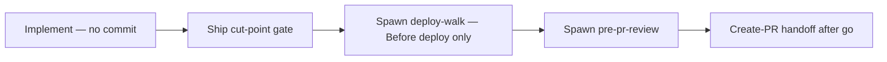

# Coding session

Hand off a unit of work into a **dedicated git worktree**, with the worktree visible in the **same Sedea workbench** (multi-root workspace), not a second editor process. **Execution mode** after setup depends on entry path — see [Execution mode after worktree attach](#execution-mode-after-worktree-attach).

**Owns:** per-PR plan §§ **5–8** during implementation (repo rules impact, tests, deploy plan, caveats); `git worktree add`, `plan-state.mjs set-worktrees` / `set-session`, Mission Control worktree attach, **mandatory worktree bootstrap** (spawn **`worktree-bootstrap`** child or inline `scripts/bootstrap-worktree-dev.sh`), pre-worktree validation + worktree-open gate; **spawned-lane implementation** or curated **prompt-only** session prompt emission; [Ship chain after implementation](#ship-chain-after-implementation-coding-session-lane) ([Ship cut-point gate](#ship-cut-point-gate-approve-commit-before-deploy) — one modal approve + commit + Before deploy **`deploy-walk`** → **`pre-pr-review`** → **`create-pr`**).

**Out of scope:** drafting per-PR §§ **1–4** ( **`pr-plan`** ); implementing hosting repo code when this run is **prompt-only** (see [Prompt-only handoff](#prompt-only-handoff)); opening PRs from the planning lane; **`plan-reconcile`** archive cadence except where this skill references it for cleanup narrative.

## Structured choice (Mission Control)

Approval gates and branch picks use **AskQuestion**, **`MC_PHASED_RESPONSE_V1`**, or **`MC_ASKQUESTION_V1`** per **`.sedea/centers/sedea/rules/2_ask-question-instructions.mdc`** and **`../README.md`** § *Recap, structured choice, act* — **preferred:** recap (status, diff, validation) + modal in one message; bare **`MC_ASKQUESTION_V1`** is sentinel-only. **Act** (worktrees, spawn, `git`, code edits) is always after the developer selects in the modal.

On **[Spawned implementation lane](#spawned-implementation-lane)**, **this lane** edits the hosting repo under the worktree through the implementation cut point — do not tell the developer to paste a session prompt into another chat. On **prompt-only** runs, emit the external prompt and **stop** without implementing here.

### Spawned lane — sentinel-first (binding)

On spawned **`coding-session`** lanes the **AskQuestion tool** is usually **unavailable**. Before the [Worktree-open gate](#worktree-open-gate), [Worktree-open gate (pr-plan spawn handoff)](#worktree-open-gate-pr-plan-spawn-handoff), [Ship cut-point gate](#ship-cut-point-gate-approve-commit-before-deploy), [Review feedback approval gate](#review-feedback-approval-gate), and [Post-create-pr handoff gate](#post-create-pr-handoff-gate) — **unless** [Auto-authorize implementation (pr-plan spawn)](#auto-authorize-implementation-pr-plan-spawn) applies (no modal; proceed to worktrees):

1. **Self-check:** the assistant message **starts** with **`MC_PHASED_RESPONSE_V1`** (or sentinel-only **`MC_ASKQUESTION_V1`**) — **no** recap prose before the sentinel.
2. Put required recap lines in **`display.markdown`** only (see pr-plan spawn handoff recap below).
3. Copy-paste template for pr-plan spawn **worktree-open** gate (replace `<recap>` when validation adds a line):

```
MC_PHASED_RESPONSE_V1
{"version":1,"display":{"markdown":"<recap>"},"askQuestion":{"modalTitle":"Coding session — start implementation","questions":[{"id":"worktree-open","prompt":"Authorize worktree and implementation on this lane?","allowMultiple":false,"options":[{"id":"continue-fill-5-8","label":"Continue — fill §§5–8 while implementing"},{"id":"revise-plan","label":"Revise PR plan first"},{"id":"change-repo","label":"Change repo or branch settings"},{"id":"defer","label":"Defer implementation"},{"id":"more-details","label":"More details for option _"}]}]}}
```

Default **`<recap>`** for pr-plan spawn: *Planning handoff complete (§§1–4). §§5–8 fill on this lane during implementation.*

## Relationship to `pr-plan`

| Concern | **`pr-plan`** | **`coding-session`** (this skill) |
|---------|--------------|-----------------------------------|
| §§ **1–4** | Drafted on the planning lane | Read for prompts and review; edit only when the developer revises the plan |
| §§ **5–8** | **`_TBD_`** or optional speculative sketch | Substantive fill during implementation |
| Handoff | **`pr-plan`** §5d **`AGENT_RUN_REQUEST_V1`** or detached entry | Spawned child lane or developer-started detached session |

See **`pr-plan/SKILL.md`** § *Handoff to coding-session*.

### pr-plan spawn handoff detection

Treat this run as a **pr-plan spawn handoff** when **either**:

- `inputs.planningHandoffMode === "sections-1-4-complete"`, or
- `inputs.upstreamSkill === "pr-plan"` **and** `inputs.readyForImplementation === true`.

When true, follow [Spawned from `pr-plan` (expected incomplete)](#spawned-from-pr-plan-expected-incomplete). After [Pre-worktree validation](#pre-worktree-validation-plan-completeness), use [Auto-authorize implementation (pr-plan spawn)](#auto-authorize-implementation-pr-plan-spawn) when eligible — otherwise [Worktree-open gate (pr-plan spawn handoff)](#worktree-open-gate-pr-plan-spawn-handoff) — not the generic incomplete gate with “executive override” labels.

### Spawned from `pr-plan` (expected incomplete)

When [pr-plan spawn handoff detection](#pr-plan-spawn-handoff-detection) applies:

1. Do **not** say the PR plan is “not fully populated,” “incomplete planning,” “not ready,” or that **`pr-plan`** failed.
2. Say: *Planning handoff complete (§§1–4). §§5–8 fill on this lane during implementation.*
3. After **`plan-ws-completeness.mjs`** → `INCOMPLETE` (optional second stdout line `EXPECTED_SECTIONS_5_8_TBD`), treat as **expected**, not a defect — do **not** send the developer back to **`pr-plan`** unless they choose **Revise PR plan first** or **Stop — I'll complete the plan first** (detached / snapshot entry only — demoted on pr-plan spawn path).
4. When [Auto-authorize implementation (pr-plan spawn)](#auto-authorize-implementation-pr-plan-spawn) does **not** apply, the [Worktree-open gate (pr-plan spawn handoff)](#worktree-open-gate-pr-plan-spawn-handoff) uses **Continue — fill §§5–8 while implementing** as the default authorizing choice — not “executive override” wording.

## Plan-anchored context (optional inputs)

The developer starts **`coding-session`** on a detached lane, via mission dispatch, or as a **spawned child** of **`pr-plan`** (§5d).

When `targetPlanPath` / `targetPlanSlug` are known (message, `@` path, snapshot, or spawn `inputs`), use them for sidecar writes and the session prompt. When spawned from **`pr-plan`**, treat spawn `inputs` and `initiatingPrompt` as authoritative — do not re-resolve from documentation placeholders.

If `upstreamSkill` is **`pr-plan`** and `repoPath` is present in `inputs`, use it as hosting repo root. If repo targets are missing, stop and ask the developer with **AskQuestion** to choose or provide the hosting repo(s). Do not infer from focused files alone.

## Implementation consent (two layers)

Only **two** developer-consent layers apply before worktrees. Do not stack extra approval **AskQuestion** rounds for the same decision.

| Layer | Where decided | Output field | This skill |
|-------|---------------|--------------|------------|
| **1 — Planning handoff** | **`pr-plan`** §5c **Start coding session** + §5d spawn `inputs` | `readyForImplementation`, `planningHandoffApproved` | Hint only; **do not** re-ask. Does **not** authorize worktrees or advance **`.sedea/centers/research-and-development/missions/plan-and-deliver/plan.mdc`** §8 `phase` past `not-started`. |
| **2 — Worktree open** | [Worktree-open gate](#worktree-open-gate) **or** [Auto-authorize implementation (pr-plan spawn)](#auto-authorize-implementation-pr-plan-spawn) | `developerApprovedImplementation` | Set `true` after an authorizing gate choice **or** auto-authorize when spawn handoff + §§1–4 drafted (see below). |

**Not consent layers** (validation / setup only — no separate approval **AskQuestion**):

- **`plan-ws-completeness.mjs`** — script check; incomplete plans are handled inside the worktree-open gate (override option), not a second gate.
- **Repo selection** — **AskQuestion** only when `repoPath` / `repoPaths` are missing.

`inputs.developerApprovedImplementation` is never a substitute for layer 2 on **detached** entry; ignore upstream `true` until the developer picks an authorizing worktree-open option **or** [Auto-authorize implementation (pr-plan spawn)](#auto-authorize-implementation-pr-plan-spawn) applies on this run.

## Pre-worktree validation (plan completeness)

**Worktree validation** (see **`pr-plan`** §5b and **development-process.md** § *Planning readiness vs worktree completeness*). Independent of layer 1 **`readyForImplementation`**. **`readyForImplementation: true` does not skip this script** — run it unless validation is skipped or the user message already contains **`override incomplete plan`**.

When this run anchors Phase 2 to a Plan Board **`.plan.md`** under **`.sedea/operations/`**, run validation **before** the [Worktree-open gate](#worktree-open-gate) — but **do not** use a separate completeness **AskQuestion**; record the script result and present override/stop choices in that single gate.

**Lane-change snapshots** (*back to plan*, *where are we?*, …) follow **30_planning-target-resolution.mdc** § *PR-plan completeness before coding-session*: when a snapshot lists both an incomplete per-PR plan and **coding-session**, **finishing the plan** must be ordered **first**.

**Skip** when there is **no** plan file anchor.

**Treat as override already chosen** when the user message contains **`override incomplete plan`** (ASCII, case-insensitive) — skip the script; proceed to the worktree-open gate.

Otherwise:

1. Resolve the plan’s **absolute** path. If you cannot, **stop** and ask for a path or `plan-state` linkage.
2. From the **hosting repo root**:
   ```bash
   node .sedea/centers/research-and-development/missions/plan-and-deliver/scripts/plan-ws-completeness.mjs --file "<absolute-plan-path>"
   ```
   - Exit **0** (`OK` / `SKIP_NOT_PER_PR`) → `planCompleteness: complete` for the worktree-open gate.
   - Exit **1** (`INCOMPLETE`) → `planCompleteness: incomplete` — **do not** create worktrees yet; route to the worktree-open gate (pr-plan spawn handoff vs generic incomplete).
   - When [pr-plan spawn handoff detection](#pr-plan-spawn-handoff-detection) applies, `INCOMPLETE` is **expected** (§§5–8 still `_TBD_` by design). If stdout includes `EXPECTED_SECTIONS_5_8_TBD`, treat as the normal §5d handoff. Use [Spawned from `pr-plan` (expected incomplete)](#spawned-from-pr-plan-expected-incomplete) wording — not “plan not fully populated.”

**Multi-repo:** run the script **once** on the shared plan before the worktree-open gate or auto-authorize branch.

## Auto-authorize implementation (pr-plan spawn)

**Layer 2 waived** — no worktree-open **AskQuestion** / **`MC_PHASED_RESPONSE_V1`** / **`MC_ASKQUESTION_V1`** when the developer already approved **Start coding session** on the **`pr-plan`** lane and the PR plan is ready to implement.

### Eligibility (all required)

1. [pr-plan spawn handoff detection](#pr-plan-spawn-handoff-detection) applies.
2. `inputs.planningHandoffApproved === true` **or** (`inputs.readyForImplementation === true` **and** `inputs.upstreamSkill === "pr-plan"`).
3. `inputs.promptOnly` is not `true`.
4. `inputs.repoPath` or non-empty `inputs.repoPaths` is present.
5. After [Pre-worktree validation](#pre-worktree-validation-plan-completeness), **either**:
   - `planCompleteness: complete` (`plan-ws-completeness.mjs` exit **0** / `OK`), **or**
   - `planCompleteness: incomplete` **and** stdout included `EXPECTED_SECTIONS_5_8_TBD` (§§ **1–4** drafted; §§ **5–8** may stay `_TBD_`).

### When eligibility fails

| Failure | Action |
|---------|--------|
| §§ **1–4** still contain `_TBD_` (incomplete without `EXPECTED_SECTIONS_5_8_TBD`) | [Worktree-open gate](#worktree-open-gate) — generic incomplete options; do **not** auto-authorize |
| `readyForImplementation: false` or `planningHandoffApproved` not set | [Worktree-open gate (pr-plan spawn handoff)](#worktree-open-gate-pr-plan-spawn-handoff) or generic gate |
| Missing `repoPath` / `repoPaths` | **AskQuestion** once for repo only — not a second planning-approval round |
| Detached / snapshot entry (no spawn handoff) | [Worktree-open gate](#worktree-open-gate) — layer 2 required |

### When eligible — act without modal

1. Set `outputs.developerApprovedImplementation: true` and `outputs.planCompleteness` from validation.
2. State one informational line (no modal): *Planning handoff approved on **pr-plan** lane. §§1–4 ready — implementing; §§5–8 fill on this lane as code lands.* When `planCompleteness: complete`, use: *PR plan complete — implementing.*
3. Proceed immediately to [Generic flow](#generic-flow) (worktree add, sidecar, attach, bootstrap) — then [Spawned implementation lane](#spawned-implementation-lane).
4. Do **not** emit **`MC_PHASED_RESPONSE_V1`** for worktree-open on this path.

## Worktree-open gate

**Layer 2 — single AskQuestion** before any `git worktree add`, sidecar session write, Mission Control worktree attach, or coding-agent prompt emission — **skip** when [Auto-authorize implementation (pr-plan spawn)](#auto-authorize-implementation-pr-plan-spawn) applies.

**Recap and structured choice:** Summarize completeness / plan path in **`display.markdown`** when using **`MC_PHASED_RESPONSE_V1`**. On spawned lanes, **`MC_PHASED_RESPONSE_V1` must be line 1** — see [Spawned lane — sentinel-first (binding)](#spawned-lane--sentinel-first-binding). Open this gate via **AskQuestion**, **`MC_PHASED_RESPONSE_V1`**, or **sentinel-only** **`MC_ASKQUESTION_V1`** — prefer one message for recap + modal. See **`../README.md`** § *Recap, structured choice, act (plan-and-deliver)*, **`.sedea/centers/sedea/rules/2_ask-question-instructions.mdc`**, and **`.cursor/rules/mission-control-agent-runtime.mdc`**.

**Branch first:** when [Auto-authorize implementation (pr-plan spawn)](#auto-authorize-implementation-pr-plan-spawn) applies, **skip this entire section**. When [pr-plan spawn handoff detection](#pr-plan-spawn-handoff-detection) applies but auto-authorize does not, use [Worktree-open gate (pr-plan spawn handoff)](#worktree-open-gate-pr-plan-spawn-handoff) below — even when `planCompleteness: complete`. Otherwise use the generic tables in this section.

### Worktree-open gate (pr-plan spawn handoff)

When [pr-plan spawn handoff detection](#pr-plan-spawn-handoff-detection) applies:

**Required recap** (include in `display.markdown` or recap prose before the modal):

*Planning handoff complete (§§1–4). §§5–8 fill on this lane during implementation.*

When `planCompleteness: incomplete`, add one line: *Validation reported incomplete because §§5–8 are still `_TBD_` — expected after **pr-plan** spawn.*

**Required options** (`modalTitle`: *Coding session — start implementation*; list in this order):

| Option id | Label |
|-----------|--------|
| `continue-fill-5-8` | Continue — fill §§5–8 while implementing |
| `revise-plan` | Revise PR plan first |
| `change-repo` | Change repo or branch settings |
| `defer` | Defer implementation |
| `more-details` | More details for option _ |

- Do **not** label the primary path “executive override” or imply **`pr-plan`** failed.
- Do **not** list **Stop — I'll complete the plan first** before **Continue — fill §§5–8 while implementing** on this path (that stop option is for detached / snapshot entry in the generic incomplete gate).
- **`continue-fill-5-8`** → `outputs.developerApprovedImplementation: true` (authorizing).
- All other options → `developerApprovedImplementation: false`.

When `planCompleteness: complete` on a pr-plan spawn handoff, use the generic **complete** option set below (rare — plan fully drafted before coding).

### Generic worktree-open gate

**When `planCompleteness: complete`** (or validation skipped / override already in the user message), required options:

- **Start implementation now**
- **Revise PR plan first**
- **Change repo or branch settings**
- **Defer implementation**
- **More details for option _**

**When `planCompleteness: incomplete`** (and **not** [pr-plan spawn handoff detection](#pr-plan-spawn-handoff-detection)), required options (do **not** offer plain **Start implementation now** without override):

- **Start with incomplete plan (executive override)**
- **Stop — I'll complete the plan first**
- **Revise PR plan first**
- **Change repo or branch settings**
- **Defer implementation**
- **More details for option _**

**Authorizing choices** (set `outputs.developerApprovedImplementation: true`):

- **Start implementation now** — only when `planCompleteness: complete` (generic gate).
- **Continue — fill §§5–8 while implementing** (`continue-fill-5-8`) — pr-plan spawn handoff when `planCompleteness: incomplete`.
- **Start with incomplete plan (executive override)** — generic incomplete gate only (detached / snapshot entry).

All other choices → `developerApprovedImplementation: false`; end or stay `continuationStatus: active` without worktrees. A prior **`pr-plan`** menu option does not substitute for this gate.

## Execution mode after worktree attach

After [Pre-worktree validation](#pre-worktree-validation-plan-completeness), an authorizing [Worktree-open gate](#worktree-open-gate) choice, worktree creation, sidecar writes, and Mission Control attach, choose **one** mode:

| Mode | When | After attach |
|------|------|--------------|
| **Spawned implementation lane** | Mission Control **spawned child** (`AGENT_RUN_REQUEST_V1` for this skill) **and** `outputs.developerApprovedImplementation: true` **and** `inputs.promptOnly` is not `true` **and** the developer did not choose **Defer implementation** at the gate | Continue on **this lane** — [Spawned implementation lane](#spawned-implementation-lane) |
| **Prompt-only handoff** | Detached natural-language entry, **re-use a prior session prompt**, planning snapshot handoff without spawn, `inputs.promptOnly: true`, **Defer implementation**, or Squad Leader orchestration that only needs an external coding chat | [Prompt-only handoff](#prompt-only-handoff) — emit fenced prompt and **stop** |

**Orientation (spawned lane):** Tell the developer you are **implementing on this worktree on this lane**. Do **not** say “paste the prompt in another session” unless **prompt-only** mode applies.

## Spawned implementation lane

Normative path when **`pr-plan`** (or another spawner) opens a **coding-session** child lane and layer 2 is satisfied.

1. **Scope guard** — Edit only files under the attached worktree root(s). Resolve hosting repo root vs worktree per **20_efficient-pr-shipping.mdc**.
2. **Bootstrap vs ship chain** — [Worktree bootstrap handoff](#worktree-bootstrap-handoff) may run on a child lane **in parallel** with implementation on this lane. **No limit** on worktree edits, plan §§ **5–8** fill, tests, or `npm` while `outputs.bootstrapStatus` is `pending`. **Forbidden until `outputs.bootstrapStatus: success`:** `git commit`, `git push`, [Ship cut-point gate](#ship-cut-point-gate-approve-commit-before-deploy), spawn **`deploy-walk`** (Before deploy), spawn **`pre-pr-review`**, spawn **`create-pr`**, and inline Before-deploy deploy verification that substitutes for [Before deploy deploy-walk handoff](#before-deploy-deploy-walk-handoff). On bootstrap failure, keep implementing if useful; retry bootstrap per [Worktree bootstrap (mandatory)](#worktree-bootstrap-mandatory) — do not open the ship chain until bootstrap succeeds.
3. **Warm-up on this lane** — Follow [Session prompt structure](#session-prompt-structure) Phase 1 steps (workspace readiness, branch check, load **Project rules** from the worktree, plan file + sidecar when anchored). You may skip emitting a fenced **external** session prompt unless the developer asks for a copy.
4. **Read the anchored PR plan** — Load `targetPlanPath` (from spawn `inputs` / `initiatingPrompt`). Use §§ **1–4** for scope context; **first implementation work** is substantive fill of §§ **5–8** (replace `_TBD_` as code paths become known), then code/tests/docs per those sections.
5. **Implement** — Make hosting-repo edits (code, tests, docs) in the worktree until **implementation ready for developer review** or a blocking stop. **Do not** `git commit` or `git push` during implementation — see **20_efficient-pr-shipping.mdc** § *Review before commit* and [Ship cut-point gate](#ship-cut-point-gate-approve-commit-before-deploy) (ship cut-point also requires `outputs.bootstrapStatus: success`). Maintain **`## Follow-ups`** on the PR plan per **development-process** § *Coding Session*.
6. **Continuation** — Keep `outputs.continuationStatus: "active"` and `outputs.shipPhase: "implementing"` while work remains. Emit **`AGENT_RESULT_RESPONSE_V1`** with `status: partial` when blocked; do **not** use `continuationStatus: terminal` to mean “prompt emitted — hand off elsewhere.”
7. **Ship chain** — When implementation is ready for developer review, follow [Ship chain after implementation](#ship-chain-after-implementation-coding-session-lane) on **this same lane** ([Ship cut-point gate](#ship-cut-point-gate-approve-commit-before-deploy) — one modal for approve + commit + Before deploy spawn when applicable → **`pre-pr-review`** → **`create-pr`** when authorized). **Do not** skip Before deploy or open a PR before that order completes.

## Deploy test plan confirmations

When the developer **confirms** a numbered step in the anchored PR plan’s **`## N. Deploy test plan`** (§7 **`### Before deploy`** or **`### After deploy`**), treat chat as **not** the system of record — same contract as **`deploy-walk`**: state lives in the plan file. Prefer spawning **`deploy-walk`** for checklist walks — it auto-runs agent-executable steps; use this inline path only for ad-hoc confirmations on the coding lane.

**Before deploy + bootstrap:** Do **not** spawn **`deploy-walk`** (Before deploy) or flip **`### Before deploy`** checkboxes via this inline path until `outputs.bootstrapStatus: success`. **After deploy** confirmations may proceed when the PR is merged per normal rules.

1. **Resolve `targetPlanPath`** — from spawn `inputs`, `plan-state.mjs resolve --cwd "<worktreePath>"`, or an explicit `@path` in the message. If multiple plans could apply, use **AskQuestion** once for **which plan** or **which step number** — not whether to persist.
2. **Same-turn file edit** — before the reply ends, patch the matching §7 line: flip `[ ]` → `[x]` for that step number. Optionally append a short dated note on the line or under §7 (for example `— confirmed YYYY-MM-DD`).
3. **Reply** — state the **absolute `targetPlanPath`** you edited and which step numbers were checked.
4. **Do not** tell the developer “you can mark” or “likely done” without editing when you can write the operations plan. If you cannot write (permissions, wrong repo, missing path), say why and offer **`deploy-walk present 7`** / **`deploy-walk <N> done`** or a concrete absolute path.
5. **Terminal `outputs`** — when you emit **`AGENT_RESULT_RESPONSE_V1`** in the same turn after edits, include `outputs.deployPlanStepsChecked` (array of step numbers, e.g. `[1,2,3]`) and `outputs.targetPlanPath`.

**Trigger examples:** “1 confirmed”, “step 2 done”, “3. confirmed” (numbered §7 items). Do not infer confirmation from vague chat (“looks good”) without an explicit step reference — use **AskQuestion** for the step number if needed.

## Prompt-only handoff

Reserved when this run is **not** a spawned implementation lane (see table above).

1. Complete Generic flow steps 1–4 (including [Worktree bootstrap handoff](#worktree-bootstrap-handoff) — wait for **`worktree-bootstrap`** child success or inline bootstrap) before emitting the external prompt.
2. Emit a **session prompt** per [Session prompt structure](#session-prompt-structure) inside a [copy/paste-safe](#copypaste-safe-prompt-output-required) fence. State that bootstrap completed (`outputs.bootstrapStatus: success`) or document failure and that the external agent must not implement until bootstrap succeeds.
3. Set `outputs.sessionPromptEmitted: true` and `outputs.implementationMode: "prompt-only"`.
4. **Stop** — do not `cd` into the worktree to implement on this lane (bootstrap may still run in step 1 above).
4. When the developer later continues on **this** or another lane after implementation review, this skill owns [Ship chain after implementation](#ship-chain-after-implementation-coding-session-lane) from the appropriate step.

Detached developers may paste the prompt into a separate Mission Control session; that session then follows the same skill as an implementation lane once layer 2 is satisfied there.

## Copy/paste-safe prompt output (required)

When you emit the final session prompt for the user to paste into **a separate coding agent** session (**prompt-only** mode):

- Wrap the **entire session prompt** in a fenced markdown code block (default ` ```text … ``` `).
- If the body contains triple backticks, use a four-backtick outer fence or escape inner fences.
- Keep explanatory prose **outside** the fence.

## Generic flow (single repo)

Run only **after** [Pre-worktree validation](#pre-worktree-validation-plan-completeness) and an authorizing choice in the [Worktree-open gate](#worktree-open-gate).

1. Create a worktree on a fresh branch from `origin/main`:
   ```bash
   git fetch origin main
   git worktree add <sibling-path> -b <branch> origin/main
   ```
   - Prefix sibling paths with the repo directory basename (see **Worktree setup** in `.sedea/centers/research-and-development/rules/20_efficient-pr-shipping.mdc`).
   - Always branch from **`origin/main`**, not **`main`** (same failure mode as in **efficient-pr-shipping**).
   - Branch naming: **`.sedea/centers/research-and-development/rules/20_efficient-pr-shipping.mdc`** § *Branch naming* (primary **hosting repo** → Sedea **`7_stacked-pr-branch-naming`**; **hosting repo worktree** → `feat/`, `improve/`, `fix/`, …).
   - **Dirty-tree gate (hosting repo)** — Before `git worktree add`, run `git status --porcelain` in the repo that receives the worktree (`HOSTING_ROOT` when branching from the primary hosting repo).
     - **Submodule gitlink-only (non-blocking)** — When the active hosting repo pins `.sedea/` via git submodules (see [`.cursor/rules/dot-sedea.mdc`](.cursor/rules/dot-sedea.mdc) § *Submodule pins*, for example **`sedea-ai/app`**), and **every** porcelain line is a **modified submodule gitlink** under `.sedea/` (paths under `.sedea/centers/` or `.sedea/operations/`), verify pointer-only drift before proceeding:
       ```bash
       git diff --stat -- <submodule-path>
       ```
       **Proceed** when each affected submodule shows only a **2 insertions(+), 2 deletions(-)** gitlink change and no other paths appear in that stat. Routine submodule pin updates do **not** block worktree creation.
     - **Still blocking** — **Stop** when porcelain includes **any** path outside those `.sedea/` submodule gitlink lines (for example `extensions/`, `packages/`, other tracked application source), when `git diff --stat` shows content changes inside a submodule (not pointer-only), or when the hosting repo has non-empty porcelain that is not explained by allowed submodule gitlinks alone.
     - Do **not** stash, commit, discard, or clean the user's WIP to clear a blocking dirty tree.
   - If `baseBranch` input is supplied, it must be a remote branch ref such as `origin/main`; do not accept a local-only branch for worktree creation.

2. **Record the session on the plan** (see [Sidecar state](#sidecar-state)). From the **hosting repo root**:
   ```bash
   node .sedea/centers/research-and-development/missions/plan-and-deliver/scripts/plan-state.mjs set-worktrees \
     --slug <plan-slug> \
     --json '[{"repo":"<repo-basename>","path":"<absolute-worktree-path>"}]'
   node .sedea/centers/research-and-development/missions/plan-and-deliver/scripts/plan-state.mjs set-session \
     --slug <plan-slug> \
     --focus <absolute-worktree-path>
   ```
   Skip when the session has no plan anchor.

3. **Attach the worktree in Sedea** (same workbench): in Mission Control, invoke MCP **`sedea_add_worktree_folder`** with JSON `{ "path": "<absolute-worktree-root>" }` (optional `"name"` for the explorer label). See **20_efficient-pr-shipping.mdc** — *Squad Leader on the main branch vs. agent sessions on worktree* and *Attach the worktree in Sedea*.

   This MCP attach is mandatory before post-setup work. If the MCP call fails, stop with `partial`; report the worktree path and the attach error, and keep `continuationStatus: "active"` so the Squad Leader does not close the implementation lane.

4. **Worktree bootstrap (mandatory)** — see [Worktree bootstrap handoff](#worktree-bootstrap-handoff). Spawn **`worktree-bootstrap`** on a child lane (default) or run inline when spawn is unavailable. **Spawned implementation lane:** continue to step 5 **without waiting** for the child — implement in parallel. **Prompt-only:** wait for `outputs.bootstrapStatus: success` before emitting the external prompt.

5. **Branch** per [Execution mode after worktree attach](#execution-mode-after-worktree-attach):
   - **Spawned implementation lane** → continue with [Spawned implementation lane](#spawned-implementation-lane) (steps 1–7 there).
   - **Prompt-only handoff** → [Prompt-only handoff](#prompt-only-handoff).

## Worktree bootstrap (mandatory)

After Generic flow step 3 (`sedea_add_worktree_folder`) succeeds, prepare **`WORKTREE_ROOT`** for **commit**, **Before deploy** **`deploy-walk`**, and the rest of the [ship chain](#ship-chain-after-implementation-coding-session-lane). Implementation on this lane may proceed **in parallel** with bootstrap — do **not** wait for the child before editing the worktree.

**Resolve paths**

- **`HOSTING_ROOT`** — hosting repo that contains `.sedea/centers/sedea/` (see **20_efficient-pr-shipping.mdc** § *Hosting repo cwd for scripts*). Use spawn `inputs.repoPath` when it points at that root.
- **`WORKTREE_ROOT`** — absolute path from step 1 (`git worktree add`) / sidecar `worktrees[].path`.

**Default:** [Worktree bootstrap handoff](#worktree-bootstrap-handoff) — spawn **`worktree-bootstrap`** on a **child lane** while this lane continues implementation.

**Inline fallback** — When the host rejects spawn, Mission Control is unavailable, or the developer explicitly requests inline bootstrap on a **detached** lane, run from **`HOSTING_ROOT`**:

```bash
./scripts/bootstrap-worktree-dev.sh "$WORKTREE_ROOT"
```

The script is idempotent. See `scripts/bootstrap-worktree-dev.sh --help` for **`--skip-*`** flags.

**`--skip-*` flags** — Use only when the developer attests partial setup. Record flags in chat, spawn `inputs.bootstrapSkipFlags`, and `outputs.bootstrapSkipFlags`.

**Success** — Set `outputs.bootstrapStatus: success`, clear `outputs.bootstrapLaneCorrelationId` when inline, then continue to Generic flow step 5. Set `outputs.shipPhase: worktree` on the first terminal line that reports setup complete (before `implementing`).

**Failure** — When bootstrap fails (child or inline):

1. Capture stderr/stdout tail in `outputs.bootstrapFailureReason`.
2. Emit **`AGENT_RESULT_RESPONSE_V1`** with `status: partial`, `outputs.bootstrapStatus: failed`, `outputs.shipPhase: worktree`, `outputs.developerApprovedImplementation: true`, `outputs.continuationStatus: active`.
3. **Do not** advance into the ship chain (`git commit`, [Ship cut-point gate](#ship-cut-point-gate-approve-commit-before-deploy), Before deploy **`deploy-walk`**, **`pre-pr-review`**, **`create-pr`**) until bootstrap succeeds. Implementation edits may continue.
4. Offer re-run: spawn **`worktree-bootstrap`** again (new `correlationId`) or inline idempotent script; **`--skip-*`** only after developer attestation.

**Missing script** — Stop with `partial`, `bootstrapStatus: failed`, `bootstrapFailureReason` naming the missing path, `shipPhase: worktree`.

## Worktree bootstrap handoff

Run after attach succeeds (Generic flow step 3 or multi-repo step 4). **Normative default** — spawn a child and **continue implementing on this lane** without waiting for the script to finish.

1. **Spawn** `.sedea/centers/research-and-development/missions/plan-and-deliver/skills/worktree-bootstrap/SKILL.md` on a **child lane** with **required** `inputs`:

| Input | Value |
|-------|--------|
| `worktreePath` | Absolute **`WORKTREE_ROOT`** |
| `hostingRoot` | Absolute **`HOSTING_ROOT`** |
| `targetPlanPath` / `targetPlanSlug` | When plan-anchored |
| `branchName` | Feature branch when known |
| `bootstrapSkipFlags` | Array of attested `--skip-*` tokens, or omit |
| `ledgerParent` | When known |
| `upstreamSkill` | `"coding-session"` |

**`initiatingPrompt`** must state: run full bootstrap unless `bootstrapSkipFlags` supplied; return `bootstrapStatus: success` or `failed` with log tail; parent lane continues implementation in parallel.

2. Set `outputs.bootstrapLaneCorrelationId` to the spawn UUID; set `outputs.bootstrapStatus: pending` until the child returns (or `success` immediately after inline fallback).

3. **Continue on this lane** — Proceed to [Spawned implementation lane](#spawned-implementation-lane) (or keep coding if already started). One line: bootstrap running on a child lane; implementation continues here.

4. **Blocked until `outputs.bootstrapStatus: success`:** `git commit`, `git push`, [Ship cut-point gate](#ship-cut-point-gate-approve-commit-before-deploy), [Before deploy deploy-walk handoff](#before-deploy-deploy-walk-handoff), spawn **`pre-pr-review`**, spawn **`create-pr`**. **Not blocked:** worktree edits, plan §§ **5–8** fill, tests, local `npm` / compile in the worktree.

5. **Multi-repo** — Emit one spawn per **`WORKTREE_ROOT`** (unique `slug` per repo). Implement per repo in parallel with each repo’s bootstrap child. Before **ship chain** steps for a repo, that repo’s `outputs.bootstrapStatus` must be `success`; aggregate failures into `outputs.bootstrapFailureReason`.

### Bootstrap result aggregation

When Mission Control delivers the **worktree-bootstrap** result:

1. Match by `correlationId` → `outputs.bootstrapLaneCorrelationId` (multi-repo: match each pending id).
2. Copy `outputs.bootstrapStatus`, `outputs.bootstrapFailureReason`, `outputs.bootstrapSkipFlags` from the child.
3. **`success`** — Continue to Generic flow step 5 ([Spawned implementation lane](#spawned-implementation-lane) or [Prompt-only handoff](#prompt-only-handoff)).
4. **`failed`** / `partial` child — Keep `continuationStatus: active`, `shipPhase: worktree`; offer re-spawn or inline retry per [Worktree bootstrap (mandatory)](#worktree-bootstrap-mandatory) **Failure**.
5. **`aborted`** / **`abandoned`** — Treat as failed unless the developer explicitly defers or retries.

### Inline bootstrap (fallback only)

When spawn is impossible or the developer chose inline on a detached lane:

1. Run `./scripts/bootstrap-worktree-dev.sh "$WORKTREE_ROOT"` from **`HOSTING_ROOT`** on **this** lane.
2. Apply success/failure rules from [Worktree bootstrap (mandatory)](#worktree-bootstrap-mandatory) without `bootstrapLaneCorrelationId`.
3. Continue to step 5 in the same session turn when the script succeeds.

## Multi-repo flow (shared branch name)

When the plan’s **Worktree setup** lists two or more repos, or the user asks for a cross-repo session:

1. For **each** repo, `git worktree add` with the **same branch name** (unless the plan says otherwise).
   - Validate every repo before creating any worktree using the same **Dirty-tree gate** as § *Generic flow* step 1. If one repo is blocking-dirty or missing the requested base branch, stop before creating a partial multi-repo session.

2. Optionally create a **`.code-workspace`** file listing each worktree folder with absolute `path` values — use only if your team uses that layout; otherwise attach **each** worktree root with **`sedea_add_worktree_folder`** in turn.

3. **`plan-state.mjs set-worktrees`** with one JSON entry per repo; **`set-session --focus`** to the workspace file **or** primary worktree path per your team convention (must stay consistent with **`resolve --cwd`** expectations in **planning-target-resolution**).

4. **Attach each worktree** with **`sedea_add_worktree_folder`**, then [Worktree bootstrap handoff](#worktree-bootstrap-handoff) **once per `WORKTREE_ROOT`** (one child spawn per repo). **Spawned lane:** implement in parallel per repo. **Prompt-only:** wait for each repo’s `bootstrapStatus: success` before that repo’s prompt.

5. **Branch** per [Execution mode after worktree attach](#execution-mode-after-worktree-attach) (spawned lane implements each repo’s scope in turn, or prompt-only emits **one session prompt per repo** with per-repo scope guards).

6. **Prompt-only:** **Stop** after prompts. **Spawned lane:** continue implementation per repo scope before the [ship chain](#ship-chain-after-implementation-coding-session-lane).

## Stale worktree detection (detect-only)

Post-ship **worktree removal**, **branch delete**, and **`main` sync** are owned by **`plan-reconcile`** (§ *Post-ship workspace cleanup* in **`plan-reconcile/SKILL.md`**) and **20_efficient-pr-shipping.mdc** § *Detach merged worktrees* — **not** on this lane.

| Rule | Behavior |
|------|----------|
| **Forbidden** | Proactive **AskQuestion** or chat offers to **`sedea_remove_worktree_folder`**, **`git worktree remove`**, delete branch, or run full cleanup as routine session wrap-up |
| **Forbidden** | Destructive git cleanup on the **coding-session** lane |
| **When to detect** | After **`prState: merged`** and deploy verification **`done`**, or when the developer returns post-merge on this lane with a plan anchor |
| **How** | From **`HOSTING_ROOT`**: `node …/plan-state.mjs --operations-user-id "$OPS_ID" detect-stale-workspaces --slug <slug> --json` |
| **If empty** | One line: no stale worktree paths on disk for this plan — **no** cleanup menu |
| **If stale** | Short recap (path, branch, **`mergedPr`** when **`prs[]`** exists) then **AskQuestion**: start **`plan-reconcile`** now · defer · **More details for option _** — **not** remove-worktree options |
| **Defer** | Developer may run **`plan-reconcile`** later; do not run cleanup here |

## Ship chain after implementation (coding-session lane)

Normative order on the **spawned implementation lane** — **do not** skip steps or jump to **`create-pr`** before **`pre-pr-review`**, and **do not** skip **Before deploy** after commit.



| Step | Section | Commit required? |
|------|---------|------------------|
| 1 | [Ship cut-point gate](#ship-cut-point-gate-approve-commit-before-deploy) | **No** for review — combined modal covers approve + commit + Before deploy spawn |
| 2 | [Before deploy deploy-walk handoff](#before-deploy-deploy-walk-handoff) | **Yes** — after cut-point **Act** (commit when needed, then spawn) |
| 3 | [Pre-PR review handoff](#pre-pr-review-handoff) | **Yes** — Before deploy resolved or skipped |
| 4 | [Create-PR handoff after go](#create-pr-handoff-after-go) | After **`pre-pr-review`** **go** |

**Forbidden on this lane:** `git commit` before ship cut-point approval; **`git commit`**, Before deploy **`deploy-walk`**, or ship cut-point while `outputs.bootstrapStatus` is `pending` or `failed`; spawn **`pre-pr-review`** while the tree is dirty; spawn **`create-pr`** before steps 2–3 complete; treat inline Before-deploy chat on this lane as a substitute for step 2 **`deploy-walk`** spawn when §7 has unchecked Before-deploy items; **three separate AskQuestions** for approve → commit → spawn Before deploy when [Combined authorization](#combined-authorization) applies.

## Ship cut-point gate (approve, commit, Before deploy)

**Precondition:** `outputs.bootstrapStatus: success` (or bootstrap not required on this run). If bootstrap is `pending` or `failed`, finish or retry [Worktree bootstrap (mandatory)](#worktree-bootstrap-mandatory) before opening this gate.

When implementation is **ready for developer review** (or the developer signals *ready for review* / *review my changes*), **stop** implementation edits and open this gate. This implements **20_efficient-pr-shipping.mdc** § *Review before commit* — **developer code review comes before any commit** — and combines what were separate approve, commit, and Before deploy spawn modals into **one** structured choice when plan-anchored and §7 has work to walk.

### Summarize and direct diff review

1. Present a short summary: `git status --short` (call out **uncommitted** vs committed), files touched, and scope vs the anchored plan when present. If there are **no commits yet** on the branch, say so — review is against the **working tree** and/or `git diff` / IDE SCM view.
2. When plan-anchored, **read** §7 **`### Before deploy`** and note in the recap: empty / all `[x]` / *N* unchecked Before-deploy steps (list step numbers when ≤5).
3. Tell the developer to review in the **IDE diff** (SCM: working tree, staged, and unstaged) and/or `git diff` / `git diff --cached` as appropriate. Do **not** treat “implementation done” chat as diff review.
4. **Do not** run `git commit`, `git push`, spawn **`deploy-walk`**, spawn **`pre-pr-review`**, or spawn **`create-pr`** in the same assistant turn as this gate's modal.

### Combined authorization

Use **one** **AskQuestion** or **`MC_PHASED_RESPONSE_V1`** (`modalTitle`: *Coding session — approve, commit, Before deploy*) — recap + modal in one message per rule **2**. **Do not** chain separate modals for approve, then commit, then spawn when this subsection applies.

**When to use the combined modal (normative):** plan-anchored run **and** §7 **`### Before deploy`** has at least one **`[ ]`** item (not empty, not only *None — …*, not all `[x]`).

| Option id | Label (brief) | Authorizes on **next** turn ([Act after pick](#act-after-ship-cut-point-pick)) |
|-----------|---------------|--------------------------------------------------------------------------------|
| `commit-only` | Approve, commit, spawn Before deploy walk | Implementation approved · **`git commit`** when tree dirty · spawn **`deploy-walk`** (`before-deploy-only`) |
| `commit-push` | Approve, commit + push, spawn Before deploy walk | Same + **`git push`** when dirty tree committed |
| `commit-only-skip-before-deploy` | Approve, commit, skip Before deploy | Implementation approved · **`git commit`** when dirty · documented skip (note under §7 or **`## Follow-ups`**) · **no** deploy-walk spawn |
| `more-changes` | More implementation changes first | Return to [Spawned implementation lane](#spawned-implementation-lane) step 5 |
| `defer` | Defer ship chain | Keep `continuationStatus: active`; no commit, no spawn |
| `more-details` | More details for option _ | Elaborate; re-ask combined modal |

Option ids **`commit-only`** and **`commit-push`** satisfy rule **6** git layer **on the pick turn** — run commit/push on the **developer's response turn** only, not in the same assistant turn as the modal.

**When Before deploy is already satisfied** (empty, *None*, or all `[x]`) but the tree is dirty, use **one** modal (`modalTitle`: *Coding session — approve and commit*) with **`commit-only`** / **`commit-push`** / **`more-changes`** / **`defer`** / **`more-details`** — then [Pre-PR review authorization](#pre-pr-review-authorization), not deploy-walk spawn.

**When the tree is clean** and Before-deploy items remain, use **one** modal with:

| Option id | Label (brief) |
|-----------|---------------|
| `spawn-before-deploy-walk` | Approve, spawn Before deploy walk (already committed) |
| `skip-before-deploy` | Skip Before deploy (executive override) |
| `more-changes` | More implementation changes first |
| `defer` | Defer ship chain |
| `more-details` | More details for option _ |

**Free-form** (no plan anchor): combined approve + commit modal only — **`commit-only`** / **`commit-push`** / **`more-changes`** / **`defer`** / **`more-details`** — then [Pre-PR review authorization](#pre-pr-review-authorization).

Do **not** use option labels that say *run pre-pr-review* or *create PR* here — those belong in [Pre-PR review authorization](#pre-pr-review-authorization).

### Spawned lane — ship cut-point sentinel (binding)

When the **AskQuestion tool** is unavailable, emit **`MC_PHASED_RESPONSE_V1`** (recap in `display.markdown`, options in `askQuestion`) — same option ids as the combined modal. Example shape (replace `<recap>` with diff summary + Before-deploy count):

```
MC_PHASED_RESPONSE_V1
{"version":1,"display":{"markdown":"<recap>"},"askQuestion":{"modalTitle":"Coding session — approve, commit, Before deploy","questions":[{"id":"ship-cut-point","prompt":"Approve implementation, commit if needed, and start Before deploy walk?","allowMultiple":false,"options":[{"id":"commit-only","label":"Approve, commit, spawn Before deploy walk"},{"id":"commit-push","label":"Approve, commit + push, spawn Before deploy walk"},{"id":"commit-only-skip-before-deploy","label":"Approve, commit, skip Before deploy"},{"id":"more-changes","label":"More implementation changes first"},{"id":"defer","label":"Defer ship chain"},{"id":"more-details","label":"More details for option _"}]}]}}
```

Omit **`commit-only-skip-before-deploy`** when Before deploy is already satisfied; omit commit options when the tree is clean and use `spawn-before-deploy-walk` instead.

### Act after ship cut-point pick

Run on the **developer's response turn** after a cut-point pick — **not** in the same assistant turn as the modal (same rule as [Pre-PR review authorization](#pre-pr-review-authorization)).

| Pick | Actions (in order) |
|------|---------------------|
| **`commit-only`** / **`commit-push`** (Before deploy unchecked) | 1. **`git commit`** if `git status --short` is non-empty · 2. Verify clean tree · 3. [Before deploy deploy-walk handoff](#before-deploy-deploy-walk-handoff) spawn (no second modal) · 4. Stop — wait for **`deploy-walk`** child |
| **`commit-only-skip-before-deploy`** | 1. **`git commit`** if dirty · 2. Append dated skip note under §7 or **`## Follow-ups`** · 3. [Pre-PR review authorization](#pre-pr-review-authorization) |
| **`commit-only`** / **`commit-push`** (Before deploy satisfied or free-form) | 1. **`git commit`** if dirty · 2. Verify clean · 3. [Pre-PR review authorization](#pre-pr-review-authorization) |
| **`spawn-before-deploy-walk`** | [Before deploy deploy-walk handoff](#before-deploy-deploy-walk-handoff) spawn · stop for child |
| **`skip-before-deploy`** | Dated skip note · [Pre-PR review authorization](#pre-pr-review-authorization) |

If commit fails or tree stays dirty after commit, stop with `partial` — do not spawn **`deploy-walk`** or **`pre-pr-review`**.

**Same user message** may authorize the combined path in prose (*approve, commit, and run Before deploy*) — treat as **`commit-only`** when Before deploy applies, per rule **20**.

## Commit execution (internal)

**Not a separate AskQuestion gate.** Runs only inside [Act after ship cut-point pick](#act-after-ship-cut-point-pick) when the pick id is **`commit-only`** or **`commit-push`**.

1. Skip **`git commit`** when `git status --short` is empty.
2. Use the commit message style from recent branch history and plan scope.
3. **`commit-push`** also runs **`git push`** after a successful commit on the **same response turn**.
4. Verify `git status --short` is empty before spawn or pre-PR authorization.

## Before deploy deploy-walk handoff

**Precondition:** `outputs.bootstrapStatus: success`. **Do not** spawn Before deploy **`deploy-walk`** while bootstrap is `pending` or `failed`.

Run from [Act after ship cut-point pick](#act-after-ship-cut-point-pick) when the cut-point pick authorizes spawn (**`commit-only`**, **`commit-push`**, or **`spawn-before-deploy-walk`**) — **no second AskQuestion** for spawn on that path. **Do not** spawn **`pre-pr-review`** or **`create-pr`** until this step completes or is skipped via **`commit-only-skip-before-deploy`** / **`skip-before-deploy`**.

When `targetPlanPath` resolves to a PR plan:

1. **Read** §7 **`### Before deploy`**. If empty, only *None — …*, or every item is `[x]`, note in one line and continue to [Pre-PR review authorization](#pre-pr-review-authorization).
2. When any **`[ ]`** Before-deploy items remain, **spawn** `.sedea/centers/research-and-development/missions/plan-and-deliver/skills/deploy-walk/SKILL.md` on a **child lane** (do **not** only walk inline on this lane unless the developer explicitly chose skip on the cut-point modal).

**Spawn inputs (required):**

- `targetPlanPath`, `targetPlanSlug`
- `worktreePath`, `branchName`
- `deployWalkScope: "before-deploy-only"` — walk only **`### Before deploy`** while `**Status:**` stays `drafted`; do **not** advance to **`### After deploy`** (post-merge)
- `ledgerParent`, `upstreamSkill: "coding-session"`

**`initiatingPrompt`** must state: pre-merge Before deploy only; PR not merged; run agent-executable Before-deploy steps automatically (no approval); return when every Before-deploy box is `[x]` or explicitly skipped/blocked per deploy-walk rules.

3. Announce that **coding-session** is waiting for the **deploy-walk** child result; **stop** — do not spawn **`pre-pr-review`** in the same turn.
4. When the child returns, copy deploy status into coding-session `outputs` and continue to [Pre-PR review authorization](#pre-pr-review-authorization) only if Before deploy is satisfied or documented skip.

**Legacy / exceptional second modal:** use a separate **AskQuestion** for spawn **only** when the developer returns mid-chain without a prior cut-point pick (for example after *more-changes* and a new review pass) and Before-deploy items remain — same options as [Combined authorization](#combined-authorization) spawn rows (`spawn-before-deploy-walk`, `skip-before-deploy`, …). **Do not** use this when the combined cut-point modal already ran in the same review pass.

## Pre-PR review authorization

Run **after** commit + [Before deploy deploy-walk handoff](#before-deploy-deploy-walk-handoff) (or documented skip). Use **AskQuestion**:

| Option id (illustrative) | Label (brief) |
|--------------------------|---------------|
| `proceed-pre-pr-review` | Proceed — spawn pre-pr-review |
| `more-changes` | More changes before review |
| `defer-review` | Defer pre-PR review |
| `more-details` | More details for option _ |

Only **`proceed-pre-pr-review`** (or the **same user message** explicitly authorizing *run pre-pr-review* per rule **20**) authorizes [Pre-PR review handoff](#pre-pr-review-handoff).

Do **not** spawn **`pre-pr-review`** in the same assistant turn as the authorization **AskQuestion**.

## Pre-PR review handoff

This branch spawns **`pre-pr-review`** only **after** [Ship chain after implementation](#ship-chain-after-implementation-coding-session-lane) cut-point **Act**, [Before deploy deploy-walk handoff](#before-deploy-deploy-walk-handoff) (or skip), and [Pre-PR review authorization](#pre-pr-review-authorization) approve spawn.

### Review handoff preconditions

Before spawning **`pre-pr-review`**:

1. [Ship cut-point gate](#ship-cut-point-gate-approve-commit-before-deploy) completed — developer approved implementation via combined modal or equivalent; [Commit execution](#commit-execution-internal) completed when the tree was dirty — at least one commit on the branch when there were changes to land.
2. [Before deploy deploy-walk handoff](#before-deploy-deploy-walk-handoff) completed or skipped — **do not** spawn **`pre-pr-review`** while unchecked Before-deploy items remain without spawn/skip documentation.
3. [Pre-PR review authorization](#pre-pr-review-authorization) — developer chose **`proceed-pre-pr-review`** (or same-message authorization per rule **20**).
4. `git status --short` in the worktree is empty. Uncommitted edits are invisible to the committed review diff, so do not spawn the reviewer while dirty.
5. `git log --oneline <baseRef>..HEAD` shows at least one commit.
6. `git diff <baseRef>...HEAD` is non-empty.
7. For plan-anchored runs, `plan-state.mjs resolve --cwd "<worktreePath>"` or supplied inputs identify the PR plan.

If any precondition fails, stop with `partial`, keep `continuationStatus: "active"`, and report the missing ship-chain step. Do not silently commit, push, skip Before deploy, or spawn review.

### Review handoff inputs

Compile the **`pre-pr-review`** child inputs:

- `anchorType`: `plan` when a PR plan path is known, otherwise `free-form`.
- `targetPlanPath` / `targetPlanSlug`: required for `plan`.
- `worktreePath`
- `branchName`
- `baseRef`
- `projectRules`: absolute worktree `.cursor/rules/*.mdc` paths curated the same way as the implementation prompt.
- `diffSummary`: commits/files/line counts from the committed diff.
- `ledgerParent`
- `upstreamSkill: "coding-session"`

Spawn `.sedea/centers/research-and-development/missions/plan-and-deliver/skills/pre-pr-review/SKILL.md`, announce that **coding-session** is waiting for the pre-PR review result, and stop. Do not open a PR before the reviewer returns `recommendation: "go"`.

### Review result aggregation

When Mission Control delivers the **`pre-pr-review`** result:

1. Copy `blockers`, `flags`, `proposedFollowUps`, `followUpsAppended`, `codingAgentHandback`, `requiresDeveloperApproval`, `remainingTasks`, `activeLanes`, and `openLedgerEntries` into the coding-session result. Record `outputs.prePrReviewRecommendation` from the child.
2. Compute **`actionablePrePrFindings`** — **true** when **any** of:
   - `recommendation` is `no-go`
   - `blockers` is non-empty
   - `flags` is non-empty
   - `codingAgentHandback` includes a non-empty **Must** or **Should** group (ignore **Defer**-only handback and items tagged **`[G §7 After deploy — post-merge]`**)
3. When **`actionablePrePrFindings`** is true, **immediately recommend** addressing pre-PR review findings before PR creation or another review pass — include one explicit sentence in the recap (for example: *Pre-PR review found issues; fix the relevant items on this lane before opening a PR.*). Do not deliver a findings-only recap without that recommendation.
4. **If `actionablePrePrFindings`** — open [Review feedback approval gate](#review-feedback-approval-gate) on **this lane** in the **same session** **before** [Create-PR handoff after go](#create-pr-handoff-after-go), **even when** `recommendation` is `go`. Do **not** jump to Create-PR or spawn **`create-pr`** in the same turn as the reviewer result.
5. **If NOT `actionablePrePrFindings`** and `recommendation` is `go` — proceed to [Create-PR handoff after go](#create-pr-handoff-after-go). Do not make **`pre-pr-review`** spawn `create-pr`.
6. If review failed, was aborted, or was abandoned, keep the ledger entry blocked until the developer retries, defers, or abandons the review.

### Review feedback approval gate

When **`actionablePrePrFindings`** is true (see [Review result aggregation](#review-result-aggregation)) — including **`recommendation: "go"`** with **`flags`** or **Must** / **Should** handback:

1. Present the review summary to the developer: `recommendation`, blockers, `Must`, `Should`, `flags`, and any proposed follow-ups for the PR plan. **Do not** surface **`Defer`** or post-merge **`### After deploy`** items — **`pre-pr-review`** omits them; drop any legacy **`[G §7 After deploy — post-merge]`** bullets if present in child outputs. **Recommend** fixing relevant findings before PR creation or re-review (same wording as [Review result aggregation](#review-result-aggregation) step 3).
2. Use **one** **AskQuestion** or **`MC_PHASED_RESPONSE_V1`** before making any code or plan edits (`modalTitle`: *Pre-PR review — address findings*). Required options **in this order** (omit rows marked *go-only* when `recommendation` is `no-go`):

| Option id | Label (brief) | Agent action |
|-----------|---------------|--------------|
| `fix-now-session` | Implement pre-PR review findings now (this session) | Continue on **this coding-session lane** in the attached worktree; implement reviewer `Must` items and any `Should` items the developer affirms before edits; keep `continuationStatus: "active"` |
| `apply-must` | Apply Must fixes only | Edit only blocker / `Must` items on this lane |
| `apply-must-should` | Apply Must + Should fixes | Edit blocker / `Must` and `Should` items on this lane |
| `proceed-create-pr` | Proceed to create PR (skip fixes for now) | *go-only* — on **next** turn, open [Create-PR handoff after go](#create-pr-handoff-after-go); no code edits this pick |
| `revise-scope` | Revise review scope | Clarify or challenge findings before code edits |
| `defer` | Defer / abandon review fixes | Keep ledger blocked or mark the PR plan deferred/abandoned per developer choice |
| `more-details` | More details for option _ | Elaborate; ask again |

3. Do not interpret the reviewer handback itself as approval. No source edits, plan edits, commits, pushes, PR creation, or new review spawn occur until the developer chooses an approval option (except **`proceed-create-pr`**, which only authorizes the Create-PR gate on the **next** turn).
4. **`fix-now-session`**, **`apply-must`**, and **`apply-must-should`** authorize implementation on **this lane** only — not a detached session prompt or a new Mission Control dispatch for coding.
5. After approved fixes are implemented, restart from [Ship cut-point gate](#ship-cut-point-gate-approve-commit-before-deploy) (combined approve + commit + Before deploy when applicable, then **`pre-pr-review`**). The loop repeats until **`pre-pr-review`** returns `go` with no **`actionablePrePrFindings`**, or the developer chooses **`proceed-create-pr`** or **`defer`**.
6. Track each loop pass in outputs as `reviewLoopCount` and keep `continuationStatus: "active"` while approval, fixes, implementation review, commit, Before deploy, re-review, or pending Create-PR after **`proceed-create-pr`** remains open.

### Spawned lane — review feedback sentinel (binding)

When the **AskQuestion tool** is unavailable after **`pre-pr-review`** returns with **`actionablePrePrFindings`**, emit **`MC_PHASED_RESPONSE_V1`** — recap in `display.markdown`, options in `askQuestion`. **Line 1 must be the sentinel** (see [Spawned lane — sentinel-first (binding)](#spawned-lane--sentinel-first-binding)). Example (replace `<recap>`; omit `proceed-create-pr` when `recommendation` is `no-go`):

```
MC_PHASED_RESPONSE_V1
{"version":1,"display":{"markdown":"<recap>"},"askQuestion":{"modalTitle":"Pre-PR review — address findings","questions":[{"id":"pre-pr-feedback","prompt":"How should we handle pre-PR review findings?","allowMultiple":false,"options":[{"id":"fix-now-session","label":"Implement pre-PR review findings now (this session)"},{"id":"apply-must","label":"Apply Must fixes only"},{"id":"apply-must-should","label":"Apply Must + Should fixes"},{"id":"proceed-create-pr","label":"Proceed to create PR (skip fixes for now)"},{"id":"revise-scope","label":"Revise review scope"},{"id":"defer","label":"Defer / abandon review fixes"},{"id":"more-details","label":"More details for option _"}]}]}}
```

### Act after review feedback pick

Run on the **developer's response turn** — **not** in the same assistant turn as the feedback modal.

| Pick | Actions |
|------|---------|
| **`fix-now-session`**, **`apply-must`**, **`apply-must-should`** | Implement approved scope on this lane; then [Ship cut-point gate](#ship-cut-point-gate-approve-commit-before-deploy) when fixes are ready |
| **`proceed-create-pr`** | Open [Create-PR handoff after go](#create-pr-handoff-after-go) (requires prior `recommendation: "go"`) |
| **`revise-scope`**, **`more-details`** | Clarify; re-open feedback gate |
| **`defer`** | Stop ship chain per developer choice |

### User requests to open a PR (before `create-pr` spawn)

When the developer says *open a PR*, *create a pull request*, or similar **before** **`pre-pr-review`** returns **`go`** and the **Create-PR handoff after go** gate:

1. **Do not** call `gh pr create` or surface GitHub `pull/new/` URLs (rule **20** § *PR creation* and § *User phrases → required handoff*).
2. State the required order: implementation → [Ship cut-point gate](#ship-cut-point-gate-approve-commit-before-deploy) (approve, commit, Before deploy **`deploy-walk`** in one modal when applicable) → spawn **`pre-pr-review`** → on **`go`**, **Create-PR handoff after go** → spawn **`create-pr`** only.
3. If they only pushed and expect a PR, confirm whether **`pre-pr-review`** has run; first-push cadence does **not** replace the **`create-pr`** child lane.

### Create-PR handoff after go

When **`pre-pr-review`** returns `recommendation: "go"` **and** either:

- **`actionablePrePrFindings`** was false (clean `go`), **or**
- the developer chose **`proceed-create-pr`** at [Review feedback approval gate](#review-feedback-approval-gate), **or**
- the developer completed a fix pass and the **subsequent** **`pre-pr-review`** returned `go` with no **`actionablePrePrFindings`**

**Do not** open this gate in the same turn as the reviewer result when **`actionablePrePrFindings`** is true — use the feedback gate first.

This path is the normative **`create-pr`** handoff on this lane — it **supersedes** rule **20** § *Commit and push cadence* step 5 prompt-only wording when both apply.

1. Verify the worktree branch is pushed or pushable per **efficient-pr-shipping**. Do not open the PR directly from coding-session — only the **`create-pr`** child may run `gh pr create`.
2. Present the reviewer `go` summary, non-blocking flags, and any proposed follow-ups to the developer, then use **AskQuestion** before plan follow-up mutation or PR creation. Required options:
   - **Approve follow-ups and create PR now**
   - **Create PR without appending proposed follow-ups**
   - **Revise code or plan first**
   - **Defer PR creation**
   - **Abandon this implementation**
   - **More details for option _**
3. Only **Approve follow-ups and create PR now** authorizes appending proposed follow-ups before PR creation. **Create PR without appending proposed follow-ups** authorizes only PR creation. Do not treat `pre-pr-review` `go` as developer approval to mutate the plan or open/prepare a PR.
4. Emit exactly one child-spawn request for `.sedea/centers/research-and-development/missions/plan-and-deliver/skills/create-pr/SKILL.md`.
5. Inputs must include `targetPlanPath`, `targetPlanSlug`, `worktreePath`, `branchName`, `baseRef`, `repoUrl`, `diffSummary`, `prePrReviewRecommendation: "go"`, `prePrReviewFlags`, `followUpsAppended`, `ledgerParent`, and `upstreamSkill: "coding-session"`.
6. Announce that **coding-session** is waiting for the PR-creating agent result and stop. Do not continue to `pr-review` or deploy until `create-pr` reports a PR URL/number or a blocking failure.

When Mission Control delivers the **`create-pr`** result:

1. Copy `prUrl`, `prNumber`, `branchName`, `prState`, `reviewState`, `mergeSha`, `mergedAt`, `deployStatus`, `deployTodoStatus`, `remainingTasks`, `activeLanes`, and `openLedgerEntries` into the coding-session result.
2. If `create-pr` reports an active **`deploy-walk`** child or `deployStatus` is in progress, announce that **coding-session** is waiting for the **deploy-walk** child result and **stop** — do not open [Post-create-pr handoff gate](#post-create-pr-handoff-gate).
3. Otherwise open [Post-create-pr handoff gate](#post-create-pr-handoff-gate) on **this lane** in the **same session**. Keep `continuationStatus: "active"`. Do **not** auto-start inline **`pr-review`** or spawn **`deploy-walk`** without the developer pick.

### Post-create-pr handoff gate

When the **`create-pr`** child returns a PR URL/number (or the developer returns to this lane with a confirmed open PR from the same ship chain):

1. Recap: `prUrl`, `prNumber`, `prState`, `reviewState`, and §7 **`### After deploy`** unchecked count when plan-anchored.
2. Use **one** **AskQuestion** or **`MC_PHASED_RESPONSE_V1`** (`modalTitle`: *Coding session — PR opened, next step*). Required options **in this order**:

| Option id | Label (brief) | Agent action |
|-----------|---------------|--------------|
| `start-pr-review` | Start inline PR review | Run [Inline PR review after PR creation](#inline-pr-review-after-pr-creation) on **next** turn |
| `check-pr-status` | Check PR merge status | Refresh `prState` / `mergeSha` / `mergedAt` via `gh` or repo tooling; re-open this gate |
| `spawn-after-deploy-walk` | PR merged — start After deploy deploy-walk | On **next** turn, [After deploy deploy-walk handoff](#after-deploy-deploy-walk-handoff) when merge confirmed |
| `defer-ship` | Defer next ship step | Keep `continuationStatus: active`; no spawn |
| `more-details` | More details for option _ | Elaborate; ask again |

3. Do **not** run inline **`pr-review`**, spawn **`deploy-walk`**, or **`plan-reconcile`** in the same assistant turn as this modal.
4. Re-open this gate after **`check-pr-status`** unless the developer picks a forward path on that response turn.

### Spawned lane — post-create-pr sentinel (binding)

When the **AskQuestion tool** is unavailable after **`create-pr`** returns, emit **`MC_PHASED_RESPONSE_V1`** — recap in `display.markdown`, options in `askQuestion`. **Line 1 must be the sentinel.**

```
MC_PHASED_RESPONSE_V1
{"version":1,"display":{"markdown":"<recap>"},"askQuestion":{"modalTitle":"Coding session — PR opened, next step","questions":[{"id":"post-create-pr","prompt":"What should we do next with this PR?","allowMultiple":false,"options":[{"id":"start-pr-review","label":"Start inline PR review"},{"id":"check-pr-status","label":"Check PR merge status"},{"id":"spawn-after-deploy-walk","label":"PR merged — start After deploy deploy-walk"},{"id":"defer-ship","label":"Defer next ship step"},{"id":"more-details","label":"More details for option _"}]}]}}
```

### Act after post-create-pr pick

Run on the **developer's response turn** — **not** in the same assistant turn as the modal.

| Pick | Actions |
|------|---------|
| **`start-pr-review`** | [Inline PR review after PR creation](#inline-pr-review-after-pr-creation) |
| **`check-pr-status`** | Query PR state; update `outputs`; re-open [Post-create-pr handoff gate](#post-create-pr-handoff-gate) |
| **`spawn-after-deploy-walk`** | [After deploy deploy-walk handoff](#after-deploy-deploy-walk-handoff) |
| **`defer-ship`** | Stop with recap; `continuationStatus: active` |
| **`more-details`** | Clarify; re-open gate |

### After deploy deploy-walk handoff

Run from [Act after post-create-pr pick](#act-after-post-create-pr-pick) when the developer chooses **`spawn-after-deploy-walk`**, or when **`prState`** is **`merged`** and they explicitly say the PR merged / *start After deploy* in the same message.

1. **Verify merge** — `prState` must be **`merged`** (from **`create-pr`** outputs or a fresh `gh pr view` / repo check). If still **`open`**, report one line and re-open [Post-create-pr handoff gate](#post-create-pr-handoff-gate) — do **not** spawn **`deploy-walk`** for After deploy only.
2. When plan-anchored, **read** §7. If **`### After deploy`** is empty or all `[x]` and capstone is done, note in one line and offer [Post-create-pr handoff gate](#post-create-pr-handoff-gate) or **`plan-reconcile`** defer — no spawn.
3. **Spawn** `.sedea/centers/research-and-development/missions/plan-and-deliver/skills/deploy-walk/SKILL.md` on a **child lane** — **post-merge full walk** (do **not** set `deployWalkScope: before-deploy-only`).

**Spawn inputs (required):**

- `targetPlanPath`, `targetPlanSlug`
- `worktreePath`, `branchName`
- `prUrl`, `prNumber`, `mergeSha`, `mergedAt`, `repoUrl` (from **`create-pr`** outputs when present)
- `ledgerParent`, `upstreamSkill: "coding-session"`

**`initiatingPrompt`** must state: PR **merged**; post-merge §7 deploy verification; walk **After deploy** (and remaining lifecycle to `done`); run agent-executable steps automatically; flip `**Status:**` via deploy-walk rules when appropriate.

4. Announce that **coding-session** is waiting for the **deploy-walk** child result; **stop** — do not spawn **`plan-reconcile`** in the same turn.
5. When the child returns, copy deploy status into `outputs` and re-open [Post-create-pr handoff gate](#post-create-pr-handoff-gate) or offer **`plan-reconcile`** defer per developer message.

### Inline PR review after PR creation

Run only after the developer chooses **`start-pr-review`** at [Post-create-pr handoff gate](#post-create-pr-handoff-gate) (or an explicit *triage PR comments* message on this lane with a known `prUrl`). Do **not** auto-start immediately when **`create-pr`** returns unless the developer already picked **`start-pr-review`** on the prior turn.

Inline `pr-review` inputs come from coding-session state:

- `prUrl` / `prNumber`
- `repoUrl`
- `worktreePath`
- `branchName`
- `targetPlanPath` / `targetPlanSlug`
- `ledgerParent`

The inline procedure:

1. Collects PR review comments.
2. Classifies each as `Must fix`, `Should fix`, `Skipped`, or `Skipped → follow-up`.
3. **Commit/push gates (stacked):** **AskQuestion** and **20_efficient-pr-shipping** § *Review before commit* for approval before the next stage; **`git commit`** / **`git push`** only per **`.sedea/centers/sedea/rules/6_git-commit-push-gate.mdc`** when the user **same message** explicitly asks (*commit*, *push*, etc.). Workflow approval alone is not git consent.
4. Applies only the approved fix scope.
5. Runs GitHub reconciliation only after approved fixes are committed/pushed, or immediately for skipped-only triage.
6. Keeps coding-session `continuationStatus: "active"` until all PR comments are resolved, followed up, skipped with rationale, or explicitly deferred.

## Implementation handoff result

When this skill runs as a spawned child, end with a child result containing at least:

- `outputs.targetPlanPath`
- `outputs.targetPlanSlug`
- `outputs.readyForImplementation` — echo layer 1 when known; set only by **`pr-plan`**, not by this gate
- `outputs.developerApprovedImplementation` — layer 2; `true` only after an authorizing worktree-open choice; never inherit from **`pr-plan`**
- `outputs.repoPaths`
- `outputs.worktrees` (array of `{repo, path, branch, attached}`)
- `outputs.bootstrapStatus` — `success` \| `failed` \| `pending` \| omitted when bootstrap not run
- `outputs.bootstrapLaneCorrelationId` — spawn UUID while `bootstrapStatus: pending`; clear on success
- `outputs.bootstrapFailureReason` — when `bootstrapStatus: failed`
- `outputs.bootstrapSkipFlags` — optional array of `--skip-*` flags used with developer attestation
- `outputs.branchName`
- `outputs.sessionPromptEmitted`
- `outputs.implementationMode` — `spawned-lane` \| `prompt-only`
- `outputs.prePrReviewStatus`
- `outputs.prePrReviewRecommendation`
- `outputs.reviewBlockers`
- `outputs.proposedFollowUps`
- `outputs.reviewLoopCount`
- `outputs.developerApprovalStatus`
- `outputs.prCreationApprovalStatus`
- `outputs.createPrStatus`
- `outputs.prUrl`
- `outputs.prNumber`
- `outputs.prState`
- `outputs.reviewState`
- `outputs.mergeSha`
- `outputs.mergedAt`
- `outputs.deployStatus`
- `outputs.deployTodoStatus`
- `outputs.deployPlanStepsChecked` — step numbers flipped to `[x]` in §7 during this turn (when applicable)
- `outputs.prReviewStatus`
- `outputs.prReviewComments`
- `outputs.prReviewDispositions`
- `outputs.prReviewBlockers`
- `outputs.githubReconciliationStatus`
- `outputs.activeLanes`
- `outputs.openLedgerEntries`
- `outputs.remainingTasks`
- `outputs.continuationOwner: "coding-session-agent"`
- `outputs.continuationStatus`

Set `outputs.continuationStatus` as follows:

- `active` when **spawned implementation lane** is coding, reviewing, or waiting on developer approval on **this** lane.
- `active` when **prompt-only** setup finished and an external coding agent (or a later message on this lane) still owns implementation before cut point.
- `active` when pre-pr-review returns blockers and developer approval for fixes is pending.
- `active` when approved review fixes, a new implementation review pass, or re-review remains.
- `active` when PR review comments, developer approval, fixes, commit/push, or GitHub reconciliation remain.
- `active` when PR merge, deploy-walk, deploy checklist, or deploy capstone todo remains.
- `active` when worktrees exist but Mission Control attach or prompt emission still needs repair.
- `terminal` only for **prompt-only** runs when worktree/prompt setup is complete and no implementation is tracked on this dispatch, or when explicitly abandoned with no active work.
- `partial` status with `continuationStatus: "active"` when readiness, repo selection, dirty tree, base branch, sidecar write, MCP attach, or **worktree bootstrap** blocks setup (`bootstrapStatus: failed`; cap `shipPhase` at `worktree`).

Do not propose dispatch resolution from this skill; the Squad Leader closes the ledger after coding, review, PR, and deploy verification report terminal status.

## Squad Leader bubble-up (detached lanes)

This skill usually runs **off** the **plan and deliver** leader lane. The Squad Leader §8 ledger often does **not** receive your `AGENT_RESULT_RESPONSE_V1`. After each milestone below, nudge the developer to paste the **Ship recap — plan and deliver** block on the **leader dispatch** (template in **`../../plan.mdc`** §8 *Leader-lane ship recap*).

| Milestone in this skill | Suggested `shipPhase` | Copy from `outputs` |
|-------------------------|----------------------|---------------------|
| Worktrees attached; setup complete (`implementationMode: prompt-only` or pre-code) | `worktree` | `targetPlanPath`, `worktrees`, `developerApprovedImplementation: true`, `remainingTasks` |
| Spawned lane implementing or review loop in progress | `implementing` | `targetPlanPath`, `implementationMode: spawned-lane`, `prePrReviewRecommendation`, `prReviewStatus` |
| Pre-PR **go** | `pre-pr-review` | `targetPlanPath`, `prePrReviewRecommendation: go` |
| PR opened | `pr-open` | `targetPlanPath`, `prUrl`, `prNumber` |
| PR comment triage complete | `pr-review` | `targetPlanPath`, `prReviewStatus`, `githubReconciliationStatus` |
| Deploy walk finished | `deploy-walk` | `targetPlanPath`, `deployStatus`, `deployTodoStatus` |
| Reconcile / archive done | `done` or `reconcile` | `targetPlanPath`, `remainingTasks` (empty) |

Set `rowStatus: blocked` when `prePrReviewRecommendation` is not **go**, review blockers remain, or `remainingTasks` is non-empty with no forward path. Parent **coding-session** agents should forward the same fields when they **do** bubble results to a squad parent.

## Mission Control section 8 sync (required terminal `outputs`)

On **every** terminal `AGENT_RESULT_RESPONSE_V1` (including follow-up re-emits), `outputs` **must** include:

| Field | Rule |
|-------|------|
| `targetPlanPath` | Absolute PR plan `.plan.md` path — **required**; host skips ledger sync without it |
| `shipPhase` | Pick the **Squad Leader bubble-up** row that matches the milestone this terminal reports (`worktree`, `implementing`, `pre-pr-review`, `pr-open`, `pr-review`, `deploy-walk`, `done`, `reconcile`, etc.) |
| `rowStatus` | `open` while work continues; `closed` only when that PR plan is fully done on this branch; `blocked` when pre-PR no-go, review blockers, or deploy/reconcile gates block forward progress |
| `prUrl` / `prNumber` | When `shipPhase` is `pr-open` or later |
| `remainingTasks` | When `rowStatus` is not `closed` |
| `blockedReason` | When `rowStatus` is `blocked` |

Also populate **## Implementation handoff result** domain fields (`developerApprovedImplementation`, `deployStatus`, `prReviewStatus`, etc.). Mission Control writes `ship-ledger.v1.json` and may inject **Ship recap — plan and deliver** on the Squad Leader lane. Manual recap paste remains valid (especially when inline **`pr-review`** never spawns a detached child).

## Sidecar state

Writes go through **`plan-state.mjs`** into **`<slug>.state.yaml`** next to **`<slug>.plan.md`** under **`.sedea/operations/.../plans/`** — never plan frontmatter for `worktrees` / `session`.

```yaml
worktrees:
  - repo: <repo-basename>
    path: <absolute-path>
session:
  focusPath: <absolute-path>
```

- Always a **list** for `worktrees`, even when length is 1.
- **`set-worktrees` replaces the list wholesale** — one active worktree set per plan for this protocol’s session model.
- Absolute paths only (no `~`).
- Skip sidecar updates when there is no plan anchor.

## Session prompt structure

**Block order:** title line → blank line → **Project rules** → **Warm-up** → `---` on its own line → **Task** (Phase 2).

### Project rules bundle (emitter must curate)

Infer touched subtrees from the anchored plan and PR scope. List **absolute** paths to **`<worktree>/.cursor/rules/*.mdc`** the worker must `Read` during warm-up.

- Paths must point at the **worktree**, not the main clone.
- **De-duplicate** and order: baseline → architecture → area-specific.
- **No vendor-specific matrix** — curate from plan headings, § 5 repo rules impact, and file paths. **Repo-specific** path patterns (extra hosting repo roots, package sub-trees, etc.) belong in **that hosting repo’s** `.cursor/rules/*.mdc` — keep this center skill **repo-agnostic**.

### Phase 1 — Warm-up (before the task)

R&D **center** rules (`10_`–`40_`, all `alwaysApply: true`) load on every dispatch via Mission Control. This warm-up block is for **hosting-repo** `.cursor/rules/*.mdc` paths under **Project rules** — list explicit `Read` steps for those only.

**Four vs five steps:** If Phase 2 links a **`.plan.md`** (absolute path), use **five** steps and include **Plan file + sidecar** (step 5). Otherwise use **four** steps (omit step 5).

Phrase a hard gate, e.g. `Warm-up first — do not read the task body below --- until every step above is done and acknowledged`.

1. **Workspace readiness** — **Read** the worktree **`README`** and **`CONTRIBUTING`** when present. For **readiness or pre-task checks**, follow **only** what those files say, what the **plan** explicitly links for setup, and what **`.cursor/rules/*.mdc`** files prescribe **when they describe pre-work or environment gates** (do not invent extra checks). If nothing prescribes a check, one line **Readiness: no checks in README / CONTRIBUTING / cited rules** — continue. If a prescribed check fails, **stop** and ask the user.
2. **Verify branch:** `git branch --show-current` matches the expected branch.
3. **Process handback** — the **developer** continues via **AskQuestion** or **`MC_ASKQUESTION_V1`** (per **30_planning-target-resolution** when a pick is required) or a separate mission dispatch per **development-process**. Name next moves with protocol branches (**`plan-reconcile`**, **`pre-pr-review`**, **`pr-review`**, rule **20** § *Commit and push cadence*).
4. **Load project rules:** `Read` every path under **Project rules**; acknowledge before continuing.
5. **Plan file + sidecar** *(plan-anchored only)*: Plans live under **`.sedea/operations/.../plans/`**; runtime fields (`worktrees`, `prs`, `session`, `parent`, todos via scripts) follow the **`.sedea/operations/`** plan union and **`plan-state.mjs`** contracts — flip todo status only through **`plan-state.mjs`** subcommands (`set-todo-status`, `todo-start`, `todo-done`); do not hand-edit `.state.yaml` except to repair a bad state. After substantive progress on a scoped todo, update status so the Plan Board stays accurate. PR linkage after push follows **20_efficient-pr-shipping** and **`plan-state.mjs upsert-pr`**.

### Phase 2 — Task

Include:

- Which PR to implement (scope, behaviour, files).
- **Plan link:** absolute path to the `.plan.md` (e.g. `@/…/.sedea/operations/…/plans/<slug>.plan.md`). When present, the emitter must have used the **five-step** warm-up.
- **Follow-ups** — per **development-process** *Coding session* / *Feedback collection*: maintain **`## Follow-ups`** on the PR plan; append bullets for out-of-scope ideas with optional `(target: …)` hints.
- **Review cadence** — after implementation, one [Ship cut-point gate](#ship-cut-point-gate-approve-commit-before-deploy) modal (approve + commit + Before deploy **`deploy-walk`** spawn when §7 has unchecked items), then **`pre-pr-review`**, then **`create-pr`**; no commit before cut-point approval; coordinate **`pr-review`** and rule **20** § *Review before commit* / *Commit and push cadence*.
- **Multi-repo only:** scope guard line per repo.

## Verbatim override

If the user supplies custom prompt text, keep their prose **verbatim** inside Phase 2 after the `---`. Still **prepend** the curated **Project rules** block and the correct **warm-up** step count (four vs five). Merge duplicates without weakening gates.

## Example (illustrative)

When emitting a **real** prompt, substitute **concrete absolute paths** for every `<…>` placeholder (worktree root, hosting repo root, plan file, etc.). Do **not** paste unresolved placeholders into **a coding agent** session.

```text
hosting-repo — feat/01-example

### Project rules (read during warm-up, before the task body)

Use the Read tool on each path below, then acknowledge before starting the task.

- `<absolute-worktree-root>/.cursor/rules/<example>.mdc`

**Warm-up first — do not read the task body below --- until all five steps are done and acknowledged.**

1. Workspace readiness: README, CONTRIBUTING, plan-linked setup, and repo rules only where they prescribe pre-work; stop if a documented check fails.
2. Branch check: expect feat/01-example
3. Process handback: next moves via AskQuestion / mission dispatch; protocol names only.
4. Load every **Project rules** path.
5. Plan + sidecar: `.sedea/operations/…/plans/<slug>.plan.md` and `<slug>.state.yaml`; todo updates via plan-state only.

---

Implement the scoped change described in `@<absolute-hosting-repo-root>/.sedea/operations/joint/plans/<slug>.plan.md` §§ 5–7 for this PR.

**Follow-ups discipline.** Append to `## Follow-ups` on that plan when you discover scope-adjacent items.

Stop after implementation; run the **ship chain** ([Ship cut-point gate](#ship-cut-point-gate-approve-commit-before-deploy) → Before deploy **`deploy-walk`** when applicable → **`pre-pr-review`**) per **development-process** — **no commit** before cut-point approval.
```

## Completion (spawned)

Required `outputs` per **## Implementation handoff result**, **Mission Control section 8 sync**, and the bubble-up table (include **`pr-review`** inline fields when that flow ran). Re-emit an **updated** terminal result after user-requested follow-up on this lane (same `correlationId`). Do not emit **`MC_DISPATCH_RESOLVED_V1`** from this skill.

### Host protocol line (required)

Emit **exactly one** line on its own: `AGENT_RESULT_RESPONSE_V1` immediately followed by a single JSON object on the **same** line. Required keys: `version` (1), `correlationId` (from the spawn request), `status`, `summary`, `outputs`, `errors` (use `[]` when none). Populate `outputs` from **Implementation handoff result** **and** include `targetPlanPath`, `shipPhase`, and `rowStatus` on every terminal line. The emitted line must be **valid JSON** (no `{...}` placeholders in the actual output). See **`.sedea/centers/sedea/skills/README.md`** § *Spawned terminal line*.

Stop after the terminal line. Do not emit another `AGENT_RUN_REQUEST_V1` or run the next protocol step in the same turn (see **`../README.md`** § *Terminal stop (normative)*).

## Completion (inline)

Report the fields below in prose to the invoker on the **same lane**. Do **not** emit `AGENT_RUN_REQUEST_V1`, `AGENT_RESULT_RESPONSE_V1`, or `MC_DISPATCH_RESOLVED_V1`. Do **not** add a **Host protocol line** under this section (see **`.sedea/centers/sedea/rules/4_mission.mdc`** § *Inline completion* and **`.sedea/centers/sedea/skills/README.md`** § *Completion (inline)*).

**plan and deliver** normally spawns this skill on a **child lane** — default **spawned implementation lane**, not prompt-only. If run inline, use the same `outputs` semantics as **## Implementation handoff result** and **`## Completion (spawned)`** in prose only (merge **`pr-review`** inline fields when that sub-flow ran).
