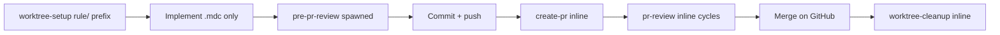

# Hosting-repo rules (detached ship lane)

**Spawnable detached lane** for hosting-repo **`.cursor/rules/*.mdc`** updates when a **`coding-session`** terminal indicates §5 repo-rule work was **not fully landed** on the product lane. Distinct skill identity and lane slug from **`coding-session`** — same sedea ship primitives, different designation and scope.

**Normative execution:** **`spawned`** (detached child lane). Parent **`planner`** / **`phase-planner`** emit **fire-and-forget** **`AGENT_RUN_REQUEST_V1`** — do **not** add the rules lane to **`pendingByParent`** or block next-row expand.

## Warm-up manifest (spawned)

Per [`.sedea/centers/sedea/docs/lane-manifest-contract.md`](.sedea/centers/sedea/docs/lane-manifest-contract.md) and **`../README.md`** § *Default warm-up* / *Warm-up cap exceptions*. Host merge: `effectiveWarmUp = dedupe(bootstrapRules → laneRules → skillWarmUp)`. Frontmatter matches this table; spawners may omit run-request **`laneRules`** when identical (README spawn preflight row 11). **384 KiB cap:** frontmatter omits **`plan.mdc`**, **`development-process.md`**, and rule **30** — explicit **`Read`** of those paths (and **`inputs.targetPlanPath`**) when ship/procedure steps require them. **No `alwaysApply` frontmatter flip.**

### `bootstrapRules` — host-resolved (R&D layer)

| Path | Purpose |
|------|---------|
| `.sedea/centers/research-and-development/rules/bootstrap.mdc` | Sole R&D `alwaysApply: true` bootstrap (≤10 KB); host merges when `centerSlug === research-and-development` |

### `skillWarmUp` — frontmatter `warmUpRules`

| Path | Purpose |
|------|---------|
| `.sedea/centers/research-and-development/missions/plan-and-deliver/skills/README.md` | Spawn contracts, terminal stop, parallel fork |
| `.sedea/centers/research-and-development/rules/20_efficient-pr-shipping.mdc` | Worktree naming, ship chain, bootstrap |
| `.sedea/centers/sedea/skills/worktree-setup/SKILL.md` | Center worktree setup (inline on this lane) |
| `.sedea/centers/sedea/skills/pr-review/SKILL.md` | Inline PR review cycles |
| `.sedea/centers/sedea/skills/worktree-cleanup/SKILL.md` | Post-merge worktree cleanup |

**Omitted from frontmatter (384 KiB spawn cap — runtime `Read`):** `plan.mdc`, `development-process.md` — load via **`inputs.targetPlanPath`** and explicit **`Read`** when ship-chain or procedure steps require them.

### `laneRules` — frontmatter `laneRules`

| Path | Purpose |
|------|---------|
| `.sedea/centers/sedea/rules/2_ask-question-instructions.mdc` | Structured choice, AskQuestion / phased sentinels |
| `.sedea/centers/sedea/rules/6_git-commit-push-gate.mdc` | Commit/push gate before ship cut-point |
| `.sedea/centers/research-and-development/rules/20_efficient-pr-shipping.mdc` | Ship lane minimum (rules-only PR) |
| `.sedea/centers/research-and-development/missions/plan-and-deliver/skills/hosting-repo-rules/SKILL.md` | This skill procedure |

## Purpose

| Owns | Does not own |
|------|----------------|
| Rules-only worktree + PR for deferred §5 `.mdc` work | Product code in application source |
| Full ship chain on **this** detached lane | Spawning **`coding-session`** as a child |
| Terminal `reconciledRepoRulesPaths`, `prShipComplete` | Edits under `.sedea/centers/`, operations plans |
| `rule/` worktree prefix (rule **7**) | Appending commits to an open product PR |

Center/mission governance gaps → **Alignment Drift Brief** (rule **5**) — not this skill.

## Inputs

| Field | Use |
|-------|-----|
| `targetPlanPath` / `targetPlanSlug` | Anchored PR plan (rules impact in §5) |
| `sourceCodingSessionCorrelationId` | Traceability to product coding-session terminal |
| `pendingRepoRulesPaths` | `.mdc` paths from coding-session handoff |
| `repoRulesReconciliationStatus` | Spawn hint — expect **`pending`** when forked |
| `worktreeName` | Default derive: **`rule/<plan-slug>`** or **`rule/<NN>-<slug>`** when stacked |
| `developerApprovedImplementation` | Layer 2 — after worktree-open gate |

## Ship chain (binding order)



| Phase | Skill | Notes |
|-------|-------|-------|
| Pre-write | [worktree-setup](.sedea/centers/sedea/skills/worktree-setup/SKILL.md) **inline** | **`rule/`** context prefix; **new** worktree/branch always |
| Implement | **this lane** | Edit **`WORKTREE_ROOT/.cursor/rules/*.mdc` only** |
| Pre-PR | [pre-pr-review](pre-pr-review/SKILL.md) **spawned** | Fresh reviewer lane before **`create-pr`** |
| Ship | [create-pr](create-pr/SKILL.md) **inline** + rule **6** gate | **New** rules-only PR — never product PR head |
| Review | [pr-review](.sedea/centers/sedea/skills/pr-review/SKILL.md) **inline** | Through terminal; **`apply-rule-updates`** for `.mdc` fixes |
| Post-merge | [worktree-cleanup](.sedea/centers/sedea/skills/worktree-cleanup/SKILL.md) **inline** | Path A ownership on **this** lane |

**Forbidden:** spawning **`coding-session`**; reusing product **`coding-session`** worktree; pushing to open product PR branch.

## Worktree naming (binding)

Use context prefix **`rule/`** per [rule **7**](.sedea/centers/sedea/rules/7_stacked-pr-worktree-naming.mdc) and Master Plan OQ4:

| Situation | Pattern | Example |
|-----------|---------|---------|
| Standalone rules PR | `rule/<plan-slug>` | `rule/deferred-logger-mdc` |
| Stacked rules work | `rule/<NN>-<slug>` | `rule/01-hosting-repo-rules-skill` |

Pass **`worktreeName`** to center **`worktree-setup.sh`** via inline **`worktree-setup`** context.

## Scope boundary (binding)

| Allowed | Forbidden |
|---------|-----------|
| `WORKTREE_ROOT/.cursor/rules/*.mdc` | `.sedea/centers/**`, mission assets |
| Read plan §5 + coding-session terminal handoff | Operations plan git automation |
| Sedea center ship skills inline on this lane | Inline **`coding-session`** reconcile on product lane for same deferred bullets |

When implementation discovers center/mission changes are required, stop and route spawner to **Alignment Drift Brief** — do not expand scope on this lane.

## Spawn trigger (parent spawners — PR 2 wiring)

Parent **`planner`** Step **7c** / **`phase-planner`** Step **5e** evaluate **after** **`coding-session`** terminal. Emit fire-and-forget **`AGENT_RUN_REQUEST_V1`** when **all** apply:

1. Plan-anchored run (`targetPlanPath` on coding-session terminal).
2. `outputs.repoRulesReconciliationStatus` is **`pending`** **or** §5 lists `.mdc` action bullets not covered by `reconciledRepoRulesPaths`.
3. Product coding-session reached terminal or merge-ready (`prShipComplete: true` or documented deferral).

**Do not spawn when:** `complete`, `skipped-none`, §5 is `_None — no repo rule updates required for this PR._` only, or scope escapes `.cursor/rules/`.

**Parent ledger (OQ5):** extend the **product PR row** with **`rulesUpdatesStatus`** — do **not** add a separate **`shipRows`** entry or block **`pendingByParent`** on the rules child.

## Session orientation table (binding)

Render as the **first block** in `display.markdown` at every mandatory gate.

| Field | Value |
|-------|-------|
| Plan | `<targetPlanSlug>` @ `<targetPlanPath>` |
| Worktree | `<absolute WORKTREE_ROOT>` or — |
| Branch | `<worktreeName>` or — |
| PR | `<url>` (#N) or — |
| Ship phase | `worktree` · `implementing` · `pre-pr-review` · `pr-open` · `pr-review` · `done` |
| Deploy scope | — (no deploy-walk on rules-only lane) |
| Review | `prReviewStatus` · GitHub `reviewState` when in PR cycles |

**Mandatory gates:** worktree-open; ship cut-point; post-**`create-pr`** recap; each **`pr-review`** cycle.

## Steps

### 1. Pre-worktree validation

- **Read `inputs.targetPlanPath`** (anchored PR plan) §§1–4; confirm §5 describes rules work (may reference coding-session handoff).
- **Read** `.sedea/centers/research-and-development/missions/plan-and-deliver/plan.mdc` §§ relevant to ship ledger / row status before populating plan §§5–8 or emitting terminal outputs (384 KiB cap — not in frontmatter `warmUpRules`).
- **Read** `.sedea/centers/research-and-development/docs/development-process.md` § *Ship chain* before cut-point, **`pre-pr-review`**, or merge steps (384 KiB cap — runtime `Read`).
- **Read** `.sedea/centers/research-and-development/rules/30_planning-target-resolution.mdc` when validating plan anchor or resolving target-path picks (384 KiB cap — runtime `Read`).
- Worktree-open gate before **`worktree-setup`**.

### 2. Worktree-setup (inline)

Run [worktree-setup](.sedea/centers/sedea/skills/worktree-setup/SKILL.md) with **`worktreeName`** using **`rule/`** prefix. MCP **`sedea_add_worktree_folder`** when hint **`attach-required`**.

### 3. Implement

- Apply §5 action bullets and `pendingRepoRulesPaths` under **`WORKTREE_ROOT/.cursor/rules/`** only.
- Populate plan §§5–8 when required (tests/deploy may be minimal for rules-only PRs).

### 4. Pre-PR review (spawned)

Spawn **`pre-pr-review`** after commit + Before deploy walk (or documented skip) per **`coding-session`** ship family. Wait for **`recommendation: go`** before push/create-pr unless executive override documented in rule **20**.

### 5. Ship cut-point and create-pr

- Structured choice before commit when tree is dirty (rule **6**).
- Inline **`create-pr`** on **`go`** — **new** rules-only PR.

### 6. PR review (inline)

Run [pr-review](.sedea/centers/sedea/skills/pr-review/SKILL.md) until **`continuationStatus: terminal`**.

### 7. Merge and cleanup

Developer merges on GitHub. Inline **`worktree-cleanup`** for **this pass's** **`WORKTREE_ROOT`** only.

## Worktree ownership (binding)

Remove or detach **only** **`WORKTREE_ROOT`** this pass created. **`git worktree list` is read-only** for other paths.

## Mutual exclusion with coding-session

| Scenario | Owner |
|----------|-------|
| Happy-path §5 reconcile in product worktree | **`coding-session`** inline reconcile |
| Deferred §5 / `pending` after product terminal | **`hosting-repo-rules`** detached lane (this skill) |
| Post-review rule updates on **active** product PR | **`coding-session`** inline handoff |
| Post-review rule updates when spawner forked **`hosting-repo-rules`** | **This lane** through merge |

## Completion (spawned)

| Field | Meaning |
|-------|---------|
| `targetPlanPath` | Anchored PR plan |
| `targetPlanSlug` | Plan slug |
| `worktreeRoot` | Absolute worktree used |
| `prUrl` | Rules-only PR URL |
| `prShipComplete` | `true` when PR merged + cleanup done |
| `reconciledRepoRulesPaths` | `.mdc` paths landed in this PR |
| `shipPhase` | Terminal phase (`done` when complete) |
| `rowStatus` | `closed` when ship chain complete |
| `continuationStatus` | `terminal` when safe for parent to mark **`rulesUpdatesStatus: complete`** |

### Host protocol line (required)

```text
AGENT_RESULT_RESPONSE_V1 {"version":1,"correlationId":"<uuid>","status":"success","summary":"Rules-only PR shipped.","outputs":{"targetPlanPath":"/path/to/plan.plan.md","targetPlanSlug":"slug","worktreeRoot":"/path/to/worktree","prUrl":"https://github.com/...","prShipComplete":true,"reconciledRepoRulesPaths":["/path/.cursor/rules/foo.mdc"],"shipPhase":"done","rowStatus":"closed","continuationStatus":"terminal"},"errors":[]}
```

## Completion (inline)

Report the same fields in prose. Do **not** emit spawn/result protocol lines unless explicitly switched to spawned mode by invoker.
