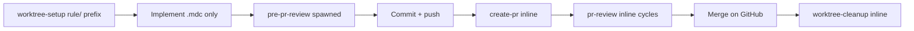

# Hosting-repo rules (detached ship lane)

**Spawnable detached lane** for hosting-repo **`.cursor/rules/*.mdc`** updates when a **`coding-session`** terminal indicates §5 repo-rule work was **not fully landed** on the product lane. Distinct skill identity and lane slug from **`coding-session`** — same sedea ship primitives, different designation and scope.

**Normative execution:** **`spawned`** (detached child lane). Parent **`master-planner`** / **`phase-planner`** emit **fire-and-forget** **`mission_control_spawn_agent`** — do **not** add the rules lane to **`pendingByParent`** or block next-row expand.

## Warm-up manifest (spawned)

Per [`.sedea/centers/sedea/docs/lane-manifest-contract.md`](.sedea/centers/sedea/docs/lane-manifest-contract.md) and **`../README.md`** § *Default warm-up* / *Warm-up cap exceptions*. Host merge: `effectiveWarmUp = dedupe(bootstrapRules → laneRules → skillWarmUp)`. Frontmatter matches this table; spawners may omit run-request **`laneRules`** when identical (README spawn preflight row 11). **384 KiB cap:** frontmatter omits **`plan.mdc`**, **`development-process.md`**, and rule **30** — explicit **`Read`** of those paths (and **`inputs.targetPlanPath`**) when ship/procedure steps require them. **No `alwaysApply` frontmatter flip.**

### `bootstrapRules` — host-resolved (R&D layer)

| Path | Purpose |
|------|---------|
| `.sedea/centers/research-and-development/rules/bootstrap.mdc` | Sole R&D `alwaysApply: true` bootstrap (≤10 KB); host merges when `centerSlug === research-and-development` |

### `skillWarmUp` — frontmatter `warmUpRules`

| Path | Purpose |
|------|---------|
| `.sedea/centers/research-and-development/missions/plan-and-deliver/skills/README.md` | Spawn contracts, terminal stop, parallel fork |
| `.sedea/centers/research-and-development/rules/20_efficient-pr-shipping.mdc` | Worktree naming, ship chain, bootstrap |
| `.sedea/centers/sedea/skills/worktree-setup/SKILL.md` | Center worktree setup (inline on this lane) |
| `.sedea/centers/sedea/skills/pr-review/SKILL.md` | Inline PR review cycles |
| `.sedea/centers/sedea/skills/worktree-cleanup/SKILL.md` | Post-merge worktree cleanup |

**Omitted from frontmatter (384 KiB spawn cap — runtime `Read`):** `plan.mdc`, `development-process.md` — load via **`inputs.targetPlanPath`** and explicit **`Read`** when ship-chain or procedure steps require them.

### `laneRules` — frontmatter `laneRules`

| Path | Purpose |
|------|---------|
| `.sedea/centers/sedea/rules/2_ask-question-instructions.mdc` | Structured choice, AskQuestion / MCP structured choice |
| `.sedea/centers/sedea/rules/6_git-commit-push-gate.mdc` | Commit/push gate before ship cut-point |
| `.sedea/centers/research-and-development/rules/20_efficient-pr-shipping.mdc` | Ship lane minimum (rules-only PR) |
| `.sedea/centers/research-and-development/missions/plan-and-deliver/skills/hosting-repo-rules/SKILL.md` | This skill procedure |

## Agent messaging (MCP)

**MCP spawn/result skill.** Parent→child spawn and child terminal result use MCP tools per **`.sedea/centers/sedea/rules/4_mission.mdc`** § *Agent-to-agent spawn protocol*.

| Action | MCP tool |
|--------|----------|
| Parent spawn (when this skill emits a child lane) | **`mission_control_spawn_agent`** |
| **This** spawned lane terminal (and terminal re-emits) | **`mission_control_send_agent_result`** |

**Binding:**

- Run **`../README.md`** § *MCP spawn preflight* (rows M1–M8) before every MCP spawn; **forbidden** host-resolved identity keys in MCP args (`correlationId`, `dispatchId`, `slotId`, … — see README § *Host-resolved identity*).
- Inline skills on this mission stay **inline-only** — no spawn wire change unless the protocol step explicitly spawns a child lane.


## Purpose

| Owns | Does not own |
|------|----------------|
| Rules-only worktree + PR for deferred §5 `.mdc` work | Product code in application source |
| Full ship chain on **this** detached lane | Spawning **`coding-session`** as a child |
| Terminal `reconciledRepoRulesPaths`, `prShipComplete` | Edits under `.sedea/centers/`, operations plans |
| `rule/` worktree prefix (rule **7**) | Appending commits to an open product PR |

Center/mission governance gaps → **Alignment Drift Brief** (rule **5**) — not this skill.

## Inputs

| Field | Use |
|-------|-----|
| `targetPlanPath` / `targetPlanSlug` | Anchored PR plan (rules impact in §5) |
| `sourceCodingSessionCorrelationId` | Traceability to product coding-session terminal |
| `pendingRepoRulesPaths` | `.mdc` paths from coding-session handoff |
| `repoRulesReconciliationStatus` | Spawn hint — expect **`pending`** when forked |
| `worktreeName` | Default derive: **`rule/<plan-slug>`** or **`rule/<NN>-<slug>`** when stacked |
| `developerApprovedImplementation` | Layer 2 — after worktree-open gate |

## Ship chain (binding order)



| Phase | Skill | Notes |
|-------|-------|-------|
| Pre-write | [worktree-setup](.sedea/centers/sedea/skills/worktree-setup/SKILL.md) **inline** | **`rule/`** context prefix; **new** worktree/branch always |
| Implement | **this lane** | Edit **`WORKTREE_ROOT/.cursor/rules/*.mdc` only** |
| Pre-PR | [pre-pr-review](pre-pr-review/SKILL.md) **spawned** | Fresh reviewer lane before **`create-pr`** |
| Ship | [create-pr](create-pr/SKILL.md) **inline** + rule **6** gate | **New** rules-only PR — never product PR head |
| Review | [pr-review](.sedea/centers/sedea/skills/pr-review/SKILL.md) **inline** | Through terminal; **`apply-rule-updates`** for `.mdc` fixes |
| Post-merge | [worktree-cleanup](.sedea/centers/sedea/skills/worktree-cleanup/SKILL.md) **inline** | Path A ownership on **this** lane |

**Forbidden:** spawning **`coding-session`**; reusing product **`coding-session`** worktree; pushing to open product PR branch.

## Worktree naming (binding)

Use context prefix **`rule/`** per [rule **7**](.sedea/centers/sedea/rules/7_stacked-pr-worktree-naming.mdc) and Master Plan OQ4:

| Situation | Pattern | Example |
|-----------|---------|---------|
| Standalone rules PR | `rule/<plan-slug>` | `rule/deferred-logger-mdc` |
| Stacked rules work | `rule/<NN>-<slug>` | `rule/01-hosting-repo-rules-skill` |

Pass **`worktreeName`** to center **`worktree-setup.sh`** via inline **`worktree-setup`** context.

## Scope boundary (binding)

| Allowed | Forbidden |
|---------|-----------|
| `WORKTREE_ROOT/.cursor/rules/*.mdc` | `.sedea/centers/**`, mission assets |
| Read plan §5 + coding-session terminal handoff | Operations plan git automation |
| Sedea center ship skills inline on this lane | Inline **`coding-session`** reconcile on product lane for same deferred bullets |

When implementation discovers center/mission changes are required, stop and route spawner to **Alignment Drift Brief** — do not expand scope on this lane.

## Spawn trigger (parent spawners — PR 2 wiring)

Parent **`master-planner`** Step **7c** / **`phase-planner`** Step **5e** evaluate **after** **`coding-session`** terminal. Emit fire-and-forget **`mission_control_spawn_agent`** when **all** apply:

1. Plan-anchored run (`targetPlanPath` on coding-session terminal).
2. `outputs.repoRulesReconciliationStatus` is **`pending`** **or** §5 lists `.mdc` action bullets not covered by `reconciledRepoRulesPaths`.
3. Product coding-session reached terminal or merge-ready (`prShipComplete: true` or documented deferral).

**Do not spawn when:** `complete`, `skipped-none`, §5 is `_None — no repo rule updates required for this PR._` only, or scope escapes `.cursor/rules/`.

**Parent ledger (OQ5):** extend the **product PR row** with **`rulesUpdatesStatus`** — do **not** add a separate **`shipRows`** entry or block **`pendingByParent`** on the rules child.

## Structured choice (Mission Control)

Layer 2 approval and ship gates on this lane use **AskQuestion** or **`mission_control_present_structured_choice`** per **`.sedea/centers/sedea/rules/2_ask-question-instructions.mdc`** and **`../README.md`** § *Recap, structured choice, act*. On spawned lanes, put recap in **`displayMarkdown`**; call **`mission_control_present_structured_choice`** before **`mission_control_send_agent_result`** when a gate is open.

## Checkpoint turn UX (skill-local)

Under Checkpoint trust (`trustLevel: checkpoint`), auto-advance scripted happy-path steps; emit structured choice only at **USER_CHECKPOINT** markers in this section, implicit external-wait surfaces, or exception paths. **No cross-skill inheritance** — gate defaults here apply only to **`hosting-repo-rules`**; other ship-chain skills document their own markers.

**Real-dispatch test loop (binding):** After merge, run one full **`hosting-repo-rules`** spawn on a Checkpoint dispatch through [Worktree-open gate](#worktree-open-gate-binding) and collect a developer verdict before the parent phase advances **`worktree-bootstrap`** PR 8 — per **Ship-chain skills UX** § *Single-concern strategy*.

Marker syntax: [`.sedea/centers/sedea/docs/user-checkpoint-marker-syntax.md`](.sedea/centers/sedea/docs/user-checkpoint-marker-syntax.md).

### Developer input vs external-wait (Checkpoint)

Under Checkpoint trust, **happy-path** substeps (validation, worktree-setup, `.mdc` implementation until review-ready) **auto-advance without a turn-end modal**. **Ship cut-point**, **post-create-pr**, and **`pr-review`** return picks are **developer-input** — **USER_CHECKPOINT** surfaces — and **must** close with **`mission_control_present_structured_choice`** / **AskQuestion**.

**Forbidden:** prose-only turn ends at developer-input gates — use structured choice instead of idle-handoff phrasing (conduct 1 § No idle handoff).

**Spawned `pre-pr-review` child terminal** is **implicit external-wait** — resume on child result delivery; do **not** end the parent turn with prose-only *waiting for reviewer*.

| Step | Checkpoint behavior | Gate |
|------|---------------------|------|
| **1** — Pre-worktree validation | Auto-advance when `targetPlanPath` / §5 scope is valid | exception: missing plan path or scope escapes `.cursor/rules/` |
| **Worktree-open gate** | **Gate** — first developer-pick gate on spawned rules lane | [Worktree-open gate](#worktree-open-gate-binding) |
| **2** — Worktree-setup | Auto-advance on happy path | exception: setup / attach failure |
| **3** — Implement | Auto-advance through `.mdc` edits until review-ready | exception: scope escape → Alignment Drift Brief |
| **4** — Ship cut-point | **Auto-advance** `commit-only` when clean criteria pass | **Gate** when any criterion fails — [Ship cut-point gate](#ship-cut-point-gate-binding) |
| **5** — Pre-PR review (spawned) | Auto-advance spawn; await reviewer terminal | implicit external-wait on child lane |
| **5b** — Create PR (inline) | Auto-advance through [create-pr Gate](create-pr/SKILL.md#gate) steps **1–4** | **Gate** at [Pre-gh authorization](create-pr/SKILL.md#pre-gh-authorization-gate-binding) |
| **6** — PR review (inline) | **Gate** when developer returns after GitHub review or idle PR | [Post-create-pr handoff](#post-create-pr-handoff-binding) · **`pr-review`** disposition |
| **7** — Merge and cleanup | Auto-advance cleanup after merge confirm | exception: cleanup script failure |

## Session orientation table (binding)

Render as the **first block** in `displayMarkdown` at every mandatory gate.

| Field | Value |
|-------|-------|
| Plan | `<targetPlanSlug>` @ `<targetPlanPath>` |
| Worktree | `<absolute WORKTREE_ROOT>` or — |
| Branch | `<worktreeName>` or — |
| PR | `<url>` (#N) or — |
| Ship phase | `worktree` · `implementing` · `pre-pr-review` · `pr-open` · `pr-review` · `done` |
| Deploy scope | — (no deploy-walk on rules-only lane) |
| Review | `prReviewStatus` · GitHub `reviewState` when in PR cycles |

**Mandatory gates:** [Worktree-open gate](#worktree-open-gate-binding); [Ship cut-point gate](#ship-cut-point-gate-binding); [Post-create-pr handoff](#post-create-pr-handoff-binding); [create-pr Pre-gh authorization](create-pr/SKILL.md#pre-gh-authorization-gate-binding); each **`pr-review`** disposition cycle. Under Checkpoint trust, only steps with **USER_CHECKPOINT** markers (or implicit external-wait) open modals — see [Checkpoint turn UX (skill-local)](#checkpoint-turn-ux-skill-local).

## Worktree-open gate (binding)

**Layer 2 — single AskQuestion** before any inline **`worktree-setup`**, sidecar session write, Mission Control worktree attach, or `.mdc` edits.

**Recap and structured choice:** Summarize plan path, §5 scope, and `pendingRepoRulesPaths` in **`displayMarkdown`** when calling **`mission_control_present_structured_choice`**. Include [Session orientation table (binding)](#session-orientation-table-binding) as the first block. On spawned lanes, end the gate turn with **`mission_control_present_structured_choice`** — see **`.sedea/centers/sedea/rules/2_ask-question-instructions.mdc`**.

USER_CHECKPOINT — authorize rules-only worktree and implementation on this lane.

**Required options** (`modalTitle`: *Hosting-repo rules — start implementation*; list in this order):

| Option id | Label | Agent action |
|-----------|-------|--------------|
| `start-rules-implementation` | Start rules-only implementation now | Set `outputs.developerApprovedImplementation: true`; proceed to [Step 2 — Worktree-setup](#2-worktree-setup-inline) |
| `revise-plan` | Revise PR plan first | Keep `developerApprovedImplementation: false`; stop without worktree |
| `change-repo` | Change repo or worktree settings | Re-collect `worktreeName` / `baseRef`; re-open gate |
| `defer` | Defer implementation | Keep `continuationStatus: active`; no worktree |
| `more-details` | More details for option _ | Elaborate; re-open gate |

- **`defaultOptionId: start-rules-implementation`** when §5 scope is valid and spawn inputs are complete.
- **Next-step resolution:** Auto-advance through [Step 1 — Pre-worktree validation](#1-pre-worktree-validation) on the happy path — no `USER_CHECKPOINT` until this gate.

## Ship cut-point gate (binding)

When **`.mdc`** implementation is **ready for developer review**, **stop** product edits and reach this gate — Checkpoint auto-advance or **`mission_control_present_structured_choice`** on exception paths. Rules-only lane: **no** inline **`deploy-walk`** — cut-point authorizes **commit only** before **`pre-pr-review`** spawn.

**Precondition:** [Step 3 — Implement](#3-implement) complete; edits limited to **`WORKTREE_ROOT/.cursor/rules/`**.

### Checkpoint — auto-advance `commit-only` (binding)

Under Checkpoint trust, **auto-advance** as if the developer picked **`commit-only`** — **no** modal — when **all** hold:

1. Implementation batch complete; no open gotchas or blocking test failures on rules scope.
2. `git status --short` shows only expected **`.mdc`** paths (or is clean after prior commit).
3. Developer did **not** pick **`more-changes`**, **`defer`**, or name executive override in the **same** message.

Recap diff summary on the auto-advance turn; run **`git commit`** on the **next** turn when tree dirty; then spawn **`pre-pr-review`** when tree is clean.

**Exception — gate required:** When any clean criterion fails or the developer requests **`more-changes`** / **`defer`**, emit **`mission_control_present_structured_choice`** per below — not prose-only recap.

USER_CHECKPOINT — approve commit on rules-only lane before pre-PR review.

Put [Session orientation table (binding)](#session-orientation-table-binding) first in **`display.markdown`**. Recap includes `git status --short`, files touched, and §5 / `pendingRepoRulesPaths` scope.

| Option id | Label (brief) | Act |
|-----------|---------------|-----|
| `commit-only` | Approve and commit | **`git commit`** on response turn when dirty; spawn **`pre-pr-review`** when clean |
| `more-changes` | More `.mdc` edits first | Return to [Step 3 — Implement](#3-implement) |
| `defer` | Defer ship chain | `continuationStatus: active` |
| `more-details` | More details for option _ | Elaborate; re-open this gate |

- **`defaultOptionId: commit-only`** when implementation is review-ready and tree shows only expected rules diffs.
- **Forbidden:** `git push`, inline **`create-pr`**, or spawn **`pre-pr-review`** in the same assistant turn as this gate's modal.
- **Forbidden:** prose-only idle handoff at this gate — use structured choice per rule **2**.
- **Next-step resolution:** Auto-advance through Step **3** on the happy path — no `USER_CHECKPOINT` until review-ready.

## Post-create-pr handoff (binding)

After inline [create-pr](create-pr/SKILL.md) records `prUrl` / `prNumber` on **this** lane, open structured choice **same turn** — adapted from [coding-session Post-create-pr handoff gate](../coding-session/SKILL.md#post-create-pr-handoff-gate). **This** spawned lane owns the modal; the parent product **`coding-session`** does not substitute.

**When required:** Same turn as inline **`create-pr`** **`## Completion (inline)`** with PR URL.

**Forbidden:** prose-only PR URL recap without **`mission_control_present_structured_choice`** at this handoff.

USER_CHECKPOINT — pick next ship action after rules-only PR creation on this lane.

Include [Session orientation table (binding)](#session-orientation-table-binding) as the first block. Reuse stable option ids from **`coding-session`** post-create-pr gate (`start-pr-review`, `check-pr-status`, `defer-pr-review`, `more-details`, …) — act on **this** lane through inline **`pr-review`** and merge delegation per [Step 6 — PR review](#6-pr-review-inline).

- **Next-step resolution:** Auto-advance through inline [create-pr](create-pr/SKILL.md) pre-PR validation and [Pre-gh authorization](create-pr/SKILL.md#pre-gh-authorization-gate-binding) on the happy path — no `USER_CHECKPOINT` until this handoff after **`gh pr create`** succeeds.

## Steps

### 1. Pre-worktree validation

- **Read `inputs.targetPlanPath`** (anchored PR plan) §§1–4; confirm §5 describes rules work (may reference coding-session handoff).
- **Read** `.sedea/centers/research-and-development/missions/plan-and-deliver/plan.mdc` §§ relevant to ship ledger / row status before populating plan §§5–8 or emitting terminal outputs (384 KiB cap — not in frontmatter `warmUpRules`).
- **Read** `.sedea/centers/research-and-development/docs/development-process.md` § *Ship chain* before cut-point, **`pre-pr-review`**, or merge steps (384 KiB cap — runtime `Read`).
- **Read** `.sedea/centers/research-and-development/rules/30_planning-target-resolution.mdc` when validating plan anchor or resolving target-path picks (384 KiB cap — runtime `Read`).
- **Next-step resolution:** Auto-advance to [Worktree-open gate](#worktree-open-gate-binding) when validation passes — no `USER_CHECKPOINT` on this step.

### 2. Worktree-setup (inline)

Run [worktree-setup](.sedea/centers/sedea/skills/worktree-setup/SKILL.md) with **`worktreeName`** using **`rule/`** prefix. MCP **`sedea_add_worktree_folder`** when hint **`attach-required`**.

### 3. Implement

- Apply §5 action bullets and `pendingRepoRulesPaths` under **`WORKTREE_ROOT/.cursor/rules/`** only.
- Populate plan §§5–8 when required (tests/deploy may be minimal for rules-only PRs).

### 4. Ship cut-point

Run [Ship cut-point gate](#ship-cut-point-gate-binding). On **`commit-only`** (Checkpoint auto-advance or developer pick), **`git commit`** on the response turn when tree dirty. **No** **`deploy-walk`** on this lane.

### 5. Pre-PR review (spawned)

Spawn **`pre-pr-review`** after cut-point commit when tree is clean. Wait for **`recommendation: go`** before push / inline **`create-pr`** unless executive override documented in rule **20**.

### 6. Create PR (inline)

Inline [create-pr](create-pr/SKILL.md) on **`go`** — **new** rules-only PR. Checkpoint gates live in **`create-pr`** § *Checkpoint turn UX* — [Pre-gh authorization](create-pr/SKILL.md#pre-gh-authorization-gate-binding) on this lane.

Open [Post-create-pr handoff](#post-create-pr-handoff-binding) **same turn** when PR URL is known.

### 7. PR review (inline)

Run [pr-review](.sedea/centers/sedea/skills/pr-review/SKILL.md) until **`continuationStatus: terminal`**. When the developer returns after GitHub review, re-open [Post-create-pr handoff](#post-create-pr-handoff-binding) or **`pr-review`** disposition gate — **not** external-wait prose.

### 8. Merge and cleanup

Developer merges on GitHub. Inline **`worktree-cleanup`** for **this pass's** **`WORKTREE_ROOT`** only.

## Worktree ownership (binding)

Remove or detach **only** **`WORKTREE_ROOT`** this pass created. **`git worktree list` is read-only** for other paths.

## Mutual exclusion with coding-session

| Scenario | Owner |
|----------|-------|
| Happy-path §5 reconcile in product worktree | **`coding-session`** inline reconcile |
| Deferred §5 / `pending` after product terminal | **`hosting-repo-rules`** detached lane (this skill) |
| Post-review rule updates on **active** product PR | **`coding-session`** inline handoff |
| Post-review rule updates when spawner forked **`hosting-repo-rules`** | **This lane** through merge |

## Completion (spawned)

| Field | Meaning |
|-------|---------|
| `targetPlanPath` | Anchored PR plan |
| `targetPlanSlug` | Plan slug |
| `worktreeRoot` | Absolute worktree used |
| `prUrl` | Rules-only PR URL |
| `prShipComplete` | `true` when PR merged + cleanup done |
| `reconciledRepoRulesPaths` | `.mdc` paths landed in this PR |
| `shipPhase` | Terminal phase (`done` when complete) |
| `rowStatus` | `closed` when ship chain complete |
| `continuationStatus` | `terminal` when safe for parent to mark **`rulesUpdatesStatus: complete`** |

### MCP result preflight (`mission_control_send_agent_result`)

| Step | Check |
|------|--------|
| R1 | Call **`mission_control_send_agent_result`** with **`status`**, **`summary`**, optional **`outputs`** / **`errors`** |
| R2 | **Forbidden args absent** — no **`correlationId`**, **`dispatchId`**, **`slotId`**, or other host-resolved keys |
| R3 | Populate **`outputs`** from the required field list below |
| R4 | Re-emit updated MCP result after user-requested follow-up on this lane (same spawn session; host resolves **`correlationId`**) |

```text
```

## Completion (inline)

Report the same fields in prose. Do **not** emit spawn/result protocol lines unless explicitly switched to spawned mode by invoker.
